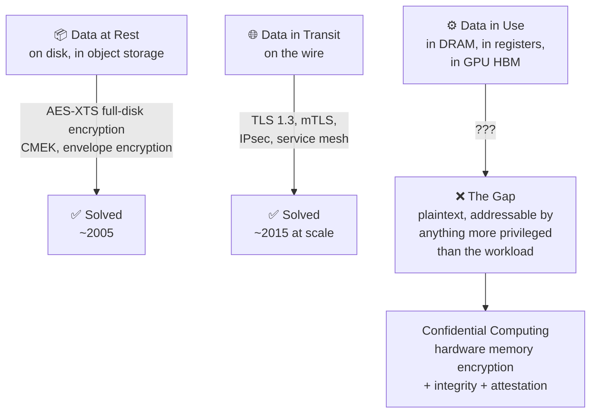
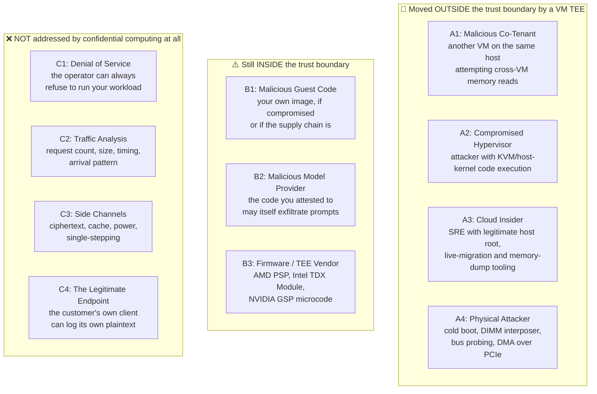
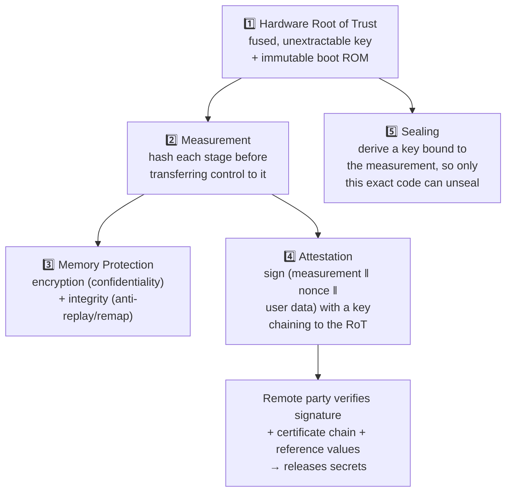
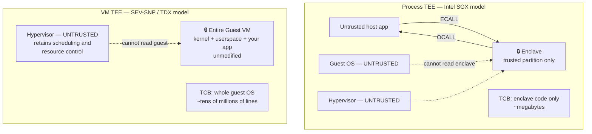
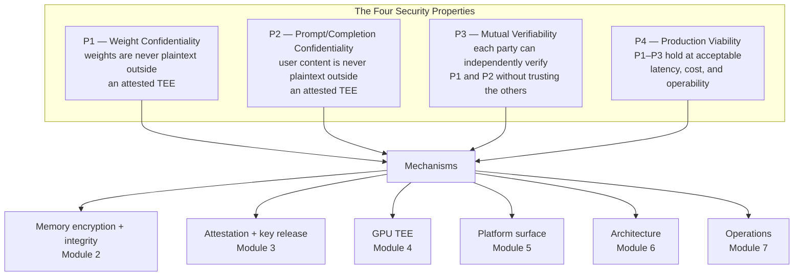

# Module 1: Confidential Computing Foundations

Confidential computing is one of those fields where the vocabulary is small and the precision demands are high. "Trusted," "secure," "encrypted," and "attested" are used interchangeably in vendor material and mean four different things. This module establishes the vocabulary carefully, because every later chapter depends on it: a claim about SEV-SNP in Module 2, or about GPU attestation in Module 4, is only checkable if you already know exactly what a TCB is and what a measurement measures.

This module covers **the three states of data and why "in use" was left open**, **the adversary taxonomy and the discipline of threat modeling**, **the building blocks of a TEE**, **process-based versus VM-based TEEs**, and **the formal statement of the third-party MaaS problem** that the rest of the book solves.

---

## Part 1: The Three States of Data

### 1.1 The Canonical Split, and the Gap It Hides

Security practice divides data into three states, and for two of them the industry converged on an answer decades ago.



The gap is not an oversight. It is a direct consequence of how computers work: a CPU cannot execute on ciphertext. At some point the bytes must be plaintext in a register file. The only question is *who else can see them at that moment*, and historically the answer was "anything running at a higher privilege level," which on a cloud host means the hypervisor, the host kernel, the firmware, the management plane, and anyone with physical access to the DIMM.

### 1.2 The Privilege Ladder

The reason "in use" is hard is that classical operating-system security is built on a *strictly nested* privilege model. Each ring can inspect everything above it.

| Level | Component | Can read guest memory? | Owned by |
| :--- | :--- | :--- | :--- |
| Ring 3 | Your inference process | Its own only | You |
| Ring 0 | Guest kernel | All guest memory | You |
| Ring -1 | Hypervisor (KVM) | All guest memory | Cloud operator |
| Ring -2 | SMM / firmware | All memory | OEM + cloud operator |
| Ring -3 | Management engine / BMC | All memory | OEM + cloud operator |
| Physical | DIMM, PCIe bus, interposer | All memory | Whoever is in the datacenter |

Every layer below your guest kernel is operated by someone who is not you. In an ordinary cloud, you accept this. The entire premise of confidential computing is to **invert the nesting**: to make a region of memory that the *more* privileged layers cannot read, enforced by silicon rather than by software policy.

### 1.3 The Confidential Computing Consortium Definition

The Confidential Computing Consortium's working definition is worth quoting precisely, because each clause is load-bearing:

> Confidential computing is the protection of data in use by performing computation in a hardware-based, attested Trusted Execution Environment.

- **Data in use** — the state above, not a re-branding of disk or transit encryption.
- **Hardware-based** — enforced by the CPU/SoC, not by a hypervisor promising to behave. A software-only sandbox is not confidential computing regardless of how good it is.
- **Attested** — the environment can *prove* what it is to a remote party. Without this clause the definition would admit "trust me, it's a TEE," which is worthless (Principle 2).
- **Trusted Execution Environment** — a specific bounded region, not the whole machine.

A useful test: if a vendor claim survives deleting the word "attested," the claim is probably marketing.

### 1.4 Why Inference Is the Forcing Function

Most workloads have a comfortable ratio of at-rest data to in-use data. A database holds terabytes on disk and a few gigabytes in a buffer pool; encrypting the disk covers most of the exposure. LLM inference inverts this completely:

| Asset | Where it lives during a request | At rest? |
| :--- | :--- | :--- |
| Model weights | Entirely resident in GPU HBM, hot, for the process lifetime | Only before the first load |
| Prompt | Plaintext in host RAM the instant TLS terminates; then tokenized into device memory | Never, unless you log it |
| KV cache | GPU HBM for the duration of the request (and longer, with prefix caching) | Never |
| Completion | Host RAM and the response buffer, streamed token by token | Never |

There is no point in the request lifecycle at which the valuable data is at rest. Disk encryption protects a model checkpoint sitting in a bucket and *nothing else that matters*. This is why LLM serving, more than any other workload, is the one that dragged confidential computing from a compliance checkbox into a functional requirement.

---

## Part 2: Threat Models and the Adversary Taxonomy

### 2.1 Naming the Adversary

"Protected in use" is meaningless without an adversary. The following taxonomy is the one used throughout this book; every architecture is evaluated against it.



### 2.2 What Each Adversary Can Actually Do

#### 1. A1 — The malicious co-tenant

Historically the headline cloud risk, and the one most thoroughly addressed even *before* confidential computing: hardware virtualization, IOMMU, and EPT/NPT already prevent one guest from addressing another's memory. Confidential computing adds defense in depth here, but if this is your only adversary you do not need a TEE. **If a design document justifies confidential computing solely by "multi-tenant isolation," it has not identified a real requirement.**

#### 2. A2 — The compromised hypervisor

The first adversary that genuinely requires new hardware. A hypervisor escape or a host-kernel vulnerability historically gives the attacker plaintext access to every guest on the machine. Under SEV-SNP or TDX, the hypervisor retains full *control* over the guest — it can schedule it, stop it, deny it memory — but the memory it can read is ciphertext under a key it does not hold.

This distinction between **control** and **confidentiality** is the single most important asymmetry in the field, and it recurs everywhere: the hypervisor is deliberately left in charge of resource management (that is what makes VM TEEs practical) and deliberately locked out of data.

#### 3. A3 — The cloud insider

Commercially, this is the adversary that matters. A model provider deciding whether to host weights on Google Cloud is not primarily worried about a hypervisor 0-day; it is worried about whether some combination of Google employees, legal process, and internal tooling could produce a copy of the weights. Confidential computing's real product is a *technical* answer — "the key material required to decrypt those weights is only released to an environment whose measurement matches a value you chose, and no Google process holds that key" — rather than a *policy* answer.

Note the sharp edge: this only holds if the key release policy is enforced by something the model provider trusts. If the provider's key lives in a Google-managed KMS under a Google-controlled IAM policy, the guarantee is substantially weaker than if it lives in a provider-operated external key manager. Module 3 returns to this at length.

#### 4. A4 — The physical attacker

Cold-boot attacks, DIMM interposers, and bus probing. Memory encryption addresses these directly and is genuinely strong: the DRAM contents are ciphertext, and with SEV-SNP or TDX they are also integrity-protected, so an interposer cannot inject or replay values undetected. The residual exposure is the *pattern* of accesses and, for SEV-SNP specifically, the deterministic relationship between plaintext and ciphertext that the ciphertext side channel exploits (Module 2, Part 5).

#### 5. B1/B2 — Code inside the enclave

The most frequently misunderstood point in the field: **a TEE protects the workload from the platform; it does nothing to protect anyone from the workload.** If your inference server has a bug that writes prompts to an external logging endpoint, the TEE faithfully protects that exfiltration from the hypervisor on its way out. If the model provider's container is designed to phone home with customer prompts, attestation proves only that it is running *the exact image the provider published* — which is precisely the image that phones home.

This is why attestation policy and image transparency are not optional add-ons. The guarantee attestation gives is "you are talking to image `sha256:abc…`." Whether image `sha256:abc…` deserves your prompts is a *separate* question that must be answered by source availability, reproducible builds, or third-party audit. Module 3, Part 7 and Module 6, Part 8 both live in this gap.

#### 6. B3 — The TEE vendor

Every TEE has an irreducible vendor-trust root. Under SEV-SNP you trust AMD's PSP firmware and the key AMD fused into the chip. Under TDX you trust the Intel TDX Module and Intel's provisioning service. Under NVIDIA CC you trust the GPU's fused signing key and GSP firmware. There is no way to remove this; the honest posture is to *name* it in the design document rather than pretend the trust chain is empty.

#### 7. C1–C4 — Out of scope, permanently

These deserve to be stated as loudly as the protections, because a design that implies otherwise is dishonest:

- **Availability**: the operator can always refuse to schedule, or simply power off the machine. Confidential computing is a confidentiality-and-integrity technology, never an availability one.
- **Traffic analysis**: request counts, payload sizes, inter-token timing, and arrival patterns are all visible to the host. For an LLM, token-generation timing observed from outside the TEE is a genuine information leak — output length is directly observable, and there is published work on recovering information from streaming-response packet sizes.
- **Side channels**: covered in Module 2, Part 5. Real, actively researched, and generally not in the vendors' threat models.
- **The legitimate endpoint**: if the customer's own application logs prompts to its own observability stack, no cloud-side mechanism helps.

### 2.3 TCB Minimization as a Design Discipline

The **Trusted Computing Base** is the set of components whose compromise breaks the guarantee. Not "the components you like" — the components whose failure is fatal.

The discipline is mechanical: enumerate every component, ask "if this were malicious, would the guarantee hold?", and if the answer is no, it is in the TCB. Then make the list as short as you can bear.

| Component | In the TCB of a Confidential GKE inference pod? | Notes |
| :--- | :--- | :--- |
| CPU silicon + microcode | **Yes** | Irreducible |
| AMD PSP / Intel TDX Module | **Yes** | Irreducible; note the TDX Module is *additional* software in the TCB |
| Guest firmware (OVMF) | **Yes** | Measured into the launch measurement |
| Guest kernel + initrd | **Yes** | The whole point of the VM-TEE tradeoff |
| Guest userspace + container image | **Yes** | Including every dependency you `pip install` |
| GPU silicon + GSP firmware + VBIOS | **Yes**, if the GPU holds plaintext | Module 4 |
| Hypervisor / host kernel | **No** | Removed by SEV-SNP / TDX |
| Cloud control plane, IAM, orchestration | **No** for confidentiality, **yes** for availability | Can stop you, cannot read you |
| Kubernetes control plane | **No** for data, **yes** for what gets scheduled | Module 5, Part 2 |

The uncomfortable row is "guest kernel + userspace." A VM TEE puts an entire Linux distribution, your Python environment, and every transitive dependency inside the TCB. That is a TCB of tens of millions of lines. It is a real cost, accepted deliberately in exchange for being able to run unmodified software — see Part 4.

---

## Part 3: The Building Blocks of a TEE

Every TEE, regardless of vendor, is assembled from the same five primitives. Recognizing them makes Module 2 a matter of noting *how* AMD and Intel each implement them rather than learning two unrelated architectures.



### 3.1 The Hardware Root of Trust

An unextractable secret fused into the silicon at manufacture, plus immutable boot code that runs before anything mutable. On AMD this is the Platform Security Processor; on Intel, the combination of microcode, the TDX Module loader, and the provisioning key hierarchy; on an NVIDIA Hopper or Blackwell GPU, a per-device private signing key fused at manufacture and never exposed to software, firmware, or the host.

Two properties matter and they are frequently confused:

- **Unextractable** — no software path reads the key, only *uses* it. This is what makes device identity meaningful.
- **Endorsed** — the vendor publishes a certificate chain asserting that the corresponding public key belongs to a genuine part. Without endorsement, a signature proves only that *something* signed it. The certificate chain is what turns a signature into "a genuine AMD EPYC in SNP mode signed this."

### 3.2 Measurement and Measured Boot

A **measurement** is a cryptographic hash of code and configuration, recorded before that code is given control. Measured boot chains them: each stage measures the next, records the hash into a protected register, then jumps.

The critical property is that measurement registers are **append-only**. You cannot set them; you can only extend them:

$$
\text{PCR}_{new} = \text{SHA256}\left(\text{PCR}_{old} \,\|\, \text{measurement}\right)
$$

This is what makes the chain unforgeable from within: malicious code that gains control *after* being measured cannot rewind the register to hide itself. It can only extend it further, which produces a different final value than the legitimate boot path — and different means rejected.

A second distinction runs through the whole book:

| | **Launch measurement** | **Runtime measurement** |
| :--- | :--- | :--- |
| Examples | SEV-SNP launch digest, TDX `MRTD` | TDX `RTMR0-3`, TPM `PCR` extensions |
| Fixed at | VM launch, then immutable | Extendable during boot and runtime |
| Covers | Initial memory image, firmware, VMSA | Kernel, initrd, rootfs, container digest |
| Verifier use | "Is this the image I approved?" | "What did it load afterwards?" |

Neither alone is sufficient. The launch measurement without runtime measurements tells you the firmware was right and nothing about what it booted; runtime measurements without a launch measurement have no anchor.

### 3.3 Memory Protection: Encryption Is Necessary, Not Sufficient

Memory encryption uses a key held in the memory controller, generated per-VM, never exposed to software — not even to the guest, and emphatically not to the hypervisor. Ciphertext goes out to the DIMM; plaintext exists only inside the SoC.

The subtlety is *mode of operation*, and it explains a real vulnerability class:

- **AES-XTS** (used for memory encryption, as for disk) is a tweakable block cipher keyed to the physical address. It is length-preserving and deterministic: the same plaintext at the same address always produces the same ciphertext. Length preservation is mandatory — a memory encryption engine cannot expand 64 bytes into 80, because the DIMM has no room for the extra bytes.
- **AES-GCM** (used for the *PCIe* path in GPU confidential computing, Module 4) is authenticated and non-deterministic, but expands the data with a nonce and a tag. That is affordable over a bus, where you can send more bytes, and unaffordable in DRAM, where you cannot.

Determinism is exactly what the **ciphertext side channel** exploits: an attacker who can read the ciphertext repeatedly can tell when a plaintext value changed, and when it returned to a previously-seen value. Module 2, Part 5 covers the consequences.

Now the part that gets skipped. **Encryption alone does not stop an attacker who controls the memory system**, because two attacks need no decryption at all:

1. **Replay** — record the ciphertext of a page at time $t_0$; write it back at time $t_1$. The guest decrypts it successfully, because it is validly encrypted under the right key at the right address. You have just rolled back the guest's state — for instance, reverting a "login failed, lock the account" counter.
2. **Remap / aliasing** — repoint the guest's physical address $X$ at the ciphertext that legitimately lives at address $Y$. With address-tweaked XTS this usually yields garbage, but the hypervisor can also simply *alias two guest pages to the same physical page* and observe or induce corruption.

Defeating these requires **integrity and ownership tracking**, which is precisely the difference between AMD's SEV-ES and SEV-SNP (the Reverse Map Table) and what Intel TDX provides through the secure EPT and the TDX Module. The one-line summary to carry into Module 2:

> **SEV/SEV-ES gave confidentiality. SEV-SNP and TDX added integrity. Only the second generation defends against an actively malicious hypervisor rather than a merely curious one.**

### 3.4 Attestation

Attestation is the TEE signing a structure that binds together:

$$
\text{Report} = \text{Sign}_{K_{RoT}}\Big( \text{measurement} \,\|\, \text{platform state} \,\|\, \text{nonce} \,\|\, \text{user data} \Big)
$$

The four inputs each do a distinct job, and dropping any one breaks something:

| Field | Purpose | What breaks without it |
| :--- | :--- | :--- |
| Measurement | *What code is running* | The verifier learns nothing about the workload |
| Platform state | Firmware version, TCB/SVN, debug flags, policy bits | You accept an environment with debug enabled or known-vulnerable firmware |
| Nonce | Freshness | Replay of an old report from a machine that has since been compromised |
| User data | Binds an application value (typically a public key hash) into the report | The report attests to a machine but not to *the channel you are talking over* |

That last row is the one people miss, and it is the entire idea behind RA-TLS: without binding the TLS public key into the report, an attacker can relay a genuine report from a real TEE while terminating your connection somewhere else. Module 3, Part 6.

### 3.5 Sealing

Sealing derives an encryption key from the root of trust *and* the current measurement:

$$
K_{seal} = \text{KDF}\left(K_{RoT},\ \text{measurement},\ \text{context}\right)
$$

Because the measurement is an input, data sealed by one code version cannot be unsealed by different code on the same machine. It is the local analogue of attested key release, and it is how a confidential workload can cache decrypted state on local disk without handing the operator a key. It also has a sharp operational edge: **update your image and you lose access to everything you sealed under the old measurement.** That is a feature, and it is also the reason sealed local caches need a migration path (Module 6, Part 4).

---

## Part 4: Process TEEs versus VM TEEs

### 4.1 The Two Architectures



### 4.2 The Tradeoff, Stated Honestly

| Dimension | Process TEE (SGX) | VM TEE (SEV-SNP / TDX) |
| :--- | :--- | :--- |
| TCB size | Small — only the enclave partition | Large — entire guest OS and userspace |
| Porting cost | High — partition the app, define the ECALL/OCALL boundary, no direct syscalls | ~Zero — lift and shift an existing image |
| Memory ceiling | Historically constrained by the EPC; a hard wall for model weights | Full VM memory, hundreds of GB |
| Device / accelerator access | Very awkward — no direct device access from an enclave | Normal — passthrough works, which is what makes confidential GPUs possible |
| Attestation granularity | Precisely the enclave binary | The whole VM image + runtime measurements |
| Failure mode of a large TCB | A bug in unrelated userspace is outside the TCB | A bug in *any* in-guest component is inside the TCB |

### 4.3 Why VM TEEs Won for AI

Four reasons, in descending order of importance:

1. **Accelerators.** An SGX enclave has no clean way to own a PCIe device. Confidential GPU computing requires a device assigned to the confidential guest and a secure session negotiated between them — which is a VM-shaped operation. This alone settles the question for LLM serving.
2. **Memory.** A 70B model in bf16 needs roughly 140 GB of weights. Process TEEs with encrypted-page-cache limits were never in this game.
3. **Software stack reality.** The inference stack is CUDA, PyTorch, NCCL, vLLM, and a large Python dependency tree. Partitioning that into a small trusted enclave is not an engineering project; it is a rewrite.
4. **Operational familiarity.** A confidential VM boots a normal image, runs a normal kubelet, and joins a normal cluster. This is why "Confidential GKE Nodes" can be approximately a flag on a node pool rather than a new compute product.

The price is the TCB. You are asserting that your entire guest image is trustworthy, which shifts the security problem from *isolation* to *supply chain* — which is why image signing, reproducible builds, and minimal base images stop being hygiene and become load-bearing (Module 3, Part 7).

### 4.4 Confidential Containers: The Kubernetes-Shaped Middle Ground

Between "confidential VM you manage" and "confidential enclave you rewrite for" sits a third model, relevant because Kubernetes is the deployment target.

The idea: run each pod (or each pod sandbox) inside its own lightweight VM TEE, using a Kata-style VM-per-pod runtime, so the *pod* rather than the *node* is the unit of confidentiality. The kubelet and the node agent stay outside the trust boundary. This is the model behind Azure's confidential containers and the CNCF Confidential Containers project.

The contrast with the Confidential GKE Nodes model matters and is developed in Module 5:

| | **Confidential node** (GKE today) | **Confidential pod sandbox** (CoCo model) |
| :--- | :--- | :--- |
| Unit of confidentiality | The whole node | The individual pod |
| Kubelet / node agent | Inside the TEE | Outside the TEE |
| Who can exec into your workload | Anyone with node-level access, subject to k8s RBAC | Blocked by the sandbox boundary |
| Attestation identity | The node image | The pod's container image |
| Maturity on GCP | Available | Not the productized path |

The honest summary for a GKE design: **Confidential GKE Nodes put the kubelet inside your TCB.** If your threat model includes "a Kubernetes control plane operated by the cloud provider can schedule a debug container next to my workload," a confidential node alone does not address it, and you need either Confidential Space or a pod-level sandbox. Module 5, Part 6 makes this decision explicitly.

---

## Part 5: The Third-Party MaaS Problem, Formalized

### 5.1 The Four Properties

Everything in Modules 2 through 7 exists to establish these four statements. They are the evaluation checklist reused in Module 6.



Stated precisely, each against a named adversary:

- **P1 — Weight confidentiality.** Model weights exist in plaintext only inside a TEE whose measurement the model provider approved in advance. *Held against:* the cloud operator (A2, A3, A4) and the end customer.
- **P2 — Prompt and completion confidentiality.** User content exists in plaintext only inside such a TEE. *Held against:* the cloud operator (A2, A3, A4) and — this is the hard one — the model provider, who wrote the code that is processing it.
- **P3 — Mutual verifiability.** Each party can verify P1 and P2 from evidence rooted in silicon vendor certificates, without relying on an assertion by any other party. *This is the property that fails silently in most designs*, usually because the verifier is operated by the party being distrusted.
- **P4 — Production viability.** All of the above at competitive TTFT and throughput, with a workable cold start, on hardware you can actually get capacity for.

### 5.2 What "Google Cannot See the Weights" Must Mean Technically

The marketing sentence decomposes into six checkable claims. Each is a chapter in this book.

| Claim | Mechanism | Where it is developed | Failure mode if omitted |
| :--- | :--- | :--- | :--- |
| Weights are encrypted at rest with a key Google does not hold | Provider-controlled KMS/EKM, envelope encryption | M3.5, M6.3 | Google's KMS admin can decrypt; property collapses to policy |
| Weights are decrypted only inside a TEE | Attested key release | M3.5 | An operator can decrypt them anywhere |
| The TEE runs exactly the approved image | Launch + runtime measurement, reference values | M3.2, M3.7 | Attestation proves "a TEE," not "the right code" |
| Host RAM holding the weights is unreadable | SEV-SNP / TDX memory encryption + integrity | M2 | A host memory dump reads them |
| GPU HBM holding the weights is unreadable | GPU CC mode, protected memory, encrypted PCIe | M4 | The most valuable copy is in the clear |
| The provider can verify all of the above itself | Independent verifier, vendor cert chains | M3.1, M3.3 | "Google says it attested successfully" — worthless |

Any design that satisfies five of six satisfies none, because the adversary attacks the missing one. This checklist is the single most useful artifact in this module; the rest of the book is an expansion of its middle column.

### 5.3 The Property That Is Hardest, and Why

P2 held *against the model provider* is the genuinely difficult one, and it is worth understanding why before Module 6 attempts it.

The model provider writes the inference code. That code, by construction, has the prompt in plaintext — it must, in order to run the model. So P2-against-the-provider cannot be achieved by hiding the prompt from the code. It can only be achieved by constraining what the code is *able to do with it*: no egress, no persistent storage, no logging of content, and — critically — an attestation policy that the customer verifies, over an image whose behavior the customer can somehow assess.

That last dependency is unavoidable and worth stating plainly: **attestation reduces "trust the provider's intentions" to "trust the provider's published image," but it cannot reduce it to nothing.** Closing the remaining gap requires transparency mechanisms outside the hardware — reproducible builds, published source, binary transparency logs, third-party audit. Apple's Private Cloud Compute is the most complete published attempt at this, and Module 7, Part 6 examines what it does that a straightforward GKE design does not.

---

## Lab: Making the TEE Announce Itself

**Goal:** boot a baseline VM, an AMD SEV-SNP VM, and an Intel TDX VM side by side, find the difference from inside each guest, and then measure what confidential memory actually costs at boot. The point is to establish that the TEE is observable rather than a billing-only abstraction, and that its costs are measurable rather than folklore.

**Scope:** provision all four instances concurrently, including the large-memory one. Running both vendors side by side is the point — a lab that boots only SEV-SNP teaches you AMD, not confidential computing. **Status:** commands transcribed from Google Cloud documentation; verify flag names against `gcloud compute instances create --help` for your CLI version.

### Step 1 — Find what your project can actually run

```bash
# Which zones offer SEV-SNP and TDX-capable machine families
gcloud compute machine-types list --filter="name~'^n2d-standard' OR name~'^c3-standard'" \
  --format="table(name, zone, guestCpus, memoryMb)" | head -40

# Confirm the confidential-compute flag values your gcloud supports
gcloud compute instances create --help | grep -A 10 "confidential-compute-type"
```

### Step 2 — Boot a baseline (non-confidential) VM

```bash
gcloud compute instances create cc-lab-baseline \
  --machine-type=n2d-standard-2 \
  --zone=us-central1-a \
  --image-project=ubuntu-os-cloud \
  --image-family=ubuntu-2404-lts-amd64
```

### Step 3 — Boot an AMD SEV-SNP Confidential VM

```bash
gcloud compute instances create cc-lab-snp \
  --confidential-compute-type=SEV_SNP \
  --machine-type=n2d-standard-2 \
  --min-cpu-platform="AMD Milan" \
  --maintenance-policy=TERMINATE \
  --zone=us-central1-a \
  --image-project=ubuntu-os-cloud \
  --image-family=ubuntu-2404-lts-amd64
```

Note `--maintenance-policy=TERMINATE`. SEV-SNP instances cannot be live-migrated, so host maintenance stops the instance rather than moving it. This is not a CLI quirk — it is the first concrete operational consequence of the architecture, and Module 2, Part 4 explains why integrity protection and live migration are fundamentally in tension.

### Step 4 — Boot an Intel TDX Confidential VM

```bash
gcloud compute instances create cc-lab-tdx \
  --confidential-compute-type=TDX \
  --machine-type=c3-standard-4 \
  --maintenance-policy=TERMINATE \
  --zone=us-central1-a \
  --image-project=ubuntu-os-cloud \
  --image-family=ubuntu-2404-lts-amd64
```

Both vendors, running at once, on your own project. Nearly every comparison in Module 2 is one you can now check directly instead of taking on faith — and the differences are not cosmetic. Keep both alive until you finish Module 2's lab, which pulls an attestation report from each.

### Step 5 — Ask each guest what it is

On all three machines:

```bash
# The kernel logs the memory-encryption state at boot
sudo dmesg | grep -i -E 'sev|tdx|memory encryption|ccp'

# CPU feature flags
lscpu | grep -i -E 'sev|tdx|flags' | tr ' ' '\n' | grep -i -E 'sev|tdx'

# Does a guest attestation device exist?
ls -l /dev/sev-guest /dev/tdx_guest 2>/dev/null
```

**Expected difference.** On the baseline VM the `dmesg` grep is empty and neither device node exists. On the SEV-SNP VM you should see a line reporting active memory encryption (typically of the form `Memory Encryption Features active: AMD SEV SEV-ES SEV-SNP`) and the character device `/dev/sev-guest`. On the TDX VM you should see a line naming Intel TDX and the device `/dev/tdx_guest` instead.

Two different vendors, two different device names, two different kernel messages — and one identical architectural idea. Write down the one sentence that is true of both guests and false of the baseline. That sentence is the definition this whole course is built on.

Those device nodes are the entire subject of Module 3 in one file: they are the guest's only channel for asking the hardware to produce a signed attestation report.

### Step 6 — Measure what confidential memory costs at boot

§3.3 said private memory must be accepted by the guest before use, and Module 2, §4 will claim this cost is proportional to memory size. That claim is usually repeated rather than measured. Measure it.

```bash
# A large SEV-SNP VM — hundreds of gigabytes of memory to accept
gcloud compute instances create cc-lab-snp-large \
  --confidential-compute-type=SEV_SNP \
  --machine-type=n2d-standard-224 \
  --min-cpu-platform="AMD Milan" \
  --maintenance-policy=TERMINATE \
  --zone=us-central1-a \
  --image-project=ubuntu-os-cloud \
  --image-family=ubuntu-2404-lts-amd64
```

On the small and the large confidential VM, compare where the boot time went:

```bash
systemd-analyze                    # firmware / loader / kernel / userspace split
systemd-analyze blame | head -20   # which units dominate, if any

# Early-boot memory work shows up here, before userspace exists
sudo dmesg | grep -i -E 'memory|accept|pvalidate|e820' | head -30
```

**What to record.** The delta in the firmware and kernel phases between a 8 GB and a 896 GB confidential guest, and the same delta on non-confidential machines of the same two sizes as a control. The control is what makes the number mean anything: large VMs boot more slowly regardless, and you want the confidential-specific component, not the sum.

Carry that number forward. It reappears as a line item in Module 6's cold-start budget, where it competes directly with multi-gigabyte weight decryption for the same latency envelope — and where being wrong about it by a factor of two changes the autoscaling design.

### Step 7 — Confirm the negative result

The interesting part of this lab is what you *cannot* see. From inside either confidential guest, there is no API that reveals the memory encryption key, and from the host there is no supported path to read guest plaintext. Try to articulate, in one sentence, which adversary from §2.1 you have just excluded — and which four you have not.

### Step 8 — Clean up

```bash
gcloud compute instances delete cc-lab-baseline cc-lab-snp-large --zone=us-central1-a --quiet
```

Keep `cc-lab-snp` and `cc-lab-tdx` — Module 2's lab pulls a real attestation report from each of them, and you have already paid the setup cost.

---

## Summary: Foundations Checklist

| Concept | One-line statement | Where it comes back |
| :--- | :--- | :--- |
| **The in-use gap** | CPUs cannot compute on ciphertext, so plaintext must exist somewhere; the question is who else can see it | Everywhere |
| **Control vs confidentiality** | VM TEEs deliberately leave the hypervisor in control of resources while locking it out of data | M2.1, M2.2 |
| **TCB** | The set of components whose compromise is fatal; VM TEEs trade a large TCB for zero porting cost | M2.4, M3.7 |
| **Measurement** | Append-only hash chain recorded before control transfer; unforgeable from within | M3.2 |
| **Encryption ≠ integrity** | Confidentiality alone permits replay and remap; SEV-SNP and TDX add the missing half | M2.1, M2.2 |
| **Attestation binds four things** | Measurement, platform state, nonce, and user data — dropping any one breaks a specific property | M3.1, M3.6 |
| **Sealing** | A key derived from the measurement, so new code cannot read old secrets | M6.4 |
| **A TEE does not protect you from the workload** | Attestation proves *which* image runs, never that the image is benign | M3.7, M6.8 |
| **The four properties P1–P4** | Weight confidentiality, prompt confidentiality, mutual verifiability, production viability | M6.1, M6.9 |
| **The six-claim decomposition** | "Google cannot see the weights" is six separate checkable claims; five of six is zero | M6.9 |

With the vocabulary fixed, the next question is mechanical: how do AMD and Intel actually build the memory protection and measurement primitives from §3.3 and §3.2, what do their attestation reports contain, and what stops working when you turn them on? That is **Module 2: Hardware TEE Architectures (`02_hardware_tee_architectures.md`)**.
