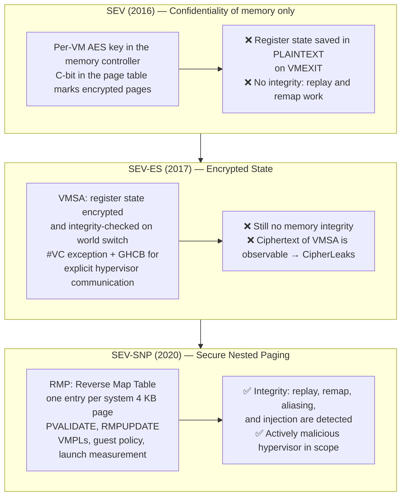
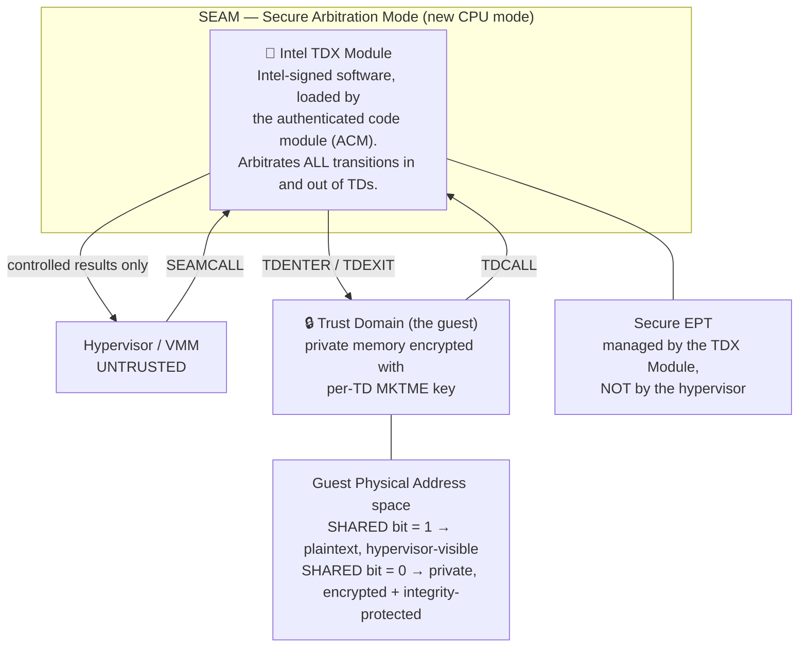
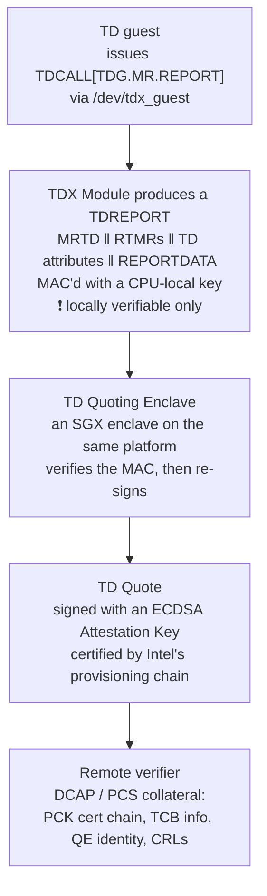
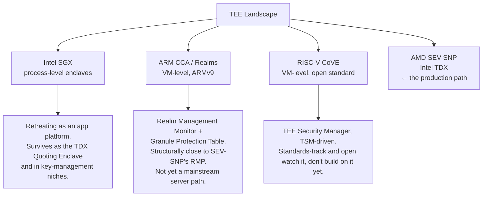

# Module 2: Hardware TEE Architectures

Module 1 established that a VM TEE needs five primitives: a root of trust, measurement, memory encryption, integrity, and attestation. This module examines how AMD and Intel actually build them. The goal is not encyclopedic coverage of two instruction set extensions — it is to be able to read a vendor claim, an attestation report field, or an incident advisory and know exactly which mechanism it refers to and what it does not cover.

This module covers **the AMD SEV lineage and the SEV-SNP integrity model**, **Intel TDX and its additional TCB layer**, **the rest of the TEE landscape**, **what stops working operationally when you enable these**, and **the published attacks and what they do to your security claim**.

---

## Part 1: The AMD SEV Lineage

AMD shipped confidential computing in three generations, and the generational differences are not marketing increments — each one closes a specific attack class from Module 1, §3.3. Knowing which generation you are on determines which adversary you have actually excluded.



### 1.1 SEV: The C-Bit and the Memory Encryption Engine

The base mechanism is simple and has not changed since 2016. Each confidential VM is assigned an **ASID** (address space identifier), and the AMD Secure Processor programs an AES key for that ASID into the memory controller. The key is generated inside the secure processor, never leaves it, and is not readable by the guest, the hypervisor, or any software at all.

Which pages get encrypted is controlled by the **C-bit** — a physical-address bit (bit 47 on typical EPYC parts) set in the guest's own page tables. A page mapped with the C-bit set is encrypted with the VM's key; a page mapped without it is plaintext, which is how the guest deliberately establishes shared buffers for I/O.

$$
\text{DRAM}[pa] = \text{AES-XTS}_{K_{ASID}}\big(\text{plaintext},\ \text{tweak} = f(pa)\big)
$$

Two consequences follow immediately and both matter later:

1. **The guest chooses what is confidential.** Any data the guest wants to DMA to a device must be placed in a *shared* (C-bit clear) page. This is why device I/O in a confidential VM requires bounce buffers — the guest copies data from private memory into a shared bounce buffer, and the device DMAs from there. Module 4 shows that confidential GPUs are the same mechanism with encryption added on top of the bounce path.
2. **The tweak is a function of the physical address.** This is what makes ciphertext deterministic per-address, and it is the root of the ciphertext side channel (§5.1).

The original SEV had a glaring hole: on `VMEXIT`, the guest's register state was written to the VMCB in *plaintext*, where the hypervisor could read and modify it freely. Encrypting memory while leaving the register file exposed on every world switch protects very little.

### 1.2 SEV-ES: Encrypted State and the GHCB

SEV-ES closes that hole with the **VMSA** (VM Save Area) — an encrypted, integrity-checked region holding guest register state across world switches. The hypervisor can no longer read or tamper with registers on exit.

But the hypervisor still needs *some* information to emulate I/O. SEV-ES makes this explicit rather than implicit: operations that previously caused a silent `VMEXIT` now raise a **`#VC` (VMM Communication) exception** inside the guest, and a guest-side handler decides what to disclose, writing it into the **GHCB** (Guest-Hypervisor Communication Block), a shared page.

This inversion is the architectural heart of the whole design and worth stating as a principle:

> **The guest, not the hypervisor, decides what leaves the trust boundary.** Every VM-TEE architecture converges on this. TDX arrives at the same place via `TDCALL` and the shared/private GPA bit.

The residual weakness — the one that CipherLeaks exploits — is that although the VMSA is encrypted, its *ciphertext* is stored in memory the hypervisor can read, at a fixed address, deterministically encrypted. An attacker who dumps VMSA ciphertext after every exit learns when specific registers changed value and when they returned to a previously-seen value. That is enough to break constant-time cryptographic implementations.

### 1.3 SEV-SNP: Integrity via the Reverse Map Table

SEV-SNP adds the missing half of Module 1, §3.3: **integrity**. The mechanism is the **RMP** (Reverse Map Table), a single system-wide table with one entry per 4 KB physical page, maintained by hardware and the AMD Secure Processor and *not writable by the hypervisor*.

Each RMP entry records who owns the page:

| RMP field | Meaning |
| :--- | :--- |
| `Assigned` | Is this page assigned to a guest, or is it hypervisor-owned? |
| `ASID` | Which guest owns it |
| `GPA` | Which *guest* physical address this system page is allowed to back |
| `Validated` | Has the guest accepted this page via `PVALIDATE`? |
| `VMPL` permissions | Per-privilege-level read/write/execute/supervisor rights |
| `Page size` | 4 KB vs 2 MB |

Every memory access by a guest is checked against the RMP in addition to the nested page tables. The check that matters most is the **GPA binding**: a system physical page assigned to guest $g$ at guest physical address $x$ can only ever be accessed as $x$. This single invariant kills the remap and aliasing attacks — the hypervisor can still change the nested page tables, but if it points GPA $y$ at a page whose RMP entry says GPA $x$, the access faults.

`PVALIDATE` is the guest's side of the contract. A page is not usable as private memory until the guest itself executes `PVALIDATE` on it, and the hardware enforces that a given page can only be validated once (until it is reclaimed and re-assigned). This closes the **double-validation / replay** attack: the hypervisor cannot silently swap in an old copy of a page and have the guest accept it, because acceptance is a one-time, guest-initiated, hardware-tracked event.

#### 1. VMPLs — privilege levels *inside* the guest

SEV-SNP defines four **Virtual Machine Privilege Levels** (VMPL0–VMPL3), with VMPL0 most privileged. RMP entries carry per-VMPL permissions, so software at VMPL0 can restrict what the guest kernel at VMPL1 may do to a page.

This exists to support a **paravisor** or **Secure VM Service Module (SVSM)** — a small trusted layer running at VMPL0 that provides services the guest kernel needs but should not be trusted to implement itself, most importantly a **virtual TPM**. A vTPM implemented by the hypervisor would be pointless in a confidential VM (the hypervisor is the adversary); a vTPM implemented at VMPL0 inside the encrypted guest is meaningful. Remember this for Module 3: on GCP, the vTPM that produces measured-boot evidence has to come from somewhere, and where it comes from determines whether its quotes are worth anything.

#### 2. Guest policy

At launch the guest owner specifies a **policy** — a bit field baked into the attestation report — declaring the minimum acceptable firmware version and whether features like debug, SMT, and migration are permitted. The firmware refuses to launch a guest whose requested policy the platform cannot satisfy, and the policy appears in every attestation report so a verifier can reject a guest launched with, say, debug enabled.

Checking the policy field is not optional. An attestation report from a genuine SEV-SNP machine with `DEBUG` allowed in the policy is a report from a machine whose memory the operator can read. Verifiers that check the measurement but not the policy are a recurring real-world bug.

#### 3. The launch measurement

The AMD Secure Processor computes a SHA-384 digest over the initial guest memory pages, their page types, and the initial vCPU state (VMSA) as the guest is constructed, before it ever executes an instruction. This is the `MEASUREMENT` field of the attestation report, and it is the anchor of everything in Module 3.

Crucially it covers *the initial image*, which in practice means firmware plus whatever the firmware was given. It does **not** cover the kernel your firmware later loads off a disk, unless that is measured separately into a vTPM. This gap is where most real measurement chains break, and Module 3, §2 covers how it is bridged.

### 1.4 The Attestation Report

The guest requests a report through `/dev/sev-guest`, which issues a firmware call to the AMD Secure Processor over an encrypted channel keyed by the **VMPCK** (VM Platform Communication Key, established at launch and known only to the guest and the ASP). The ASP returns a report signed with the **VCEK** (Versioned Chip Endorsement Key), a key derived from chip-unique fused secrets *and the current TCB version*.

The fields that matter operationally:

| Field | What it holds | Why a verifier must check it |
| :--- | :--- | :--- |
| `MEASUREMENT` | SHA-384 launch digest | This is "what code is running" |
| `REPORT_DATA` | 64 bytes supplied by the guest | The nonce and/or public key binding — Module 1, §3.4 |
| `HOST_DATA` | 32 bytes supplied by the *hypervisor* at launch | Untrusted by construction; useful for correlation, never for security |
| `POLICY` | Guest policy bits, including debug | A report with debug allowed is not a confidentiality guarantee |
| `TCB_VERSION` / `*_SVN` | Security version numbers of the firmware components | Rejects known-vulnerable platform firmware |
| `ID_KEY_DIGEST`, `AUTHOR_KEY_DIGEST` | Digests of the guest owner's signing keys | Lets a verifier confirm *who* launched this guest, not just what |
| `VMPL` | The privilege level that requested the report | A VMPL3 report says less than a VMPL0 one |
| `REPORT_ID`, `MA_REPORT_ID` | Report identity; links to a migration agent's report | Relevant if migration is enabled at all |

The `TCB_VERSION` row deserves emphasis because it is the source of significant operational pain. The VCEK is *derived from* the TCB version — meaning when AMD ships a firmware update and the platform TCB advances, **the signing key changes**, and every cached certificate and every pinned reference value becomes stale. Module 3, §4 covers the fleet-wide churn this causes.

---

## Part 2: Intel TDX

Intel's Trust Domain Extensions reach the same destination by a structurally different route. Where AMD put the enforcement logic in hardware tables managed by a coprocessor, Intel introduced a new privilege mode and a new *software* component that runs in it.



### 2.1 SEAM and the TDX Module

TDX introduces **SEAM** (Secure Arbitration Mode), a CPU mode more privileged than the hypervisor's VMX root mode. Only one thing runs there: the **Intel TDX Module**, an Intel-signed software component loaded at boot by an authenticated code module and measured into the platform.

Every transition into or out of a Trust Domain passes through the TDX Module. The hypervisor asks for things via `SEAMCALL`; the guest asks for things via `TDCALL`. The hypervisor never touches TD memory or TD register state directly — it requests, and the module decides.

**The architectural tradeoff is explicit and should be stated in any design document**: TDX adds a substantial piece of *software* to the TCB that AMD's design does not have. The TDX Module is on the order of a hundred thousand lines of code running at the highest privilege level on the machine. In exchange, Intel gets flexibility — the module can be updated to fix bugs and add features without new silicon, which is exactly what happened with the TDX errata discussed in §5.3. AMD's RMP-based enforcement is more rigid and has a smaller software TCB.

Neither approach is strictly better; they fail differently. AMD failures tend to require a hardware or PSP firmware fix; Intel failures can often be patched in the module, at the cost of a TCB recovery event that invalidates prior attestations.

### 2.2 Private and Shared Memory: The SHARED Bit

TDX splits the guest physical address space using the most significant guest-physical-address bit as a **SHARED** flag:

| GPA bit | Memory type | Encrypted? | Integrity-protected? | Hypervisor access |
| :--- | :--- | :--- | :--- | :--- |
| SHARED = 0 | Private | Yes, per-TD MKTME key | Yes | None |
| SHARED = 1 | Shared | No | No | Full |

This is functionally the inverse of AMD's C-bit (there, set means encrypted; here, set means shared) but serves the identical purpose: the guest explicitly designates the memory it uses to talk to the outside world. Virtio rings, bounce buffers, and any DMA target live in shared pages.

Private memory is managed through the **Secure EPT**, a second-stage page table that the *TDX Module* owns. The hypervisor can request page additions and removals, but it cannot map a private page to a different GPA or alias two private pages, because it does not hold the write permission — the same invariant the RMP provides on AMD, enforced by a different mechanism.

### 2.3 Measurement Registers: MRTD and RTMR

TDX provides two kinds of measurement register, and the split maps exactly onto Module 1, §3.2:

- **`MRTD`** (Measurement Register for Trust Domain) — the *build-time* measurement, computed by the TDX Module as the TD is constructed from its initial pages, then finalized. Immutable thereafter. The direct analogue of the SEV-SNP launch measurement.
- **`RTMR0` … `RTMR3`** — four *runtime* extendable registers, behaving like TPM PCRs: extend-only, `RTMR_new = SHA384(RTMR_old ‖ data)`. The guest extends these as it boots to cover the kernel, initrd, command line, and — the part that matters for Kubernetes — the container image digest.

The conventional split follows TCG-style boot phases: `RTMR0` for the virtual firmware and its configuration, `RTMR1` for the OS loader and kernel, `RTMR2` for the OS application layer, `RTMR3` reserved for the workload. A verifier that checks `MRTD` alone has verified the initial image and learned nothing about what it booted.

### 2.4 The Quote Path

Getting from an in-TD measurement to something a remote party can verify takes two steps, and the two-step structure is the thing to remember:



Two points that trip people up:

1. **A TDREPORT is not remotely verifiable.** It carries a MAC under a key only that CPU package holds. It is useful only on-platform. The Quoting Enclave's job is to convert local, symmetric evidence into a remotely-verifiable asymmetric signature. If you see "TDREPORT" in an architecture diagram crossing a network boundary, the diagram is wrong.
2. **The Quoting Enclave is an SGX enclave.** SGX is deprecated on client parts and receding as an application platform, but it survives on Xeon as the substrate for TDX attestation. It is not gone; it changed jobs.

Verification requires **collateral** fetched from Intel's Provisioning Certification Service: the PCK certificate chain for that specific CPU, the current TCB info, the QE identity, and CRLs. This is the analogue of AMD's KDS, and it has the same operational consequence — verification depends on reaching a vendor service, or on caching its output and dealing with staleness.

---

## Part 3: The Rest of the Landscape

You will encounter these three in specifications, papers, and vendor roadmaps. Brief treatment is sufficient, but knowing where each sits prevents category errors.



**Intel SGX** is the process TEE from Module 1, §4.1. Its historical constraints — a small encrypted page cache, painful application partitioning, no clean device access — disqualified it for model serving. It is worth understanding for two reasons: the TDX attestation path depends on it, and much of the attack literature (single-stepping, controlled channels) originated there and transferred directly to VM TEEs.

**ARM CCA** introduces *Realms*, isolated VM-like environments managed by a **Realm Management Monitor**, with a **Granule Protection Table** tracking page ownership. If that sounds like the RMP, it is the same idea with different naming — which is the useful takeaway: the industry converged on "hardware-enforced page ownership tracking" as the correct integrity primitive, independently, three times.

**RISC-V CoVE** (Confidential VM Extension) defines a **TEE Security Manager** occupying a role analogous to the TDX Module. It matters as evidence that the architecture is now standard rather than proprietary, and because an open TEE is the only path to eliminating vendor trust (adversary B3 from Module 1). It is not a deployment option today.

---

## Part 4: Comparison and Operational Consequences

### 4.1 Head-to-Head

| Dimension | SEV-SNP | TDX |
| :--- | :--- | :--- |
| Enforcement mechanism | RMP table + hardware checks | TDX Module software in SEAM mode |
| Added software TCB | AMD PSP firmware | AMD PSP equivalent **plus** the TDX Module (~10⁵ LoC) |
| Memory confidentiality | AES-XTS per-ASID key | MKTME per-TD key |
| Memory integrity | RMP ownership + `PVALIDATE` | Secure EPT managed by the TDX Module |
| Private/shared marking | C-bit set = **encrypted** | SHARED bit set = **plaintext** |
| Launch measurement | `MEASUREMENT` (SHA-384) | `MRTD` (SHA-384) |
| Runtime measurement | None natively; requires a vTPM (typically via an SVSM at VMPL0) | `RTMR0-3` natively |
| Attestation output | Report signed by VCEK/VLEK | TD Quote signed by an ECDSA AK via the Quoting Enclave |
| Endorsement service | AMD KDS | Intel PCS / DCAP collateral |
| In-guest privilege levels | VMPL0–3 | None equivalent |
| Live migration | Requires a migration agent; disabled in practice on GCP | Not supported |
| GCP machine families | N2D (SEV, SEV-SNP), C2D/C3D (SEV), C4D (SEV) | C3, and the A3 confidential-GPU path |

The row worth internalizing is **runtime measurement**. TDX gives you `RTMR0-3` in the architecture; SEV-SNP does not, so a measured-boot chain covering the kernel and container image must be built on a vTPM, which must itself be trustworthy, which is why the SVSM/VMPL0 machinery in §1.3 exists. This is why on Google Cloud the *confidential GPU* path is TDX-based — the attestation story is more complete out of the box.

### 4.2 What Stops Working

This section is the one to bring to a design review. Enabling confidential computing is not transparent, and the breakages are structural rather than bugs to be fixed later.

#### 1. Live migration

Live migration requires copying guest memory to another host. In a confidential VM the memory is encrypted with a key the hypervisor cannot access, so migration requires a *migration agent* inside the trust boundary that re-encrypts pages for the destination — plus attestation of the destination platform, plus policy allowing it. AMD specifies this (hence `MA_REPORT_ID` in the report), Intel does not support it, and on GCP the practical answer is `--maintenance-policy=TERMINATE`.

**Consequence for LLM serving**: host maintenance events terminate your inference node. With a multi-minute cold start (Module 6, §4), this is a capacity-planning problem, not a footnote. You need surge capacity and drain handling that a normal GKE node pool does not need.

#### 2. Memory ballooning and overcommit

Private pages must be explicitly accepted by the guest (`PVALIDATE` / TD page acceptance). The hypervisor cannot silently reclaim them. Ballooning and memory overcommit therefore either do not work or require guest cooperation. Cloud providers respond by not overcommitting confidential instances — which is part of why they cost more and why capacity is tighter.

#### 3. Boot time

The guest must accept its entire private memory range before use. For a VM with hundreds of gigabytes this is measurable — the acceptance loop is proportional to memory size, and it lands directly in your cold-start budget. Measure it; do not assume it.

#### 4. Device access and DMA

Every DMA target must be a shared page. Drivers that assume they can DMA from arbitrary kernel memory must go through the kernel's bounce-buffer path (`swiotlb`). For high-throughput devices this bounce is the dominant overhead — and it is exactly the mechanism that Module 4 shows dominating confidential GPU performance.

#### 5. Nested virtualization

Generally unavailable inside confidential VMs. If your stack expects nested virtualization — some sandboxing runtimes, some CI patterns — verify before committing.

#### 6. Observability and debugging

Host-side profiling, memory introspection, live kernel debugging, and crash dumps to a host-visible location all stop working by design. `perf` from the host sees nothing useful. Core dumps contain confidential data and therefore must not leave the TEE unencrypted. Module 7, §3 is devoted to this.

#### 7. Attestation on the critical path

Every node join, every key release, and every image rollout now depends on reaching a verifier and, transitively, a vendor endorsement service. You have added a hard dependency on AMD's KDS or Intel's PCS to your ability to start serving traffic. Cache the collateral, and know your behavior when the cache is cold and the service is unreachable.

---

## Part 5: Known Attacks and Residual Risk

The purpose of this section is not to catalogue vulnerabilities. It is to answer one question: **when you tell a model provider "Google cannot read your weights," which published results qualify that statement?** Answering honestly is both more defensible and more professional than not knowing.

### 5.1 The Ciphertext Side Channel

The deepest issue, because it is architectural rather than a bug.

Memory encryption is AES-XTS with a tweak derived from the physical address (§1.1). It is therefore **deterministic**: the same plaintext, at the same address, under the same key, always yields the same ciphertext. An attacker who can read ciphertext — which the hypervisor always can, since it manages the physical memory — can detect *when a value changes* and *when it returns to a previously observed value*, without ever decrypting anything.

**CIPHERLEAKS** (USENIX Security 2021) demonstrated this against SEV-ES and SEV-SNP by observing VMSA ciphertext across `VMEXIT`s, recovering full private keys from constant-time RSA and ECDSA implementations in OpenSSL. Constant-time code is not a defense here — constant-time protects against *timing* leakage, and this channel is about *value* leakage.

Follow-up work generalized it beyond the VMSA to guest data pages, and produced both automated detection tooling (CipherH) and compiler-level mitigations (Cipherfix, CipherGuard, Zebrafix) that break the plaintext-to-ciphertext determinism by masking or interleaving secret-dependent memory. **Heracles** (CCS 2025) pushed further into chosen-plaintext territory against SEV-SNP.

**What this means for an LLM serving design.** It is a serious threat to cryptographic secrets held in guest memory — TLS private keys, the KEK used to decrypt weights. It is a much weaker threat to the weights themselves, which are hundreds of gigabytes of high-entropy data that no one is going to reconstruct through a determinism oracle. The right response is to keep cryptographic operations off the confidential VM's CPU where possible and to treat any long-lived key in guest DRAM as the highest-value target in the system. Do not respond by claiming the channel does not exist.

### 5.2 Interrupt Injection and Instruction-Level Manipulation

A second family exploits the fact that the hypervisor still controls interrupt delivery and some cache operations:

- **Heckler** and **WeSee** inject interrupts into a confidential VM to steer guest execution. The guest's `#VC`/interrupt handling paths become an attack surface precisely because the hypervisor retains scheduling control — the "control vs confidentiality" asymmetry from Module 1, §2.2, viewed from the attacker's side.
- **CacheWarp** abuses the `INVD` instruction to drop guest writes from cache, effectively rolling back guest memory state and defeating checks in security-sensitive code paths.

These were addressed by a combination of guest kernel hardening and firmware updates. The structural lesson generalizes: **anything the hypervisor is deliberately left in control of is an attack surface**, and each new capability the hypervisor keeps is a new one.

### 5.3 Single-Stepping and TDX

**TDXdown** (CCS 2024) demonstrated single-stepping and instruction-counting against Intel TDX, defeating the module's built-in mitigation. Single-stepping — pausing a TEE after each instruction to observe microarchitectural state — was pioneered against SGX and transfers to VM TEEs, and it dramatically amplifies every other side channel by giving the attacker precise control over observation points.

Intel's response came through TDX Module updates, which is the flexibility advantage from §2.1 realized. It also illustrates the cost: a module update advances the TCB, which invalidates prior attestation results, which forces a fleet-wide re-attestation.

### 5.4 The Honest Summary

| Attack class | Status | Effect on the claim you make to a model provider |
| :--- | :--- | :--- |
| Cross-VM memory read | Prevented | Fully addressed |
| Malicious hypervisor reading guest DRAM | Prevented (SNP/TDX) | Fully addressed |
| Replay / remap / aliasing | Prevented (RMP, Secure EPT) | Fully addressed |
| Physical DRAM attack | Prevented | Fully addressed |
| Ciphertext side channel | **Architectural, mitigations are software-side** | Qualify the claim: crypto keys in guest memory are at elevated risk |
| Interrupt injection, `INVD` rollback | Patched, class remains open | Requires staying current on firmware and guest kernel |
| Single-stepping | **Open, actively researched** | Amplifies other channels; not in vendor threat models |
| Traffic analysis, request timing | **Never in scope** | State it explicitly; do not imply otherwise |
| Availability | **Never in scope** | Operator can always stop you |

The professional posture is the third column. A design document that lists these qualifications is more credible to a sophisticated counterparty than one that claims the problem is solved — and a model provider's security team will know this literature.

---

## Lab: Pull and Decode Real Attestation Reports From Both Vendors

**Goal:** obtain genuine hardware-signed attestation evidence from an AMD SEV-SNP guest *and* an Intel TDX guest, identify by hand every field discussed in §1.4 and §2.3, and then survey a fleet to see how much the TCB values actually vary across machines. This is the exercise that converts Module 3 from abstraction into mechanics.

**Scope:** reuse `cc-lab-snp` and `cc-lab-tdx` from Module 1, then add a spread of instances across zones and machine shapes for the fleet survey. Decoding one vendor's report teaches you a format; decoding both teaches you which parts of attestation are architectural and which are AMD's or Intel's local conventions. **Status:** `gcloud` invocations and the SEV-SNP machine-type constraint in Step 9 verified against Google Cloud's supported-configurations documentation; `snpguest` commands written against **v0.10.x**, whose positional argument order differs from earlier releases — check `snpguest --version` and `--help` before assuming a failure is yours. The TDX quote path moves quickly; verify against current Intel and Google documentation.

### Step 1 — Confirm both guests are what they claim

On `cc-lab-snp` and `cc-lab-tdx` respectively:

```bash
ls -l /dev/sev-guest      # on the SNP guest
ls -l /dev/tdx_guest      # on the TDX guest
sudo dmesg | grep -i -E 'sev|tdx'
```

If the device node is absent, the instance is not actually running under the TEE and nothing below will work. Fix that before proceeding — this is also the check your production readiness probe should perform.

### Step 2 — Install `snpguest` on the AMD guest

```bash
sudo apt-get update && sudo apt-get install -y build-essential pkg-config libssl-dev git
curl --proto '=https' --tlsv1.2 -sSf https://sh.rustup.rs | sh -s -- -y
source "$HOME/.cargo/env"
git clone https://github.com/virtee/snpguest.git
cd snpguest && cargo build --release
sudo cp target/release/snpguest /usr/local/bin/

snpguest --version    # this lab is written against 0.10.x
```

**Pin the version, and check it.** `snpguest`'s positional argument order has changed between releases — `fetch ca` and `fetch vcek` in particular. If a command below fails with a usage error, that is almost always the cause, and `snpguest fetch ca --help` will show you the current order in ten seconds. This is not a flaw in the tool; it is what depending on a fast-moving attestation toolchain feels like, and it is a small preview of the collateral-versioning problem in Module 7.

### Step 3 — Request a report with your own `REPORT_DATA`

The request file must be **exactly 64 bytes of binary** — the tool reads 64 bytes and does not pad. The easy way is to let it generate them:

```bash
# --random writes 64 random bytes into the request file and binds them
# to REPORT_DATA. In production this is the nonce and/or the hash of
# your TLS public key (Module 1 §3.4, Module 3 §6).
sudo snpguest report attestation-report.bin request-data.bin --random

# To supply your own instead, make sure it is 64 raw bytes, not 64 hex characters:
#   openssl rand 64 > request-data.bin
#   sudo snpguest report attestation-report.bin request-data.bin

sudo snpguest display report attestation-report.bin
```

### Step 4 — Read the fields

Work through the decoded output and locate each of these. This is the actual learning objective of the lab:

- `MEASUREMENT` — the SHA-384 launch digest. Note that you have no independent way to know what value to *expect* here. Sit with that discomfort; it is the reference-value problem of Module 3, §7, and it is the hardest unsolved problem in the field.
- `REPORT_DATA` — confirm it echoes the bytes you supplied.
- `POLICY` — decode the bits. Is debug permitted?
- `TCB_VERSION` and the `*_SVN` fields — the platform's firmware security versions.
- `VMPL` — which privilege level requested this. `snpguest` defaults to **VMPL 1**, so that is what you will see unless you pass `-v 0`. Do that and pull a second report; the two differ, which is the point — the field records the requester, not the machine.
- `SIGNATURE` — an ECDSA P-384 signature, meaningless until you verify it against a certificate chain.

### Step 5 — Fetch the certificate chain

```bash
# Retrieve the ARK/ASK chain and the VCEK from AMD's Key Distribution Service.
# Argument order is: ENCODING, then CERTS_DIR, then the processor model.
sudo snpguest fetch ca pem ./certs milan
sudo snpguest fetch vcek pem ./certs attestation-report.bin
ls -l ./certs
```

Better still, let the report name its own processor model rather than hardcoding `milan`, which is wrong the moment you run the survey in Step 9 on anything else:

```bash
sudo snpguest fetch ca pem ./certs --report attestation-report.bin --endorser vcek
```

Note what just happened: verification required contacting an AMD service. That dependency is now on the critical path of your production key-release flow (§4.2.7).

### Step 6 — Verify

```bash
sudo snpguest verify certs ./certs
sudo snpguest verify attestation ./certs attestation-report.bin
```

A successful verification establishes: *a genuine AMD EPYC processor, in SNP mode, at a specific firmware TCB level, launched a guest with this launch measurement and this policy, and echoed my `REPORT_DATA`.*

### Step 7 — Now get a quote out of the Intel TDX guest

Kernels from **6.7 onward** expose a vendor-neutral request interface through configfs, which is the most efficient way to see what the two architectures share. Ubuntu 24.04 is new enough. On `cc-lab-tdx`:

```bash
# The interface appears once the platform's guest driver is loaded; that
# driver selects TSM_REPORTS, which is what creates the configfs tree.
# There is no module called "tsm" — load the vendor driver instead.
sudo modprobe tdx_guest      # or: sudo modprobe sev-guest, on the AMD box
ls -d /sys/kernel/config/tsm/report/

sudo mkdir /sys/kernel/config/tsm/report/lab
openssl rand 64 | sudo tee /sys/kernel/config/tsm/report/lab/inblob >/dev/null
sudo cat /sys/kernel/config/tsm/report/lab/provider     # expect "tdx_guest"
sudo cat /sys/kernel/config/tsm/report/lab/outblob > tdx-quote.bin
```

`inblob` takes up to 64 bytes of **raw binary**, so generate bytes rather than hex text — writing 64 hex characters silently gives you an ASCII string as your nonce, which works and is not what you meant. When you are done, `sudo rmdir /sys/kernel/config/tsm/report/lab` releases the entry.

Run the identical sequence on `cc-lab-snp` and note that it also works, producing an SNP report instead. **The request interface is common; the bytes that come back are not.** Parse the quote with Intel's DCAP quote-parsing sample or the Trust Authority CLI, and locate the TDX analogues of what you just read on AMD.

### Step 8 — Diff the two architectures using your own evidence

Fill this in from the two artifacts you just produced, not from the table in §2:

| Question | SEV-SNP (`attestation-report.bin`) | TDX (`tdx-quote.bin`) |
| :--- | :--- | :--- |
| What holds the launch measurement? | `MEASUREMENT` | `MRTD` |
| Where does post-launch measurement live? | *(nowhere — find this out)* | `RTMR0`–`RTMR3` |
| What echoes your 64 bytes? | `REPORT_DATA` | `REPORTDATA` |
| What identifies the firmware level? | `TCB_VERSION`, `*_SVN` | `TEE_TCB_SVN`, `SEAMSVN` |
| What signs it, and what signs *that*? | VCEK ← ASK ← ARK | ECDSA AK ← PCK ← Intel root |
| Is debug state in the evidence? | `POLICY` bits | `TD_ATTRIBUTES` |

The empty cell is the important one. AMD's report has no equivalent of the RTMRs, which is exactly why §3.4 said SEV-SNP needs an external vTPM for runtime measurement — and why Google's confidential-GPU path is TDX-based. You have now proved that from evidence rather than accepted it from prose.

### Step 9 — Survey how much your fleet actually varies

Reference values are only useful if you know the spread they have to cover. Boot a spread of SNP instances and collect a report from each.

One constraint shapes this step, and it is worth knowing before you write the loop: on Google Cloud, **SEV-SNP is available only on N2D with AMD Milan.** C3D is Genoa but offers plain SEV, not SNP; C2D and C4D are SEV as well. So you cannot vary the CPU generation here even if you want to — asking for `--min-cpu-platform="AMD Genoa"` with `--confidential-compute-type=SEV_SNP` is simply rejected. Vary what you actually can:

```bash
for z in us-central1-a us-central1-b us-east1-b europe-west4-a; do
  for size in 2 4 16; do
    gcloud compute instances create "snp-survey-${z}-${size}" \
      --confidential-compute-type=SEV_SNP --machine-type="n2d-standard-${size}" \
      --min-cpu-platform="AMD Milan" --maintenance-policy=TERMINATE --zone="$z" \
      --image-project=ubuntu-os-cloud --image-family=ubuntu-2404-lts-amd64 \
      --async
  done
done
```

Note the naming: instance names must be lowercase and unique, and `us-central1-b` and `us-east1-b` both end in `b`, so the zone has to go in whole.

Pull a report from every one, then diff the `TCB_VERSION` and `MEASUREMENT` fields across the whole set. Two results to look for, both of which will shape a policy you write later:

1. **`TCB_VERSION` varies across the fleet**, because hosts are patched on a rolling basis. A release policy that pins an exact TCB value would have just failed on some fraction of your own instances — which is why Module 3, §5.3 insists the policy express a *floor* and never an equality.
2. **`MEASUREMENT` varies with things you did not think were inputs.** The same image at a different vCPU count produces a different launch digest, because the count and the firmware are measured alongside it. Anyone maintaining an allowlist of expected measurements is maintaining a matrix indexed by machine shape, not a value.

Write down how many distinct measurements you observed for what you thought was one configuration. That number is the honest size of the reference-value problem, and it is the reason §7 of the next module is as long as it is.

### Step 10 — Notice what you still do not have

Write down, before moving on, what this evidence does **not** tell you:

1. Whether that launch measurement corresponds to code you trust — you have a hash and no reference value.
2. What the guest loaded *after* launch. On AMD, nothing after launch is covered at all; on Intel, only what something deliberately extended into an RTMR.
3. Whether the entity that showed you this report is the entity you are actually talking to — nothing binds it to a channel until you put a public key hash in `REPORT_DATA`.

Those three gaps are Parts 2, 6, and 7 of Module 3.

### Step 11 — Clean up

```bash
gcloud compute instances list --filter="name~'^snp-survey-'" --format="value(name,zone)" \
  | while read n z; do gcloud compute instances delete "$n" --zone="$z" --quiet; done
```

Keep `cc-lab-snp` and `cc-lab-tdx` once more — Module 3 uses a Confidential Space image rather than these, but having a working `snpguest` install to compare raw evidence against a Google-issued token is worth the two instances.

---

## Summary: Hardware TEE Comparison

| Question | SEV-SNP | TDX | Why it matters downstream |
| :--- | :--- | :--- | :--- |
| Who enforces isolation? | RMP table, checked in hardware | TDX Module software in SEAM mode | Determines TCB size and patch model |
| Which bit marks confidential memory? | C-bit set = encrypted | SHARED bit set = plaintext | Inverted conventions; a frequent source of confusion |
| How is replay prevented? | RMP GPA binding + one-shot `PVALIDATE` | Secure EPT owned by the TDX Module | This is the SEV-ES → SEV-SNP generational leap |
| Runtime measurement built in? | No — needs a vTPM, typically via SVSM at VMPL0 | Yes — `RTMR0-3` | Why GCP's confidential-GPU path is TDX-based |
| What signs the evidence? | VCEK, derived from chip secrets **and TCB version** | ECDSA AK via the TD Quoting Enclave (an SGX enclave) | Both create a hard dependency on a vendor service |
| Live migration? | Migration agent required; disabled in practice | Not supported | Host maintenance terminates your inference node |
| Biggest residual risk | Ciphertext side channel (architectural) | Single-stepping (TDXdown class) | Qualify your security claims accordingly |

You can now obtain a hardware-signed statement about a running machine. That statement is currently worthless, for three reasons: you have no reference value to compare the measurement against, it says nothing about what the guest loaded after boot, and it is not bound to any channel you are communicating over. Closing those three gaps — and using the result to release a key — is **Module 3: Remote Attestation and Attested Key Release (`03_remote_attestation_and_key_release.md`)**.
