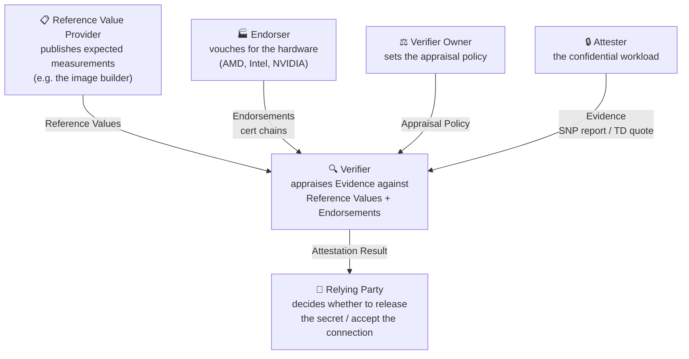
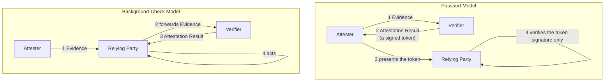
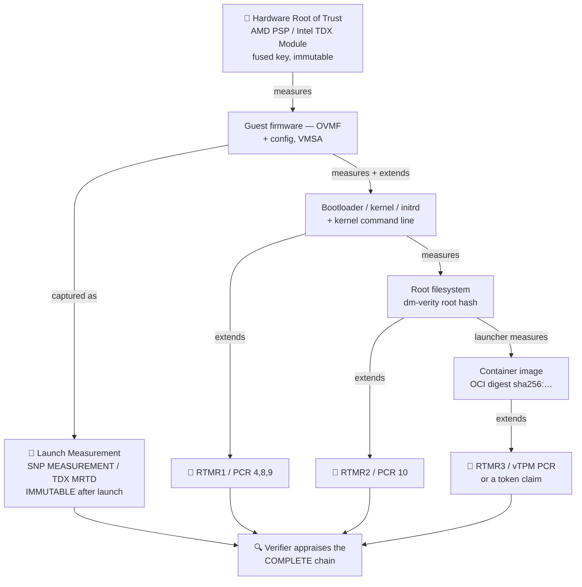
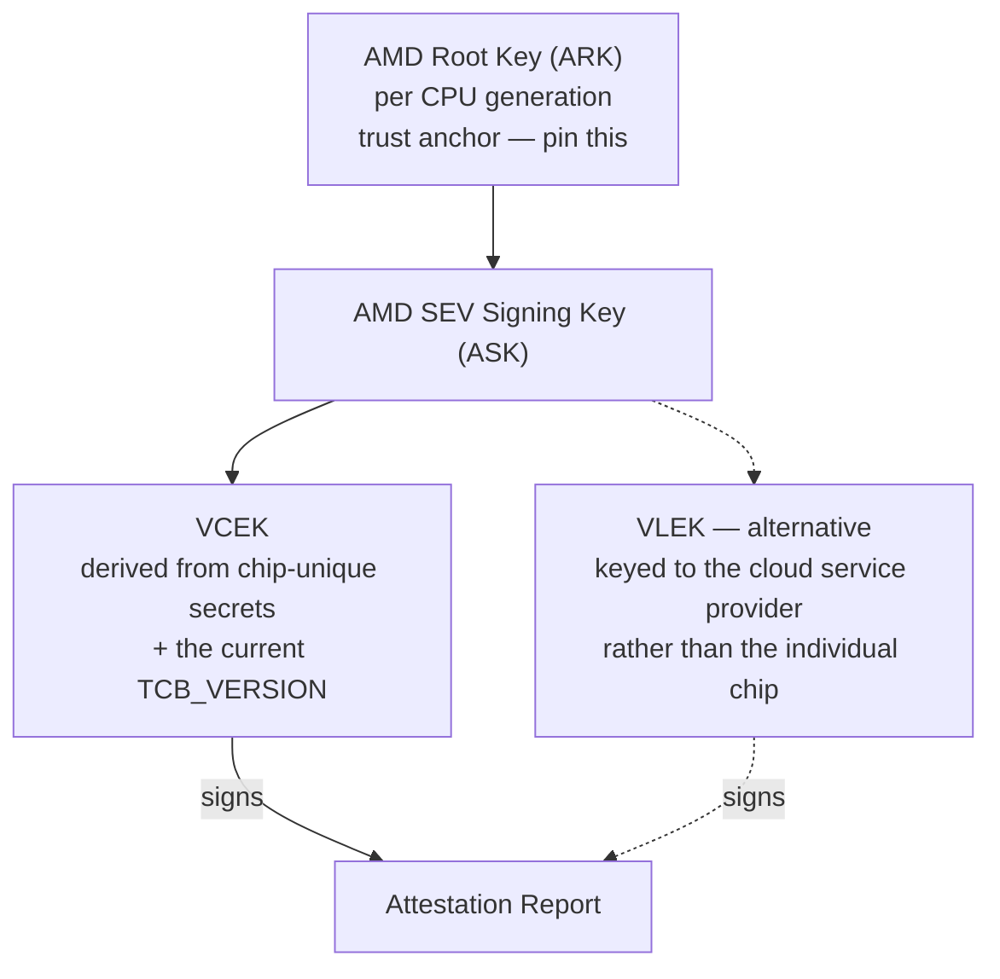
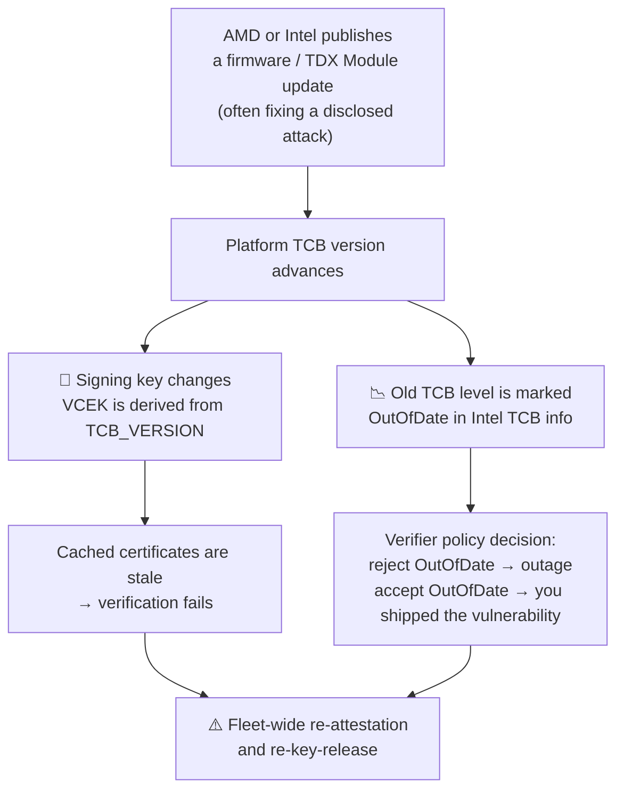
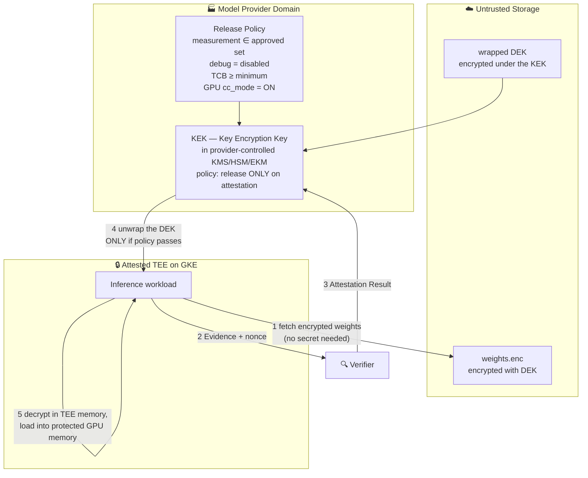
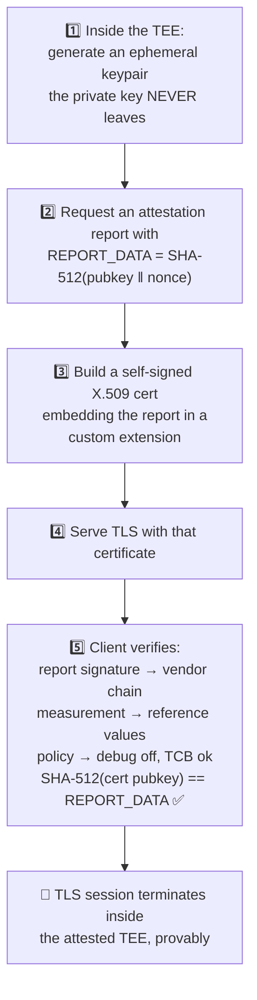

# Module 3: Remote Attestation and Attested Key Release

Module 2 ended with a hardware-signed report and three reasons it was worthless: no reference value to compare the measurement against, no coverage of anything loaded after boot, and no binding to the channel you are talking over. This module closes all three, and then uses the result to do the thing that makes confidential computing commercially meaningful — release a decryption key to a machine on the basis of what it is running, rather than on the basis of who is asking.

This is the longest module in the book, and deliberately so. The trusted execution environment is a component you buy; attestation is the system you design. Almost every real-world failure of a confidential computing deployment is an attestation failure, not a TEE failure.

This module covers **the RATS architecture and who verifies whom**, **the measurement chain from silicon to container digest**, **evidence formats and their certificate chains**, **freshness, revocation, and TCB versioning**, **attested key release**, **RA-TLS**, and **the reference-value problem**.

---

## Part 1: The RATS Architecture

### 1.1 The Roles

IETF RFC 9334 gives the field its vocabulary. The value of using it is not pedantry — it is that the roles are separable, and *who plays each role* is the single most consequential decision in a confidential computing design.



| Role | What it does | Who plays it in a 3P MaaS design |
| :--- | :--- | :--- |
| **Attester** | Produces Evidence about itself | The inference pod in the confidential GKE node |
| **Verifier** | Appraises Evidence, emits an Attestation Result | ⚠️ **The critical choice** — see §1.3 |
| **Relying Party** | Consumes the result and acts on it | The KMS releasing the weight key; the client deciding to send a prompt |
| **Endorser** | Vouches that the hardware is genuine | AMD (KDS), Intel (PCS), NVIDIA (NRAS) |
| **Reference Value Provider** | Publishes what the measurements *should* be | The party that built the image — often the weakest link (§7) |
| **Verifier Owner** | Sets the appraisal policy | Whoever gets to say "debug must be off, TCB ≥ X, image digest ∈ {…}" |

### 1.2 Passport versus Background-Check

Two topologies, with materially different trust and availability properties.



| | Passport | Background-check |
| :--- | :--- | :--- |
| Who talks to the verifier | The attester | The relying party |
| Relying party complexity | Low — just verify a JWT signature | High — must integrate a verifier |
| Freshness | Bounded by token lifetime; needs care | Naturally fresh, driven by the relying party's nonce |
| Verifier availability on the request path | No (token can be pre-fetched) | Yes |
| Who the relying party must trust | The verifier's signing key | The verifier's live response |

Google Cloud's Confidential Space uses the **passport model**: the workload obtains an OIDC token from the Google Cloud Attestation service and presents it to a relying party such as Cloud KMS, which only checks the JWT signature and the claims. AWS Nitro Enclaves is closer to background-check: the enclave hands an attestation document to KMS, which does the appraisal itself.

### 1.3 The Question That Decides Everything: Who Is the Verifier?

Here is the trap, and it is the reason P3 (mutual verifiability) from Module 1 fails silently in so many real designs.

If Google operates the verifier, then the attestation result is a statement **by Google** that the environment was correct. For a model provider whose threat model explicitly includes Google (adversary A3), that is not evidence — it is a promise, of exactly the kind confidential computing was supposed to replace. The trust chain has a Google-shaped link in the middle of it.

There are three ways out, in increasing order of strength:

| Approach | Mechanism | Residual trust in the cloud operator |
| :--- | :--- | :--- |
| **Cloud-operated verifier** | Google Cloud Attestation issues the token; KMS enforces the policy | Full — you trust Google's verifier and Google's KMS |
| **Independent verifier, cloud evidence** | The provider runs its own verifier over raw SEV-SNP/TDX evidence, chaining to AMD/Intel certs | Minimal for appraisal; Google still controls scheduling and availability |
| **Independent verifier + external key manager** | As above, and the key that decrypts the weights lives in provider-controlled infrastructure (EKM) | Minimal — Google can stop the workload but cannot decrypt |

**The design rule**: the verifier and the key holder should be operated by the party whose asset is at risk. A model provider protecting weights should run the verifier that appraises the environment and should hold the key that unlocks them. Anything else reduces "hardware-enforced" to "contractually promised" with extra latency.

This is a genuinely awkward conversation to have with a cloud platform team, because the convenient path — use the platform's attestation service and the platform's KMS — is precisely the one that dissolves the property the customer is paying for. It is better to have the conversation during design than during a security review.

---

## Part 2: The Measurement Chain

### 2.1 From Silicon to Container Digest

A launch measurement covers firmware. A container digest is what you actually care about. Everything between them has to be chained, and the chain is only as strong as its weakest link.



### 2.2 The Three Places It Breaks

#### 1. The gap between firmware and kernel

The launch measurement covers the initial memory image. If your firmware then loads a kernel from an unmeasured disk, an attacker who can modify that disk controls the kernel while the launch measurement stays valid. The fix is either to build the kernel *into* the measured initial image (a direct-boot, measured-kernel arrangement), or to measure it into a vTPM before executing it.

On SEV-SNP this is acute, because there is no architectural runtime measurement register (Module 2, §4.1) — you need a vTPM, and the vTPM must live inside the trust boundary (an SVSM at VMPL0), not be provided by the hypervisor. **A vTPM implemented by the hypervisor in a confidential VM provides no security whatsoever**, because the adversary is the hypervisor. This is a real and recurring architecture-review finding.

#### 2. The mutable root filesystem

If the rootfs can be modified after measurement, measuring it once proves nothing. The standard answer is `dm-verity`: a Merkle tree over the filesystem whose root hash is measured, with the kernel verifying every block on read. Any modification is detected at access time, not just at boot.

This is why hardened confidential images (Confidential Space's image, Apple PCC's, Azure's CVM images) are read-only with `dm-verity` and a small writable overlay in `tmpfs` — and it is why "just add our agent to the node image" is a request that has to be refused in a confidential design.

#### 3. Runtime mutability

Even with a verified rootfs, `kubectl exec`, a debug sidecar, or a privileged DaemonSet can introduce unmeasured code after attestation. The measurement was accurate *at the time it was taken*; it is not a continuous property.

This is the strongest argument for the Confidential Space model over plain Confidential GKE Nodes (Module 5, §6): Confidential Space runs exactly one container image, measured into the attestation token, with no interactive access in the production image. A confidential GKE node runs a full kubelet that will start whatever the control plane tells it to.

### 2.3 Time-of-Check to Time-of-Use

Attestation happens at a moment. Execution continues afterward. Nothing in the architecture re-verifies the workload while it runs.

Mitigations, in order of practicality:

- **Make the window small.** Attest immediately before releasing a key, not at node join and then reuse forever.
- **Make post-attestation mutation impossible.** Immutable rootfs, no shell, no exec, no dynamic code loading — this is the real defense.
- **Re-attest periodically.** Bound the damage window; note this does not detect a compromise that leaves no measurement trace, which is most of them.
- **Bind secrets to the measurement.** Sealing (Module 1, §3.5) means that even if the attacker replaces the code, the new code cannot unseal the old secrets.

---

## Part 3: Evidence Formats and Certificate Chains

### 3.1 The Three Evidence Types You Will Meet

| | **SEV-SNP report** | **TDX quote** | **TPM quote + event log** |
| :--- | :--- | :--- | :--- |
| Produced by | AMD Secure Processor | TD Quoting Enclave | TPM / vTPM |
| Signed with | VCEK or VLEK | ECDSA Attestation Key | Attestation Identity Key |
| Chains to | AMD ARK → ASK → VCEK | Intel Root CA → PCK → QE → AK | Manufacturer EK certificate |
| Endorsement service | AMD KDS | Intel PCS (DCAP collateral) | Vendor EK CA; on GCE, Google |
| Carries measurement | `MEASUREMENT` (launch only) | `MRTD` + `RTMR0-3` | PCR values + a replayable event log |
| Caller-supplied bytes | `REPORT_DATA` (64 B) | `REPORTDATA` (64 B) | Qualifying data / nonce |
| Freshness | Caller must put a nonce in `REPORT_DATA` | Same | Same |

The TPM row is the one people underestimate. A TPM quote alone gives you PCR values, which are opaque hashes. The **event log** is what makes them interpretable: it records what was measured, in order, so a verifier can *replay* the log, recompute the PCRs, confirm they match the quote, and then inspect the individual events ("this kernel, this command line, this initrd"). Without the event log you can only compare against a golden PCR value, which means you must have booted an identical machine yourself to know what to expect. With the log, you can appraise the individual components.

### 3.2 The AMD Chain



The VCEK/VLEK distinction matters for a cloud deployment:

- **VCEK** is derived from chip-unique secrets. It uniquely identifies the physical CPU. Great for security, and a privacy and correlation concern for the cloud provider, since it lets a tenant fingerprint individual machines in the fleet.
- **VLEK** is issued to a cloud service provider, so reports identify "an AMD part operated by CSP X at TCB level Y" rather than a specific chip. The tenant loses the ability to distinguish physical machines.

You must know which one your platform uses, because the certificate-fetch path and the meaning of the resulting identity both change.

The key operational fact, repeated from Module 2 because it causes real outages: **the VCEK is derived from the TCB version**. Firmware update ⇒ new TCB version ⇒ new VCEK ⇒ every cached certificate is stale and every verifier that pinned one starts failing.

### 3.3 The Intel Chain and DCAP Collateral

Intel verification needs more than a signature — it needs *collateral*:

| Collateral item | What it establishes |
| :--- | :--- |
| PCK certificate chain | This quote came from a genuine Intel CPU with a given PPID and TCB |
| TCB info (per FMSPC) | Which TCB levels are currently up-to-date, out-of-date, or revoked |
| QE identity | The Quoting Enclave itself is genuine and at an acceptable version |
| CRLs | Nothing in the chain has been revoked |

This is fetched from Intel's Provisioning Certification Service, typically via a locally-run **PCCS** cache. The design consequence is unavoidable: **verification has a network dependency on a vendor service.** In production you run a caching service and you decide, explicitly and in advance, what happens when the cache is stale and the upstream is unreachable — fail closed (no key release, no serving) or fail open (accept possibly-revoked evidence). There is no third option, and choosing by accident means choosing fail-open.

### 3.4 Where the Ecosystem Is Heading: EAT and CoRIM

Three vendors, three incompatible binary formats, three verification libraries. The IETF RATS working group's answer:

- **EAT** (Entity Attestation Token, RFC 9711) — a common CBOR/JWT claims format for attestation evidence and results. Google's Confidential Space token is EAT-influenced, which is why it has claims named `eat_nonce`, `dbgstat`, `hwmodel`, and `swname` rather than vendor-specific field names.
- **CoRIM** (Concise Reference Integrity Manifest) — a standard format for *reference values*, so the expected-measurement problem (§7) can be solved by publishing a signed manifest rather than by everyone inventing a bespoke JSON schema.
- **CoSWID** — software identification tags, so a reference value can be tied to an identifiable piece of software.

None of this removes the need to understand the underlying vendor formats today, but it tells you where the abstraction boundary will eventually sit, and it is why writing your verification logic against a claims-based abstraction rather than against raw SEV-SNP structs is the right call.

---

## Part 4: Freshness, Revocation, and TCB Versioning

### 4.1 Freshness

A report with no nonce proves an environment existed at *some* point. It does not prove it exists now. Replay is trivial: capture a valid report from a healthy machine, then present it forever from a compromised one.

Two mechanisms:

- **Nonce (challenge-response).** The relying party generates a random value, the attester puts it in `REPORT_DATA` / `REPORTDATA` / `eat_nonce`, the report proves it was produced after the challenge. Strongest, requires a round trip, natural fit for background-check.
- **Timestamp with a short lifetime.** The token carries `iat`/`exp` and the relying party rejects old ones. Fits the passport model. The security is exactly the token lifetime — a token valid for an hour is an hour-long replay window on a machine that may have been compromised thirty minutes ago.

Confidential Space supports both: tokens carry `iat`, `nbf`, and `exp`, and up to six caller-supplied `eat_nonce` values. **If you can supply a nonce, supply one.** Relying on lifetime alone is a choice to accept a replay window, and it should be a documented choice rather than a default.

### 4.2 TCB Versioning and Its Fleet-Wide Consequences

This is the operational reality that surprises teams in month three.



The policy dilemma in the middle box has no clean answer, and it must be decided in advance:

- **Reject out-of-date TCB immediately**: every node still on old firmware stops being able to obtain keys. If your fleet updates over days, you have a days-long partial outage.
- **Accept out-of-date TCB**: you are serving customer prompts on hardware with a known, published vulnerability, having told the customer the environment is attested.

The workable answer is a **graceful window with a hard deadline**: accept the previous TCB level for a bounded period, alarm loudly on any node still using it, and enforce the new floor at a pre-committed date. That is a policy and a runbook, not a code change — which is why it needs to exist before the first firmware advisory, not after.

Practical guidance:

1. Never pin an exact TCB version. Pin a *minimum*, and have a documented process for raising the floor.
2. Cache endorsement collateral aggressively, but treat cache misses as a first-class failure mode with a tested behavior.
3. Instrument the TCB version distribution across your fleet as a dashboard. You will need it the day an advisory lands.
4. Decide fail-closed vs fail-open explicitly, write it down, and make sure the on-call engineer knows which one is configured.

---

## Part 5: Attested Key Release

This is the payoff. Everything so far has been about producing a trustworthy statement; this part is about doing something useful with it.

### 5.1 The Pattern



Envelope encryption is what makes this practical: the multi-hundred-gigabyte weights are encrypted once with a symmetric DEK; only the small wrapped DEK travels through the attestation-gated path. Rotating access means rewrapping a key, not re-encrypting a model.

### 5.2 The Policy Is the Product

The release policy is where all the security lives, and where the bugs are. A policy for a 3P MaaS inference workload should assert, at minimum:

| Assertion | Claim / field | Failure if omitted |
| :--- | :--- | :--- |
| Genuine hardware TEE | Signature chains to AMD/Intel root | Anyone can fabricate evidence |
| Correct TEE type | `hwmodel` ∈ {`GCP_INTEL_TDX`, …} | You accept a Shielded VM as if it were a TEE |
| Debug disabled | `dbgstat = disabled-since-boot`; SNP `POLICY` bits | The operator can attach a debugger and read memory |
| Firmware not stale | `TCB_VERSION` ≥ floor; Intel TCB status | Known-vulnerable platform |
| Approved image | `submods.container.image_digest` ∈ allowlist | Any image on the platform gets your weights |
| Image signed by the right party | `submods.container.image_signatures[].key_id` | Digest allowlists rot; signatures scale |
| GPU in CC mode | `submods.nvidia_gpu.cc_mode = ON` | **Weights land in unprotected HBM — the whole design fails** |
| Expected GPU model | `submods.nvidia_gpu.gpus[].hwmodel` | Attestation of the wrong accelerator class |
| Fresh | `eat_nonce` matches, `exp` in the future | Replay |

The GPU rows are the ones most often missing, and they are the most damaging omission — a policy that checks everything about the CPU TEE and nothing about the GPU produces a perfectly attested environment that loads your weights into plaintext HBM. Module 4 develops this.

### 5.3 Platform Comparison

| | **GCP** | **AWS** | **Azure** |
| :--- | :--- | :--- | :--- |
| Evidence to relying party | OIDC JWT attestation token (passport) | Attestation document (background-check) | JWT from MAA |
| Policy expressed in | Workload Identity Federation attribute conditions (CEL) + IAM | KMS key policy condition keys (`kms:RecipientAttestation:*`) | Managed HSM SKR policy |
| Key store | Cloud KMS / Cloud HSM / Cloud EKM | AWS KMS | Managed HSM |
| Independent verification possible? | Yes, via raw evidence — but the ergonomic path is Google's verifier | Yes | Yes, via MAA or your own |

The pattern is identical everywhere; only the policy language differs. On GCP the mechanism is Workload Identity Federation: an attribute condition over the token's claims decides whether the token can be exchanged for a Google credential, and IAM then decides what that credential may decrypt. Module 5, §4 covers the concrete syntax.

### 5.4 The Question Worth Asking Out Loud

Every attested-key-release design should be able to answer: **if the cloud operator wanted the plaintext key, what would they have to do?**

| Design | What the operator would have to do |
| :--- | :--- |
| Key in cloud KMS, cloud IAM policy | Change an IAM policy. This is an internal operation. |
| Key in cloud KMS, policy over attestation claims | Forge an attestation token — requires compromising the cloud verifier's signing key. |
| Key in provider-run external KMS, provider-run verifier | Break AMD/Intel hardware attestation, or compromise the model provider. |

Only the third row is a hardware-rooted guarantee. The first is a policy control wearing a confidential-computing costume. Being able to state which row your design occupies — plainly, to a model provider's security team — is the single most valuable output of this module.

---

## Part 6: RA-TLS — Binding Attestation to a Channel

### 6.1 The Relay Problem

Attestation proves that *a* TEE exists with certain properties. It does not prove that the TEE is the endpoint you are connected to. A man-in-the-middle can obtain a genuine report from a real, correctly-configured TEE and present it while terminating your connection at a machine of its choosing.

The fix is Module 1, §3.4's fourth field: put a hash of the endpoint's public key into the report's caller-supplied data.



The client's final check is the whole point: the key that terminates this TLS session is a key that the attested TEE holds. A relayed report fails, because the relay does not hold the private key matching the hash inside the report.

### 6.2 Why This Matters More for LLM Serving Than for Almost Anything Else

Consider the alternative. A managed L7 load balancer terminates TLS with a certificate whose private key the *cloud provider* holds, and re-encrypts to the backend. The prompt is plaintext in the load balancer's memory — a machine that is emphatically not in your TEE.

Everything downstream can be perfectly confidential, and the guarantee is already gone before the first token is processed. This is not a hypothetical: it is the default configuration of essentially every managed ingress on every cloud, and it is the most common way a confidential inference design silently fails. Module 6, §5 is devoted to the options.

### 6.3 Practical Complications

- **Standard TLS libraries do not do this.** A client must be given custom verification logic. For a public API this is a real adoption barrier — you are asking every customer to use your SDK. For a first-party or enterprise integration it is entirely feasible.
- **Certificate lifetime.** The certificate is ephemeral and tied to the attestation. Rotation is frequent and must be automated.
- **Nonce vs freshness.** The nonce must come from the client for full freshness, which means either a pre-handshake exchange or accepting time-based freshness.
- **Composite evidence.** For GPU workloads the report must cover the GPU too, or the client has verified that the *CPU* holding the TLS key is confidential while the GPU doing the inference may not be.

---

## Part 7: The Reference-Value Problem

### 7.1 The Hardest Unsolved Part

Everything up to here assumed the verifier knows what measurement to expect. That assumption is doing enormous work, and in practice it is where confidential computing deployments are weakest.

You have a report saying `MEASUREMENT = 0x3f2a…`. How do you know that is the right value?

- **You cannot compute it from the source.** It depends on firmware version, memory layout, vCPU count, and the exact build of everything in the initial image.
- **You cannot ask the cloud provider.** That reintroduces exactly the trust you were trying to eliminate — "Google told me this hash is the good one."
- **You can boot it yourself and record it** — but that only proves you and the production machine ran the same bits, which is genuinely useful and is what most deployments actually do.

### 7.2 The Approaches, Honestly Rated

| Approach | How it works | Strength | Cost |
| :--- | :--- | :--- | :--- |
| **Golden value from your own boot** | Boot the image yourself in a controlled environment, record the measurement, pin it | Moderate — proves bit-identity with what *you* ran | Low; brittle across firmware and shape changes |
| **Vendor-published reference values** | The image publisher signs a manifest of expected measurements (CoRIM, NVIDIA RIM) | Moderate — you now trust the publisher | Low, if the publisher provides it |
| **Reproducible builds** | Anyone can rebuild the image bit-for-bit from source and derive the measurement independently | **Strong** — removes trust in the builder | High engineering cost |
| **Binary transparency log** | Measurements are published to an append-only, verifiable log; an equivocating publisher is detectable | **Strong**, complements reproducibility | Moderate; needs ecosystem support |
| **Third-party audit** | An independent party inspects the image and endorses its measurement | Weak-to-moderate — a human process | Recurring |

The honest state of the art: most production confidential computing deployments use golden values recorded from their own builds, plus image signing. That is meaningfully better than nothing and meaningfully short of the guarantee the marketing implies.

### 7.3 What Strong Looks Like

Apple's Private Cloud Compute is the most complete published attempt, and it is worth studying precisely because it treats the reference-value problem as *the* problem rather than a detail:

1. Software images are built reproducibly.
2. Every production image is published to an append-only transparency log.
3. Client devices verify that the server they are talking to is running an image present in that log before sending data — the enforcement is *client-side*, not operator-side.
4. Researchers are given the images and tooling to inspect them.

The pieces that make it work are (2) and (3) together: publishing measurements is worthless if clients do not refuse to talk to unpublished ones. This is the bar a genuinely verifiable 3P MaaS design should be measured against, and Module 7, §6 examines how far a GKE-based design can get toward it.

### 7.4 What This Means in Practice

For the design you will actually build:

1. **Minimize the measured surface.** A distroless image with one static binary has a measurement you can reason about. A general-purpose base image with a package manager does not.
2. **Make builds reproducible where you can.** Even partial reproducibility (pinned digests, locked dependencies, `SOURCE_DATE_EPOCH`) narrows the gap.
3. **Sign images and put signature verification in the release policy.** `image_signatures[].key_id` scales where digest allowlists do not.
4. **Publish your reference values.** If the model provider is meant to verify independently, they need a signed, versioned, publicly retrievable manifest of acceptable measurements.
5. **Be explicit about the residual trust.** Write the sentence: "the customer trusts that image digest X behaves as documented, on the basis of [signature | reproducible build | audit]." If you cannot complete that sentence, P3 does not hold.

---

## Lab: From Evidence to a Released Key

**Goal:** perform a complete attested key release — obtain a Confidential Space attestation token, inspect its claims, bind a Cloud KMS key to a policy over those claims, and then break the policy and watch the release fail. The final step is the one that teaches; a policy you have never seen deny anything is a policy you do not know is enforced.

**Cost:** one small confidential VM plus KMS operations — well under a dollar. **Status:** structure and claim names verified against Google Cloud documentation; exact `gcloud` syntax varies by CLI version — verify with `--help` and consult the Confidential Space documentation as you go.

### Part A — Get a token and read it

Build a trivial workload that reads the attestation token and prints it. Inside a Confidential Space workload the token is available from the launcher's socket:

```bash
# Inside the workload container
curl -s --unix-socket /run/container_launcher/teeserver.sock \
  http://localhost/v1/token > token.jwt

# Decode the payload (this is a JWT; the payload is base64url in the middle field)
cut -d. -f2 token.jwt | tr '_-' '/+' | base64 -d 2>/dev/null | python3 -m json.tool
```

### Part B — Find every claim from §5.2

In the decoded payload, locate and write down:

- `iss` — should be `https://confidentialcomputing.googleapis.com`
- `hwmodel` — `GCP_AMD_SEV`, `GCP_INTEL_TDX`, or, revealingly, `GCP_SHIELDED_VM`
- `dbgstat` — `disabled-since-boot` in production, `enabled` on a DEBUG image
- `swname` / `swversion` — `CONFIDENTIAL_SPACE` and the image version
- `submods.container.image_digest` — the workload identity that matters
- `submods.container.image_signatures[]` — present only if you signed the image
- `submods.gce.*` — project, zone, instance
- `submods.confidential_space.support_attributes` — `STABLE`, `LATEST`, `EXPERIMENTAL`
- `eat_nonce` — absent unless you requested one
- `exp` − `iat` — compute the token lifetime, and note that this is your replay window if you do not use a nonce

**Exercise:** run the same workload on a DEBUG Confidential Space image and diff the two tokens. Watch `dbgstat` flip to `enabled` and `support_attributes` change. Then answer: which single claim, if unchecked by a relying party, makes the entire deployment non-confidential?

### Part C — Bind a KMS key to the attestation

Create a workload identity pool with a provider whose attribute condition requires the claims you care about:

```bash
gcloud iam workload-identity-pools create cc-lab-pool \
  --location=global \
  --display-name="Confidential Space lab pool"

gcloud iam workload-identity-pools providers create-oidc cc-lab-provider \
  --location=global \
  --workload-identity-pool=cc-lab-pool \
  --issuer-uri="https://confidentialcomputing.googleapis.com" \
  --allowed-audiences="https://sts.googleapis.com" \
  --attribute-mapping="google.subject=assertion.sub" \
  --attribute-condition="assertion.swname == 'CONFIDENTIAL_SPACE' \
    && assertion.dbgstat == 'disabled-since-boot' \
    && 'sha256:YOUR_IMAGE_DIGEST' in assertion.submods.container.image_digest"
```

Then grant that federated identity `roles/cloudkms.cryptoKeyDecrypter` on a key holding your test secret, and have the workload exchange its token via STS for a Google credential and decrypt.

### Part D — Break it three ways

This is the part that produces understanding. For each, predict the failure before you run it:

1. **Change the image.** Rebuild with one byte different, deploy, watch the digest change and the exchange fail with a condition mismatch.
2. **Use a DEBUG image.** `dbgstat` becomes `enabled`, the condition fails. Now remove the `dbgstat` clause from the attribute condition and observe that the release *succeeds* — on an image where the operator can inspect memory. This is the single most instructive failure in the lab.
3. **Replay a token.** Capture a token, wait past `exp`, and try again. Then reason about what an attacker could have done inside that window.

### Part E — The question to sit with

You have now released a key to an attested environment. Ask: **who decided that this image digest was acceptable, and who could change that decision?** If the answer is "an IAM policy in the same Google Cloud project the workload runs in," then a Google Cloud project administrator can add their own image digest to the allowlist — and the guarantee reduces to IAM. That observation is §1.3 arriving in concrete form, and it is what motivates external key management in Module 6.

---

## Summary: The Attestation Checklist

| Question | Answer | Consequence of getting it wrong |
| :--- | :--- | :--- |
| Who is the Verifier? | Should be the party whose asset is at risk | The guarantee reduces to a promise by the operator |
| Passport or background-check? | GCP is passport; AWS Nitro is closer to background-check | Determines freshness handling and availability coupling |
| Does the chain reach the container digest? | Launch measurement → runtime registers → image digest | You attest firmware and learn nothing about the workload |
| Is the rootfs immutable? | `dm-verity` + read-only + no exec | Measurement becomes meaningless after boot |
| Is there a nonce? | Use `eat_nonce` / `REPORT_DATA` whenever possible | Token lifetime becomes your replay window |
| Is `dbgstat` / `POLICY.DEBUG` checked? | Must be | You accept an environment whose memory the operator can read |
| Is the TCB floor enforced, and is it a floor? | Minimum, never an exact pin, with a raise process | Either a fleet outage or serving on known-vulnerable firmware |
| Is the GPU in the policy? | `cc_mode = ON` plus the GPU model | Weights land in unprotected HBM; the design fails silently |
| Is the report bound to the TLS key? | RA-TLS, via caller-supplied report data | Attestation can be relayed from a different machine |
| Where do reference values come from? | Ideally reproducible builds + a transparency log; realistically signed golden values | This is the weakest link in most real deployments |
| Fail-closed or fail-open when the verifier is unreachable? | Decide explicitly and write it down | Choosing by accident means choosing fail-open |

Every policy in this module referred to a GPU claim without explaining it. That is the largest remaining gap: the CPU TEE is now well-defended, and the weights, activations, and KV cache all live somewhere else entirely. Closing that gap — and understanding what it costs in throughput — is **Module 4: Confidential GPUs and Accelerators (`04_confidential_gpus_and_accelerators.md`)**.
