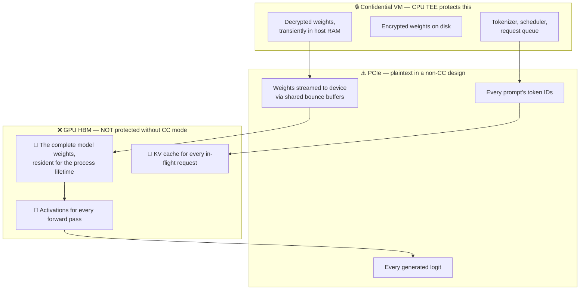
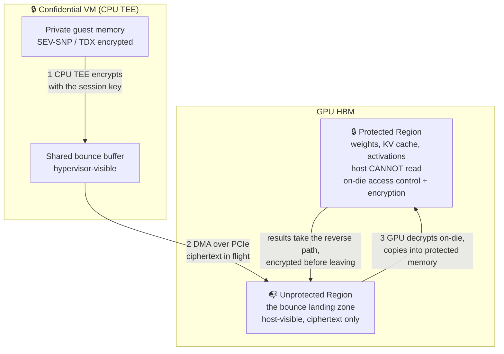
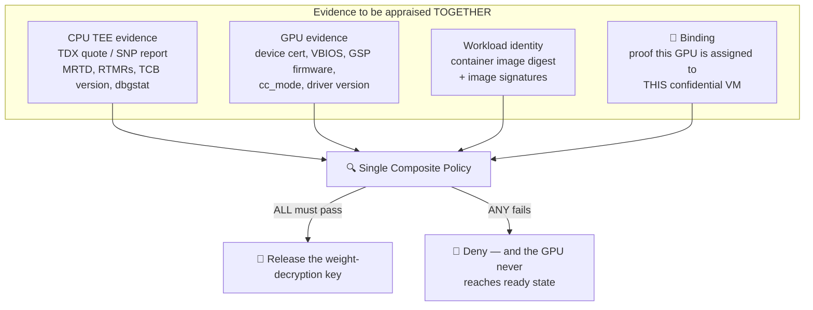
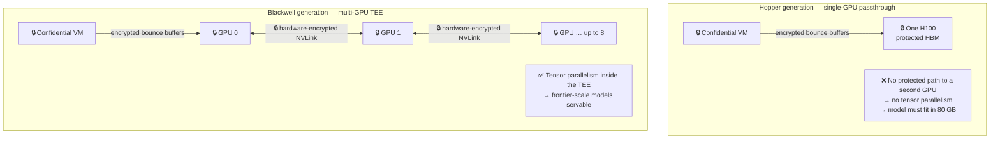

# Module 4: Confidential GPUs and Accelerators

Every release policy in Module 3 contained a line about `cc_mode` that was never explained. This module explains it, and in doing so closes the gap that separates "confidential computing" from "confidential *LLM* computing." A confidential VM protects host DRAM. An LLM does not live in host DRAM. Until the accelerator is inside the trust boundary, a perfectly attested confidential VM is protecting the least valuable copy of your data while the interesting copy sits in plaintext HBM on a device the hypervisor can address.

This module covers **why the GPU must join the TCB**, **the internals of NVIDIA confidential computing mode**, **GPU attestation and composite policy**, **the multi-GPU story and what it means for tensor parallelism**, **the performance model**, and **the adjacent ecosystem**.

---

## Part 1: Why the GPU Must Join the TCB

### 1.1 The Accounting

Take the Module 6 reference architecture in its half-finished state: a Confidential GKE node running SEV-SNP or TDX, with an ordinary GPU attached by PCIe passthrough. Exactly what is protected?



The three red rows are the entire asset. A host-side attacker who can read GPU memory — through the driver interface, through a DMA path, through the device's own debug facilities — gets:

- **The weights**, in full, at rest, for hours. This is P1 from Module 1, defeated completely.
- **The KV cache**, which is a per-request, high-fidelity encoding of everything the model has been told, including the system prompt and the full conversation. This is P2, defeated completely.
- **The activations**, which are recoverable enough to matter.

There is a further point that is easy to miss: in a CPU-only confidential design, the *hypervisor still programs the IOMMU and owns the PCIe topology*. The confidential VM's own DMA buffers must be shared (unencrypted) pages, by construction — that is how DMA works under SEV-SNP and TDX (Module 2, §4.2.4). So the weights do not merely end up unprotected on the GPU; they cross the bus in the clear, through memory the hypervisor can read, on every load.

**Conclusion, stated as strongly as it deserves**: a confidential LLM serving design that does not attest the GPU provides no meaningful confidentiality for the model or the prompts. It is not a partial guarantee. It is the appearance of one.

### 1.2 What the GPU TEE Has to Provide

The same five primitives as Module 1, §3, restated for a device that is not a CPU:

| Primitive | What it means on a GPU | Consequence if missing |
| :--- | :--- | :--- |
| Root of trust | A per-device key fused at manufacture, never exposed to software | Device identity is forgeable |
| Measurement | Measurements of VBIOS, GSP firmware, and driver state | You attest "a GPU," not "a trustworthy GPU" |
| Memory protection | HBM regions the host cannot read | The weights are readable |
| Secure channel | Encrypted, integrity-protected PCIe transfers | Weights and prompts leak in transit on every load and every request |
| Attestation | A signed device report, verifiable against a vendor chain | No basis for including the device in the trust boundary |

And one that has no CPU analogue, because a CPU is not a peripheral:

| Primitive | What it means |
| :--- | :--- |
| **Binding to the CPU TEE** | Evidence that *this* GPU is exclusively assigned to *this* confidential VM. Without it, an attacker attests a genuine CC-mode GPU somewhere else in the fleet and uses a non-protected one for the actual work — the relay attack of Module 3, §6.1, applied to a device. |

---

## Part 2: NVIDIA Confidential Computing Mode

### 2.1 The Three States

NVIDIA Hopper (H100/H200) and Blackwell parts expose a device-level mode with three settings, and the distinction between the middle two is a frequent source of production incidents:

| Mode | Protection | Profiling / debug tools | Intended use |
| :--- | :--- | :--- | :--- |
| `OFF` | None | Full | Normal, non-confidential workloads |
| `ON` | Full — protected memory, encrypted transfers, attestation required | **Disabled** | Production confidential workloads |
| `DEVTOOLS` | Partial — the mechanisms run, but the protections are relaxed | Enabled | Development and performance work only |

`DEVTOOLS` exists because you cannot profile a workload whose memory is unreadable, and someone has to tune the kernels. It is not a security mode. **A release policy that accepts `cc_mode ∈ {ON, DEVTOOLS}` accepts an environment where the operator can profile your inference and read device memory** — which is exactly the `dbgstat` trap from Module 3, §5.2, wearing a GPU costume. Assert `cc_mode == ON` and nothing else.

### 2.2 The Protected Memory Model

In CC mode the GPU partitions its HBM:



The essential insight is that **the plaintext never exists outside a trust boundary at any point on the path.** It is plaintext in confidential-VM private memory, ciphertext from the moment it enters the shared bounce buffer, ciphertext across the bus, ciphertext in the unprotected landing region, and plaintext again only inside the GPU's protected region. The hypervisor can read the shared buffer and the unprotected region and learns nothing but ciphertext and sizes.

Note the asymmetry with CPU memory encryption from Module 2: **here the mode is AES-GCM, not AES-XTS**. Over a bus you can afford the nonce and authentication tag that GCM adds, and you get authentication and non-determinism for free — which is why the ciphertext side channel of Module 2, §5.1 does not have a direct analogue on this path. You cannot afford that expansion in DRAM, which is why CPU memory encryption is stuck with a deterministic mode. This is the clearest illustration in the book of why the two halves of the system have different cryptographic properties.

### 2.3 Session Establishment: SPDM and PCIe IDE

The encryption key on that path has to come from somewhere, and it cannot come from the hypervisor. The mechanism is **SPDM** (Security Protocol and Data Model, a DMTF standard): the confidential VM and the GPU perform a mutually authenticated key exchange, with the GPU authenticating using its fused device key and its certificate chain. The result is a session key held by the guest and the device, and by nobody in between.

**PCIe IDE** (Integrity and Data Encryption) is the link-layer standard for encrypting and integrity-protecting PCIe traffic. Hopper's implementation encrypts data in software-managed bounce buffers; the direction of travel across the industry is toward hardware link encryption plus **TDISP** for device assignment (§6.2).

The point worth carrying forward: the secure channel is established *between the confidential VM and the device*, using keys derived from the device's root of trust, with the hypervisor excluded. This is the same shape as everything else in this book — the guest, not the platform, decides what crosses the boundary.

### 2.4 Operational Requirements

Two things that are not obvious from the architecture and that will cost you an afternoon each:

1. **`nvidia-persistenced` is required.** In CC mode, tearing down and reloading the driver means renegotiating the secure session and re-attesting. The persistence daemon keeps the driver loaded so this does not happen on every process exit. Without it you will see intermittent, confusing attestation failures.
2. **The GPU has a "ready state" that gates compute.** After attestation succeeds, something must tell the GPU that it may accept work: `nvidia-smi conf-compute -srs 1`. Until then, the GPU is in CC mode but not ready, and CUDA operations fail. This is deliberate — it is the hardware's enforcement point for "no compute before successful attestation," and it means **attestation is on your cold-start critical path by design** (Module 6, §4).

---

## Part 3: GPU Attestation and Composite Policy

### 3.1 The Evidence

The GPU produces its own attestation report, structurally parallel to the SEV-SNP report of Module 2:

| Element | Content |
| :--- | :--- |
| Device identity | A unique device identifier, signed with the fused per-device key |
| Measurements | VBIOS version, GSP firmware measurements, driver version, CC mode state |
| Nonce | Caller-supplied, for freshness |
| Certificate chain | Device certificate chaining to an NVIDIA root |

Verification compares those measurements against a **RIM** (Reference Integrity Manifest) — NVIDIA's signed publication of expected measurements for a given firmware and driver version. This is the reference-value problem of Module 3, §7 solved the "vendor-published" way: you trust NVIDIA's signed manifest rather than deriving the expected values yourself. It is the same strength rating as the second row of that table — moderate, and it moves the trust rather than removing it.

Two verification topologies, matching Module 3, §1.2 exactly:

- **NRAS** (NVIDIA Remote Attestation Service) — send evidence to NVIDIA, get back a verdict. Simple; adds a network dependency and tells NVIDIA about your fleet.
- **Local verifier** — run the verification yourself against cached RIMs and NVIDIA's root certificates. More work; no runtime dependency on NVIDIA; and, for a model provider that wants to be its own verifier (Module 3, §1.3), the only acceptable option.

### 3.2 Composite Attestation Is the Whole Point

A CPU attestation and a GPU attestation, each valid, verified separately, prove very little together. What you need is a single policy decision over *bound* evidence:



On Google Cloud this composition is done for you and surfaced in the Confidential Space attestation token, which carries a `submods.nvidia_gpu` section alongside the CPU claims — including `cc_mode`, `cc_feature`, and per-GPU entries with `hwmodel` (e.g. `GCP_NVIDIA_H100`), `driver_version`, `vbios_version`, and a device unique identifier. That is what makes a single-token policy possible: one JWT, verified once, asserting facts about the CPU TEE, the GPU, and the container image simultaneously.

**The policy lines you must not omit**, restating Module 3, §5.2 with the reasoning now visible:

```text
submods.nvidia_gpu.cc_mode == "ON"           # not DEVTOOLS
submods.nvidia_gpu.gpus[*].hwmodel == expected model
submods.nvidia_gpu.gpus[*].driver_version >= floor
submods.nvidia_gpu.gpus[*].vbios_version  in approved set
```

A policy that verifies the CPU TEE perfectly and omits these four lines produces an environment that is attested, confidential, and loading your weights into plaintext HBM.

---

## Part 4: Multi-GPU and Tensor Parallelism

### 4.1 The Hopper Constraint

This is the single most consequential practical fact in this module, and it shapes the entire Module 6 architecture.

The first-generation Hopper confidential computing implementation supports **single-GPU passthrough**. One H100 is assigned to one confidential VM. There is no protected interconnect between two confidential GPUs, so a tensor-parallel group spanning two GPUs would have to move activations between them over a path that is not inside either TEE.

Google Cloud's Confidential GKE Nodes with GPU reflect this directly: the documented configuration is the `a3-highgpu-1g` machine type with exactly **one** NVIDIA H100 80 GB GPU per node, using Intel TDX — and GPU sharing features (time-sharing, MIG) are not available.

The consequences for model serving are severe and should be stated plainly:

| Constraint | Consequence |
| :--- | :--- |
| One 80 GB GPU per confidential node | Your model plus KV cache must fit in 80 GB, minus runtime overhead |
| No tensor parallelism across GPUs | A 70B model in bf16 (~140 GB of weights) **does not fit**, full stop |
| No MIG, no time-sharing | No packing several small models onto one device; utilization suffers |
| No NVLink between confidential GPUs | Pipeline parallelism across nodes crosses the network, not just a bus |

The practical serving envelope on a single 80 GB confidential H100 is therefore: models up to roughly 30–40B parameters at bf16, or larger models quantized to 8-bit or 4-bit. A frontier-scale model in full precision is not servable in this configuration. **If your Vertex 3P MaaS workload is a large model, the Hopper generation forces either quantization, pipeline parallelism across nodes with encrypted inter-node transport, or waiting for Blackwell.**

### 4.2 The Blackwell Change

Blackwell-generation HGX platforms (B200 and successors) remove this constraint. Multi-GPU confidential computing is supported with **hardware-encrypted NVLink** between GPUs inside the same confidential VM, with 1, 2, 4, or 8 GPUs assignable to a single CVM. CPU↔GPU traffic still goes through encrypted bounce buffers; GPU↔GPU traffic within the confidential group travels over encrypted NVLink.



This is the change that moves confidential LLM serving from "a demo for small models" to "a deployment option for the models people actually pay for." When planning a 3P MaaS confidential offering, the accelerator generation is not an optimization detail — **it determines which models are servable at all**, and it belongs near the top of the design document, not in an appendix.

### 4.3 The Attestation Consequence

Multi-GPU confidential computing multiplies the evidence. Each GPU produces its own report, and the policy must verify:

1. Every GPU in the group individually — model, firmware, CC mode.
2. That all of them are bound to the same confidential VM.
3. That the NVLink interconnect between them is in its protected mode.

A policy that checks GPU 0 and assumes GPUs 1–7 match is a policy with a seven-eighths hole in it. Verify each device.

---

## Part 5: The Performance Model

### 5.1 Where the Overhead Actually Is

The single most useful thing to know about confidential GPU performance is *where the cost is not*:

$$
T_{\text{total}} = \underbrace{T_{\text{transfer}}}_{\text{heavily affected}} + \underbrace{T_{\text{compute}}}_{\text{nearly unaffected}} + \underbrace{T_{\text{attest}}}_{\text{one-time, but large}}
$$

**Compute inside the GPU is essentially unaffected.** The SMs operate on plaintext in protected HBM; there is no per-instruction cryptography. A matrix multiply in CC mode runs at the same rate as one outside it.

**Transfer across PCIe is heavily affected.** Every host↔device byte is encrypted, copied into a bounce buffer, DMA'd, and decrypted. This is a per-byte cost on a path that was already the slowest link in the system.

Published benchmark work on H100 CC mode is consistent on the shape of this: the GPU-internal computational overhead is minimal, and the overall penalty is dominated by CPU–GPU data transfer over PCIe.

### 5.2 Why This Is Good News for LLM Inference

The arithmetic intensity of LLM inference works in your favor. Define, for a given phase:

$$
I = \frac{\text{FLOPs performed on the device}}{\text{bytes moved across PCIe}}
$$

CC mode taxes the denominator and leaves the numerator alone. So the relative overhead scales as $1/I$, and the phases of inference sort neatly:

| Phase | PCIe traffic | Device compute | CC overhead |
| :--- | :--- | :--- | :--- |
| **Weight loading (cold start)** | Enormous — tens to hundreds of GB, once | None | **Severe** — this is where the cost lands |
| **Prefill** | Small — token IDs in | Large — full forward pass over the prompt | Low |
| **Decode** | Tiny — one token in, logits out | Moderate per step, repeated | Low, and falls further with batching |
| **Small-batch, short-prompt requests** | Small but not negligible relative to compute | Small | Highest of the serving phases |

This is why published measurements report that overhead **shrinks as model size, batch size, and sequence length grow**: all three increase compute per byte transferred. Benchmark work on H100 CC mode has reported throughput penalties in the mid-single-digit percentage range for LLM inference, falling toward negligible for the largest models and longest sequences, with the smallest models and shortest sequences carrying the highest relative cost.

**The design implication is direct**: confidential mode is cheapest exactly where LLM serving is most valuable — large models, batched traffic, long contexts. It is most expensive on cold starts and on small, latency-sensitive requests. Optimize accordingly: fewer, longer-lived, well-batched replicas rather than many small ones.

### 5.3 Cold Start Is the Real Cost

Loading a 40 GB model into protected HBM means encrypting, bouncing, DMA-ing, and decrypting 40 GB. At an effective post-CC bandwidth of $B$ GB/s:

$$
T_{\text{load}} = \frac{S_{\text{model}}}{B_{\text{effective}}} \quad\text{where}\quad B_{\text{effective}} < B_{\text{raw PCIe}}
$$

Add the confidential VM's own memory acceptance loop (Module 2, §4.2.3), TEE boot, attestation round trips, and the KMS key release, and cold start for a confidential inference pod is materially worse than for a normal one. This is the dominant term in the Module 6, §4 latency budget, and it is why autoscaling a confidential inference fleet is a different problem from autoscaling a normal one.

### 5.4 What to Measure

Do not accept published numbers, including the ones above, as applying to your workload. The variables that matter — model size, batch size, sequence length, quantization, PCIe generation, CPU TEE type — vary enough that the honest answer is always "measure it." A defensible benchmark isolates four things:

1. **Baseline**: normal VM, normal GPU.
2. **CPU TEE only**: confidential VM, GPU with CC off. Isolates the CPU-side cost.
3. **CPU TEE + GPU CC**: the production configuration.
4. **Cold start, separately from steady state.** Reporting a single blended number hides the fact that one component is nearly free and the other is expensive.

For capacity planning before you have measurements, a reasonable starting heuristic drawn from published single-H100 work is to reserve on the order of **15–25% additional throughput capacity**, then replace that with workload-specific measurements as soon as you have them. Module 7, §1 develops the methodology.

---

## Part 6: The Adjacent Ecosystem

### 6.1 AMD and the Rest of the Accelerator Field

AMD's Instinct line pairs with SEV-SNP through **SEV-TIO** (Trusted I/O), AMD's implementation of trusted device assignment. The architectural shape is the same as NVIDIA's — device root of trust, attestation, encrypted DMA — with the difference that AMD can integrate the CPU and device trust models more tightly, since it owns both ends.

For a Google Cloud design this is mostly informational today, but it matters for a second reason: **it demonstrates that the mechanism is not NVIDIA-specific**, which means designing your attestation policy against an abstract "accelerator evidence" shape rather than against NVIDIA's specific report format is the portable choice.

### 6.2 TDISP: Where This Is All Going

The current generation of confidential GPU support is, architecturally, a workaround. Bounce buffers exist because the device cannot be securely assigned to the confidential VM in a way the platform understands; software encrypts data before DMA because the link itself is not trusted.

**TDISP** (TEE Device Interface Security Protocol), a PCIe specification, is the standardized fix. It defines how a device interface is assigned to a TEE, how it is authenticated (via SPDM), how the link is protected (via IDE), and how the device transitions through a defined security state machine. When TDISP is broadly implemented, the bounce buffer disappears: a device function is assigned directly into the confidential VM's private memory, with hardware link encryption.

The consequences to anticipate:

- Most of the transfer overhead in §5.1 goes away.
- Attestation becomes more standardized and less vendor-specific.
- The trust boundary becomes cleaner to describe — a genuinely useful outcome when explaining the design to a counterparty's security team.

This is a two-to-three-year horizon, not a thing to build on today, but it is the reason not to over-invest in bounce-buffer-specific optimizations.

### 6.3 TPUs

Google's TPUs are the obvious question for a Vertex-hosted workload, and the honest answer is that the confidential computing story for TPUs is substantially less mature and less publicly documented than the NVIDIA GPU path. Any 3P MaaS confidential design should be verified against current Google Cloud documentation before assuming TPU support, and should treat the GPU path as the one with a documented, verifiable attestation chain today.

---

## Lab: Verify a Confidential GPU, and Measure Both Generations

**Goal:** bring up confidential GPU nodes on both accelerator generations, confirm CC mode from inside the guest, obtain and verify a GPU attestation report, and then measure — with a real non-confidential control running alongside — the transfer overhead §5.1 predicts, the encrypted-NVLink behaviour §4.2 claims, and the serving envelope §4.1 says each generation has.

**Scope:** run three node pools concurrently — a confidential H100, a **non-confidential H100 as the control**, and a confidential 8×B200 node. The A/B is not optional here. Every performance claim in this module is a *difference* between two configurations, and a within-instance toggle cannot measure cold start, cannot measure NVLink, and cannot show you the Hopper serving cap at all. Provision the control. **Status:** `nvidia-smi` and `nvtrust` invocations follow NVIDIA's documented interfaces; the `gcloud` node-pool flags follow Google Cloud documentation. Confidential multi-GPU availability by machine type and region changes faster than anything else in this book — verify against current documentation before running, and expect at least one flag name to have moved.

### Step 1 — Create the confidential Hopper pool and its control

```bash
# Confidential: TDX + one H100, per §4.1
gcloud container node-pools create cc-gpu-pool \
  --cluster=YOUR_CLUSTER \
  --location=us-central1 \
  --node-locations=us-central1-a \
  --confidential-node-type=TDX \
  --machine-type=a3-highgpu-1g \
  --accelerator=type=nvidia-h100-80gb,count=1,gpu-driver-version=latest \
  --num-nodes=1

# The control: identical hardware, no confidential mode. This is what makes
# every number below a measurement rather than an anecdote.
gcloud container node-pools create plain-gpu-pool \
  --cluster=YOUR_CLUSTER \
  --location=us-central1 \
  --node-locations=us-central1-a \
  --machine-type=a3-highgpu-1g \
  --accelerator=type=nvidia-h100-80gb,count=1,gpu-driver-version=latest \
  --num-nodes=1
```

### Step 2 — Prove the Hopper constraint instead of reading about it

§4.1 claims one GPU per confidential VM on Hopper. Try to violate it:

```bash
gcloud container node-pools create cc-gpu-multi \
  --cluster=YOUR_CLUSTER --location=us-central1 \
  --confidential-node-type=TDX \
  --machine-type=a3-highgpu-8g \
  --accelerator=type=nvidia-h100-80gb,count=8,gpu-driver-version=latest \
  --num-nodes=1
```

Record the exact error. That message is §4.1 enforced by the API rather than described in prose, and it is worth pasting into your design document verbatim — it ends the "can't we just use tensor parallelism?" conversation faster than any explanation.

### Step 3 — Confirm CC mode from inside the guest

```bash
# Is the GPU in confidential computing mode?
nvidia-smi conf-compute -f

# What is the GPU's ready state? Compute is gated on this.
nvidia-smi conf-compute -grs

# Confirm the driver is pinned — required in CC mode
systemctl status nvidia-persistenced
```

Expect `CC status: ON`. Run the same command on the control node and expect `OFF`. If the confidential node reports `OFF`, everything downstream in this lab is measuring a non-confidential GPU, and — more importantly — a production deployment in this state would be silently unprotected. **This check belongs in your readiness probe**, not just in a lab.

### Step 4 — Observe the enforcement

Before the ready state is set, try to run any CUDA workload:

```bash
python3 -c "import torch; print(torch.zeros(1).cuda())"
```

It should fail. Now set the ready state and retry:

```bash
sudo nvidia-smi conf-compute -srs 1
python3 -c "import torch; print(torch.zeros(1).cuda())"
```

This is the most instructive moment in the lab: **the hardware refuses to compute until something asserts that attestation succeeded.** Attestation is not advisory, and it is not off the critical path.

### Step 5 — Pull and verify a GPU attestation report

```bash
git clone https://github.com/NVIDIA/nvtrust.git
cd nvtrust/guest_tools/attestation_sdk
pip install -r requirements.txt

# Verify locally against cached RIMs and NVIDIA roots, or remotely via NRAS —
# consult the tool's current documentation for the invocation.
python3 -m verifier.cc_admin
```

Inspect the output for the VBIOS version, driver version, and the individual measurement comparisons against the RIM. When a measurement mismatches, the tool names the index — which is the GPU equivalent of the reference-value problem from Module 3, §7, and a good moment to ask where that RIM came from and who signed it.

### Step 6 — Measure the transfer penalty against the control

Run this on the confidential node **and** the plain node, and diff the results:

```bash
/usr/local/cuda/extras/demo_suite/bandwidthTest --memory=pinned --mode=range \
  --start=1048576 --end=1073741824 --increment=104857600
```

Then confirm the other half of the model — that compute is *not* affected — by running an identical large matmul benchmark on both:

```bash
python3 -c "
import torch, time
a = torch.randn(16384, 16384, device='cuda', dtype=torch.bfloat16)
b = torch.randn(16384, 16384, device='cuda', dtype=torch.bfloat16)
torch.cuda.synchronize(); t = time.time()
for _ in range(50): c = a @ b
torch.cuda.synchronize()
print('TFLOP/s:', 50 * 2 * 16384**3 / (time.time() - t) / 1e12)
"
```

**The predicted result:** a substantial drop in PCIe bandwidth on the confidential node, and TFLOP/s within noise of the control. Demonstrating that compute is *not* affected is what makes the model in §5.2 credible — and it is the number that stops a capacity planner from applying a flat overhead multiplier to everything.

### Step 7 — Measure encrypted NVLink on Blackwell

§4.2 claims Blackwell adds hardware-encrypted NVLink and 1/2/4/8-GPU confidential assignment. Test it:

```bash
gcloud container node-pools create cc-gpu-blackwell \
  --cluster=YOUR_CLUSTER --location=us-central1 \
  --confidential-node-type=TDX \
  --machine-type=a4-highgpu-8g \
  --accelerator=type=nvidia-b200,count=8,gpu-driver-version=latest \
  --num-nodes=1
```

The node-pool creation succeeding where Step 2's failed is itself the headline result. Now measure the interconnect with CC mode on, and again with it off:

```bash
nvidia-smi conf-compute -f            # confirm ON across all eight devices
nvidia-smi nvlink --status            # link state and per-link bandwidth

git clone https://github.com/NVIDIA/nccl-tests && cd nccl-tests && make
./build/all_reduce_perf -b 8M -e 4G -f 2 -g 8
```

Record bus bandwidth at each message size, CC on versus off. **What to look for:** the GPU↔GPU path is protected by link-level encryption in hardware rather than by bounce buffers through host memory, so the collective penalty should look nothing like the PCIe penalty from Step 6. If your numbers say otherwise, find out why before you design around them — this single measurement decides whether tensor-parallel confidential serving is viable.

### Step 8 — Find each generation's serving envelope empirically

Take a 70B model in bf16 — roughly 140 GB of weights, per §4.1's table — and try to serve it on the confidential H100:

```bash
python3 -c "
from vllm import LLM
llm = LLM(model='YOUR_70B_MODEL', gpu_memory_utilization=0.9)
"
```

It fails, out of memory, and it was never going to do anything else. Now run the same model on the confidential Blackwell node with tensor parallelism across all eight GPUs:

```bash
python3 -c "
from vllm import LLM
llm = LLM(model='YOUR_70B_MODEL', tensor_parallel_size=8, gpu_memory_utilization=0.9)
print('loaded')
"
```

**That contrast is the entire argument of Part 4, reduced to two commands.** One generation cannot serve the model at any price; the next serves it inside the TEE with encrypted interconnect. This is why §4.2 insists the accelerator generation belongs near the top of a design document rather than in an appendix.

### Step 9 — Time the phases that Module 6 will budget

On both confidential nodes, load a model that does fit and time the two phases separately:

```bash
time python3 -c "
from vllm import LLM
llm = LLM(model='YOUR_MODEL', gpu_memory_utilization=0.9)
print('loaded')
"
```

Then run a short generation benchmark. You should see the pattern §5.2 predicts: loading is disproportionately slow, steady-state generation is close to baseline. Run it on the control node too, so the confidential-specific component is separated from the plain cost of moving tens of gigabytes. That single decomposition is the empirical basis for the entire cold-start discussion in Module 6.

### Step 10 — Tear down

```bash
for p in cc-gpu-pool plain-gpu-pool cc-gpu-blackwell; do
  gcloud container node-pools delete "$p" --cluster=YOUR_CLUSTER --location=us-central1 --quiet
done
gcloud container node-pools list --cluster=YOUR_CLUSTER --location=us-central1
```

Confirm the deletion with that last command rather than assuming it. Accelerator nodes are the one resource in this course worth verifying gone, not because of the bill but because a half-deleted pool will silently reschedule your next lab onto the wrong hardware and quietly invalidate its numbers.

---

## Summary: Confidential GPU Checklist

| Question | Answer | Why it matters |
| :--- | :--- | :--- |
| Does a CPU-only confidential VM protect an LLM? | **No** — weights, KV cache, and activations are all in GPU HBM | This is the defining error in the field |
| What does CC mode encrypt? | Host↔device transfers with AES-GCM; HBM is access-controlled into a protected region | Non-deterministic mode, unlike CPU memory encryption |
| Is `DEVTOOLS` a security mode? | **No** — profiling is enabled and protections are relaxed | Assert `cc_mode == ON` exactly |
| How is the session key established? | SPDM mutual authentication between the CVM and the device | The hypervisor is excluded by construction |
| How is the GPU attested? | Signed device report, measurements compared against NVIDIA RIMs | Local verifier if you need to be your own verifier |
| Must CPU and GPU evidence be bound? | **Yes** — otherwise a genuine CC GPU elsewhere can be relayed | Composite policy over a single token |
| How many GPUs per confidential VM on Hopper? | **One** — `a3-highgpu-1g`, no MIG, no time-sharing | Caps servable model size at what fits in 80 GB |
| Does Blackwell fix this? | Yes — encrypted NVLink, 1/2/4/8 GPUs per CVM | Determines whether frontier-scale models are servable at all |
| Where does the overhead land? | Host↔device transfer; on-device compute is nearly unaffected | Overhead shrinks with model size, batch size, and sequence length |
| What is the expensive operation? | Cold start — loading tens of GB into protected HBM | The dominant term in the Module 6 latency budget |

You now have the two hardware halves: a confidential CPU with verified measurements, and a confidential accelerator bound to it. What remains is the platform — which machine types, which GKE settings, which attestation service, and which of Google's two quite different confidential products you should actually build on. That is **Module 5: The Google Cloud Confidential Surface (`05_google_cloud_confidential_surface.md`)**.
