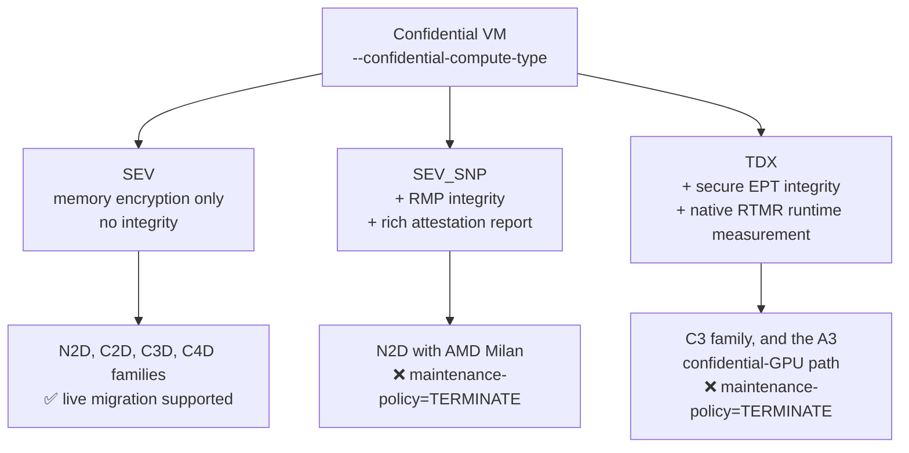
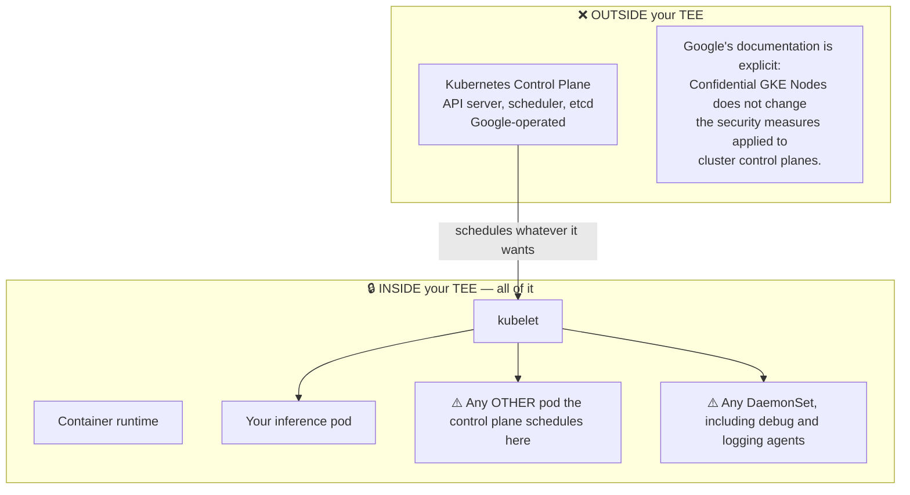
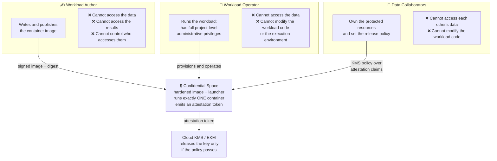
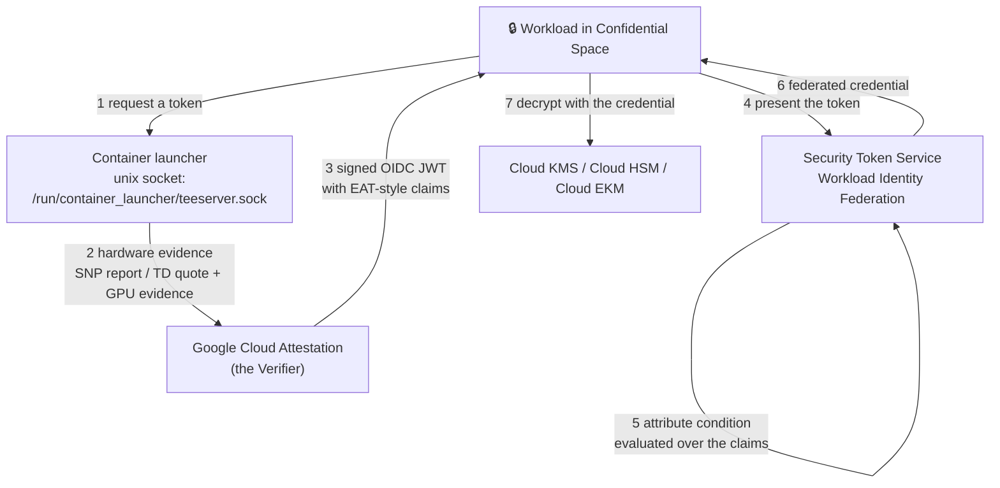
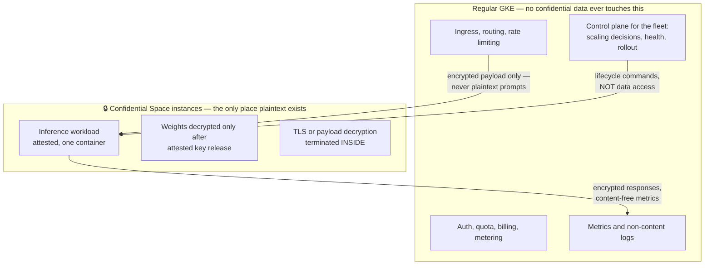

# Module 5: The Google Cloud Confidential Surface

Modules 1 through 4 built the mechanisms. This module is about what Google Cloud actually sells, which of those mechanisms each product exposes, and — the question that decides your architecture — which of Google's two quite different confidential offerings a third-party model serving workload should be built on. They are not variants of each other. They embody different answers to "who is in the trust boundary," and choosing the convenient one costs you a security property that is hard to add back later.

This module covers **Confidential VM machine families**, **Confidential GKE Nodes and what they do not cover**, **Confidential Space and its three-role separation**, **the GCP attestation and key-release surface**, **the supporting cast of adjacent products**, and **a head-to-head decision for inference**.

!!! warning "Product surfaces move fast"
    Machine-type availability, regional coverage, and GPU support in this area change on a scale of months. Every product claim in this module should be re-verified against current Google Cloud documentation before it enters a design document. The *architecture* is stable; the *availability matrix* is not.

---

## Part 1: Confidential VM

### 1.1 The Product Matrix

Confidential VM is the base layer — everything else in this module is built on it.



| | **SEV** | **SEV-SNP** | **TDX** |
| :--- | :--- | :--- | :--- |
| Memory confidentiality | Yes | Yes | Yes |
| Memory integrity | **No** | Yes | Yes |
| Native runtime measurement | No | No — needs a vTPM | **Yes** (`RTMR0-3`) |
| Live migration | Yes | No | No |
| Machine families (verify currency) | N2D, C2D, C3D, C4D | N2D (AMD Milan) | C3, plus the confidential-GPU A3 path |
| Confidential GPU support | No | See §2.2 | **Yes** — the documented GPU path |

**The row that should drive your choice is memory integrity.** Plain SEV gives confidentiality without integrity, which Module 1, §3.3 established is insufficient against an actively malicious hypervisor — replay and remap attacks work. SEV is the widest-available and cheapest option and it is the wrong one for a workload whose threat model includes adversary A2 or A3. If a design document says "Confidential VM" without saying which technology, it has not made the decision that matters.

### 1.2 The Practical Constraints

Three that will shape your capacity planning:

1. **`--maintenance-policy=TERMINATE` for SEV-SNP and TDX.** No live migration (Module 2, §4.2.1). Host maintenance stops the instance. For an inference node with a multi-minute cold start, this is a real availability input, not a footnote.
2. **Regional availability is narrow.** Confidential offerings — especially TDX and confidential GPUs — are available in a small subset of regions. This interacts badly with data-residency requirements: a customer who needs their data in a specific region may find the confidential option is not offered there, and the resulting conversation is uncomfortable because the two requirements are both security requirements.
3. **Capacity, not just availability.** A3 confidential capacity is constrained. Reservations matter.

### 1.3 Storage and Keys Around the VM

Confidential VM protects memory. It says nothing about disk, and the surrounding storage story has to be built deliberately:

| Concern | Mechanism | Note |
| :--- | :--- | :--- |
| Boot and data disks | Google-managed encryption, CMEK, or Confidential Hyperdisk | CMEK means *you* control the KEK in Cloud KMS — better, and still Google-operated |
| Model weights at rest | Application-level envelope encryption (Module 3, §5) | **Do not rely on disk encryption for this.** The decryption must be gated on attestation, which disk encryption is not |
| Secrets | Attested key release, not Secret Manager IAM | Secret Manager releases on *identity*; you need release on *measurement* |

The middle row is the one that matters and the one most often done wrong. Encrypting the weights on disk with CMEK protects them from someone who steals the disk. It does not protect them from the cloud operator, because the operator's platform can read the disk and holds the path to the key. Only attestation-gated release does that.

---

## Part 2: Confidential GKE Nodes

### 2.1 What It Is

Confidential GKE Nodes is, essentially, "run my node pool's VMs as Confidential VMs." The kubelet, the container runtime, and your pods all run inside the TEE.

Enable at cluster level (Autopilot or Standard):

```bash
gcloud container clusters create-auto CLUSTER_NAME \
  --location=LOCATION \
  --confidential-node-type=CONFIDENTIAL_COMPUTE_TECHNOLOGY   # sev | sev_snp | tdx
```

Or at node-pool level (Standard only):

```bash
gcloud container node-pools create NODE_POOL_NAME \
  --cluster=CLUSTER_NAME \
  --location=LOCATION \
  --machine-type=MACHINE_TYPE \
  --node-locations=ZONE1,ZONE2 \
  --confidential-node-type=CONFIDENTIAL_COMPUTE_TECHNOLOGY
```

**Cluster-level enablement is irreversible.** You cannot turn it off on an existing cluster. Node-pool-level enablement is the flexible path and is what you want while iterating.

### 2.2 The GPU Configuration

The confidential GPU path, from Module 4, §4.1, expressed as a node pool:

```bash
gcloud container node-pools create cc-gpu-pool \
  --cluster=CLUSTER_NAME \
  --location=LOCATION \
  --node-locations=ZONE \
  --confidential-node-type=tdx \
  --machine-type=a3-highgpu-1g \
  --accelerator=type=nvidia-h100-80gb,count=1,gpu-driver-version=latest
```

The constraints are worth restating because they are the hard boundary on what you can serve:

- One H100 80 GB per node, `a3-highgpu-1g`.
- Intel TDX.
- **No GPU sharing** — no time-sharing, no multi-instance GPU.
- Minimum GKE versions apply and differ depending on whether you use manual or automatic driver installation, and on whether you use ComputeClasses or flex-start.

### 2.3 What Confidential GKE Nodes Does *Not* Cover

This section is the reason this module exists, and it is the most important thing to take from it.



Follow the implication carefully:

1. The control plane is outside your TEE and is operated by Google.
2. The kubelet is *inside* your TEE and obeys the control plane.
3. Therefore anyone with sufficient control-plane access can cause arbitrary code to run **inside your trust boundary**.

That includes `kubectl exec` into your inference pod, scheduling a privileged debug pod on the node, or adding a DaemonSet that reads process memory. The memory encryption is doing its job perfectly the entire time — it is protecting that attacker's code from the hypervisor.

**The honest characterization**: Confidential GKE Nodes removes the hypervisor and the physical layer from your TCB (adversaries A2 and A4, and much of A3). It does **not** remove the Kubernetes control plane, and on GKE the control plane is operated by Google. If your threat model's headline adversary is "Google," Confidential GKE Nodes alone does not fully address it.

This is not a criticism of the product — it is a correct reading of what it is for. But it must be stated explicitly in any design document that claims protection against a cloud insider, because a model provider's security team will find it.

### 2.4 Other Limitations Worth Knowing

- Not compatible with sole-tenant nodes.
- Windows node pools unsupported.
- Local SSD supported only for ephemeral storage.
- Node auto-provisioning supports SEV and SEV-SNP, but not TDX — which matters, because TDX is the confidential-GPU path.
- Maintenance events cause disruption where live migration is unavailable.

---

## Part 3: Confidential Space

### 3.1 A Different Product Answering a Different Question

Confidential Space is not "Confidential VM with extras." It is a purpose-built answer to the multi-party trust problem — which is to say, it is a product built for exactly the scenario in Module 1, §5.1.

The core idea: a hardened, Google-published, measured image whose entire job is to launch **one** container and produce an attestation token describing it. No SSH. No interactive access. No arbitrary workload scheduling. The image is based on Container-Optimized OS and is hardened for this single purpose.

### 3.2 The Three Roles

This separation is the product's actual contribution, and it maps directly onto the three-party diagram from the curriculum index.



The sentence to internalize: **the workload operator has full project-level administrative privileges and still cannot read the data.** That is the property Confidential GKE Nodes does not give you, and it is exactly the property a 3P MaaS design needs. Map it onto the real parties:

| Confidential Space role | 3P MaaS party |
| :--- | :--- |
| Workload author | The party that builds the inference image (model provider, or a jointly-audited build) |
| Workload operator | Google / the platform team running the service |
| Data collaborator (weights) | The model provider, holding the weight KEK |
| Data collaborator (prompts) | The end customer, if prompt keys are also attestation-gated |

### 3.3 DEBUG versus Production Images

Google publishes both debug and production variants of the Confidential Space image. The difference shows up in the attestation token:

| | Production image | Debug image |
| :--- | :--- | :--- |
| `dbgstat` claim | `disabled-since-boot` | `enabled` |
| Interactive access | None | Available for troubleshooting |
| Fit for real data | Yes | **No** |

This is the concrete realization of Module 3's `dbgstat` check. A relying party that does not assert `dbgstat == "disabled-since-boot"` will happily release production keys to a debug image where the operator can inspect the workload. It is a one-line policy omission with total consequences, and it is the most valuable single check in the entire release policy.

Image versions also carry `support_attributes` (`STABLE`, `LATEST`, `USABLE`, `EXPERIMENTAL`). A production release policy should pin acceptable values rather than accept anything, for the same reason you pin a TCB floor.

### 3.4 The Observability Tension

Confidential Space's strength — nothing gets in, nothing gets out except what the workload deliberately emits — is also its operational cost. You cannot SSH in. You cannot attach a debugger. If the container crashes on startup, you have very little to work with.

Google provides opt-in mechanisms to surface logs and memory monitoring, and the attestation token reflects whether they are enabled (there is a `monitoring_enabled` structure under the Confidential Space submodule). **The fact that this is reflected in the token is the important design detail**: a data collaborator can write a policy that refuses to release keys to an instance with memory monitoring enabled. That is the right shape — the observability decision becomes a negotiated, attested property rather than something the operator toggles unilaterally.

The tension is real and does not have a clean resolution: every diagnostic capability you add is a channel out of the trust boundary. Module 7, §3 is about working within that constraint.

### 3.5 The Limitation for Inference

Confidential Space runs one container per VM instance. It is not Kubernetes. There is no horizontal pod autoscaler, no service mesh, no rolling deployment primitive, no pod-level scheduling.

For an inference *service* — which needs autoscaling, load balancing, rolling upgrades, and health-based replacement — you are rebuilding a meaningful fraction of what Kubernetes gives you. This is the central tradeoff of §6, and it is a genuine engineering cost, not a formality.

---

## Part 4: Attestation and Key Release on GCP

### 4.1 The Token Path



This is the passport model from Module 3, §1.2. Note step 2: **Google Cloud Attestation is the verifier.** Module 3, §1.3 explained why that is a design decision and not a detail — for a model provider whose threat model includes Google, an attestation result signed by Google is a statement by the party being distrusted. The mitigations are in §4.3 below.

### 4.2 Policy as a Workload Identity Federation Attribute Condition

The policy is a CEL expression evaluated over the token's claims:

```bash
gcloud iam workload-identity-pools providers create-oidc PROVIDER_ID \
  --location=global \
  --workload-identity-pool=POOL_ID \
  --issuer-uri="https://confidentialcomputing.googleapis.com" \
  --allowed-audiences="https://sts.googleapis.com" \
  --attribute-mapping="google.subject=assertion.sub" \
  --attribute-condition="
    assertion.swname == 'CONFIDENTIAL_SPACE'
    && assertion.dbgstat == 'disabled-since-boot'
    && assertion.hwmodel == 'GCP_INTEL_TDX'
    && 'sha256:APPROVED_DIGEST' in assertion.submods.container.image_digest
    && assertion.submods.nvidia_gpu.cc_mode == 'ON'
  "
```

Every clause here was earned in an earlier module:

| Clause | Established in |
| :--- | :--- |
| `swname == 'CONFIDENTIAL_SPACE'` | §3.1 — this is a Confidential Space image, not a bare GCE VM |
| `dbgstat == 'disabled-since-boot'` | §3.3 and Module 3, §5.2 — the single most important check |
| `hwmodel == 'GCP_INTEL_TDX'` | Module 2, §4.1 — you want integrity, not just SEV confidentiality |
| `image_digest` allowlist | Module 3, §2 — the chain reaching the actual workload |
| `nvidia_gpu.cc_mode == 'ON'` | Module 4, §2.1 and §3.2 — without it the weights land in plaintext HBM |

Where possible, prefer `submods.container.image_signatures[].key_id` over a digest allowlist. Digest allowlists must be edited on every release; a signature check survives releases and expresses the intent ("images signed by this key") rather than an enumeration of instances.

### 4.3 The Key Store Decision

This is where the P3 (mutual verifiability) property is won or lost.

| Option | Key material lives | Who can change the release policy | Guarantee |
| :--- | :--- | :--- | :--- |
| **Cloud KMS** | Google infrastructure, Google-managed HSM backing | Google Cloud IAM principals in the project | Policy-level |
| **Cloud HSM** | FIPS-validated HSM, Google-operated | Same | Policy-level, better key custody |
| **Cloud EKM** | **Your** external key manager, outside Google | You, in your own system | **Hardware-and-organizationally rooted** |

For a model provider's weight KEK, EKM is the qualitatively different option. With Cloud KMS, the answer to "what would Google have to do to get the plaintext key?" includes "change an IAM policy" — an internal operation. With EKM, the key never exists in Google's infrastructure, and the release decision is made by a system the model provider operates.

Two caveats to state honestly:

- EKM adds a latency and availability dependency on the external key manager, on the cold-start path.
- Even with EKM, the model provider must verify the attestation evidence itself to gain the full property. If the external key manager simply trusts a Google-signed token, the verifier is still Google. Doing this properly means the provider's key manager validates the underlying hardware evidence against AMD/Intel/NVIDIA roots.

---

## Part 5: The Supporting Cast

### 5.1 Image Signing and Binary Authorization

Confidential computing shifts the security problem from isolation to supply chain (Module 1, §4.3). The tooling that matters:

- **Sigstore / cosign** signatures on the container image, surfaced in the attestation token as `submods.container.image_signatures[]` with `key_id` and `signature_algorithm`. This is what lets a release policy say "signed by the model provider" rather than "digest equals X."
- **Binary Authorization** — a GKE admission controller that blocks unsigned or unattested images from being deployed. Note the distinction: Binary Authorization prevents deployment; the attestation policy prevents *key release*. They are complementary, and only the second one is enforced by something outside Google's control plane.

### 5.2 gVisor Is Not a Weaker TEE

This confusion appears in nearly every design review, so it is worth being blunt.

| | **gVisor / sandboxing** | **Confidential computing** |
| :--- | :--- | :--- |
| Protects | The *host* from the *workload* | The *workload* from the *host* |
| Adversary | Malicious or compromised container | Malicious hypervisor, cloud insider, physical attacker |
| Enforced by | Software (a user-space kernel) | Hardware |
| Useful for a 3P MaaS design? | Yes — for a different reason | Yes — for the reason this book is about |

They are **orthogonal**, not alternatives. In fact both are relevant to 3P MaaS: confidential computing protects the model provider's weights from the platform, while sandboxing protects the platform from a model provider's container. A complete design may well use both, and saying so demonstrates that the threat model has been thought through in both directions.

### 5.3 Shielded VM, Workload Identity, and the Rest

- **Shielded VM** provides secure boot, vTPM, and integrity monitoring. It is *not* confidential computing — memory is not encrypted, and the hypervisor can read it. Note that `GCP_SHIELDED_VM` is a possible value of the `hwmodel` claim, which is precisely why a release policy must assert the `hwmodel` it expects rather than merely checking that a token verifies.
- **Workload Identity** binds a Kubernetes service account to a Google service account. It authenticates *who* the workload is, not *what code* it is running. It is not a substitute for attestation, and a design that uses Workload Identity to gate access to weights has an identity control where it needs a measurement control.
- **VPC Service Controls** constrain data egress at the network perimeter. Relevant to Module 6, §8, where the question is how to prevent an in-TEE workload from exfiltrating prompts — one of the few places where a control *outside* the TEE genuinely helps, because the threat is the workload itself.

---

## Part 6: Confidential Space versus Confidential GKE for Inference

### 6.1 The Head-to-Head

| Dimension | **Confidential GKE Nodes** | **Confidential Space** |
| :--- | :--- | :--- |
| Unit of confidentiality | The node | The VM instance running one container |
| Kubelet in the TCB | **Yes** | N/A — no Kubernetes |
| Control plane can inject code into the boundary | **Yes** | **No** |
| Operator can access data | Yes, with sufficient cluster access | **No, by design** |
| Attestation identity | Node image; workload identity requires extra work | The container image digest, natively in the token |
| Turnkey attestation token | No | **Yes** |
| GPU support | Yes — `a3-highgpu-1g`, one H100, TDX | Yes — surfaced as `submods.nvidia_gpu` claims |
| Autoscaling, rolling updates, service mesh | **Yes — native** | No; you build it |
| Multi-container pods, sidecars | Yes | One container |
| Operational familiarity | High | Low |
| Suits the 3P MaaS trust model | Partially | **Yes — it was designed for it** |

### 6.2 The Recommendation, With Its Cost Stated

**For a workload whose security claim is "the cloud operator cannot read the model weights or the customer prompts," Confidential Space is the architecturally correct primitive, and Confidential GKE Nodes alone is not sufficient.**

The reason is §2.3: on Confidential GKE Nodes, the Google-operated control plane can schedule code inside your trust boundary. That single fact undermines the headline claim, and no amount of RBAC configuration fixes it, because RBAC is enforced by the control plane you are trying to exclude.

The cost of that recommendation is real and should not be minimized. Choosing Confidential Space means giving up horizontal pod autoscaling, rolling deployments, service mesh, sidecars, and the entire GKE operational toolkit for the confidential portion of the system. For an inference service that needs to scale with traffic, that is a substantial engineering investment.

### 6.3 The Hybrid That Usually Wins

In practice the workable architecture is neither/both — a split-plane design:



The rule that makes this work: **the regular GKE plane may orchestrate the confidential plane but must never see plaintext.** Ingress forwards an encrypted payload; the control plane starts and stops instances; metrics carry counts and latencies but no content. The confidential plane is small, auditable, and does one thing.

This is the architecture Module 6 develops in full, including the hardest part — how the prompt gets from the customer to the confidential plane without being decrypted at the boundary.

---

## Lab: Run the Same Container on All Three Surfaces and Watch Them Diverge

**Goal:** deploy one identical workload to a Confidential Space instance, a Confidential GKE node, and a plain Confidential VM — simultaneously — release a secret to it gated on the attestation token, and then try to steal that secret from each with full administrative access. Two of the three give it up. This is Module 3's lab made concrete on the real product surface, and it is the module's central claim made falsifiable.

**Scope:** all three surfaces up at once, using the operator/provider project split from Module 3's lab. Deploying them sequentially and comparing notes is not the same exercise: the point is to hold everything constant except the confidential product, then run the *same attack* against each and watch the results differ. Keep the Module 3 verifier running — it is what turns Step 6 from a demo into a control. **Status:** commands follow Google Cloud documentation; `gcloud` syntax varies by CLI version, so verify with `--help` and the current Confidential Space docs.

### Step 1 — Build a workload that shows its own token and holds a secret

```dockerfile
FROM python:3.12-slim
RUN pip install --no-cache-dir requests-unixsocket google-auth
COPY main.py /main.py
CMD ["python", "/main.py"]
```

`main.py` should fetch the token from the launcher socket, print the decoded claims, exchange it via STS, attempt a Cloud KMS decrypt, and then **hold the decrypted secret in memory in a long-lived process**. That last detail is what makes Step 6 measurable rather than rhetorical. Push it to Artifact Registry and record the digest.

### Step 2 — Set up the key and the policy

```bash
# A KMS key holding a test secret
gcloud kms keyrings create cc-lab --location=global
gcloud kms keys create weights-kek --location=global --keyring=cc-lab --purpose=encryption

# A workload identity pool gated on the attestation claims
gcloud iam workload-identity-pools create cc-lab-pool --location=global

gcloud iam workload-identity-pools providers create-oidc cc-lab-provider \
  --location=global \
  --workload-identity-pool=cc-lab-pool \
  --issuer-uri="https://confidentialcomputing.googleapis.com" \
  --allowed-audiences="https://sts.googleapis.com" \
  --attribute-mapping="google.subject=assertion.sub" \
  --attribute-condition="assertion.swname == 'CONFIDENTIAL_SPACE' \
    && assertion.dbgstat == 'disabled-since-boot' \
    && 'sha256:YOUR_DIGEST' in assertion.submods.container.image_digest"
```

Grant the resulting principal `roles/cloudkms.cryptoKeyDecrypter` on the key.

### Step 3 — Bring up all three surfaces

```bash
# (a) Confidential Space — the hardened, operator-excluded image
gcloud compute instances create cc-space-lab \
  --confidential-compute-type=SEV_SNP \
  --machine-type=n2d-standard-2 \
  --min-cpu-platform="AMD Milan" \
  --maintenance-policy=TERMINATE \
  --zone=us-central1-a \
  --image-project=confidential-space-images \
  --image-family=confidential-space \
  --metadata="^~^tee-image-reference=REGION-docker.pkg.dev/PROJECT/REPO/IMAGE@sha256:DIGEST" \
  --scopes=cloud-platform \
  --service-account=YOUR_SA@PROJECT.iam.gserviceaccount.com

# (b) Confidential GKE Nodes — hardware-encrypted memory, ordinary Kubernetes
gcloud container node-pools create cc-lab-pool \
  --cluster=YOUR_CLUSTER --location=LOCATION \
  --confidential-node-type=sev_snp --machine-type=n2d-standard-4

# (c) A plain Confidential VM running the same container by hand
gcloud compute instances create cc-plain-cvm \
  --confidential-compute-type=SEV_SNP \
  --machine-type=n2d-standard-2 \
  --min-cpu-platform="AMD Milan" \
  --maintenance-policy=TERMINATE \
  --zone=us-central1-a \
  --image-project=ubuntu-os-cloud --image-family=ubuntu-2404-lts-amd64
```

Check Cloud Logging for the Confidential Space workload's output. The decrypt should succeed there. Deploy the same container image to (b) and run it manually on (c).

### Step 4 — Diff the three tokens side by side

Collect a token from each surface and diff them. Do not summarize — put them next to each other:

| Claim | Confidential Space | Confidential GKE node | Plain Confidential VM |
| :--- | :--- | :--- | :--- |
| `swname` | `CONFIDENTIAL_SPACE` | *(no launcher socket — find out what you can get)* | `GCE` |
| `dbgstat` | `disabled-since-boot` | | |
| `submods.container.image_digest` | present | | |
| Does the KMS decrypt succeed? | yes | | |

The middle column is the instructive one, and the blanks are deliberate. There is no turnkey equivalent of the launcher's token socket on a Confidential GKE node, which means there is no built-in binding from *this container image* to *this hardware*. You have hardware-encrypted memory and no attested workload identity — a distinction that never appears on the product comparison page.

### Step 5 — Break the policy, three ways

Predict each failure before running it.

1. **Change the image.** Add a comment to `main.py`, rebuild, push, redeploy with the new digest without updating the attribute condition. The token exchange fails on the digest clause.
2. **Switch to the debug image family.** Redeploy using the debug Confidential Space image. Observe `dbgstat` become `enabled` in the token and the condition fail. **Then remove the `dbgstat` clause and redeploy.** The decrypt now succeeds — on an image where the operator has interactive access. Sit with that result; it is the most instructive failure in the module.
3. **Try it on the plain Confidential VM.** `swname` is now `GCE` rather than `CONFIDENTIAL_SPACE`, and the condition fails. This is why that clause is not redundant.

### Step 6 — Now attack all three with full admin rights

Grant yourself `roles/owner` and cluster-admin, then try to read the secret out of each running workload. Same container, same secret, three surfaces.

**Against the Confidential GKE node**, with ordinary cluster credentials:

```bash
kubectl exec -it POD_NAME -- /bin/sh
cat /proc/1/environ; grep -a -A2 SECRET /proc/1/maps   # or just attach a debugger
```

You are now inside the trust boundary, on a node whose memory is hardware-encrypted, reading the plaintext secret out of the workload's address space. **That is §2.3, demonstrated in one command.** Nothing is broken; the product is working exactly as designed. It simply does not defend against the adversary you thought it did — and note that you did not even need node access, because the Google-operated control plane was your way in.

**Against the plain Confidential VM:**

```bash
gcloud compute ssh cc-plain-cvm --zone=us-central1-a
sudo cat /proc/$(pgrep -f main.py)/environ
```

Same result, fewer steps.

**Against Confidential Space:** try everything. SSH is not available. There is no `exec`. Serial console output is restricted. Attaching a debugger is not possible. Redeploy with a modified image and the digest clause denies the key. The only way in is to change the release policy — and if you built Module 3's Part E verifier, that policy is not in a project you control.

Write down which of the three surfaces survived, and against which adversary. That table is the deliverable of this module, and it is a more persuasive artifact in a design review than any vendor comparison chart.

### Step 7 — Confirm the control plane is outside the boundary

§2.3 says Google's control plane sits outside your TEE. You just used it as an attack path in Step 6. Make it explicit:

```bash
kubectl get pod POD_NAME -o yaml | grep -A5 'image:'   # scheduling and image choice
kubectl auth can-i --list                              # what the control plane can do to you
```

Whoever controls the API server chooses which image runs on your confidential node. Hardware-encrypted memory does not constrain that choice in any way. This is precisely why Module 6 puts the data plane in Confidential Space and orchestrates it from *regular* GKE rather than trying to make Confidential GKE Nodes carry the security argument.

### Step 8 — Clean up

```bash
gcloud compute instances delete cc-space-lab cc-plain-cvm --zone=us-central1-a --quiet
gcloud container node-pools delete cc-lab-pool --cluster=YOUR_CLUSTER --location=LOCATION --quiet
```

---

## Summary: The GCP Confidential Surface

| Question | Answer | Consequence |
| :--- | :--- | :--- |
| Which Confidential VM technology? | SEV-SNP or TDX, never plain SEV | Plain SEV has no memory integrity |
| Which technology for GPUs? | TDX, `a3-highgpu-1g`, one H100 | Caps servable model size at 80 GB |
| Does Confidential GKE cover the control plane? | **No** — Google's documentation says so explicitly | Google-operated control plane can inject code into your TEE |
| Can a Confidential Space operator read the data? | **No** — even with full project admin | This is the property 3P MaaS needs |
| What gates key release? | A CEL attribute condition over token claims, then IAM | Every clause maps to a mechanism from Modules 2–4 |
| Which claims are non-negotiable? | `dbgstat`, `hwmodel`, `image_digest`, `nvidia_gpu.cc_mode` | Omitting `dbgstat` alone voids the guarantee |
| Where should the weight KEK live? | Cloud EKM, verified by the provider's own verifier | Cloud KMS reduces the guarantee to an IAM policy |
| Is gVisor an alternative to a TEE? | **No** — opposite direction, both may be useful | Protects the host from the workload, not the reverse |
| Confidential Space or Confidential GKE? | Confidential Space for the data plane; regular GKE around it | You give up HPA, rolling updates, and sidecars for the confidential part |

You now have every component: hardware TEEs, attestation, confidential GPUs, and the platform primitives that expose them. What remains is the design itself — how the weights get in, where TLS terminates, what the KV cache does to your threat model, and what an insider with host root can still do to the finished system. That is **Module 6: Designing Confidential LLM Serving on GKE (`06_designing_confidential_llm_serving_on_gke.md`)**.
