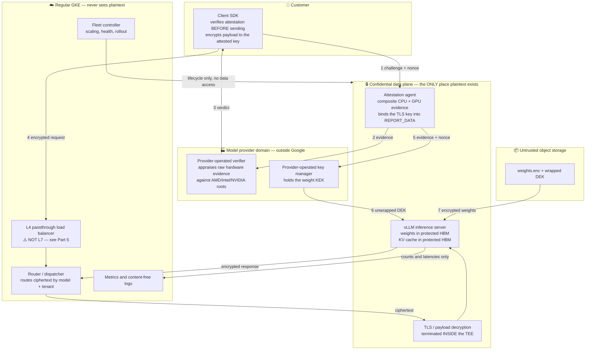
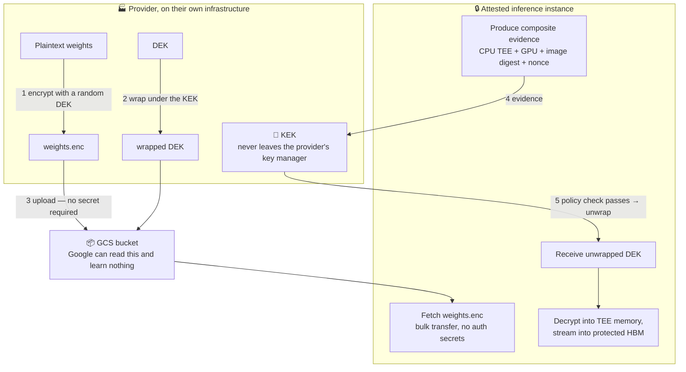
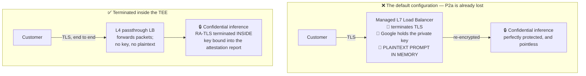
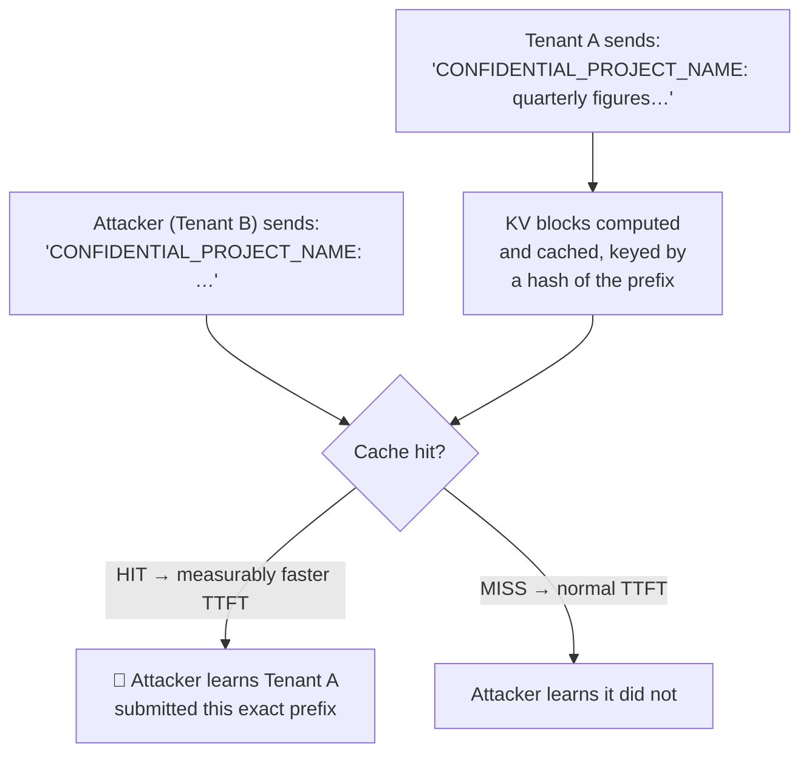
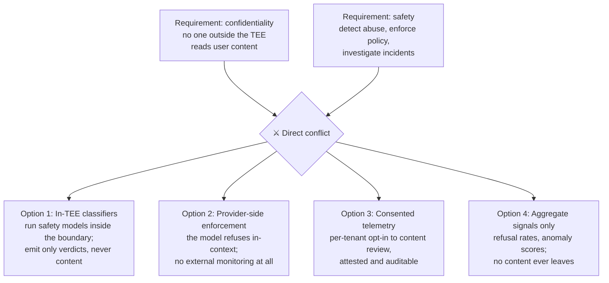

# Module 6: Designing Confidential LLM Serving on GKE

Everything before this module exists to make this module readable. The mechanisms are established: memory encryption with integrity, a measurement chain that reaches the container digest, attested key release, a GPU inside the trust boundary, and the platform primitives that expose them. This module assembles them into a design, and then — the part that distinguishes an engineering document from a marketing one — walks the finished design back through the adversary list and states plainly what still leaks.

This module covers **requirements decomposition**, **the reference architecture**, **the encrypted weight pipeline**, **the cold-start budget**, **where TLS terminates**, **KV cache and prefix-cache leakage**, **multi-tenancy**, **the observability and safety tension**, and **an adversarial review of the result**.

---

## Part 1: Requirements Decomposition

### 1.1 The Four Properties, Made Precise

Module 1, §5.1 stated P1–P4 informally. Here they are as testable assertions, each naming the adversary it is held against.

| | Property | Held against | Test: how would you know it failed? |
| :--- | :--- | :--- | :--- |
| **P1** | Model weights exist in plaintext only inside a TEE whose measurement the model provider approved in advance | Cloud operator (A2, A3, A4); end customer | Can any party obtain a plaintext weight file without producing evidence that satisfies the provider's policy? |
| **P2a** | Prompts and completions exist in plaintext only inside such a TEE | Cloud operator (A2, A3, A4) | Is there any point on the request path where a Google-operated component holds plaintext? |
| **P2b** | Prompts are not disclosed to the model provider beyond what inference requires | Model provider (B2) | Can the workload egress, persist, or log content? Who verified that it does not? |
| **P3** | Each party can verify P1, P2a, and P2b from evidence rooted in silicon vendor certificates, without relying on assertions by another party | All parties | Does verification require trusting a statement made by the party being distrusted? |
| **P4** | P1–P3 hold at competitive TTFT and throughput, with a workable cold start, on obtainable hardware | Reality | Is the confidential path more than ~25% worse, or is cold start unbounded? |

Splitting P2 into P2a and P2b is the most useful thing in this table. They are different problems with different solutions: P2a is solved by hardware, and P2b is not solvable by hardware at all. Designs routinely solve P2a, claim P2, and ship.

### 1.2 What Cannot Be Achieved, Stated Up Front

Before designing, fix the boundaries. The following are out of scope permanently, and a design that implies otherwise is dishonest:

- **Availability against the operator.** Google can stop the workload. Always.
- **Traffic analysis.** Request counts, arrival times, payload sizes, inter-token timing, and session duration are visible to the platform. For an LLM this is more informative than it sounds: output length is directly observable from streaming behavior.
- **The customer's own endpoint.** If the customer's application logs prompts, nothing here helps.
- **Perfect P2b.** As Module 1, §5.3 established, attestation reduces "trust the provider's intentions" to "trust the provider's published image." It cannot reduce it to nothing. Closing the remainder requires transparency mechanisms outside the hardware.

---

## Part 2: The Reference Architecture

### 2.1 The Design



### 2.2 Component Walkthrough

| Component | Choice | Justification |
| :--- | :--- | :--- |
| Confidential runtime | Confidential Space instances, orchestrated by a controller in regular GKE | Module 5, §6.2 — Confidential GKE Nodes leave the Google-operated control plane able to inject code into the trust boundary |
| CPU TEE | Intel TDX | Module 2, §4.1 — native `RTMR` runtime measurement; and it is the confidential-GPU path |
| Accelerator | H100 in CC mode, `cc_mode == ON`, one per instance | Module 4, §2.1 and §4.1 |
| Verifier | **Provider-operated**, appraising raw evidence | Module 3, §1.3 — a Google-operated verifier makes P3 a promise by Google |
| Key manager | **Provider-operated external KMS** | Module 5, §4.3 — Cloud KMS reduces the guarantee to an IAM policy |
| Ingress | L4 passthrough, or client-side payload encryption | Part 5 — an L7 LB terminates TLS outside the TEE and voids P2a |
| Control plane | Regular GKE, explicitly outside the trust boundary | It may orchestrate; it must never see plaintext |
| Observability | Counts, latencies, and error classes only | Part 8 |

The rule that makes the split-plane design coherent, worth stating as an invariant:

> **The orchestration plane may start, stop, scale, and route to the confidential plane. It may never possess a key that decrypts anything, nor observe any request or response content.**

Any proposed feature that violates this — a debugging endpoint, a content-aware router, a caching layer in front of the model — is a change to the security architecture and must be reviewed as one.

---

## Part 3: The Encrypted Weight Pipeline

### 3.1 The Flow



### 3.2 Design Decisions That Matter

**Never write plaintext weights to disk.** Decrypt into memory and stream into GPU memory. A plaintext weight file on a persistent disk is readable by the platform regardless of how it got there. If memory pressure forces staging, stage into `tmpfs` inside the TEE, never onto a persistent volume.

**Key granularity.** Three reasonable schemes, with real tradeoffs:

| Scheme | Blast radius of a leaked DEK | Operational cost |
| :--- | :--- | :--- |
| One DEK per model version | That model version, everywhere | Lowest |
| One DEK per model version per deployment region | One region | Moderate |
| One DEK per instance, derived at release time | One instance | Highest; complicates caching |

Per-model-version is the usual starting point. Per-region is worth it when regulatory boundaries matter.

**Rotation.** Rotating the KEK means rewrapping the DEK — cheap, and it does not touch the encrypted weights. Rotating the DEK means re-encrypting the model — expensive. Design so that the routine operation is KEK rotation.

**Revocation.** Removing an image digest from the release policy stops *new* instances from obtaining the key. It does not stop instances already running with the key in memory. If revocation must be immediate, you need short-lived key leases and periodic re-attestation, with the workload terminating when a lease cannot be renewed. Decide which you need; the difference is a design change, not a config change.

---

## Part 4: The Cold-Start Problem

### 4.1 The Budget

This is the dominant practical cost of the whole design, and it needs to be a budget, not a hope.

| Phase | What happens | Confidential-specific cost |
| :--- | :--- | :--- |
| Instance provisioning | Allocate an A3 confidential instance | Constrained capacity; may queue |
| TEE boot | Firmware, guest kernel, **private memory acceptance** | Acceptance is proportional to VM memory (Module 2, §4.2.3) |
| Attestation | Compose CPU + GPU evidence, round trip to the verifier | Network round trips; vendor collateral fetch if cache is cold |
| GPU ready state | `conf-compute -srs 1` after successful attestation | Hardware refuses compute before this (Module 4, §2.4) |
| Key release | Round trip to the provider's external key manager | Cross-organization network dependency |
| Weight fetch | Pull tens of GB from object storage | Same as non-confidential |
| Decrypt + load | Decrypt in TEE memory, stream into protected HBM | **The big one** — every byte encrypted, bounced, DMA'd, decrypted (Module 4, §5.3) |
| Warm-up | CUDA graph capture, first-token latency stabilization | Same as non-confidential |

Two structural properties make this worse than a normal cold start: the sequence is largely **serial** (you cannot fetch the key before attesting, or load weights before the GPU is ready), and it has **external dependencies** on a verifier and a key manager that a normal deployment does not have.

$$
T_{\text{cold}} = T_{\text{provision}} + T_{\text{boot}} + T_{\text{attest}} + T_{\text{key}} + \frac{S_{\text{model}}}{B_{\text{fetch}}} + \frac{S_{\text{model}}}{B_{\text{cc-effective}}} + T_{\text{warm}}
$$

**Measure each term separately.** A single blended number tells you nothing about which one to attack.

### 4.2 Mitigations, With Their Security Cost

| Mitigation | How it helps | Security cost |
| :--- | :--- | :--- |
| **Warm pools** | Pre-attested, pre-loaded instances absorb demand spikes | **None.** Just money. This is the primary answer. |
| **Overlap fetch and attest** | Pull encrypted weights while attestation is in flight; they need no secret | **None.** Free win, and frequently missed. |
| **Sealed local cache** | Cache decrypted weights on local SSD under a sealing key (Module 1, §3.5) | Moderate — expands the attack surface to a persistent medium; ties the cache to a measurement, so an image update invalidates it |
| **Aggressive collateral caching** | Avoid a cold fetch from AMD KDS or Intel PCS on the critical path | None, if staleness is handled (Module 3, §4.2) |
| **Quantization** | Fewer bytes to decrypt and transfer; also relieves the Hopper 80 GB ceiling | None to confidentiality; a quality decision |
| **VM snapshot / restore** | Would skip boot and load entirely | ❌ **Fundamentally hostile to attestation.** A snapshot restores memory state without re-executing the measured boot path; the launch measurement no longer reflects how this memory came to exist. Do not do this without a scheme specifically designed for it. |

The snapshot row deserves emphasis because it is the most tempting optimization and the one that quietly destroys the guarantee. If someone proposes it, the question to ask is: *what does the launch measurement mean for a VM whose memory was restored rather than built?*

### 4.3 The Consequence for Autoscaling

With cold start measured in minutes rather than seconds, reactive autoscaling does not work — by the time a new instance is serving, the traffic spike is over. The workable patterns:

1. **Predictive scaling** on traffic forecasts rather than instantaneous queue depth.
2. **Generous warm pools**, sized by the p99 of the arrival process rather than the mean.
3. **Queue and degrade**, admitting that some requests wait, with explicit backpressure rather than timeouts.
4. **Over-provision and accept the cost.** Often the honest answer for a premium confidential tier, and it should be priced in rather than engineered around.

---

## Part 5: Where TLS Terminates

### 5.1 The Problem That Voids Everything Else

This is the most common silent failure in confidential inference design, and it is worth being blunt about.



The failure is not subtle in its consequences and is extremely easy to miss in review, because the confidential portion of the architecture is genuinely correct. The prompt is plaintext in a Google-operated load balancer before it ever reaches the TEE. **P2a fails at the first hop**, and every diagram downstream of that point is describing protection that no longer matters.

### 5.2 The Options

| Option | How it works | P2a holds? | Cost |
| :--- | :--- | :--- | :--- |
| **A. Managed L7 LB** | Google terminates TLS, re-encrypts to backend | ❌ **No** | Zero effort; zero guarantee |
| **B. L4 passthrough + RA-TLS in the TEE** | LB forwards packets; the TEE holds the only private key, bound into its attestation report (Module 3, §6) | ✅ Yes | Lose L7 routing, WAF, HTTP-aware rate limiting; client needs custom verification |
| **C. Client-side payload encryption** | Client encrypts the prompt to a public key released only to an attested TEE (HPKE); transport TLS may terminate anywhere | ✅ Yes | Application-layer protocol; client SDK required; streaming responses need per-chunk encryption |
| **D. B + C together** | Belt and braces | ✅ Yes | Highest complexity |

### 5.3 The Recommendation

**Option C, with Option B where the client can support it.**

The reasoning is that Option C degrades gracefully. Payload encryption is independent of transport, so the design survives a load balancer misconfiguration, a service-mesh change, or an SRE adding an L7 hop for a good operational reason. Option B alone is correct but fragile: it depends on a network topology invariant that an unrelated team can break without realizing what they have broken.

Option C's cost is real: every client must use an SDK that fetches the attested public key, verifies the attestation, encrypts the payload, and decrypts streamed chunks. For a first-party or enterprise integration this is acceptable. For a public, curl-compatible API it is a genuine adoption barrier — which is why confidential inference offerings tend to be enterprise-tier products rather than default endpoints.

**Whichever you choose, write down the invariant and add a test for it.** "No Google-operated component ever holds a key that decrypts request content" is a property you can assert in a design review and, with some effort, verify continuously.

---

## Part 6: KV Cache, Prefix Caching, and Disaggregation

### 6.1 The KV Cache Is Prompt Content

The KV cache is a per-request tensor encoding of everything the model has attended to: the system prompt, the retrieved documents, the user's message, the conversation history. Treat it with exactly the sensitivity of the prompt itself, because that is what it is.

Inside a confidential GPU it lives in protected HBM and is fine. The danger is every mechanism that moves it, shares it, or persists it.

### 6.2 Prefix Caching: A Plaintext-Equivalent Leak Channel

Prefix caching reuses the computed KV blocks for a shared prompt prefix across requests. It is one of the highest-value optimizations in modern serving. It is also, across tenants, an information leak — and worse, an *actively probeable* one.



This is a timing oracle over the content of other tenants' prompts. An attacker with API access can binary-search a secret by observing TTFT. Memory encryption does not help at all — the leak is through *latency*, not memory access, and latency is visible to anyone who can send a request.

**The rules:**

| Configuration | Verdict |
| :--- | :--- |
| Prefix cache shared across tenants | ❌ **Never.** This is a cross-tenant content oracle. |
| Prefix cache scoped per tenant | ✅ Acceptable — the oracle only reveals the tenant's own prompts to themselves |
| Prefix cache for a provider-supplied system prompt, shared | ⚠️ Acceptable only if that prefix is not secret; be certain it contains no tenant data |
| KV cache offloaded to CPU RAM | ✅ Fine inside the confidential VM; ❌ never to host-shared memory |
| KV cache persisted to disk | ❌ Not without encryption under an attestation-gated key |

The general principle, which applies well beyond prefix caching: **any cache keyed on content, shared across trust boundaries, is an oracle for that content.** Apply it to tokenizer caches, semantic caches, embedding caches, and speculative-decoding draft caches too.

### 6.3 Disaggregated Prefill and Decode

Disaggregated serving runs prefill and decode on separate machines and ships the KV cache between them. This is a substantial throughput win and it drives a truck through the trust boundary if done naively.

The KV cache — prompt content — crosses the network between two nodes. In a confidential design that transfer must be:

1. **Encrypted in transit**, under a key established between the two TEEs.
2. **Mutually attested** — the prefill node must verify the decode node is an approved, attested TEE before sending, and vice versa. Otherwise an attacker stands up a fake decode node and receives plaintext KV blocks.
3. **Not staged in plaintext** in any intermediate buffer, transfer service, or RDMA staging area.

This amounts to RA-TLS (Module 3, §6) between inference nodes, on the hot path, for large tensors. It is achievable, but the performance benefit of disaggregation has to be weighed against the added latency and the significant added complexity. **For a first confidential deployment, do not disaggregate.** Get the single-node path correct, measure it, and revisit.

---

## Part 7: Multi-Tenancy

### 7.1 The Spectrum

| Model | Isolation | Efficiency | When it is right |
| :--- | :--- | :--- | :--- |
| **Instance per tenant** | Strongest — a TEE boundary between tenants | Poor: a GPU per tenant, cold start per tenant | High-value tenants; regulatory separation |
| **Instance per model, tenants batched together** | Hardware isolation from the platform; **software isolation between tenants** | Good — the standard serving model | Most cases, if you accept the caveat below |
| **Multiple models per instance** | Weakest | Best | Not with confidential single-GPU constraints anyway |

### 7.2 The Caveat That Must Be Stated

In the middle row — the normal one — continuous batching puts multiple tenants' tokens in the same forward pass, the same GPU memory, and the same process. The TEE boundary is around the *whole instance*, not around each tenant.

**Consequence**: the isolation between tenant A and tenant B is enforced by the correctness of the inference server's request handling, not by hardware. A bug in vLLM's block manager that leaks KV blocks between sequences is a cross-tenant data leak, and confidential computing does nothing about it — the leak happens entirely inside the trust boundary.

This is worth saying explicitly to customers, because the natural reading of "confidential computing" is "hardware-isolated from other tenants," and that is not what a batched deployment provides. What it provides is hardware isolation from *the platform*, which is a different and also valuable property. Conflating them is the kind of imprecision that becomes a problem during a security review.

If a tenant requires hardware isolation from other tenants, they need a dedicated instance, and that should be a priced tier rather than an argument.

### 7.3 Observable Cross-Tenant Signals

Even with correct isolation, tenants sharing an instance can observe each other indirectly:

- **Queue delay** reveals other tenants' load.
- **Batch composition effects** on inter-token latency reveal concurrent activity.
- **Prefix cache hits** reveal content, if shared (§6.2).
- **Preemption and eviction** under memory pressure reveal other tenants' sequence lengths.

None of these are catastrophic in most threat models, but they should be enumerated in the design document rather than discovered by a customer's red team.

---

## Part 8: Observability and the Safety Blind Spot

### 8.1 What You Can Emit

The invariant from §2.2 constrains telemetry hard. A workable classification:

| Signal | Emit? | Note |
| :--- | :--- | :--- |
| Request count, latency, TTFT, TPOT | ✅ | Content-free |
| Token counts (input and output) | ✅ | Needed for billing; note it *is* a small leak — length is observable anyway |
| Error classes and codes | ✅ | Not error *messages*, which often embed content |
| Model, version, instance, attestation status | ✅ | Essential for operations |
| Queue depth, batch size, cache hit rate | ⚠️ | Aggregate only; per-tenant cache hit rates leak (§6.2) |
| Prompt or completion text | ❌ | Voids P2a |
| Stack traces, core dumps | ❌ | Routinely contain content |
| Sampled requests for quality evaluation | ❌ | Even 0.1% sampling is a plaintext egress channel |

The stack trace row is the one that bites in production. An unhandled exception whose message includes part of the prompt, logged to Cloud Logging, is a plaintext leak through an ordinary code path that no one reviewed as a security boundary. **Structured logging with an explicit allowlist of fields is not optional here** — a denylist will fail.

### 8.2 The Safety Tension

This is the genuinely hard, unresolved problem, and it deserves to be named rather than engineered around silently.

Responsible model serving involves abuse monitoring, safety classification, and incident investigation. All of them require reading user content. Confidential computing forbids reading user content outside the TEE. These requirements are in direct conflict.



None of these is complete:

- **In-TEE classifiers** work for automated policy enforcement and are the strongest option, but they cannot support human review of a specific incident, they add latency, and they enlarge the measured image.
- **Provider-side enforcement** relies entirely on model behavior, with no defense in depth.
- **Consented telemetry** is honest and workable for enterprise customers, and it should be *attested* — the tenant's consent state should be part of what the policy enforces, not a flag the operator sets.
- **Aggregate signals** tell you something is wrong without telling you what.

**The design position to take**: pick a combination, write it down in the customer-facing documentation, and be explicit that the confidential tier has *weaker abuse monitoring* than the standard tier. That is a real tradeoff a customer is entitled to know about, and pretending otherwise is how a security architecture becomes a liability.

---

## Part 9: Adversarial Review

Now the discipline from Module 1, §2.1. Take the finished design and walk the adversary list.

### 9.1 The Review

| Adversary | Capability against this design | Verdict |
| :--- | :--- | :--- |
| **A1 — Malicious co-tenant** | Cannot read another confidential instance's memory | ✅ Addressed |
| **A2 — Compromised hypervisor** | Sees ciphertext in DRAM and on the PCIe path; integrity-protected | ✅ Addressed |
| **A3 — Cloud insider with host root** | Can stop the workload, observe traffic patterns, and attempt ciphertext side channels. Cannot read weights or prompts. Cannot change the release policy — it lives in the provider's key manager | ✅ Addressed for confidentiality |
| **A4 — Physical attacker** | DRAM and bus contents are ciphertext with integrity | ✅ Addressed |
| **B1 — Compromised workload image** | Full access to everything inside the boundary | ⚠️ **Mitigated only by supply chain**: minimal image, signing, reproducible builds, attested digest allowlist |
| **B2 — Malicious model provider** | Wrote the code holding the plaintext prompt | ⚠️ **Partially addressed**: no egress, no persistence, attested digest, VPC-SC. Residual trust in the image's behavior remains — this is P2b, unsolved by hardware |
| **B3 — TEE vendor** | AMD, Intel, NVIDIA firmware is trusted by construction | ⚠️ Irreducible; name it in the design document |
| **C1 — Availability** | Google can terminate the workload at will | ❌ Out of scope, permanently |
| **C2 — Traffic analysis** | Request counts, sizes, timing, and streaming behavior are all visible | ❌ Out of scope; disclose it |
| **C3 — Side channels** | Ciphertext side channel against keys in guest memory; single-stepping | ⚠️ Real; keep firmware current, minimize long-lived keys in guest DRAM |
| **C4 — Customer's own endpoint** | Customer may log their own plaintext | ❌ Out of scope |

### 9.2 What an Insider With Host Root Can Still Do

Stated plainly, because a model provider's security team will ask exactly this:

1. **Stop you.** Terminate the instance, deny capacity, revoke the project.
2. **Observe metadata.** How many requests, how large, how often, how long the responses stream — from which output length is directly inferable.
3. **Attempt side channels.** Ciphertext side channel against cryptographic keys in guest memory (Module 2, §5.1); single-stepping to amplify other channels. Not trivial, not theoretical.
4. **Attack the supply chain.** If they can influence what image gets built or which digest lands in the allowlist, they win — which is why the allowlist must live in the provider's key manager, not in a Google Cloud IAM policy.
5. **Escalate through a firmware vulnerability.** Which is why the TCB floor and the update posture from Module 3, §4.2 are security controls, not hygiene.

What they **cannot** do: read the weights, read the prompts, read the completions, or read the KV cache.

### 9.3 The Six-Claim Checklist, Answered

Module 1, §5.2 decomposed "Google cannot see the weights" into six checkable claims. The finished design:

| Claim | Status in this design |
| :--- | :--- |
| Weights encrypted at rest with a key Google does not hold | ✅ Provider-operated external key manager (§2.2, §3.1) |
| Weights decrypted only inside a TEE | ✅ Attested key release (§3.1) |
| The TEE runs exactly the approved image | ✅ Confidential Space image digest in the token; ⚠️ subject to §7.4 of Module 3 — reference values |
| Host RAM unreadable | ✅ TDX memory encryption with integrity |
| GPU HBM unreadable | ✅ `cc_mode == ON` asserted in the release policy |
| The provider can verify all of the above itself | ✅ Provider-operated verifier over raw evidence |

Six of six — with one honest asterisk on the third row, which is the reference-value problem and the reason Module 3, §7 exists.

---

## Lab: End-to-End Confidential Inference

**Goal:** run a small model in a Confidential Space instance with an H100 in CC mode, releasing the weight key only on composite CPU + GPU + image attestation, and have a client verify the attestation before sending a prompt.

**Cost:** ⚠️ **Expensive.** An A3 instance for the duration. Budget two hours and delete everything after. **Status:** this lab composes verified pieces from the Module 3, 4, and 5 labs; the composition itself is presented as a design exercise. Verify each command against current documentation.

### Step 1 — Encrypt a model

```bash
# Generate a DEK, encrypt the model, wrap the DEK under a KEK you control
openssl rand -out dek.bin 32
tar czf - ./model | openssl enc -aes-256-gcm -kfile dek.bin > model.enc
gcloud kms encrypt --key=weights-kek --keyring=cc-lab --location=global \
  --plaintext-file=dek.bin --ciphertext-file=dek.wrapped
gsutil cp model.enc dek.wrapped gs://YOUR_BUCKET/
shred -u dek.bin   # the plaintext DEK must not survive this step
```

### Step 2 — Build the inference image

The container should, in order: request the attestation token from the launcher socket; exchange it for a credential; unwrap the DEK; fetch and decrypt the model into `tmpfs`; start vLLM; and expose an endpoint that returns its own attestation token so a client can verify it.

Sign the image with cosign and record the digest.

### Step 3 — Write the composite release policy

```bash
gcloud iam workload-identity-pools providers create-oidc cc-infer-provider \
  --location=global \
  --workload-identity-pool=cc-lab-pool \
  --issuer-uri="https://confidentialcomputing.googleapis.com" \
  --allowed-audiences="https://sts.googleapis.com" \
  --attribute-mapping="google.subject=assertion.sub" \
  --attribute-condition="
    assertion.swname == 'CONFIDENTIAL_SPACE'
    && assertion.dbgstat == 'disabled-since-boot'
    && 'sha256:YOUR_DIGEST' in assertion.submods.container.image_digest
    && assertion.submods.nvidia_gpu.cc_mode == 'ON'
  "
```

### Step 4 — Deploy and time each phase

Instrument the container to log a timestamp at each cold-start milestone from §4.1: boot complete, attestation complete, key released, weights fetched, weights decrypted and loaded, first token served. **Produce the actual budget table for your configuration.** This artifact is more valuable than the rest of the lab combined — it is the number every capacity and pricing conversation will need.

### Step 5 — Verify from the client side

Write a client that, before sending any prompt:

1. Fetches the server's attestation token.
2. Verifies the signature and the claims — including `cc_mode` and the image digest.
3. **Refuses to send anything if verification fails.**

Then break it: deploy an image whose digest is not in the allowlist and confirm the client refuses. That refusal is P3 working.

### Step 6 — Demonstrate the prefix-cache oracle

With prefix caching enabled and shared, send a distinctive long prompt, then measure TTFT for a second request sharing that prefix versus a fresh one. The difference should be clearly measurable.

**That measurable difference is §6.2's leak, in your own numbers.** Then disable cross-request prefix sharing and confirm the difference disappears. This is the most convincing demonstration in the book that a confidentiality failure need not involve reading any memory at all.

### Step 7 — Clean up

Delete the instance, the node pool, the bucket contents, and the KMS key version.

---

## Summary: The Design Checklist

| Decision | Recommendation | Consequence of the alternative |
| :--- | :--- | :--- |
| Confidential runtime | Confidential Space, orchestrated from regular GKE | Confidential GKE Nodes leave the Google control plane inside the boundary |
| CPU TEE | TDX | SEV-SNP lacks native runtime measurement and is not the GPU path |
| GPU | H100 CC mode, `cc_mode == ON` asserted | Weights in plaintext HBM |
| Verifier | Provider-operated, over raw evidence | P3 becomes a promise by Google |
| Key manager | Provider-operated external KMS | The guarantee reduces to a Google IAM policy |
| TLS termination | Client-side payload encryption, plus L4 passthrough | A managed L7 LB holds plaintext prompts |
| Weight delivery | Envelope encryption; decrypt to memory only | Plaintext weights on disk are readable by the platform |
| Cold start | Warm pools; overlap fetch with attest; never VM snapshots | Reactive autoscaling does not work at multi-minute cold start |
| Prefix caching | Per-tenant only, never shared across tenants | A timing oracle over other tenants' prompt content |
| Disaggregation | Not in v1; if adopted, RA-TLS between nodes | KV cache — prompt content — crosses the network in plaintext |
| Multi-tenancy | Batched per model, with the software-isolation caveat disclosed | Customers assume hardware isolation between tenants and are wrong |
| Observability | Field allowlist; no content, ever; no stack traces | An exception message leaks a prompt through an unreviewed path |
| Safety monitoring | In-TEE classifiers plus attested consented telemetry; disclose the gap | Either a silent confidentiality breach or an unmonitored abuse surface |

The design is complete. What remains is proving it performs, operating it without the tools you are used to, and being able to defend its claims against a sophisticated counterparty — including honestly comparing it to what AWS, Azure, and Apple have published. That is **Module 7: Performance, Operations, and Evaluation (`07_performance_operations_and_evaluation.md`)**.
