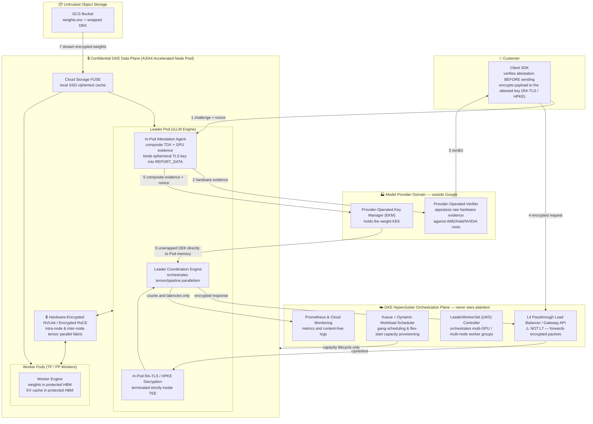
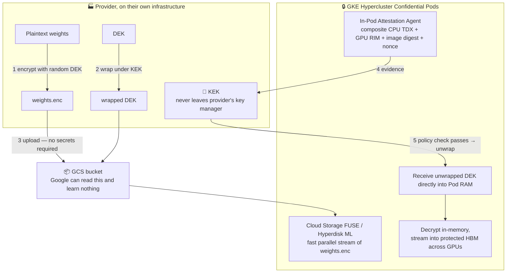
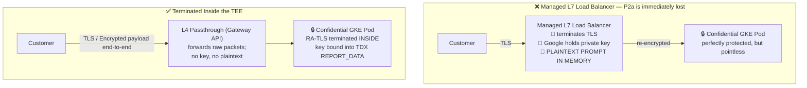
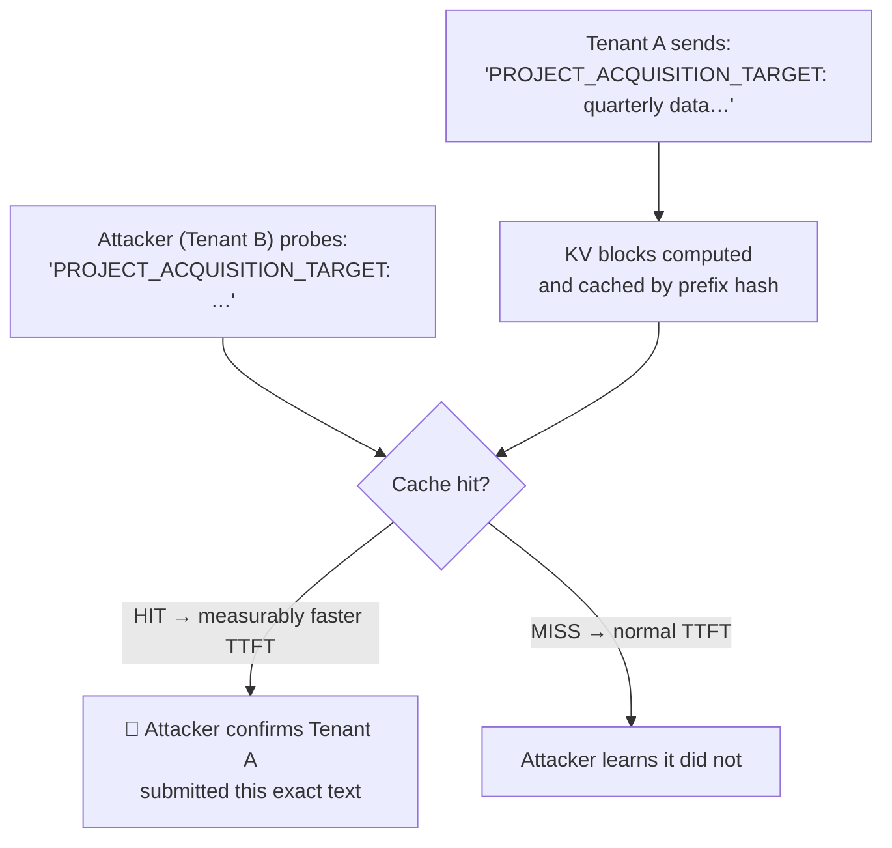
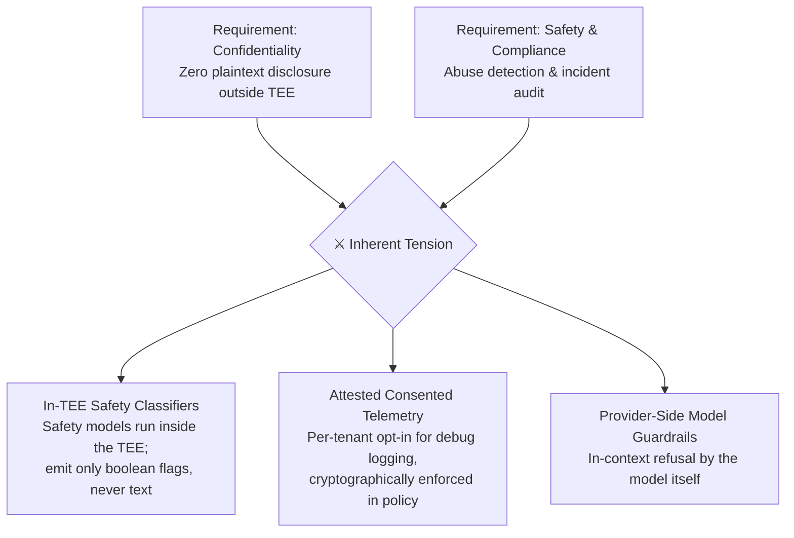

# Module 6: Designing Confidential LLM Serving on GKE

Everything before this module exists to make this module readable. The mechanisms are established: memory encryption with integrity, a measurement chain that reaches the container digest, attested key release, a GPU inside the trust boundary, and the platform primitives that expose them. This module assembles them into an end-to-end production architecture on **GKE Hypercluster** (and Google Cloud's AI Hypercomputer architecture), and then — the part that distinguishes an engineering document from a marketing one — walks the finished design back through the adversary list and states plainly what still leaks.

This module covers **requirements decomposition**, **the reference architecture on GKE Hypercluster**, **the encrypted weight pipeline**, **the cold-start budget and hypercluster optimizations**, **where TLS terminates**, **KV cache and prefix-cache leakage**, **multi-tenancy**, **the observability and safety tension**, and **an adversarial review of the result**.

---

## Part 1: Requirements Decomposition

### 1.1 The Four Properties, Made Precise

Module 1, §5.1 stated P1–P4 informally. Here they are as testable assertions, each naming the adversary it is held against.

| | Property | Held against | Test: how would you know it failed? |
| :--- | :--- | :--- | :--- |
| **P1** | Model weights exist in plaintext only inside a TEE whose measurement the model provider approved in advance | Cloud operator (A2, A3, A4); end customer | Can any party obtain a plaintext weight file without producing evidence that satisfies the provider's policy? |
| **P2a** | Prompts and completions exist in plaintext only inside such a TEE | Cloud operator (A2, A3, A4) | Is there any point on the request path where a Google-operated component holds plaintext? |
| **P2b** | Prompts are not disclosed to the model provider beyond what inference requires | Model provider (B2) | Can the workload egress, persist, or log content? Who verified that it does not? |
| **P3** | Each party can verify P1, P2a, and P2b from evidence rooted in silicon vendor certificates, without relying on assertions by another party | All parties | Does verification require trusting a statement made by the party being distrusted? |
| **P4** | P1–P3 hold at competitive TTFT and throughput, with a workable cold start, on obtainable hardware | Reality | Is the confidential path more than ~25% worse, or is cold start unbounded? |

Splitting P2 into P2a and P2b is the most useful thing in this table. They are different problems with different solutions: **P2a is solved by hardware, and P2b is not solvable by hardware at all.** Designs routinely solve P2a, claim P2, and ship.

### 1.2 What Cannot Be Achieved, Stated Up Front

Before designing, fix the boundaries. The following are out of scope permanently, and a design that implies otherwise is dishonest:

- **Availability against the operator.** Google can stop the workload. Always.
- **Traffic analysis.** Request counts, arrival times, payload sizes, inter-token timing, and session duration are visible to the platform. For an LLM this is more informative than it sounds: output length is directly observable from streaming behavior.
- **The customer's own endpoint.** If the customer's application logs prompts, nothing here helps.
- **Perfect P2b.** As Module 1, §5.3 established, attestation reduces "trust the provider's intentions" to "trust the provider's published image." It cannot reduce it to nothing. Closing the remainder requires transparency mechanisms outside the hardware.

---

## Part 2: The Reference Architecture

### 2.1 The Architectural Paradigm Spectrum

Serving frontier LLMs (70B, 405B, MoE architectures) under confidential computing requires high-bandwidth multi-GPU interconnects, distributed multi-node orchestration, low-latency weight streaming, and dynamic capacity scheduling. Modern architectures fall across three distinct patterns:

1. **Native GKE Hypercluster with Confidential Accelerated Node Pools (Primary Reference Architecture)**: Runs distributed inference workloads (e.g. vLLM / TensorRT-LLM orchestrated by [LeaderWorkerSet (LWS)](https://github.com/kubernetes-sigs/lws)) directly on confidential GPU node pools. Pods use in-workload attestation agents to fetch hardware quotes and directly unwrap DEKs from the provider's external KMS into protected HBM. Control plane risks are mitigated via Binary Authorization, strict Pod Security Admission, private endpoints, and in-pod end-to-end payload encryption.
2. **GKE Hypercluster Split-Plane / Hybrid Orchestration**: GKE Hypercluster acts as the untrusted frontend, scheduler (Kueue / Dynamic Workload Scheduler), and L4 router, while delegating raw inference to standalone [Confidential Space](05_google_cloud_confidential_surface.md#part-3-confidential-space) worker instances where organizational policy strictly requires zero host-level agent access.
3. **GKE Hypercluster with Confidential Containers (Pod-Level MicroVM TEEs)**: Next-generation confidential Kubernetes leveraging microVM runtimes (such as Kata Containers with TDX/SEV-SNP) where each Pod runs in its own hardware TEE, placing the node's Kubelet and host OS outside the Pod's trust boundary.

### 2.2 The Reference Design (Native GKE Hypercluster)



### 2.3 Component Walkthrough

| Component | Choice | Justification |
| :--- | :--- | :--- |
| **Confidential runtime** | GKE Hypercluster with Confidential Accelerated Node Pools | Full AI Hypercomputer orchestration (LWS, Kueue, DWS flex-start, GCS FUSE) while keeping data in hardware TEEs |
| **CPU TEE** | Intel TDX | Module 2, §4.1 — native `RTMR` runtime measurement, secure EPT integrity, and the confidential-GPU path |
| **Accelerator** | NVIDIA H100/H200 (A3) or B200 (A4) in CC mode (`cc_mode == ON`) | Module 4, §2.1 & §4.2 — weights and KV cache reside in hardware-protected HBM; B200 enables hardware-encrypted NVLink across 8 GPUs |
| **Workload Orchestrator** | LeaderWorkerSet (LWS) on GKE | Manages complex distributed inference topologies (Tensor Parallelism + Pipeline Parallelism across worker groups) |
| **Verifier** | **Provider-operated**, appraising raw evidence | Module 3, §1.3 — a Google-operated verifier makes P3 a promise by Google |
| **Key manager** | **Provider-operated external KMS (Cloud EKM)** | Module 5, §4.3 — Cloud KMS reduces the guarantee to an internal IAM policy |
| **Ingress** | L4 passthrough (Gateway API) + In-Pod RA-TLS, or Client-Side Payload Encryption (HPKE) | Part 5 — an L7 LB terminates TLS outside the TEE and voids P2a |
| **Storage layer** | Cloud Storage FUSE with local SSD caching | High-throughput streaming of encrypted weight chunks directly into guest memory |
| **Control plane security** | Hardened GKE Autopilot / Standard + Binary Authorization | Mitigates Kubelet/Control plane injection risks via signed container digests and strict admission controls |
| **Observability** | Counts, latencies, and error classes only | Part 8 |

The rule that makes this architecture coherent, worth stating as an invariant:

> **The orchestration plane may manage capacity, schedule jobs, and route encrypted traffic. It must NEVER hold decryption keys, nor observe plaintext prompt or weight data.**

Any proposed feature that violates this — a debugging endpoint, a content-aware router, a caching layer in front of the model — is a change to the security architecture and must be reviewed as one.

---

## Part 3: The Encrypted Weight Pipeline

### 3.1 The Flow on GKE Hypercluster



### 3.2 Multi-Node & Multi-GPU Tensor Parallel Weight Delivery

When running large models (e.g. 70B+ parameters) across multi-GPU or multi-node configurations on GKE Hypercluster via LeaderWorkerSet (LWS):

1. **Leader Pod Attestation**: The Leader Pod initializes, performs composite CPU + GPU attestation against the Provider's EKM, and obtains the unwrapped DEK directly into its protected guest memory.
2. **Secure Intra-Group Key / Weight Distribution**:
   - *Intra-Node (Blackwell B200)*: Weights are decrypted in host CVM memory and streamed into GPU 0–7 over PCIe bounce buffers; GPUs share activations over hardware-encrypted NVLink.
   - *Inter-Node (Multi-Host Pipeline Parallelism)*: Worker pods mutually attest to the Leader pod over an internal RA-TLS channel across the GKE Hypercluster VPC network. The unwrapped DEK (or encrypted weight stream) is transmitted over this mutually-attested, encrypted inter-pod channel.
3. **Never write plaintext weights to disk**: Decrypt strictly in memory/`tmpfs` and stream directly into GPU HBM. Cloud Storage FUSE and local SSDs cache only *ciphertext*.

### 3.3 Design Decisions That Matter

**Key Granularity:**

| Scheme | Blast radius of a leaked DEK | Operational cost |
| :--- | :--- | :--- |
| **One DEK per model version** | That model version, everywhere | Lowest — recommended starting point |
| **One DEK per model version per region** | One region | Moderate — enforces geographic boundaries |
| **One DEK per instance / Pod group** | One Pod group | Highest — complicates weight caching |

**Rotation:** Rotating the KEK means rewrapping the DEK in the provider's KMS — cheap, instant, and does not touch encrypted weight files. Rotating the DEK requires re-encrypting the entire model — expensive. Design so that routine operations only touch the KEK.

**Revocation:** Removing an image digest from the release policy stops *new* Pods from obtaining the key. Existing running Pods retain the DEK in memory. If immediate revocation is required, implement short-lived key leases with periodic re-attestation; if re-attestation fails, the inference process terminates and flushes GPU HBM.

---

## Part 4: The Cold-Start Problem & Hypercluster Optimizations

### 4.1 The Latency Budget

Cold start is the dominant operational challenge of confidential inference, and must be engineered as a rigorous budget.

| Phase | What happens | Confidential-specific cost |
| :--- | :--- | :--- |
| **Capacity allocation** | GKE provisions A3/A4 confidential node pool | Capacity queuing (mitigated by Dynamic Workload Scheduler) |
| **TEE boot & memory acceptance** | Firmware, guest OS, private memory acceptance | Proportional to VM DRAM size (Module 2, §4.2.3) |
| **Attestation** | Composite TDX + GPU evidence generation & appraisal | Network round trips; vendor collateral fetch if cache is cold |
| **GPU ready state** | `conf-compute -srs 1` after attestation | Hardware enforces lock until verified (Module 4, §2.4) |
| **Key release** | EKM unwrap request over external network | Cross-cloud / cross-datacenter latency |
| **Weight streaming** | Pull tens/hundreds of GB from GCS | Parallel bandwidth via GCS FUSE / Hyperdisk ML |
| **Decrypt + load to HBM** | In-memory AES-GCM decrypt + PCIe bounce buffer DMA | **The dominant term** — encrypted PCIe transfer bottleneck (Module 4, §5.3) |
| **Warm-up** | CUDA graph capture, KV cache allocation, first-token prep | Same as non-confidential |

$$
T_{\text{cold}} = T_{\text{provision}} + T_{\text{boot}} + T_{\text{attest}} + T_{\text{key}} + \frac{S_{\text{model}}}{B_{\text{fetch}}} + \frac{S_{\text{model}}}{B_{\text{cc-effective}}} + T_{\text{warm}}
$$

### 4.2 GKE Hypercluster Cold-Start Mitigations

| Mitigation | How it helps | Security cost |
| :--- | :--- | :--- |
| **Dynamic Workload Scheduler (DWS) / `flex-start`** | Pre-allocates and gang-schedules entire multi-node accelerator pools with guaranteed execution windows | **None.** Eliminates runtime provisioning jitter. |
| **Cloud Storage FUSE Local Cache** | Caches encrypted weight chunks on local SSD across Pod restarts | **None.** The cached bytes are ciphertext; reading them without the DEK yields nothing. |
| **Overlap fetch and attest** | Stream encrypted weights from GCS FUSE while attestation and key release are in-flight | **None.** Encrypted weights require no secrets to transfer. |
| **Warm pools with Kueue** | Pre-attested, pre-loaded Pods absorb traffic spikes | **None.** Financial cost only; standard production practice. |
| **Container image streaming** | Secondary boot disks / fast image streaming for rapid container startup | **None**, provided container digests are verified against the allowlist. |
| **Quantization (fp8 / int4)** | Halves or quarters the bytes transferred across PCIe bounce buffers | None to confidentiality; quality trade-off. |
| **VM snapshot / restore** | Restores pre-loaded VM memory from disk | ❌ **Fundamentally hostile to attestation.** A snapshot bypasses measured boot; launch measurements no longer reflect the running state. |

### 4.3 The Consequence for Autoscaling

With cold start measured in minutes rather than seconds, reactive autoscaling does not work — by the time a new instance is serving, the traffic spike is over. The workable patterns on GKE Hypercluster:

1. **Predictive scaling with Kueue and DWS** on traffic forecasts rather than instantaneous queue depth.
2. **Generous warm pools**, sized by the p99 of the arrival process rather than the mean.
3. **Queue and degrade**, admitting that some requests wait, with explicit backpressure rather than timeouts.
4. **Over-provision and accept the cost.** Often the honest answer for a premium confidential tier, priced into SLA contracts.

---

## Part 5: Where TLS Terminates

### 5.1 The Ingress Problem That Voids Confidentiality



If an L7 load balancer terminates TLS before the TEE, **the prompt exists in plaintext on Google-operated infrastructure**. P2a fails at the very first hop, regardless of how secure the downstream GPU is.

### 5.2 Ingress Patterns Compared

| Option | Mechanism | P2a holds? | Operational Tradeoff |
| :--- | :--- | :--- | :--- |
| **A. Managed L7 LB** | Google terminates TLS, re-encrypts to pod | ❌ **No** | Zero engineering effort; completely voids confidentiality guarantee |
| **B. L4 Passthrough + In-Pod RA-TLS** | GKE Gateway API / L4 LB forwards packets; Pod terminates TLS using key bound to attestation report | ✅ Yes | Loses L7 WAF and path-based routing; requires client attestation verification SDK |
| **C. Client-Side Payload Encryption (HPKE)** | Client encrypts prompt body with Pod's attested public key; transport TLS can terminate anywhere | ✅ Yes | Application-layer protocol; resilient to network topology misconfigurations |
| **D. B + C (Defense-in-Depth)** | L4 passthrough combined with client payload encryption | ✅ Yes | Maximum security assurance |

**Recommendation:** Implement **Option C** (Client-Side HPKE Payload Encryption) combined with **Option B** (L4 Passthrough via GKE Gateway API). Payload encryption ensures that even if an operator introduces an L7 debugging proxy or misconfigures network ingress, prompt plaintext is never exposed.

---

## Part 6: KV Cache, Prefix Caching, and Disaggregated Serving

### 6.1 The KV Cache Is Prompt Content

The KV cache represents the internal activations of all processed tokens (system prompt, RAG context, user history). In confidential GPUs, it resides securely in hardware-protected HBM. Any mechanism that extracts, shares, or persists KV blocks must be treated with the same confidentiality rigor as the prompt itself.

### 6.2 Prefix Caching: A Cross-Tenant Timing Oracle

Prefix caching reuses computed KV blocks for shared prompt prefixes. When shared across multiple tenants, it creates a high-precision timing oracle:



Because TTFT differences are observable over public APIs, memory encryption provides zero protection against this timing channel.

**The Rules for Confidential Serving:**
- **Cross-tenant prefix cache**: ❌ **Strictly forbidden.**
- **Per-tenant isolated prefix cache**: ✅ Allowed (oracle only reveals tenant's own data to themselves).
- **Static provider system prompt cache**: ⚠️ Allowed only if the prompt is public and contains zero tenant data.
- **KV cache swap to CPU RAM**: ✅ Allowed within the confidential VM; ❌ never to host-shared memory.

### 6.3 Disaggregated Prefill and Decode on GKE Hypercluster

Disaggregated serving separates compute-intensive prefill nodes from memory-intensive decode nodes, transferring KV tensors across the network. On GKE Hypercluster, this requires:

1. **Mutual Attestation (mRA-TLS)**: Prefill and Decode pods must verify each other's hardware TEE and container digest before initiating transfer.
2. **Encrypted Inter-Node Fabric**: KV blocks transmitted across nodes over RoCE or VPC networks must be encrypted using ephemeral session keys negotiated inside the TEEs.
3. **Zero Plaintext Staging**: Tensors must never be staged in unencrypted host memory or unauthenticated RDMA buffers.

---

## Part 7: Multi-Tenancy on GKE Hypercluster

### 7.1 Multi-Tenancy Isolation Models

| Model | Isolation Mechanism | Efficiency | Recommended Use Case |
| :--- | :--- | :--- | :--- |
| **Dedicated Node Pool per Tenant** | Hardware TEE boundary per tenant node | Low (GPU idle cost per tenant) | High-compliance enterprise tiers |
| **Confidential Containers (Pod TEEs)** | MicroVM TEE per Pod on shared nodes | High | Multi-tenant clusters with strict hardware isolation |
| **Continuous Batching in Shared Pod** | Hardware isolation from platform; **software isolation between tenants** | Highest | Standard multi-tenant serving (with caveat below) |

### 7.2 The Multi-Tenant Software Caveat

In standard continuous batching, multiple tenants' requests execute in the same forward pass in the same GPU HBM. The hardware TEE isolates the entire container from the cloud operator, but cross-tenant isolation relies on the memory safety and block management of the inference server (e.g. vLLM). A software bug in block management is a cross-tenant leak occurring entirely inside the trust boundary.

Customers requiring hardware-enforced isolation from *other tenants* must be allocated dedicated confidential instances or Pod-level microVM TEEs.

---

## Part 8: Observability and Safety

### 8.1 Allowlisted Telemetry

To maintain confidentiality invariant P2a, telemetry emitted from the confidential plane must adhere to a strict field allowlist:

| Signal | Allow? | Rationale |
| :--- | :--- | :--- |
| **Request counts, latencies, TTFT, TPOT** | ✅ | Content-free performance telemetry |
| **Token counts (prompt & completion)** | ✅ | Required for billing (length is observable via traffic analysis anyway) |
| **Error codes and categories** | ✅ | Sanitized status codes only |
| **Error messages and stack traces** | ❌ | Routinely interpolate prompt text; must be stripped at the boundary |
| **Raw prompt / completion text** | ❌ | Immediately voids P2a |
| **Heap dumps & core dumps** | ❌ | Contain unencrypted weights and prompt memory |

### 8.2 The Safety & Abuse Monitoring Tension

Responsible AI serving requires detecting abusive content, yet confidential computing forbids external content inspection.



**Production Posture:** Run lightweight safety classifier models *inside* the TEE. The classifier emits binary policy violation flags to external monitoring, allowing abuse mitigation without exposing prompt contents.

---

## Part 9: Adversarial Review

### 9.1 Threat Model Evaluation

Walking the finished GKE Hypercluster design against the Module 1 adversary taxonomy:

| Adversary | Capability against this architecture | Verdict |
| :--- | :--- | :--- |
| **A1 — Malicious co-tenant** | Cannot access guest DRAM or GPU HBM; isolated by hardware TEE | ✅ Addressed |
| **A2 — Compromised hypervisor** | Sees only ciphertext on DRAM and PCIe bus; integrity-protected by TDX and GPU CC | ✅ Addressed |
| **A3 — Cloud insider with host root** | Can terminate nodes or observe traffic timing; cannot read weights, prompts, or KV cache; cannot bypass provider EKM release policy | ✅ Addressed for confidentiality |
| **A4 — Physical / DMA attacker** | Memory and bus lines are encrypted with hardware integrity protection | ✅ Addressed |
| **B1 — Compromised container image** | Has full in-enclave access | ⚠️ Mitigated by supply chain: cosign signing, Binary Authorization, attested digest allowlist |
| **B2 — Malicious model provider** | Author of the inference code holding plaintext prompt | ⚠️ Partially addressed: VPC Service Controls, no unauthorized egress, audited open codebase (P2b constraint) |
| **B3 — Silicon TEE vendor** | Hardware / firmware trust root | ⚠️ Irreducible baseline trust in Intel/AMD/NVIDIA |
| **C1 — Availability** | Cloud provider can stop or delete instances at will | ❌ Out of scope |
| **C2 — Traffic analysis** | Packet arrival rates, token streaming cadences, payload sizes are visible | ❌ Out of scope; disclose to customer |
| **C3 — Side channels** | Ciphertext side channels on DRAM / cache lines | ⚠️ Mitigate via latest firmware patches and TCB floor enforcement |

### 9.2 The Six-Claim Checklist, Verified

| Claim | Verification Status | Implementation in this Design |
| :--- | :--- | :--- |
| **1. Weights encrypted at rest** | ✅ Passed | AES-256-GCM wrapped under provider KEK in GCS (§3.1) |
| **2. Weights decrypted only in TEE** | ✅ Passed | EKM releases DEK only to attested TDX + GPU CC environment (§3.1) |
| **3. Workload runs approved image** | ✅ Passed | Binary Authorization + Container digest verified in attestation token |
| **4. Host RAM unreadable** | ✅ Passed | Intel TDX hardware memory encryption with secure EPT integrity |
| **5. GPU HBM unreadable** | ✅ Passed | NVIDIA CC mode enabled (`cc_mode == ON`) with protected HBM |
| **6. Provider independently verifies** | ✅ Passed | Raw evidence validated against silicon vendor roots by provider verifier |

---

## Lab: Deploying Production Confidential LLM Serving on GKE Hypercluster

**Goal:** Deploy a frontier-class model (e.g. 70B parameter model) on a GKE Hypercluster confidential GPU node pool using LeaderWorkerSet (LWS) and vLLM, with attested key release from an external KMS and verified in-pod RA-TLS ingress.

### Step 1 — Create the GKE Hypercluster with Confidential Node Pool

```bash
# Create GKE cluster with hardened control plane
gcloud container clusters create-auto cc-hypercluster \
  --location=us-central1 \
  --release-channel=rapid

# Provision a Confidential GPU Node Pool (Intel TDX + NVIDIA H100/B200)
gcloud container node-pools create cc-gpu-pool \
  --cluster=cc-hypercluster \
  --location=us-central1 \
  --node-locations=us-central1-a \
  --machine-type=a3-highgpu-1g \
  --confidential-node-type=tdx \
  --accelerator=type=nvidia-h100-80gb,count=1,gpu-driver-version=latest \
  --enable-gvnic \
  --num-nodes=2
```

### Step 2 — Configure Encrypted Storage and GCS FUSE

```bash
# Encrypt the model weights and upload ciphertext
openssl rand -out dek.bin 32
tar cf - ./model-70b | openssl enc -aes-256-gcm -kfile dek.bin > model.enc
gcloud kms encrypt --key=weights-kek --keyring=cc-ring --location=global \
  --plaintext-file=dek.bin --ciphertext-file=dek.wrapped
gsutil cp model.enc dek.wrapped gs://cc-model-store/
shred -u dek.bin
```

### Step 3 — Deploy the LeaderWorkerSet with Attestation Agent

```yaml
apiVersion: leaderworkerset.x-k8s.io/v1
kind: LeaderWorkerSet
metadata:
  name: vllm-confidential-70b
spec:
  replicas: 1
  leaderWorkerTemplate:
    size: 2
    leaderTemplate:
      metadata:
        labels:
          role: leader
      spec:
        containers:
        - name: vllm-leader
          image: us-docker.pkg.dev/PROJECT/REPO/vllm-cc:v1@sha256:APPROVED_DIGEST
          securityContext:
            allowPrivilegeEscalation: false
            capabilities:
              drop: ["ALL"]
          env:
          - name: MODEL_BUCKET
            value: "gs://cc-model-store"
          - name: EKM_ENDPOINT
            value: "https://kms.provider.com/unwrap"
          volumeMounts:
          - name: gcs-fuse-csi
            mountPath: /data
        volumes:
        - name: gcs-fuse-csi
          csi:
            driver: gcsfuse.csi.storage.gke.io
            readOnly: true
    workerTemplate:
      spec:
        containers:
        - name: vllm-worker
          image: us-docker.pkg.dev/PROJECT/REPO/vllm-cc:v1@sha256:APPROVED_DIGEST
```

### Step 4 — Verify End-to-End Attestation and Key Release

1. The Leader Pod generates its composite TDX + H100 CC evidence.
2. The Pod presents the evidence and nonce to the Provider's External KMS.
3. Upon policy validation, the unwrapped DEK is returned over TLS directly into the Pod's memory.
4. The Pod streams `model.enc` from GCS FUSE, decrypts in-memory, and loads weights into protected HBM.
5. The client SDK queries the Pod's attestation report, verifies the bound RA-TLS key, and sends an encrypted inference request.

---

## Summary: The GKE Confidential Serving Design Checklist

| Decision | Production Recommendation | Consequence of Compromise |
| :--- | :--- | :--- |
| **Confidential Infrastructure** | GKE Hypercluster with TDX + H100/B200 CC Node Pools | Standard nodes expose memory to hypervisor and cloud insiders |
| **Workload Orchestration** | LeaderWorkerSet (LWS) + Dynamic Workload Scheduler flex-start | Inability to coordinate multi-node tensor parallelism under attestation |
| **Key Release Gate** | Provider-Operated External KMS (Cloud EKM) appraising raw evidence | Cloud KMS reduces security guarantee to a cloud IAM policy |
| **TLS & Ingress** | L4 Passthrough (Gateway API) + In-Pod RA-TLS / Client HPKE | Managed L7 LB terminates TLS and holds plaintext prompts in cloud memory |
| **Weight Delivery** | Cloud Storage FUSE + In-Memory Decrypt to protected HBM | Plaintext weight files on disk are readable by the platform |
| **Cold-Start Strategy** | DWS flex-start + FUSE local cache + Warm Pools | Multi-minute cold starts cause severe request timeouts under traffic spikes |
| **Prefix Caching** | Scoped strictly per-tenant; never shared across tenants | Shared prefix cache acts as a timing oracle leaking prompt contents |
| **Disaggregated Serving** | Mutual RA-TLS + encrypted inter-node transport | Plaintext KV tensors cross network unencrypted |
| **Telemetry & Observability** | Strict field allowlist; sanitized error codes; zero prompt text | Uncaught stack traces leak user prompts into Cloud Logging |
| **Safety Monitoring** | In-TEE classifier models emitting binary policy flags | Either complete safety blind spot or total privacy violation |

The architecture is complete and defensible. What remains is measuring performance, operating without standard debug access, and understanding fleet lifecycle under attestation. That is **Module 7: Performance, Operations, and Evaluation (`07_performance_operations_and_evaluation.md`)**.
