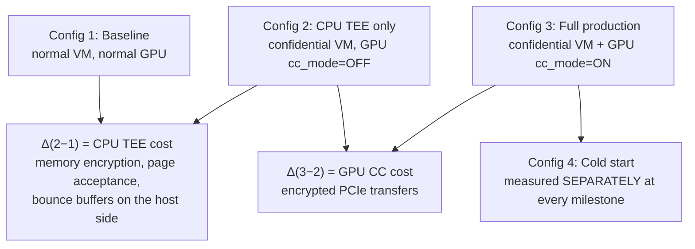
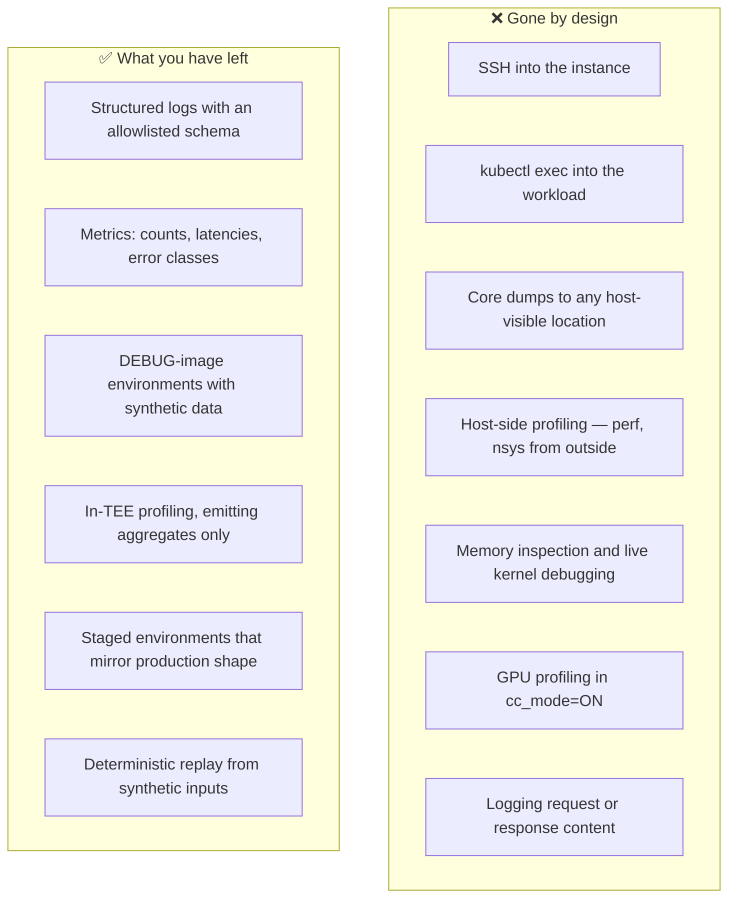

# Module 7: Performance, Operations, and Evaluation

A design that is correct and unoperable is not a design. This module is about the three things that decide whether the Module 6 architecture survives contact with production: whether you can measure its cost honestly, whether you can run it without the tools you are used to, and whether you can defend its claims to a counterparty who has read the same literature you have.

This module covers **benchmarking methodology**, **the overhead and cost budget**, **debugging without SSH or core dumps**, **fleet lifecycle under attestation**, **which compliance claims actually hold**, and **how the published alternatives from AWS, Azure, and Apple compare**.

---

## Part 1: Benchmarking Methodology

### 1.1 The Four-Configuration Matrix

The single most common benchmarking error in this field is reporting one number for "confidential computing overhead." There are at least two independent sources of cost, and they behave completely differently. Separating them is not pedantry — it determines which optimization is worth doing.

Configuration 4 is not a fourth environment — it is the insistence that cold start be reported separately from steady state. Blending them produces a number that describes neither, and it hides the fact that one component is nearly free while the other is expensive.

### 1.2 What a Defensible Benchmark Controls For

| Variable | Why it matters | How to control it |
| :--- | :--- | :--- |
| Model size | Overhead falls as the model grows (Module 4, §5.2) | Report per model; never extrapolate across sizes |
| Batch size | Overhead falls as batching increases | Sweep it; report the curve, not a point |
| Sequence length | Longer prompts amortize transfer over more compute | Sweep input and output lengths independently |
| Quantization | Changes bytes transferred and bytes resident | State it; fp8 and bf16 are different experiments |
| Warm vs cold | Different by an order of magnitude | Always separate |
| Attestation caching | A cold vendor-collateral fetch adds seconds | State whether the cache was warm |
| Instance variance | Confidential capacity is constrained; you may get different hosts | Repeat across instances, report the distribution |

### 1.3 The Metrics That Matter for Serving

Report all four; any one alone is misleading:

$$
\text{TTFT} = t_{\text{first token}} - t_{\text{request}} \qquad
\text{TPOT} = \frac{t_{\text{last}} - t_{\text{first}}}{N_{\text{output}} - 1}
$$

- **TTFT** — dominated by prefill. Modestly affected by CC.
- **TPOT** — dominated by decode. Least affected by CC.
- **Throughput** (requests/s and tokens/s at a fixed latency SLO) — the number that determines cost per token.
- **Cold start**, broken down by the Module 6, §4.1 milestones.

Report throughput *at a latency SLO*, not in isolation. Throughput measured with unbounded queueing is a number about your queue, not your system.

### 1.4 The Honest Framing of Published Numbers

Published benchmark work on H100 confidential computing has reported LLM inference throughput penalties in the mid-single-digit percentage range, shrinking toward negligible as model size, batch size, and sequence length grow, with the cost attributable almost entirely to CPU–GPU transfer over PCIe rather than to on-device compute.

Two cautions about carrying those numbers into your own planning:

1. **They are steady-state numbers.** They say nothing about cold start, which is where this architecture actually hurts.
2. **They are single-GPU numbers.** The Hopper single-GPU constraint (Module 4, §4.1) means the comparison is often not "the same workload with CC on and off" but "a workload you had to restructure to fit in 80 GB versus one you did not." That restructuring cost is real and is not captured in any CC overhead percentage.

For capacity planning before you have your own measurements, reserving on the order of **15–25% additional throughput capacity** is a reasonable starting heuristic — and it should be replaced by measurements from your own workload as soon as they exist.

---

## Part 2: The Overhead and Cost Budget

### 2.1 Where the Cost Actually Comes From

| Source | Magnitude | Falls on | Mitigable? |
| :--- | :--- | :--- | :--- |
| Encrypted PCIe transfer | Largest steady-state term | Every host↔device byte | Partially — batch more, transfer less; TDISP eventually |
| Weight load at cold start | Largest term overall | Startup only | Warm pools, quantization, sealed cache |
| Guest private-memory acceptance | Seconds, scales with VM RAM | Boot only | Right-size the VM |
| Attestation round trips | Hundreds of ms to seconds | Startup, and re-attestation | Cache collateral; overlap with weight fetch |
| Key release round trip | Network RTT to an external KMS | Startup | Co-locate; but not at the cost of independence |
| Memory encryption | Small, mostly hidden by the memory hierarchy | All memory access | Not meaningfully |
| Lost GPU sharing (no MIG, no time-slicing) | **Can dominate everything else** | Utilization | No — it is a hard constraint |

The last row is the one that budgets miss. A 5% throughput penalty is easy to absorb. Losing the ability to pack several small models onto one GPU can halve your effective utilization, and that shows up in cost per token far more than any encryption overhead.

### 2.2 The Cost Model

$$
C_{\text{token}} = \frac{C_{\text{instance-hour}} \times (1 + \alpha_{\text{premium}})}{\text{Throughput}_{\text{tokens/hour}} \times U_{\text{effective}}}
$$

Three multipliers work against you simultaneously, and only one of them is the overhead everyone talks about:

1. **$\alpha_{\text{premium}}$** — confidential machine types carry a price premium, and the confidential SKUs are a narrower, less discountable selection.
2. **Throughput** — reduced by the CC overhead in §1.4. This is the small one.
3. **$U_{\text{effective}}$** — reduced by lost GPU sharing, by warm-pool idle capacity, and by the over-provisioning that multi-minute cold start forces. **This is usually the largest term.**

The honest summary to bring to a pricing discussion: **the compute overhead of confidential computing is modest; the operational overhead is not.** Warm pools and lost packing density cost more than encryption does.

### 2.3 What This Means Commercially

A confidential inference tier is a premium product, and it should be priced and positioned as one. Attempting to offer it at parity with standard inference means absorbing the warm-pool and utilization costs somewhere invisible, which eventually becomes a capacity problem rather than a margin problem.

---

## Part 3: Debuggability

### 3.1 What You Lose

The two that hurt most in practice:

- **No core dumps.** A crash produces a stack trace at best, and that stack trace cannot include content. A segfault in a CUDA kernel gives you very little.
- **No production profiling.** `cc_mode=ON` disables profiling tools. You cannot profile the configuration you actually run; you profile `DEVTOOLS` mode and hope the difference is uninteresting.

### 3.2 How to Work Within It

1. **Make the DEBUG path first-class.** A Confidential Space DEBUG image with synthetic data, matched in every other respect to production, is where debugging happens. Invest in making it genuinely identical — a debug environment that diverges from production is where the bugs you cannot reproduce live.
2. **Log with an allowlist, never a denylist.** Define the emittable fields explicitly. Any log call that can interpolate arbitrary data is a leak waiting for the right exception. This is a lint rule, not a code review convention.
3. **Sanitize exceptions at the boundary.** Wrap the request handler so that no exception message propagates to a logger. Log an error *class* and a correlation ID; the message is discarded.
4. **Correlation IDs everywhere.** With no content in logs, a request ID that threads through every component is the only way to reconstruct a request's path.
5. **Deterministic synthetic reproduction.** Build the ability to replay a request *shape* — token counts, batch composition, sampling parameters — without its content. Most performance bugs and many correctness bugs reproduce from shape alone.
6. **In-TEE profiling that emits aggregates.** Histograms and percentiles can leave the boundary. Traces of individual requests cannot.

### 3.3 Incident Response Without Evidence

When something goes wrong in production, you will have: metrics, error classes, attestation state, and no content. Plan for it before the incident:

- **Decide the escalation path in advance.** If diagnosis genuinely requires content, the only legitimate route is customer-consented, time-boxed, attested telemetry (Module 6, §8.2) — not an SRE deciding under pressure to enable a debug flag.
- **Write the runbook while calm.** "We cannot look at the data" is an unwelcome discovery at 3 a.m.
- **Accept unresolvable incidents.** Some issues will be closed without root cause. That is a deliberate cost of the architecture and should be acknowledged in the SLA conversation, not treated as an operational failure.

---

## Part 4: Fleet Lifecycle Under Attestation

### 4.1 What Attestation Adds to Every Operation

| Operation | Normal fleet | Confidential fleet |
| :--- | :--- | :--- |
| Node join | Register with the control plane | Attest, obtain a key, reach GPU ready state |
| Image rollout | Push, roll, done | Push, **update the reference values in the release policy**, then roll |
| Firmware update | Transparent | Advances the TCB → invalidates cached collateral → fleet-wide re-attestation |
| Key rotation | Update a secret | Rewrap the DEK, re-release to every running instance |
| Scale up | Seconds | Minutes (Module 6, §4) |
| Host maintenance | Live migration | **Termination** — no live migration under SEV-SNP or TDX |

The image rollout row is the operational trap. **A new image has a new digest, and the digest is in the release policy.** Deploy the image before updating the policy and every new instance fails to obtain the weight key — a self-inflicted outage that looks like a key management failure and is actually a deployment ordering bug.

The correct sequence, which belongs in the deployment pipeline rather than in someone's memory:

1. Build and sign the image; record the digest.
2. **Add** the new digest to the release policy, keeping the old one.
3. Roll the fleet.
4. Verify no instances remain on the old digest.
5. **Remove** the old digest.

Steps 2 and 5 make the policy tolerate both versions during the roll. Skipping step 5 is how allowlists accumulate digests nobody can account for, which is its own security problem.

### 4.2 The TCB Advance Runbook

When AMD or Intel publishes a firmware update (Module 3, §4.2):

1. Cached endorsement collateral becomes stale; verification starts failing.
2. The old TCB level is marked out-of-date; your policy must decide whether to accept it.
3. Rejecting it immediately means every un-updated node loses key access.
4. Accepting it means serving on hardware with a published vulnerability.

The workable answer, which must exist as a written policy before the first advisory:

- A **grace window** during which the previous TCB level is accepted.
- **Loud alarms** on any node still at the old level.
- A **pre-committed deadline** at which the floor is raised regardless.
- A **dashboard of TCB version distribution** across the fleet — you will need it the day the advisory lands, and building it under pressure is a bad time.

### 4.3 Autoscaling Reconsidered

Module 6, §4.3 established that reactive autoscaling does not work at multi-minute cold start. The operational shape that does:

- **Predictive scaling** on forecasts, not instantaneous queue depth.
- **Warm pool sized on the p99 of arrivals**, not the mean.
- **Explicit backpressure** — queue and shed with a clear error, rather than timing out.
- **Attestation health as a first-class signal.** An instance that has passed attestation and released its key is "ready"; one that has booted is not. Your readiness probe must check GPU CC mode and attestation state, not just that the HTTP port is open (Module 4, lab step 2).

---

## Part 5: Compliance and Positioning

### 5.1 What Confidential Computing Genuinely Supports

| Claim | Holds? | Qualification |
| :--- | :--- | :--- |
| "The cloud operator cannot read data in use" | ✅ Yes | With SEV-SNP/TDX **and** GPU CC mode **and** in-TEE TLS termination |
| "Data is protected from a compromised hypervisor" | ✅ Yes | This is the core, well-evidenced property |
| "Only approved code can decrypt the data" | ✅ Yes | If the release policy is complete and the verifier is independent |
| "The customer can verify this independently" | ✅ Yes | Only with an independent verifier; ❌ if the cloud operator is the verifier |
| "Data never leaves the jurisdiction" | ⚠️ Partly | CC does not control placement; that is a separate, region-level control |
| "This satisfies [regulation]" | ⚠️ Depends | CC is evidence toward a control objective, not a certification |
| "The workload cannot exfiltrate data" | ❌ **No** | A TEE protects the workload from the platform, never the reverse |
| "Data is safe from all attacks" | ❌ **No** | Side channels, traffic analysis, and availability remain (Module 2, §5.4) |

### 5.2 Where the Marketing Outruns the Mechanism

Four claims worth being able to correct, politely, in a customer meeting:

1. **"Confidential computing means we can't see your data."** True only if the GPU is attested, TLS terminates inside the TEE, and no telemetry carries content. Each of those is a design decision that can be, and often is, made the other way.
2. **"Attestation proves the code is trustworthy."** Attestation proves *which* code runs. Whether that code is trustworthy is a separate question answered by source availability, reproducible builds, or audit (Module 3, §7).
3. **"Your data is isolated from other tenants."** In a batched deployment, isolation between tenants is enforced by the inference server's correctness, not by hardware (Module 6, §7.2).
4. **"This makes us compliant."** Confidential computing is a technical control that supports a compliance argument. It is not a certification, and no regulator has a "confidential computing" checkbox.

Being the person in the room who states these accurately is more valuable than being the person who claims more. Sophisticated counterparties — and a model provider's security team is a sophisticated counterparty — assign credibility based on which qualifications you volunteer.

---

## Part 6: Comparative Architectures

### 6.1 The Field

| | **AWS Nitro Enclaves** | **Azure Confidential Containers** | **Apple Private Cloud Compute** | **This design (GKE)** |
| :--- | :--- | :--- | :--- | :--- |
| Isolation unit | An enclave carved from a parent EC2 instance | A pod sandbox (Kata + SEV-SNP) | A whole purpose-built node | A Confidential Space instance |
| Hardware basis | Nitro hypervisor and card | AMD SEV-SNP | Apple silicon, plus Intel TDX and NVIDIA CC in expanded deployments | Intel TDX + NVIDIA H100 CC |
| Attestation model | Background-check — the enclave hands a document to KMS | JWT from Microsoft Azure Attestation | Client-enforced against a transparency log | Passport via Google Cloud Attestation, or provider-verified raw evidence |
| Key release | KMS condition keys over attestation | Managed HSM secure key release | Apple-controlled, client-verified | Provider-operated external KMS |
| No interactive access | Enclave has no persistent storage, no network, no shell | Sandbox boundary | **Explicitly designed out** — no remote shell, no interactive debugging | Confidential Space production image |
| Reference values | Customer-managed PCRs | Policy over the container image | **Reproducible builds + published binaries + append-only log** | Signed golden values; digest allowlist |
| GPU support | Limited | Emerging | Yes, NVIDIA CC | Yes, one H100 per instance |

### 6.2 What Each Gets Right

**AWS Nitro Enclaves** has the cleanest key-release story: the KMS policy is expressed as condition keys over attestation measurements, and it is enforced by KMS itself. The mechanism is simple enough to explain to a customer in one diagram, which is a genuine engineering virtue. Its limitation is scope — an enclave has no persistent storage and no direct network, which is elegant for key operations and awkward for GPU-attached inference.

**Azure Confidential Containers** gets the *unit of confidentiality* right. Running each pod in its own VM TEE (Kata plus SEV-SNP) means the kubelet and node agent stay outside the trust boundary — precisely the property Confidential GKE Nodes lacks (Module 5, §2.3). If GKE offered a pod-sandbox confidential runtime, the Module 6 architecture would be simpler, because you could keep Kubernetes and still exclude the control plane.

**Apple Private Cloud Compute** is the most complete published treatment of the reference-value problem, and it is the design worth studying hardest. Its five stated requirements — stateless computation, enforceable guarantees, no privileged runtime access, non-targetability, and verifiable transparency — read as a direct answer to the gaps this book has catalogued. Two of them are the ones a GKE design most often fails to match:

- **No privileged runtime access, designed out rather than configured off.** Apple states it deliberately omitted remote shell and interactive debugging from PCC nodes, because open-ended access is a broad attack surface. Compare this with Module 5, §2.3's `kubectl exec` demonstration.
- **Verifiable transparency, enforced client-side.** Images are reproducibly built, binaries are published for inspection, measurements go into a cryptographically verifiable append-only ledger, and — the load-bearing part — client devices refuse to send data to a node whose image is not in that log. Publishing measurements achieves nothing unless clients enforce against them.

### 6.3 The Development Worth Knowing About

Apple has extended Private Cloud Compute beyond its own data centers, running Apple Intelligence workloads on Google Cloud in collaboration with Google and NVIDIA. The published stack is **NVIDIA Confidential Computing on NVIDIA GPUs, Intel CPUs with TDX, and Google's Titan chip** — which is, component for component, the architecture Module 6 describes.

Two details from Apple's account are worth internalizing, because they are exactly the positions this book has argued for:

1. **Apple retains complete control over the software.** Apple devices only trust PCC software cryptographically approved by Apple, and all binaries are published for public inspection. Google provides infrastructure; Google does not become the verifier. This is Module 3, §1.3's rule — *the verifier and key holder should be the party whose asset is at risk* — implemented at scale by a party with the leverage to insist on it.
2. **Apple explicitly does not rely on confidential computing alone.** Their published position is that they do not rely solely on confidential computing to mitigate attacks leveraging privileged access outside the confidential VM, including side-channel attacks. That is Module 2, §5.4's honest summary, adopted as an engineering posture: layered defenses on the assumption that the TEE's guarantees have edges.

The practical significance for a Vertex 3P MaaS design is direct: **a sophisticated model provider running on Google Cloud infrastructure, with an independent verifier and its own software control, is not hypothetical.** It is a published, shipping arrangement, and it sets the expectation a comparable offering will be measured against.

### 6.4 What a GKE Design Should Aim For

Ordered by ratio of value to effort:

1. **Independent verification.** The model provider verifies raw hardware evidence itself. Highest value; entirely achievable today.
2. **External key management.** The weight KEK lives outside Google. Achievable with Cloud EKM.
3. **No interactive access to production.** Confidential Space production images, and a policy that never accepts `dbgstat == enabled`. Free — it is a policy line.
4. **Client-side attestation enforcement.** The client verifies before sending. Requires an SDK; this is the step most designs skip, and it is the one that makes the guarantee the customer's rather than the operator's.
5. **Published reference values.** A signed, versioned manifest of acceptable measurements. Moderate effort, high credibility.
6. **Reproducible builds.** Highest effort, highest strength. Aim for it; ship without it if you must, and say so.

The gap between a defensible design and Apple's bar is items 4, 5, and 6 — and none of them is a hardware limitation. They are all product and engineering investment decisions.

---

## Lab: Build the Benchmark Harness and Run a Rotation Drill

**Goal:** produce the overhead table your organization will actually cite, and rehearse the operation most likely to cause an outage.

**Cost:** ⚠️ Two A3 instances if you want a true A/B. Budget accordingly, or accept a within-instance comparison by toggling GPU CC mode. **Status:** a methodology exercise; the specific commands depend on your serving stack.

### Part A — The four-configuration matrix

Run an identical workload across the configurations from §1.1 and fill in this table. **This artifact is the deliverable.**

| Config | TTFT p50 | TTFT p99 | TPOT p50 | Tokens/s | Cold start |
| :--- | :--- | :--- | :--- | :--- | :--- |
| 1. Baseline (normal VM + GPU) | | | | | |
| 2. CPU TEE only (`cc_mode=OFF`) | | | | | |
| 3. Full CC (`cc_mode=ON`) | | | | | |

Then sweep batch size $\in \{1, 4, 16, 64\}$ and input length $\in \{128, 1024, 8192\}$ for configurations 1 and 3, and plot overhead percentage against each. **You are looking for the downward slope predicted by Module 4, §5.2.** If you do not see it, your benchmark is transfer-bound in a way the model does not predict, and finding out why is more valuable than the numbers.

### Part B — Decompose the cold start

Instrument every milestone from Module 6, §4.1 and produce:

| Phase | Duration | % of total |
| :--- | :--- | :--- |
| Instance provisioning | | |
| TEE boot + memory acceptance | | |
| Attestation (warm collateral cache) | | |
| Attestation (cold collateral cache) | | |
| Key release | | |
| Weight fetch | | |
| Decrypt + load to protected HBM | | |
| Warm-up to first token | | |

Run it twice — once with a warm collateral cache and once cold — and note the difference. That delta is your exposure to an AMD KDS or Intel PCS outage on the critical path.

### Part C — The key rotation drill

This rehearses the operation most likely to cause a self-inflicted outage.

1. With traffic flowing, rotate the KEK and rewrap the DEK.
2. Force a new instance to launch and obtain the new key.
3. Verify that in-flight requests on old instances are unaffected.
4. Drain the old instances.
5. **Time the whole thing**, and note whether any request failed.

Now do the destructive version deliberately, in a non-production environment: **deploy a new image digest without first adding it to the release policy.** Watch every new instance fail to obtain the key. Time how long it takes you to diagnose the cause from the available signals — which is exactly the diagnosis you will have to perform under pressure, with no shell access, one day.

### Part D — The TCB advance simulation

Raise the minimum TCB version in your release policy above what your fleet currently reports. Observe every instance fail to obtain keys. Then:

1. How quickly did your monitoring detect it?
2. Did the alerts say "TCB below policy floor," or did they say "key release failing"? Only the first is actionable.
3. How would you have rolled back?

Write the runbook from what you learn. Doing this deliberately on a Tuesday is much cheaper than discovering it the day a firmware advisory lands.

---

## Summary: Operating a Confidential Inference Fleet

| Question | Answer | Why it matters |
| :--- | :--- | :--- |
| How do you benchmark honestly? | Four configurations; separate CPU TEE from GPU CC from cold start | One blended number describes nothing |
| Where is the compute overhead? | PCIe transfer; mid-single-digit percentages, shrinking with scale | Modest, and not the main cost |
| Where is the *real* cost? | Warm pools, lost GPU sharing, over-provisioning for cold start | Utilization dominates encryption overhead |
| What do you lose in debugging? | SSH, exec, core dumps, host and GPU profiling, content logs | Invest in DEBUG parity and shape-based replay |
| How do you log safely? | Allowlisted fields, sanitized exceptions, correlation IDs | A denylist will leak through an exception message |
| What breaks on image rollout? | The digest changes and the release policy has not | Add the new digest before rolling; remove the old after |
| What happens on a firmware update? | TCB advances, collateral goes stale, fleet re-attests | Needs a grace window and a pre-committed deadline |
| Does autoscaling work? | Not reactively | Predictive scaling and warm pools sized on p99 |
| Which compliance claims hold? | Operator cannot read data in use; **not** "workload cannot exfiltrate" | Volunteering the qualifications buys credibility |
| What is the bar to aim for? | Apple PCC: no privileged access by design, reproducible builds, client-enforced transparency | Items 4–6 of §6.4 are product decisions, not hardware limits |

---

## Where to Go Next

You have the full stack: the primitives, the hardware, the attestation system, the accelerator, the platform, a design, and the means to evaluate it. Two things are worth doing next.

**Build the smallest end-to-end thing that works.** A single confidential instance, a toy model with an encrypted weight file, a composite release policy, and a client that refuses to send a prompt when attestation fails. That last behavior — a client that says no — is the one that converts this from theory into a system you trust.

**Keep the primary sources close.** This field moves fast enough that any specific claim here has a shelf life. The architecture will not change much; the availability matrices, the GPU generations, and the attack literature will. Appendix B exists for exactly this.

The two appendices are [Appendix A: Master Glossary](appendix_glossary_and_terminology.md) and [Appendix B: Primary Source Reading List](appendix_reading_list.md).
