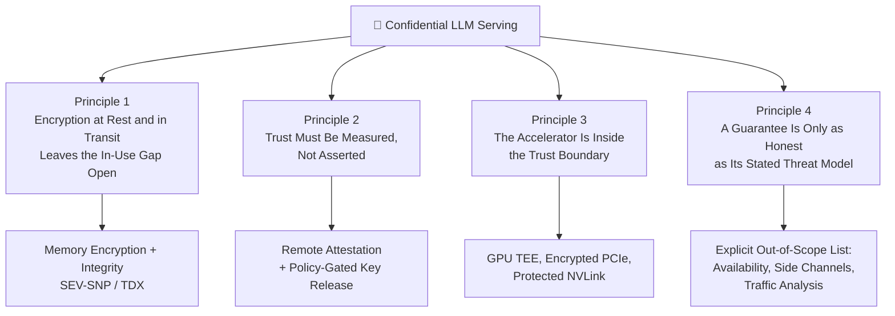
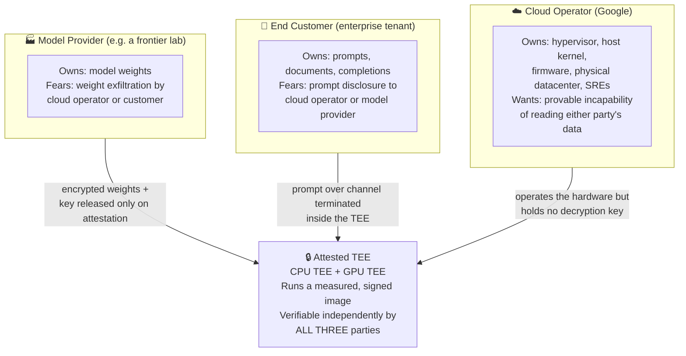

# Confidential Computing for LLM Serving: Threat Model and Comprehensive Curriculum

Serving a third-party foundation model on someone else's cloud is a problem of *conflicting distrust*. The model provider does not want the cloud operator — or the end customer — to read the weights they spent nine figures training. The end customer does not want the cloud operator — or the model provider — to read their prompts. The cloud operator wants to be able to say, credibly and to a regulator, that it is *technically incapable* of reading either. No amount of policy, contract, or IAM configuration resolves this, because every one of those controls is enforced by the party being distrusted.

Confidential computing is the set of hardware mechanisms that convert those promises into checkable claims. This textbook builds the subject from memory-encryption primitives up to a complete, adversarially-reviewed reference architecture for confidential LLM inference on GKE, covering **the three states of data and the in-use gap**, **AMD SEV-SNP and Intel TDX internals**, **remote attestation and attested key release**, **confidential GPUs**, **the Google Cloud product surface**, **the applied serving design**, and **performance, operations, and honest evaluation**.

---

## Part 1: Leading Principles

Four principles organize everything that follows. Every module is, in some sense, an elaboration of one of them.

### Principle 1: Encryption at Rest and in Transit Leaves the In-Use Gap Open

The industry solved data at rest (disk encryption, CMEK) and data in transit (TLS everywhere) two decades ago. Both solutions share a structural assumption: at some point the data is decrypted into RAM, and RAM is trusted. That assumption was defensible when the machine belonged to you. It is not defensible when the machine belongs to a cloud provider whose hypervisor, host kernel, firmware, and operations staff all sit between the DIMM and your process.

**The problem this creates for inference**: an LLM serving process is *nothing but* data in use. The weights are in RAM and HBM. The prompt is in RAM the instant TLS terminates. The KV cache — a lossy but very real encoding of the entire conversation — sits in GPU memory for the duration of the request. There is no moment in the request lifecycle where the interesting data is at rest.

**The solution**: hardware memory encryption with integrity protection, so that the ciphertext visible to the hypervisor and to a physical attacker is not decryptable by them, and cannot be replayed or remapped without detection.

### Principle 2: Trust Must Be Measured, Not Asserted

A TEE with no remote attestation is a machine that claims to be secure. A TEE *with* remote attestation is a machine that produces a hardware-signed statement of exactly what code it is running, which a remote party can verify against a reference value it chose in advance, before releasing anything sensitive to it.

The second is worth something. The first is worth nothing, because a malicious operator can simply run a normal VM and tell you it is a confidential one.

**The consequence for how you spend your time**: engineers new to this field spend it on the TEE and treat attestation as plumbing. This is backwards. The TEE is bought from AMD or Intel and works or does not. Attestation is where all the design decisions, all the operational pain, and all the actual security properties live — which is why Module 3 is the longest chapter in this book.

### Principle 3: The Accelerator Is Inside the Trust Boundary

A confidential VM protects CPU memory. An LLM does not live in CPU memory. If the weights are copied over a plaintext PCIe bus into unprotected HBM, the confidential VM has protected the least interesting copy of the data and a host-side attacker reads the rest.

**The consequence**: LLM confidential computing is not "confidential computing, applied to LLMs." It is a strictly harder problem that requires the GPU to have its own root of trust, its own attestation, its own protected memory, and an encrypted, integrity-protected channel to the CPU TEE — and it requires the verifier to check *both* pieces of evidence and bind them together. This is the single most common design error in the field.

### Principle 4: A Guarantee Is Only as Honest as Its Stated Threat Model

Confidential computing does not make a workload "secure." It moves specific, enumerable adversaries out of the trust boundary, and leaves others inside it. A design document that says "data is protected in use" without saying *from whom* and *against what* is marketing.

**The discipline this book enforces**: every architecture in these notes is followed by an explicit list of what remains exposed — availability, request timing and volume, ciphertext side channels, the fact that the customer's own client can log the plaintext, and the supply chain that produced the measured image. The last chapter of Module 6 exists solely to walk the finished reference architecture back through the adversary list and say plainly what an insider with host root can still do.

---

## Part 2: The Three-Party Trust Problem

Every design decision in this book traces back to this diagram. It is worth internalizing before Module 1.

The load-bearing word is **independently**. The architecture is only interesting if the model provider can verify the weight-decryption key was released to an environment it approved of, *without trusting Google's word for it*, and the customer can verify the prompt-handling endpoint is that same approved environment, *without trusting either Google or the model provider*. Anything less collapses back into ordinary cloud tenancy with extra steps.

---

## Part 3: Curriculum Structure and Roadmap

| Module | Filename | Key Topics Covered |
| :--- | :--- | :--- |
| **[Module 1: Foundations](01_confidential_computing_foundations.md)** | [`01_confidential_computing_foundations.md`](01_confidential_computing_foundations.md) | Three states of data; adversary taxonomy; TCB minimization; root of trust, measurement, sealing; memory encryption and integrity; process TEEs vs VM TEEs; the 3P MaaS problem statement |
| **[Module 2: Hardware TEEs](02_hardware_tee_architectures.md)** | [`02_hardware_tee_architectures.md`](02_hardware_tee_architectures.md) | AMD SEV → SEV-ES → SEV-SNP (RMP, VMPL, PSP); Intel TDX (SEAM, TDX Module, secure EPT, MRTD/RTMR); ARM CCA and RISC-V CoVE; what breaks operationally; ciphertext side channels and single-stepping attacks |
| **[Module 3: Attestation](03_remote_attestation_and_key_release.md)** | [`03_remote_attestation_and_key_release.md`](03_remote_attestation_and_key_release.md) | RATS architecture (RFC 9334); the measurement chain from RoT to container digest; evidence formats and certificate chains; freshness, revocation, TCB versioning; attested key release; RA-TLS; reproducible reference values |
| **[Module 4: Confidential GPUs](04_confidential_gpus_and_accelerators.md)** | [`04_confidential_gpus_and_accelerators.md`](04_confidential_gpus_and_accelerators.md) | Why CPU-only TEEs fail for inference; NVIDIA Hopper/Blackwell CC mode; bounce buffers, SPDM, PCIe IDE; GPU attestation, RIMs, NRAS, composite attestation; single-GPU Hopper vs multi-GPU Blackwell NVLink encryption; the overhead model |
| **[Module 5: The GCP Surface](05_google_cloud_confidential_surface.md)** | [`05_google_cloud_confidential_surface.md`](05_google_cloud_confidential_surface.md) | Confidential VM families; Confidential GKE Nodes and their GPU constraints; Confidential Space and its three-role separation; GCP attestation tokens and Workload Identity Federation; Cloud KMS/EKM key hierarchies; Confidential Space vs Confidential GKE for inference |
| **[Module 6: Applied Design](06_designing_confidential_llm_serving_on_gke.md)** | [`06_designing_confidential_llm_serving_on_gke.md`](06_designing_confidential_llm_serving_on_gke.md) | Requirements decomposition; the reference architecture; encrypted weight delivery; the cold-start budget; where TLS terminates; KV cache and prefix-cache leakage; multi-tenancy; the observability/safety tension; adversarial review |
| **[Module 7: Performance & Ops](07_performance_operations_and_evaluation.md)** | [`07_performance_operations_and_evaluation.md`](07_performance_operations_and_evaluation.md) | Benchmarking methodology; the overhead budget and cost model; debugging without SSH, core dumps, or host profilers; fleet lifecycle under attestation; compliance claims that hold and claims that don't; AWS Nitro, Azure CACI, and Apple PCC compared |
| **[Appendix A: Glossary](appendix_glossary_and_terminology.md)** | [`appendix_glossary_and_terminology.md`](appendix_glossary_and_terminology.md) | Every acronym in the book, grouped by domain, with expansions and one-line definitions |
| **[Appendix B: Reading List](appendix_reading_list.md)** | [`appendix_reading_list.md`](appendix_reading_list.md) | Annotated primary sources — vendor specs, RFCs, and the attack papers — so any claim here can be re-verified at the source |

---

## Part 4: Deep-Dive Module Breakdown

### [Module 1: Confidential Computing Foundations](01_confidential_computing_foundations.md)

1. **The Three States of Data** — why "in use" was left unsolved, and why inference is the workload that makes it unavoidable.
2. **Threat Models and the Adversary Taxonomy** — malicious co-tenant, compromised hypervisor, cloud insider with host root, physical/DMA attacker, malicious guest. What each is capable of and which mechanism addresses it.
3. **TEE Building Blocks** — hardware root of trust, measured boot, sealing, attestation reports, ephemeral memory encryption keys, AES-XTS vs AES-GCM, and why confidentiality without integrity is defeated by replay and remap.
4. **Process TEEs vs VM TEEs** — the SGX enclave model and its porting cost, the VM-TEE lift-and-shift model and its TCB cost, and why VM TEEs won for AI. Confidential containers as the Kubernetes-shaped middle ground.
5. **The Third-Party MaaS Problem, Formalized** — the four security properties, the parties each is held against, and the evaluation checklist reused in Module 6.

### [Module 2: Hardware TEE Architectures](02_hardware_tee_architectures.md)

1. **AMD SEV Lineage** — the C-bit and the memory encryption engine; SEV-ES and VMSA register protection; SEV-SNP's Reverse Map Table, `PVALIDATE`, VMPLs, guest policy, and the PSP as root of trust.
2. **Intel TDX** — SEAM mode and the TDX Module as an added TCB layer; shared vs private GPA and secure EPT; `TDCALL`/`SEAMCALL`; `MRTD` vs the runtime-extendable `RTMR0-3`; the TDREPORT → Quoting Enclave → DCAP quote path.
3. **The Rest of the Landscape** — SGX's retreat from this workload, ARM CCA Realms, RISC-V CoVE.
4. **Comparison and Operational Consequences** — TCB size, integrity model, I/O model, attestation format, GCP availability; then what stops working: live migration, ballooning, nested virtualization, huge pages, host-side profiling, kdump.
5. **Known Attacks and Residual Risk** — the ciphertext side channel family, single-stepping, TDX errata and patch cadence — framed as: *what does this do to the claim you are about to make to a model provider?*

### [Module 3: Remote Attestation and Attested Key Release](03_remote_attestation_and_key_release.md)

1. **The RATS Architecture** — Attester, Verifier, Relying Party, Endorser, Reference Value Provider; passport vs background-check models; why "who is the verifier" is a commercial question wearing a technical costume.
2. **The Measurement Chain** — hardware RoT → firmware → measurement registers → kernel/initrd/`dm-verity` → container image digest, and the three places it usually breaks.
3. **Evidence Formats and Certificate Chains** — SEV-SNP report layout, TDX quote layout, TPM quote and event log; VCEK/VLEK and the AMD KDS; Intel PCS and DCAP collateral; EAT/CoRIM normalization.
4. **Freshness, Revocation, and TCB Versioning** — nonces, replay, token lifetime, and the fleet-wide re-attestation churn that firmware updates cause.
5. **Attested Key Release** — envelope encryption of weights; policy over attestation claims; KMS-side vs verifier-side enforcement; GCP, AWS, and Azure patterns compared.
6. **RA-TLS** — binding the TLS public key into the attestation report, and why this is the only clean end-to-end guarantee for a client.
7. **Reference Values and Reproducible Builds** — the genuinely unsolved part: knowing which measurement to expect.

### [Module 4: Confidential GPUs and Accelerators](04_confidential_gpus_and_accelerators.md)

1. **Why the GPU Must Join the TCB** — an exact accounting of what leaks when the CPU is confidential and the GPU is not.
2. **NVIDIA CC Mode Internals** — CC-Off/CC-On/CC-DevTools; the on-die root of trust and GSP firmware; protected memory regions; AES-GCM encrypted bounce buffers; SPDM sessions and PCIe IDE.
3. **GPU Attestation** — device evidence, VBIOS/driver measurements, Reference Integrity Manifests, NRAS vs local verification, `nvtrust`, and composite CPU+GPU+image policy.
4. **Multi-GPU and Tensor Parallelism** — the Hopper single-GPU constraint and what it costs a large model; Blackwell's hardware-encrypted NVLink and 1/2/4/8-GPU confidential assignment.
5. **The Overhead Model** — why the cost lands on host↔device transfer rather than compute, why it shrinks as model and batch size grow, and what to actually measure.
6. **The Adjacent Ecosystem** — AMD SEV-TIO, PCIe TDISP as the standardization endpoint, and where confidential accelerators are heading.

### [Module 5: The Google Cloud Confidential Surface](05_google_cloud_confidential_surface.md)

1. **Confidential VM** — SEV, SEV-SNP, and TDX by machine family; feature gaps; regional and capacity reality; Confidential Hyperdisk and CMEK.
2. **Confidential GKE Nodes & GKE Hypercluster** — enabling it, AI Hypercomputer orchestration (LeaderWorkerSet, Kueue, DWS flex-start, GCS FUSE), node-pool constraints, and mitigating control plane risks outside your TEE.
3. **Confidential Space** — the hardened image and launcher; the workload-author / operator / data-collaborator separation; DEBUG vs PROD images; the logging escape hatches and exactly how much they cost you.
4. **Attestation on GCP** — the attestation token and its claims; the vTPM path; Workload Identity Federation attribute conditions as policy language; Cloud KMS, Cloud HSM, and EKM key hierarchies.
5. **The Supporting Cast** — Binary Authorization and Sigstore signing; Workload Identity vs Secret Manager; gVisor as an *orthogonal* threat model, not a weaker TEE.
6. **Architectural Spectrum for Inference** — Native GKE Hypercluster vs Confidential Space vs Split-Plane Hybrid: a head-to-head decision table and trade-off analysis.

### [Module 6: Designing Confidential LLM Serving on GKE](06_designing_confidential_llm_serving_on_gke.md)

1. **Requirements Decomposition** — the four properties, stated formally, each against a named adversary.
2. **The Reference Architecture on GKE Hypercluster** — GKE Hypercluster confidential accelerated node pool + NVIDIA CC mode + LeaderWorkerSet (LWS) + in-pod attestation agent + external KMS key release + L4 passthrough / HPKE payload encryption.
3. **The Encrypted Weight Pipeline** — provider-side encryption through GCS FUSE parallel streaming and multi-node tensor-parallel weight delivery into protected GPU HBM; key rotation and revocation.
4. **The Cold-Start Problem & Hypercluster Optimizations** — a latency budget for TEE boot + attestation + multi-gigabyte decrypt + GPU load, and mitigations (Dynamic Workload Scheduler flex-start, FUSE local caching, Kueue warm pools).
5. **Where TLS Terminates** — the attested-ingress problem, and why a managed L7 load balancer silently voids the guarantee.
6. **KV Cache, Prefix Caching, and Disaggregation** — why cross-tenant prefix cache reuse is a plaintext-equivalent leak, and what disaggregated serving does to your trust boundary.
7. **Multi-Tenancy** — per-tenant TEE vs shared TEE with cross-tenant continuous batching.
8. **Observability and the Safety Blind Spot** — the real conflict between confidentiality and abuse monitoring, and the three architectural responses to it.
9. **Adversarial Review** — the finished design, walked back through the Module 1 adversary list.

### [Module 7: Performance, Operations, and Evaluation](07_performance_operations_and_evaluation.md)

1. **Benchmarking Methodology** — isolating CPU-TEE cost from GPU-CC cost from attestation cost; what a fair A/B requires.
2. **The Overhead and Cost Budget** — attributable overhead by source, plus the machine-type premium and the selection constraints.
3. **Debuggability** — operating without SSH, core dumps, host profilers, or `kubectl exec`; incident response without evidence.
4. **Fleet Lifecycle** — node upgrades, TCB rollouts forcing re-attestation, key rotation under load, autoscaling with attestation on the critical path.
5. **Compliance and Positioning** — what confidential computing genuinely supports, and where the marketing outruns the mechanism.
6. **Comparative Architectures** — AWS Nitro Enclaves, Azure Confidential Containers, and Apple Private Cloud Compute as published design references.

---

## Part 5: How Each Module Is Built

Every module follows the same four-beat structure, and closes with a hands-on lab.

1. **Conceptual foundation** — the mechanism explained from first principles, with the problem it exists to solve stated before the solution.
2. **Architecture and data flow** — Mermaid diagrams for every major mechanism, plus comparison tables wherever two designs compete.
3. **Configuration and API anatomy** — the actual flags, claim names, report fields, and `gcloud` surfaces, not paraphrases of them.
4. **Production pitfalls** — what breaks, what the vendor documentation understates, and what the residual risk is.
5. **`## Lab:`** — a runnable exercise. Confidential computing does not become intuitive by reading field tables; it becomes intuitive the first time you pull a real attestation report, decode it, flip one byte of the image, and watch key release fail.

!!! warning "On labs and scale"
    The labs provision real Confidential VM, Confidential GKE, A3, and A4 GPU resources, and several of them deliberately run more than one configuration at once. That is not extravagance: nearly every claim in this course is a *difference* between two environments — confidential versus not, Hopper versus Blackwell, one verifier versus another — and a difference cannot be measured with one instance. Where a lab asks for a control, provision the control; a lab run at toy scale produces numbers that are wrong in the flattering direction rather than merely imprecise. Each lab states its scope and whether its commands have been executed against a live project or are transcribed from vendor documentation and marked unverified. Capacity, not cost, is the real constraint — confidential GPU types are region-limited, so check availability before planning a session.

Start with [Module 1: Confidential Computing Foundations](01_confidential_computing_foundations.md).
