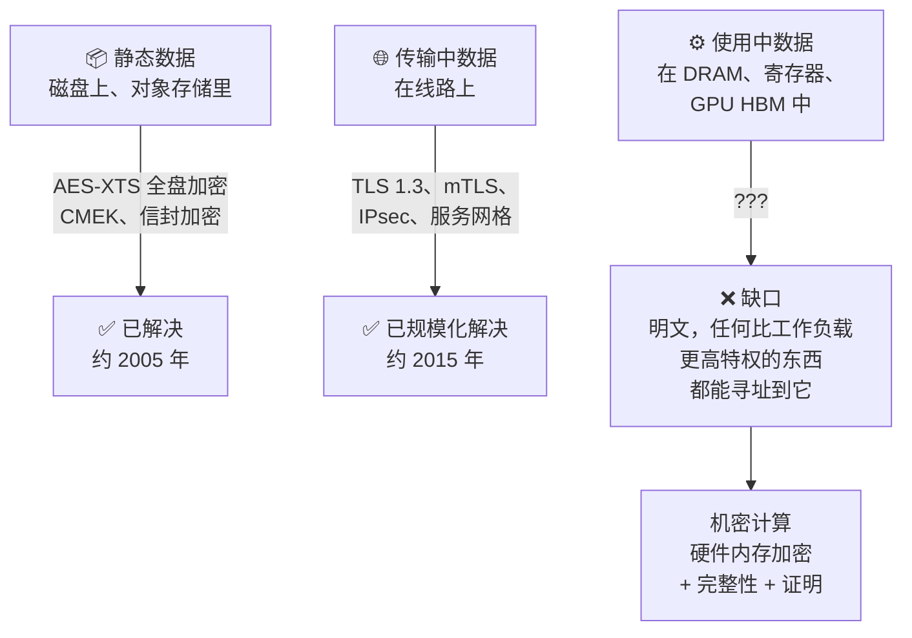
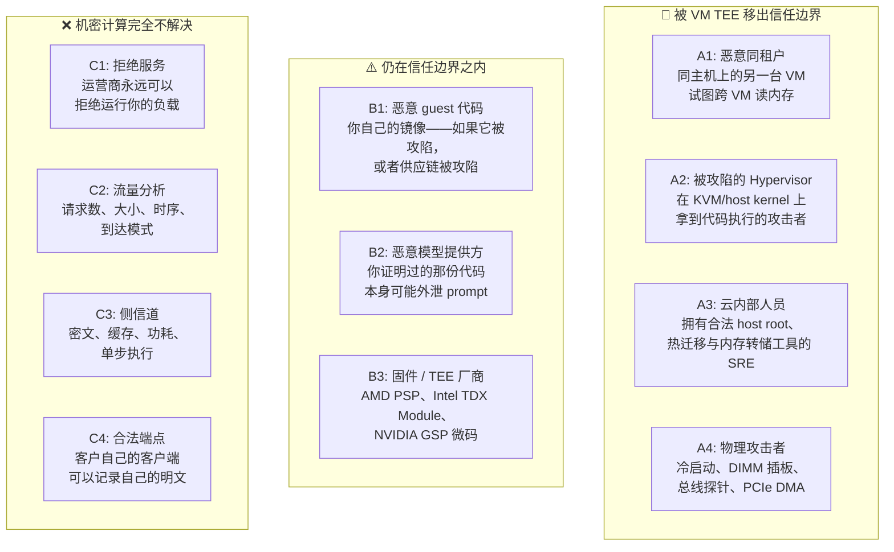
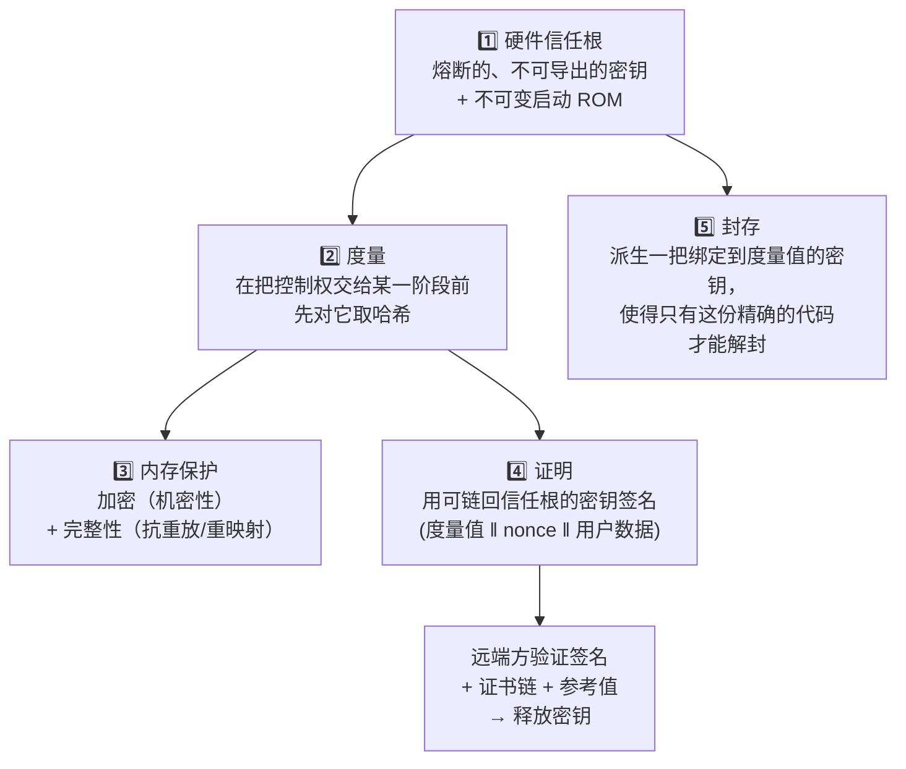
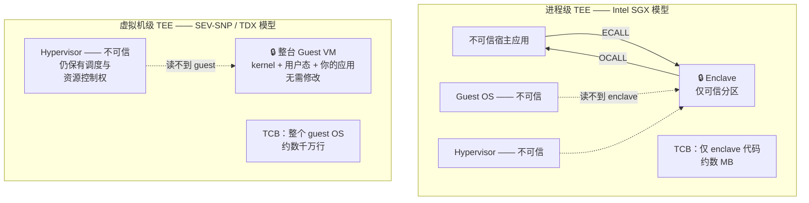
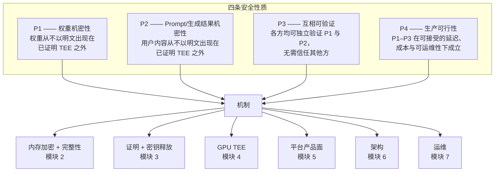

# 模块 1: 机密计算基础

机密计算是那种"词汇量很小、但精度要求很高"的领域。"可信"、"安全"、"加密"、"已证明"在厂商材料里被换着用，实际上指四件不同的事。本模块会小心地把词汇立起来，因为后面每一章都依赖它：模块 2 里关于 SEV-SNP 的论断、模块 4 里关于 GPU 证明的论断，只有在你已经清楚 TCB 究竟指什么、度量究竟度量了什么之后，才是可核验的。

本模块涵盖**数据的三种状态与 in-use 缺口为何被留下**、**攻击者分类与威胁建模的纪律**、**TEE 的构件**、**进程级 TEE 与虚拟机级 TEE**，以及**第三方 MaaS 问题的形式化陈述**——本书余下部分正是在解这个问题。

---

## 第 1 部分: 数据的三种状态

### 1.1 经典三分法，以及它藏起来的那个缺口

安全实践把数据分成三种状态，其中两种业界几十年前就收敛出了答案。



这个缺口不是疏忽，而是计算机工作方式的直接后果：CPU 无法在密文上执行运算。总有一刻，那些字节必须以明文形式出现在寄存器堆里。唯一的问题是**那一刻还有谁能看见它们**，而历史上的答案是"任何运行在更高特权级的东西"——在云主机上，这意味着 hypervisor、host kernel、固件、管理面，以及任何能物理接触到 DIMM 的人。

### 1.2 特权阶梯

"in use" 之所以难，是因为经典操作系统安全建立在**严格嵌套**的特权模型上：每一环都能检视它上面的一切。

| 层级 | 组件 | 能读 guest 内存吗？ | 归谁所有 |
| :--- | :--- | :--- | :--- |
| Ring 3 | 你的推理进程 | 仅自身 | 你 |
| Ring 0 | Guest kernel | 全部 guest 内存 | 你 |
| Ring -1 | Hypervisor (KVM) | 全部 guest 内存 | 云运营商 |
| Ring -2 | SMM / 固件 | 全部内存 | OEM + 云运营商 |
| Ring -3 | 管理引擎 / BMC | 全部内存 | OEM + 云运营商 |
| 物理层 | DIMM、PCIe 总线、插板 | 全部内存 | 谁在机房里谁就有 |

你的 guest kernel 之下的每一层，都由"不是你"的人运营。在普通云上，你接受这一点。机密计算的全部前提，就是**把这个嵌套关系反转过来**：造出一块内存区域，让**更高**特权的层次读不到它——由硅片而非软件策略来强制执行。

### 1.3 机密计算联盟的定义

机密计算联盟（CCC）的工作定义值得逐字引用，因为每个子句都承重：

> 机密计算是通过在基于硬件的、已证明的可信执行环境中执行计算，来保护使用中的数据。

- **使用中的数据** —— 指上面那个状态，不是磁盘或传输加密的换个说法。
- **基于硬件** —— 由 CPU/SoC 强制执行，而不是靠 hypervisor 承诺自己会守规矩。纯软件沙箱不算机密计算，无论它做得多好。
- **已证明** —— 环境能够向远端方**证明**自己是什么。去掉这个子句，定义就会容纳"相信我，这是个 TEE"，而那毫无价值（原则 2）。
- **可信执行环境** —— 一块特定的、有边界的区域，而不是整台机器。

一个好用的检验方法：如果一句厂商论断在删掉"已证明"三个字之后仍然成立，那它多半是市场文案。

### 1.4 为什么推理是那个逼出问题的负载

大多数负载的"静态数据 : 使用中数据"比例都很舒服。数据库在磁盘上放几 TB，缓冲池里只有几 GB；加密磁盘就覆盖了大部分暴露面。LLM 推理把这个比例彻底倒过来了：

| 资产 | 请求期间它在哪 | 处于静态吗？ |
| :--- | :--- | :--- |
| 模型权重 | 整份常驻 GPU HBM，进程生命周期内一直是热的 | 仅在首次加载前 |
| Prompt | TLS 一终结就以明文在 host RAM；随后 tokenize 进设备内存 | 从不，除非你把它记了日志 |
| KV cache | 请求期间在 GPU HBM（开了 prefix caching 还会更久） | 从不 |
| 生成结果 | host RAM 与响应缓冲区，逐 token 流式输出 | 从不 |

请求生命周期中**不存在**任何一个"有价值的数据处于静态"的时刻。磁盘加密保护的是躺在 bucket 里的模型 checkpoint，**以及其他任何不重要的东西**。这就是为什么 LLM 服务比任何其他负载都更彻底地把机密计算从一个合规勾选项拖成了一项功能性需求。

---

## 第 2 部分: 威胁模型与攻击者分类

### 2.1 给攻击者命名

脱离攻击者谈"使用中受保护"没有意义。下面这套分类贯穿全书；书中每个架构都要拿它来评估。



### 2.2 每类攻击者到底能干什么

#### 1. A1 —— 恶意同租户

历史上最常被拿来说的云风险，也是**在机密计算之前**就已经被处理得最彻底的一类：硬件虚拟化、IOMMU 和 EPT/NPT 早已阻止一个 guest 寻址另一个 guest 的内存。机密计算在这里增加的是纵深防御；但如果这是你唯一的攻击者，你不需要 TEE。**如果一份设计文档论证机密计算的唯一理由是"多租户隔离"，那它还没有识别出真正的需求。**

#### 2. A2 —— 被攻陷的 Hypervisor

第一个真正需要新硬件的攻击者。历史上，hypervisor 逃逸或 host kernel 漏洞会让攻击者拿到这台机器上每一个 guest 的明文。在 SEV-SNP 或 TDX 下，hypervisor 仍然对 guest 保有完整**控制权**——它能调度它、停掉它、不给它内存——但它能读到的内存是密文，而密钥不在它手里。

**控制权**与**机密性**的这一区分是本领域最重要的不对称性，而且它到处复现：hypervisor 被**刻意**保留在资源管理的位置上（正是这一点让 VM TEE 变得可用），同时被**刻意**挡在数据之外。

#### 3. A3 —— 云内部人员

从商业上说，这才是那个要紧的攻击者。一个模型提供方在决定是否把权重放到 Google Cloud 上时，首要担心的不是 hypervisor 0-day，而是"某种 Google 员工 + 法律程序 + 内部工具的组合，是否可能产出一份权重副本"。机密计算真正的产品，是一个**技术性**回答——"解密那些权重所需的密钥，只会释放给一个度量值与你事先选定的值匹配的环境，而没有任何 Google 流程持有该密钥"——而不是一个**策略性**回答。

注意这里有个锋利的边：这只在密钥释放策略由模型提供方信任的东西来执行时才成立。如果提供方的密钥放在 Google 托管的 KMS 里、受 Google 控制的 IAM 策略管辖，那么这个保证比放在提供方自运营的外部密钥管理器里要**弱得多**。模块 3 会详细回到这一点。

#### 4. A4 —— 物理攻击者

冷启动攻击、DIMM 插板、总线探针。内存加密直接应对这些，而且确实强：DRAM 内容是密文，在 SEV-SNP 或 TDX 下还带完整性保护，因此插板无法在不被发现的情况下注入或重放数值。残余暴露面是访问**模式**，以及——特别针对 SEV-SNP——明文与密文之间那种确定性关系，密文侧信道正是利用它（模块 2 第 5 部分）。

#### 5. B1/B2 —— enclave 内部的代码

本领域最常被误解的一点：**TEE 保护的是工作负载不受平台侵害；它完全不保护任何人不受工作负载侵害。** 如果你的推理服务有个 bug 会把 prompt 写到外部日志端点，TEE 会忠实地保护这份外泄数据在出去的路上不被 hypervisor 看见。如果模型提供方的容器本就设计成把客户 prompt 回传，那么证明只能说明它正在运行**提供方发布的那个精确镜像**——而那恰恰就是会回传的那个镜像。

这就是为什么证明策略与镜像透明性不是可选的附加项。证明给你的保证是"你在和镜像 `sha256:abc…` 对话"。至于镜像 `sha256:abc…` 是否配得上你的 prompt，是一个**独立**的问题，必须由源码可得性、可复现构建或第三方审计来回答。模块 3 第 7 部分与模块 6 第 8 部分都活在这个缺口里。

#### 6. B3 —— TEE 厂商

每个 TEE 都有一个不可约减的厂商信任根。在 SEV-SNP 下你信任 AMD 的 PSP 固件和 AMD 熔进芯片的那把密钥；在 TDX 下你信任 Intel TDX Module 和 Intel 的配置服务；在 NVIDIA CC 下你信任 GPU 出厂熔断的签名私钥和 GSP 固件。这无法去除；诚实的姿态是在设计文档里**点名**它，而不是假装信任链是空的。

#### 7. C1–C4 —— 永久不在范围内

这几条值得和那些保护同样大声地讲出来，因为暗示相反结论的设计是不诚实的：

- **可用性**：运营商永远可以拒绝调度，或者干脆断电。机密计算是机密性与完整性技术，从来不是可用性技术。
- **流量分析**：请求数、载荷大小、token 间时序、到达模式，host 全都看得见。对 LLM 来说，从 TEE 外部观测到的 token 生成时序是一种真实的信息泄露——输出长度直接可观测，而且已有公开研究从流式响应的包大小中恢复信息。
- **侧信道**：见模块 2 第 5 部分。真实存在、仍在被积极研究，且通常不在厂商的威胁模型里。
- **合法端点**：如果客户自己的应用把 prompt 记进自己的可观测性栈，任何云侧机制都帮不上忙。

### 2.3 TCB 最小化作为一种设计纪律

**可信计算基（TCB）** 是那批"一旦被攻破，保证即失效"的组件集合。不是"你喜欢的组件"，而是"其失效即致命的组件"。

这套纪律是机械的：枚举每一个组件，问"如果它是恶意的，保证还成立吗？"，答案为否则它在 TCB 里。然后把这份清单压到你能忍受的最短。

| 组件 | 在 Confidential GKE 推理 Pod 的 TCB 里吗？ | 备注 |
| :--- | :--- | :--- |
| CPU 硅片 + 微码 | **是** | 不可约减 |
| AMD PSP / Intel TDX Module | **是** | 不可约减；注意 TDX Module 是**额外**进 TCB 的软件 |
| Guest 固件 (OVMF) | **是** | 被度量进 launch measurement |
| Guest kernel + initrd | **是** | 这正是 VM-TEE 权衡的核心代价 |
| Guest 用户态 + 容器镜像 | **是** | 包括你 `pip install` 的每一个依赖 |
| GPU 硅片 + GSP 固件 + VBIOS | **是**（若 GPU 持有明文） | 模块 4 |
| Hypervisor / host kernel | **否** | 被 SEV-SNP / TDX 移出 |
| 云控制面、IAM、编排 | 机密性上**否**，可用性上**是** | 能拦住你，读不到你 |
| Kubernetes 控制面 | 数据上**否**，"调度什么"上**是** | 模块 5 第 2 部分 |

让人不舒服的是"guest kernel + 用户态"那一行。VM TEE 把一整个 Linux 发行版、你的 Python 环境和每一个传递依赖都塞进了 TCB，规模是数千万行。这是实打实的代价，是为了能跑未经修改的软件而**刻意**接受的——见第 4 部分。

---

## 第 3 部分: TEE 的构件

无论哪家厂商，每个 TEE 都由同样的五种原语组装而成。认出这五种原语之后，模块 2 就只是"看 AMD 和 Intel 各自**怎么**实现它们"，而不是学两套互不相干的架构。



### 3.1 硬件信任根

一个在制造时熔进硅片的不可导出秘密，加上运行在任何可变代码之前的不可变启动代码。在 AMD 上这是 Platform Security Processor；在 Intel 上是微码、TDX Module 加载器与配置密钥层级的组合；在 NVIDIA Hopper 或 Blackwell GPU 上，是一把出厂熔断、从不暴露给软件、固件或主机的每设备私有签名密钥。

有两个性质要紧，而且经常被混淆：

- **不可导出** —— 没有任何软件路径能读出这把密钥，只能**使用**它。这正是设备身份有意义的原因。
- **有背书** —— 厂商发布证书链，断言对应公钥属于一颗真品。没有背书，签名只能证明"某个东西"签过它。是证书链把一个签名变成"一颗处于 SNP 模式的真品 AMD EPYC 签了它"。

### 3.2 度量与度量启动

**度量**是代码与配置的密码学哈希，在该代码被赋予控制权**之前**记录下来。度量启动把它们串起来：每一阶段度量下一阶段，把哈希写进受保护寄存器，然后跳转。

关键性质是度量寄存器**只可追加**。你不能设置它，只能扩展它：

$$
\text{PCR}_{new} = \text{SHA256}\left(\text{PCR}_{old} \,\|\, \text{measurement}\right)
$$

这正是这条链从内部无法伪造的原因：在被度量**之后**才拿到控制权的恶意代码，无法把寄存器回滚以隐藏自己。它只能继续扩展，而那会产出一个与合法启动路径不同的终值——不同即拒绝。

还有一组贯穿全书的区分：

| | **Launch measurement（启动度量）** | **Runtime measurement（运行时度量）** |
| :--- | :--- | :--- |
| 例子 | SEV-SNP launch digest、TDX `MRTD` | TDX `RTMR0-3`、TPM `PCR` 扩展 |
| 固定于 | VM 启动时，此后不可变 | 启动与运行期间可继续扩展 |
| 覆盖 | 初始内存镜像、固件、VMSA | kernel、initrd、rootfs、容器摘要 |
| 验证方用途 | "这是我批准的那个镜像吗？" | "它之后又加载了什么？" |

两者单独都不够。只有 launch measurement 而没有运行时度量，只能告诉你固件是对的，却说不清它启动了什么；只有运行时度量而没有 launch measurement，则没有锚点。

### 3.3 内存保护：加密是必要的，但不充分

内存加密使用一把由内存控制器持有、按 VM 生成、从不暴露给软件的密钥——不暴露给 guest，更不暴露给 hypervisor。出到 DIMM 上的是密文，明文只存在于 SoC 内部。

微妙之处在于**操作模式**，而它解释了一整类真实漏洞：

- **AES-XTS**（用于内存加密，也用于磁盘）是一种以物理地址为 tweak 的可调分组密码。它保长且确定：同一地址上的同一明文永远产出同一密文。保长是强制的——内存加密引擎不能把 64 字节膨胀成 80 字节，因为 DIMM 上没有多余的地方放这些字节。
- **AES-GCM**（用于 GPU 机密计算中的 **PCIe** 路径，模块 4）带认证且非确定，但会以 nonce 和 tag 膨胀数据。这在总线上负担得起——你可以多发字节；在 DRAM 里则负担不起——你不能。

确定性正是**密文侧信道**所利用的：能反复读取密文的攻击者，可以判断一个明文值何时发生了变化、何时又回到了此前见过的值。模块 2 第 5 部分讲后果。

下面是常被跳过的部分。**仅有加密，挡不住一个控制着内存系统的攻击者**，因为有两类攻击根本不需要解密：

1. **重放** —— 在 $t_0$ 时刻记录某页的密文，在 $t_1$ 时刻把它写回去。guest 会成功解密，因为它确实是在正确地址上用正确密钥合法加密过的。你刚刚回滚了 guest 的状态——比如把一个"登录失败，锁定账户"的计数器倒了回去。
2. **重映射 / 别名** —— 把 guest 物理地址 $X$ 重新指向合法存在于地址 $Y$ 的密文。在带地址 tweak 的 XTS 下这通常产出垃圾，但 hypervisor 同样可以直接**把两个 guest 页别名到同一个物理页**，从而观测或诱发损坏。

要挫败这两类攻击，需要**完整性与归属追踪**——而这恰恰就是 AMD SEV-ES 与 SEV-SNP 之间的差别（反向映射表 RMP），也是 Intel TDX 通过 secure EPT 与 TDX Module 提供的东西。带进模块 2 的一句话总结是：

> **SEV/SEV-ES 给了机密性。SEV-SNP 与 TDX 补上了完整性。只有第二代才防得住一个主动作恶的 hypervisor，而不只是一个好奇的 hypervisor。**

### 3.4 证明

证明就是 TEE 对一个结构体签名，把以下几项绑在一起：

$$
\text{Report} = \text{Sign}_{K_{RoT}}\Big( \text{measurement} \,\|\, \text{platform state} \,\|\, \text{nonce} \,\|\, \text{user data} \Big)
$$

这四个输入各司其职，去掉任何一个都会坏掉某样东西：

| 字段 | 作用 | 缺了它会坏什么 |
| :--- | :--- | :--- |
| 度量值 | **在跑什么代码** | 验证方对工作负载一无所知 |
| 平台状态 | 固件版本、TCB/SVN、调试标志、策略位 | 你会接受一个开着调试或跑着已知漏洞固件的环境 |
| Nonce | 新鲜性 | 可以重放一份来自某台此后已被攻陷的机器的旧报告 |
| 用户数据 | 把一个应用层数值（通常是公钥哈希）绑进报告 | 报告证明了一台机器，但没证明**你正在通话的那条通道** |

最后一行是最常被漏掉的，而它正是 RA-TLS 的全部要义：不把 TLS 公钥绑进报告，攻击者就能中继一份来自真实 TEE 的真实报告，同时把你的连接终结在别处。见模块 3 第 6 部分。

### 3.5 封存

封存从信任根**并且**当前度量值派生出一把加密密钥：

$$
K_{seal} = \text{KDF}\left(K_{RoT},\ \text{measurement},\ \text{context}\right)
$$

因为度量值是输入之一，被某个代码版本封存的数据，无法被同一台机器上的**不同**代码解封。它是"基于证明的密钥释放"的本地版本，也是机密负载得以在本地磁盘缓存已解密状态、却不用把密钥交给运营商的办法。它同样有一个锋利的运维边：**更新镜像，你就失去了在旧度量值下封存的一切。** 这是特性，也是为什么封存的本地缓存需要迁移方案（模块 6 第 4 部分）。

---

## 第 4 部分: 进程级 TEE 与虚拟机级 TEE

### 4.1 两种架构



### 4.2 诚实地陈述这个权衡

| 维度 | 进程级 TEE (SGX) | 虚拟机级 TEE (SEV-SNP / TDX) |
| :--- | :--- | :--- |
| TCB 体量 | 小 —— 仅 enclave 分区 | 大 —— 整个 guest OS 与用户态 |
| 移植成本 | 高 —— 拆分应用、定义 ECALL/OCALL 边界、不能直接系统调用 | 约为零 —— 现有镜像平迁 |
| 内存上限 | 历史上受 EPC 限制；对模型权重来说是硬墙 | 完整 VM 内存，数百 GB |
| 设备/加速器访问 | 非常别扭 —— enclave 无法直接访问设备 | 正常 —— 直通可用，这正是机密 GPU 得以成立的前提 |
| 证明粒度 | 恰好是 enclave 二进制 | 整个 VM 镜像 + 运行时度量 |
| 大 TCB 的失效模式 | 无关用户态里的 bug 在 TCB 之外 | guest 内**任意**组件的 bug 都在 TCB 之内 |

### 4.3 为什么 VM TEE 在 AI 场景胜出

四条理由，按重要性降序：

1. **加速器。** SGX enclave 没有干净的办法拥有一个 PCIe 设备。机密 GPU 计算要求把设备指派给机密 guest，并在两者之间协商一条安全会话——这是个 VM 形态的操作。仅此一条就为 LLM 服务定了案。
2. **内存。** 一个 bf16 的 70B 模型光权重就约 140 GB。受加密页缓存限制的进程级 TEE 从来就没进过这场比赛。
3. **软件栈的现实。** 推理栈是 CUDA、PyTorch、NCCL、vLLM 和一大棵 Python 依赖树。把它拆分进一个小可信 enclave 不是工程项目，是重写。
4. **运维熟悉度。** 机密 VM 启动的是普通镜像、跑的是普通 kubelet、加入的是普通集群。这正是为什么 "Confidential GKE Nodes" 可以近似于节点池上的一个开关，而不是一个全新的计算产品。

代价是 TCB。你在断言整个 guest 镜像值得信任，这把安全问题从**隔离**转移到了**供应链**——于是镜像签名、可复现构建和最小基础镜像不再是卫生习惯，而成了承重结构（模块 3 第 7 部分）。

### 4.4 机密容器：Kubernetes 形态的折中方案

在"你自管的机密 VM"与"你要为之重写的机密 enclave"之间，还有第三种模型，之所以相关是因为部署目标是 Kubernetes。

思路是：用 Kata 风格的 VM-per-pod 运行时，把每个 Pod（或每个 Pod sandbox）跑在自己的轻量 VM TEE 里，使**Pod** 而非**节点**成为机密性的单位。kubelet 与节点代理留在信任边界之外。这就是 Azure 机密容器与 CNCF Confidential Containers 项目背后的模型。

它与 Confidential GKE Nodes 模型的对比很要紧，模块 5 会展开：

| | **机密节点**（今天的 GKE） | **机密 Pod 沙箱**（CoCo 模型） |
| :--- | :--- | :--- |
| 机密性单位 | 整个节点 | 单个 Pod |
| kubelet / 节点代理 | 在 TEE 内 | 在 TEE 外 |
| 谁能 exec 进你的负载 | 任何有节点级访问权的人，受 k8s RBAC 约束 | 被沙箱边界挡住 |
| 证明身份 | 节点镜像 | Pod 的容器镜像 |
| GCP 上的成熟度 | 已可用 | 非产品化路径 |

对一份 GKE 设计的诚实总结是：**Confidential GKE Nodes 把 kubelet 放进了你的 TCB。** 如果你的威胁模型包含"由云厂商运营的 Kubernetes 控制面可以在我的负载旁边调度一个调试容器"，那么单靠机密节点解决不了它，你需要 Confidential Space 或 Pod 级沙箱。模块 5 第 6 部分会明确做这个决策。

---

## 第 5 部分: 第三方 MaaS 问题的形式化

### 5.1 四条性质

模块 2 到 7 的全部内容，都是为了确立下面这四条陈述。它们就是模块 6 复用的那份评估清单。



精确陈述，每条各自点名对抗方：

- **P1 —— 权重机密性。** 模型权重仅在其度量值经模型提供方事先批准的 TEE 内部以明文存在。**对抗：**云运营商（A2、A3、A4）与终端客户。
- **P2 —— Prompt 与生成结果机密性。** 用户内容仅在这样的 TEE 内部以明文存在。**对抗：**云运营商（A2、A3、A4），以及——这条才难——写了那份正在处理它的代码的模型提供方。
- **P3 —— 互相可验证。** 各方均可基于扎根于硅片厂商证书的证据来验证 P1 与 P2，不依赖任何其他方的断言。**这条性质在大多数设计里都是无声失效的**，通常是因为验证方由被怀疑的那一方运营。
- **P4 —— 生产可行性。** 以上全部在有竞争力的 TTFT 与吞吐下成立，冷启动可接受，而且你真的拿得到那批硬件的容量。

### 5.2 "Google 看不到权重"在技术上必须意味着什么

这句市场话术可以分解成六条可核验的论断。每一条都是本书的一章。

| 论断 | 机制 | 在哪展开 | 缺了它的失效模式 |
| :--- | :--- | :--- | :--- |
| 权重以 Google 不持有的密钥静态加密 | 提供方控制的 KMS/EKM、信封加密 | M3.5、M6.3 | Google 的 KMS 管理员能解密；性质退化为策略 |
| 权重仅在 TEE 内部被解密 | 基于证明的密钥释放 | M3.5 | 运营商可以在任何地方解密它们 |
| TEE 运行的正是被批准的那个镜像 | 启动 + 运行时度量、参考值 | M3.2、M3.7 | 证明只证明了"一个 TEE"，而非"正确的代码" |
| 存放权重的 host RAM 不可读 | SEV-SNP / TDX 内存加密 + 完整性 | M2 | 一次 host 内存转储就读走了 |
| 存放权重的 GPU HBM 不可读 | GPU CC 模式、受保护内存、加密 PCIe | M4 | 最有价值的那份副本是明文的 |
| 提供方能自行验证以上全部 | 独立验证方、厂商证书链 | M3.1、M3.3 | "Google 说证明通过了"——一文不值 |

满足六条中的五条，等于一条都不满足，因为攻击者会攻击缺的那条。这份清单是本模块最有用的产物；本书余下部分就是它中间那一列的展开。

### 5.3 最难的那条性质，以及为什么难

**对抗模型提供方**的 P2 是真正困难的那条，在模块 6 尝试解它之前值得先弄清楚为什么难。

模型提供方写了推理代码。这份代码按构造就持有明文 prompt——它必须持有，否则跑不了模型。所以"对抗提供方的 P2"不可能通过对代码隐藏 prompt 来实现，只能通过约束这份代码**能拿它做什么**来实现：不许出网、不许持久化、不许记录内容日志，以及——最关键的——一份由客户验证的证明策略，针对一个客户能以某种方式评估其行为的镜像。

最后这个依赖无法回避，值得直说：**证明把"信任提供方的意图"降级成了"信任提供方发布的镜像"，但它不能把这件事降到零。** 要闭合剩下的缺口，需要硬件之外的透明性机制——可复现构建、公开源码、二进制透明日志、第三方审计。Apple 的 Private Cloud Compute 是这方面最完整的公开尝试，模块 7 第 6 部分会考察它做了哪些一份直白的 GKE 设计没做的事。

---

## Lab: 让 TEE 自己现形

**目标**：并排启动一台基线 VM、一台 AMD SEV-SNP VM 和一台 Intel TDX VM，从每个 guest 内部找出差别，然后实测机密内存在启动阶段到底要付出多少代价。要点在于确立"TEE 是可观测的，而不是一个只体现在账单上的抽象"，并且它的开销是可测量的，而不是口口相传的传说。

**规模**：四台实例全部同时开出来，包括那台大内存的。两家厂商并排跑才是重点——只启动 SEV-SNP 的实验教给你的是 AMD，而不是机密计算。**状态**：命令转录自 Google Cloud 文档；请用你本地 `gcloud compute instances create --help` 核对 flag 名称。

### 第 1 步 —— 看清你的项目实际能跑什么

```bash
# 哪些 zone 提供支持 SEV-SNP 与 TDX 的机型族
gcloud compute machine-types list --filter="name~'^n2d-standard' OR name~'^c3-standard'" \
  --format="table(name, zone, guestCpus, memoryMb)" | head -40

# 确认你的 gcloud 支持哪些 confidential-compute flag 取值
gcloud compute instances create --help | grep -A 10 "confidential-compute-type"
```

### 第 2 步 —— 启动一台基线（非机密）VM

```bash
gcloud compute instances create cc-lab-baseline \
  --machine-type=n2d-standard-2 \
  --zone=us-central1-a \
  --image-project=ubuntu-os-cloud \
  --image-family=ubuntu-2404-lts-amd64
```

### 第 3 步 —— 启动一台 AMD SEV-SNP 机密 VM

```bash
gcloud compute instances create cc-lab-snp \
  --confidential-compute-type=SEV_SNP \
  --machine-type=n2d-standard-2 \
  --min-cpu-platform="AMD Milan" \
  --maintenance-policy=TERMINATE \
  --zone=us-central1-a \
  --image-project=ubuntu-os-cloud \
  --image-family=ubuntu-2404-lts-amd64
```

注意 `--maintenance-policy=TERMINATE`。SEV-SNP 实例无法热迁移，因此主机维护会停掉实例而不是迁走它。这不是 CLI 的怪癖——这是该架构的第一个具体运维后果，模块 2 第 4 部分会解释为什么完整性保护与热迁移在根本上相互冲突。

### 第 4 步 —— 启动一台 Intel TDX 机密 VM

```bash
gcloud compute instances create cc-lab-tdx \
  --confidential-compute-type=TDX \
  --machine-type=c3-standard-4 \
  --maintenance-policy=TERMINATE \
  --zone=us-central1-a \
  --image-project=ubuntu-os-cloud \
  --image-family=ubuntu-2404-lts-amd64
```

两家厂商同时在你自己的项目里跑着。模块 2 里几乎每一处对比，你现在都可以直接核验，而不必照单全收——而且那些差异并不是表面功夫。把这两台留着别删，模块 2 的实验会分别从它们身上拉一份证明报告。

### 第 5 步 —— 问每个 guest：你是什么

在三台机器上都执行：

```bash
# 内核在启动时会记录内存加密状态
sudo dmesg | grep -i -E 'sev|tdx|memory encryption|ccp'

# CPU 特性标志
lscpu | grep -i -E 'sev|tdx|flags' | tr ' ' '\n' | grep -i -E 'sev|tdx'

# 是否存在 guest 证明设备？
ls -l /dev/sev-guest /dev/tdx_guest 2>/dev/null
```

**预期差异**：在基线 VM 上，`dmesg` 那条 grep 是空的，两个设备节点都不存在。在 SEV-SNP VM 上，你应当看到一行报告内存加密已激活（通常形如 `Memory Encryption Features active: AMD SEV SEV-ES SEV-SNP`），以及字符设备 `/dev/sev-guest`。在 TDX VM 上，你看到的则应是一行点名 Intel TDX 的日志，以及设备 `/dev/tdx_guest`。

两家不同的厂商，两个不同的设备名，两条不同的内核日志——以及一个完全相同的架构思想。写下那句对两个 guest 都成立、而对基线不成立的话。整门课就建立在那句定义之上。

这些设备节点用一个文件概括了模块 3 的全部主题：它们是 guest 向硬件索取一份签名证明报告的唯一通道。

### 第 6 步 —— 实测机密内存在启动阶段的代价

第 3.3 节说过，私有内存必须由 guest 显式接受后才能使用；模块 2 第 4 节则会断言这项开销与内存大小成正比。这个断言通常是被复述的，而不是被测量的。去测它。

```bash
# 一台大内存 SEV-SNP VM —— 要接受几百 GB 的内存
gcloud compute instances create cc-lab-snp-large \
  --confidential-compute-type=SEV_SNP \
  --machine-type=n2d-standard-224 \
  --min-cpu-platform="AMD Milan" \
  --maintenance-policy=TERMINATE \
  --zone=us-central1-a \
  --image-project=ubuntu-os-cloud \
  --image-family=ubuntu-2404-lts-amd64
```

在小的和大的机密 VM 上，分别对比启动时间花在了哪里：

```bash
systemd-analyze                    # firmware / loader / kernel / userspace 的拆分
systemd-analyze blame | head -20   # 哪些 unit 占大头（如果有的话）

# 早期启动阶段的内存工作会出现在这里，那时 userspace 还不存在
sudo dmesg | grep -i -E 'memory|accept|pvalidate|e820' | head -30
```

**要记录什么**：8 GB 与 896 GB 两台机密 guest 之间，firmware 阶段与 kernel 阶段的差值；以及同样两种规格的非机密机器上的同一差值，作为对照组。对照组才是让这个数字有意义的东西：大 VM 本来就启动得更慢，你要的是机密计算特有的那一部分，而不是两者之和。

把这个数字带走。它会作为一个条目重新出现在模块 6 的冷启动预算里，在那里它与数 GB 权重解密争夺同一个延迟额度——在那里，把它估错两倍就会改变整个自动扩缩容的设计。

### 第 7 步 —— 确认那个否定结果

这个实验有意思的部分在于你*看不到*什么。从任一机密 guest 内部，都没有任何 API 能吐出内存加密密钥；从主机侧，也没有受支持的路径能读到 guest 明文。试着用一句话说清楚：你刚刚排除掉的是 §2.1 中的哪一类攻击者——以及还有哪四类没有排除。

### 第 8 步 —— 清理

```bash
gcloud compute instances delete cc-lab-baseline cc-lab-snp-large --zone=us-central1-a --quiet
```

留着 `cc-lab-snp` 和 `cc-lab-tdx`——模块 2 的实验会分别从它们身上拉一份真实的证明报告，而搭建成本你已经付过了。

---

## 总结: 基础概念清单

| 概念 | 一句话 | 在哪里回来 |
| :--- | :--- | :--- |
| **in-use 缺口** | CPU 无法在密文上计算，所以明文必然存在于某处；问题只是那一刻还有谁看得见 | 全书 |
| **控制权 vs 机密性** | VM TEE 刻意把资源控制权留给 hypervisor，同时把它挡在数据之外 | M2.1、M2.2 |
| **TCB** | 一旦被攻破即致命的组件集合；VM TEE 用一个大 TCB 换来了零移植成本 | M2.4、M3.7 |
| **度量** | 在控制权移交前记录的只可追加哈希链；从内部无法伪造 | M3.2 |
| **加密 ≠ 完整性** | 只有机密性会放过重放与重映射；SEV-SNP 与 TDX 补上了缺的那一半 | M2.1、M2.2 |
| **证明绑定四样东西** | 度量值、平台状态、nonce、用户数据——去掉任一条都会坏掉一个具体性质 | M3.1、M3.6 |
| **封存** | 从度量值派生的密钥，使新代码读不到旧秘密 | M6.4 |
| **TEE 不保护你免受工作负载侵害** | 证明只证明**哪个**镜像在跑，从不证明这个镜像是良性的 | M3.7、M6.8 |
| **四条性质 P1–P4** | 权重机密性、prompt 机密性、互相可验证、生产可行性 | M6.1、M6.9 |
| **六论断分解** | "Google 看不到权重"是六条独立可核验的论断；六中之五等于零 | M6.9 |

词汇固定下来之后，接下来的问题就很机械了：AMD 和 Intel 究竟如何构建 §3.3 的内存保护与 §3.2 的度量原语？它们的证明报告里有什么？打开这些开关之后又有什么会停止工作？这就是**模块 2: 硬件 TEE 架构 (`02_hardware_tee_architectures.md`)**。
