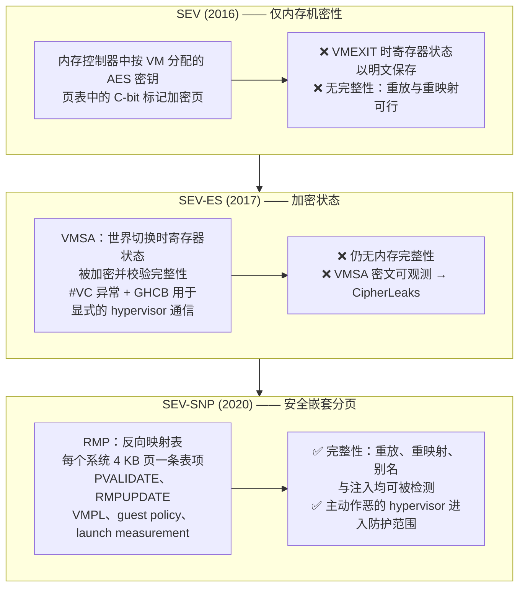
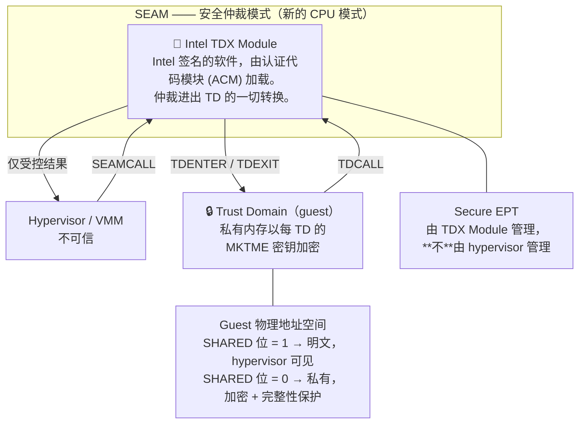
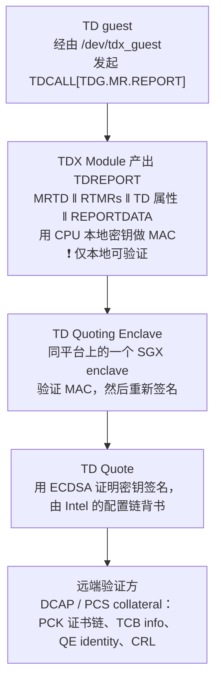
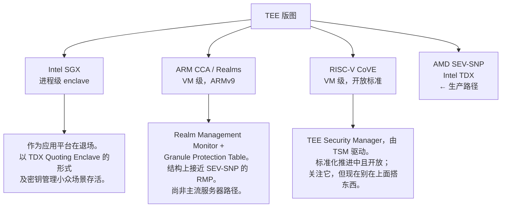

# 模块 2: 硬件 TEE 架构

模块 1 确立了 VM TEE 需要五种原语：信任根、度量、内存加密、完整性、证明。本模块考察 AMD 与 Intel 究竟如何构建它们。目标不是把两套指令集扩展讲成百科全书——而是让你在读到一句厂商论断、一个证明报告字段或一份事件公告时，能准确知道它指的是哪个机制、以及它**没有**覆盖什么。

本模块涵盖 **AMD SEV 谱系与 SEV-SNP 完整性模型**、**Intel TDX 及其额外的 TCB 层**、**TEE 版图的其余部分**、**打开这些开关后运维上会坏掉什么**，以及**已公开的攻击对你的安全论断意味着什么**。

---

## 第 1 部分: AMD SEV 谱系

AMD 的机密计算出了三代，代际差异不是营销增量——每一代都封堵了模块 1 §3.3 里的一类具体攻击。你在哪一代上，决定了你实际排除掉了哪个攻击者。



### 1.1 SEV：C-bit 与内存加密引擎

基础机制很简单，自 2016 年起没变过。每台机密 VM 被分配一个 **ASID**（地址空间标识符），AMD 安全处理器把该 ASID 对应的 AES 密钥编程进内存控制器。密钥在安全处理器内部生成、从不外流，guest、hypervisor 以及任何软件都读不到它。

哪些页会被加密由 **C-bit** 控制——这是一个物理地址位（在典型 EPYC 上是 bit 47），由 guest 在**自己的**页表里设置。带 C-bit 映射的页用该 VM 的密钥加密；不带 C-bit 的页是明文，guest 正是用这种方式**刻意**建立 I/O 共享缓冲区。

$$
\text{DRAM}[pa] = \text{AES-XTS}_{K_{ASID}}\big(\text{plaintext},\ \text{tweak} = f(pa)\big)
$$

由此立刻得到两个后果，两个后面都要紧：

1. **由 guest 决定什么是机密的。** guest 想 DMA 给设备的任何数据，都必须放进**共享**（C-bit 清零）页。这就是为什么机密 VM 里的设备 I/O 需要 bounce buffer——guest 把数据从私有内存拷进共享 bounce buffer，设备再从那里 DMA。模块 4 会说明机密 GPU 就是这同一套机制，只是在 bounce 路径上再加了一层加密。
2. **tweak 是物理地址的函数。** 这使得密文按地址确定，也正是密文侧信道的根源（§5.1）。

初代 SEV 有个显眼的漏洞：`VMEXIT` 时，guest 的寄存器状态以**明文**写入 VMCB，hypervisor 可以随意读写。一边加密内存、一边在每次世界切换时敞开寄存器堆，保护不了多少东西。

### 1.2 SEV-ES：加密状态与 GHCB

SEV-ES 用 **VMSA**（VM Save Area）堵上了这个洞——这是一块加密且带完整性校验的区域，跨世界切换保存 guest 寄存器状态。hypervisor 不再能在退出时读取或篡改寄存器。

但 hypervisor 仍然需要**某些**信息来模拟 I/O。SEV-ES 把这件事从隐式变成显式：以前会导致静默 `VMEXIT` 的操作，现在会在 guest 内部抛出 **`#VC`（VMM Communication）异常**，由 guest 侧的处理程序决定披露什么，并把它写进共享页 **GHCB**（Guest-Hypervisor Communication Block）。

这个反转是整套设计的架构核心，值得作为一条原则写下来：

> **由 guest 而非 hypervisor 决定什么离开信任边界。** 每种 VM-TEE 架构都收敛到这一点。TDX 通过 `TDCALL` 与 shared/private GPA 位到达同一个地方。

残余弱点——正是 CipherLeaks 所利用的——在于：VMSA 虽然被加密，它的**密文**却存放在 hypervisor 可读的内存里、位于固定地址、且是确定性加密的。攻击者在每次退出后转储 VMSA 密文，就能得知某个寄存器何时改变了值、何时又回到了此前见过的值。这足以攻破常量时间的密码学实现。

### 1.3 SEV-SNP：通过反向映射表实现完整性

SEV-SNP 补上了模块 1 §3.3 缺的那一半：**完整性**。机制是 **RMP**（反向映射表）——一张全系统唯一的表，每个 4 KB 物理页一条表项，由硬件与 AMD 安全处理器维护，且 **hypervisor 不可写**。

每条 RMP 表项记录这一页归谁所有：

| RMP 字段 | 含义 |
| :--- | :--- |
| `Assigned` | 这一页是分配给某个 guest 的，还是 hypervisor 自有的？ |
| `ASID` | 归哪个 guest |
| `GPA` | 这个系统页被允许承载的**guest** 物理地址 |
| `Validated` | guest 是否已通过 `PVALIDATE` 接受了它？ |
| VMPL 权限 | 按特权级的读/写/执行/supervisor 权限 |
| 页大小 | 4 KB vs 2 MB |

guest 的每一次内存访问，除了走嵌套页表，还要额外过一遍 RMP 检查。最要紧的是 **GPA 绑定**：分配给 guest $g$、位于 guest 物理地址 $x$ 的系统物理页，永远只能以 $x$ 的身份被访问。仅这一条不变式就杀掉了重映射与别名攻击——hypervisor 仍可改嵌套页表，但如果它把 GPA $y$ 指向一个 RMP 表项标称 GPA $x$ 的页，这次访问就会 fault。

`PVALIDATE` 是这份契约的 guest 侧。一页在 guest 自己对它执行 `PVALIDATE` 之前不可作为私有内存使用，而且硬件强制一页只能被验证一次（直到它被回收并重新分配）。这封死了**双重验证/重放**攻击：hypervisor 无法悄悄换入一页旧副本并让 guest 接受它，因为"接受"是一次性的、由 guest 发起的、硬件追踪的事件。

#### 1. VMPL —— guest **内部**的特权级

SEV-SNP 定义了四个 **虚拟机特权级**（VMPL0–VMPL3），VMPL0 特权最高。RMP 表项带按 VMPL 的权限，因此运行在 VMPL0 的软件可以限制 VMPL1 上的 guest kernel 对某页能做什么。

它的存在是为了支持 **paravisor** 或 **Secure VM Service Module (SVSM)**——一个运行在 VMPL0 的小型可信层，提供那些 guest kernel 需要、但不应由它自己实现的服务，其中最重要的是**虚拟 TPM**。由 hypervisor 实现的 vTPM 在机密 VM 里毫无意义（hypervisor 就是攻击者）；而在加密 guest 内部由 VMPL0 实现的 vTPM 才有意义。请记住这一点以备模块 3：在 GCP 上，产出度量启动证据的那个 vTPM 总得来自某处，而它来自哪里决定了它的 quote 值不值钱。

#### 2. Guest policy

启动时 guest 所有者指定一份 **policy**——一个烧进证明报告的位域——声明可接受的最低固件版本，以及是否允许 debug、SMT、迁移等特性。固件会拒绝启动那些平台无法满足其所请策略的 guest，而且该策略出现在每一份证明报告里，因此验证方可以拒绝一个（比如）开着 debug 启动的 guest。

检查 policy 字段不是可选项。一份来自真品 SEV-SNP 机器、但 policy 里允许 `DEBUG` 的证明报告，来自一台运营商可以读其内存的机器。**只检查度量值、不检查 policy 的验证方**是现实中反复出现的 bug。

#### 3. Launch measurement

AMD 安全处理器在 guest 被构造出来、还没执行一条指令之前，对初始 guest 内存页、其页类型以及初始 vCPU 状态（VMSA）计算一个 SHA-384 摘要。这就是证明报告的 `MEASUREMENT` 字段，也是模块 3 里一切的锚点。

关键在于它覆盖的是**初始镜像**，实践中意味着固件加上交给固件的东西。它**不**覆盖固件后来从磁盘上加载的那个内核——除非那被单独度量进 vTPM。绝大多数真实度量链正是断在这个缺口上，模块 3 §2 讲怎么把它接上。

### 1.4 证明报告

guest 通过 `/dev/sev-guest` 请求报告，它会向 AMD 安全处理器发起一次固件调用，通道由 **VMPCK**（VM Platform Communication Key，启动时建立，仅 guest 与 ASP 知晓）加密。ASP 返回一份用 **VCEK**（Versioned Chip Endorsement Key）签名的报告，该密钥由芯片唯一的熔断秘密**以及当前 TCB 版本**派生而来。

运维上要紧的字段：

| 字段 | 内容 | 验证方为何必须检查它 |
| :--- | :--- | :--- |
| `MEASUREMENT` | SHA-384 启动摘要 | 这就是"在跑什么代码" |
| `REPORT_DATA` | guest 提供的 64 字节 | nonce 和/或公钥绑定——模块 1 §3.4 |
| `HOST_DATA` | **hypervisor** 在启动时提供的 32 字节 | 按构造即不可信；可用于关联，绝不可用于安全判定 |
| `POLICY` | guest policy 位，含 debug | 一份允许 debug 的报告不构成机密性保证 |
| `TCB_VERSION` / `*_SVN` | 各固件组件的安全版本号 | 拒绝已知存在漏洞的平台固件 |
| `ID_KEY_DIGEST`、`AUTHOR_KEY_DIGEST` | guest 所有者签名密钥的摘要 | 让验证方确认**是谁**启动了这个 guest，而不只是跑了什么 |
| `VMPL` | 请求该报告的特权级 | VMPL3 的报告比 VMPL0 的说明力弱 |
| `REPORT_ID`、`MA_REPORT_ID` | 报告标识；关联迁移代理的报告 | 仅在启用迁移时相关 |

`TCB_VERSION` 那一行值得强调，因为它是重大运维痛点的来源。VCEK 是**从** TCB 版本**派生**的——也就是说，AMD 发布固件更新、平台 TCB 前进时，**签名密钥就变了**，每一份缓存的证书和每一个钉死的参考值随之失效。模块 3 §4 讲这会引发的全机群风暴。

---

## 第 2 部分: Intel TDX

Intel 的 Trust Domain Extensions 走了一条结构上不同的路到达同一目的地。AMD 把执行逻辑放进由协处理器管理的硬件表；Intel 则引入了一个新的特权模式，以及一个运行在其中的新**软件**组件。



### 2.1 SEAM 与 TDX Module

TDX 引入 **SEAM**（安全仲裁模式），一个比 hypervisor 的 VMX root 模式更高特权的 CPU 模式。里面只跑一样东西：**Intel TDX Module**，一个由 Intel 签名的软件组件，在启动时由认证代码模块加载并被度量进平台。

进出 Trust Domain 的每一次转换都要经过 TDX Module。hypervisor 通过 `SEAMCALL` 请求，guest 通过 `TDCALL` 请求。hypervisor 从不直接触碰 TD 内存或 TD 寄存器状态——它提出请求，由模块决定。

**这个架构权衡是显式的，任何设计文档都该写明**：TDX 把一块可观的**软件**加进了 TCB，而 AMD 的设计里没有这一块。TDX Module 是十万行量级的代码，运行在机器上的最高特权级。作为交换，Intel 获得了灵活性——模块可以更新以修复 bug、增加功能，无需换硅片，这正是 §5.3 里 TDX 勘误的处理方式。AMD 基于 RMP 的执行更僵硬，但软件 TCB 更小。

两种做法没有绝对优劣，它们的**失效方式不同**。AMD 的失效往往需要硬件或 PSP 固件修复；Intel 的失效常常能在模块里打补丁，代价是一次让此前所有证明失效的 TCB recovery 事件。

### 2.2 私有与共享内存：SHARED 位

TDX 用 guest 物理地址的最高位作为 **SHARED** 标志来切分 guest 物理地址空间：

| GPA 位 | 内存类型 | 加密？ | 完整性保护？ | hypervisor 访问 |
| :--- | :--- | :--- | :--- | :--- |
| SHARED = 0 | 私有 | 是，每 TD 的 MKTME 密钥 | 是 | 无 |
| SHARED = 1 | 共享 | 否 | 否 | 完全 |

这在功能上与 AMD 的 C-bit **相反**（那边置位表示加密，这边置位表示共享），但用途完全相同：由 guest 显式指定它用来与外界通信的那部分内存。Virtio ring、bounce buffer 以及任何 DMA 目标都住在共享页里。

私有内存通过 **Secure EPT** 管理——这是一张由 **TDX Module** 拥有的二级页表。hypervisor 可以请求增删页，但它不能把一个私有页映射到不同的 GPA，也不能把两个私有页做别名，因为它没有写权限——与 AMD 上 RMP 提供的是同一条不变式，只是执行机制不同。

### 2.3 度量寄存器：MRTD 与 RTMR

TDX 提供两类度量寄存器，这个划分与模块 1 §3.2 完全对应：

- **`MRTD`**（Measurement Register for Trust Domain）—— **构建期**度量，由 TDX Module 在 TD 从其初始页构造出来时计算，随后 finalize，此后不可变。SEV-SNP launch measurement 的直接对应物。
- **`RTMR0` … `RTMR3`** —— 四个**运行时**可扩展寄存器，行为类似 TPM PCR：只可扩展，`RTMR_new = SHA384(RTMR_old ‖ data)`。guest 在启动过程中扩展它们，以覆盖内核、initrd、命令行，以及——对 Kubernetes 最要紧的那部分——容器镜像摘要。

惯例划分沿用 TCG 风格的启动阶段：`RTMR0` 给虚拟固件及其配置，`RTMR1` 给 OS loader 与内核，`RTMR2` 给 OS 应用层，`RTMR3` 留给工作负载。**只检查 `MRTD` 的验证方，验证了初始镜像，却对它启动了什么一无所知。**

### 2.4 Quote 路径

从 TD 内部的度量走到远端方可验证的东西要两步，而这个两步结构正是要记住的重点：



两个常把人绊倒的点：

1. **TDREPORT 不是远程可验证的。** 它带的是一个 MAC，密钥只有那颗 CPU 封装持有，只在本机有用。Quoting Enclave 的职责就是把本地的对称证据转换成远程可验证的非对称签名。如果你在一张架构图里看到 "TDREPORT" 跨越网络边界，那张图是错的。
2. **Quoting Enclave 是一个 SGX enclave。** SGX 在客户端产品上已被弃用、作为应用平台也在退场，但它在 Xeon 上作为 TDX 证明的底座活了下来。它没消失，只是换了工作。

验证需要从 Intel 配置证明服务拉取 **collateral**：该颗 CPU 的 PCK 证书链、当前 TCB info、QE identity 与 CRL。这是 AMD KDS 的对应物，运维后果也一样——验证依赖于能连上厂商服务，或者依赖于缓存其输出并处理陈旧问题。

---

## 第 3 部分: 版图的其余部分

你会在规范、论文和厂商路线图里碰到下面这三个。简略处理足矣，但知道各自的位置能避免范畴错误。



**Intel SGX** 就是模块 1 §4.1 里的进程级 TEE。它历史上的约束——加密页缓存很小、应用拆分痛苦、无法干净地访问设备——使它在模型服务上出局。仍然值得理解，原因有二：TDX 的证明路径依赖它；而且大量攻击文献（单步执行、受控信道）起源于此，并直接迁移到了 VM TEE 上。

**ARM CCA** 引入 *Realm*——由 **Realm Management Monitor** 管理的隔离类 VM 环境，并用 **Granule Protection Table** 追踪页归属。如果这听起来像 RMP，那是因为它就是同一个想法换了名字——而这正是有用的结论：业界在"硬件强制的页归属追踪"是正确完整性原语这件事上，独立地收敛了三次。

**RISC-V CoVE**（Confidential VM Extension）定义了 **TEE Security Manager**，扮演类似 TDX Module 的角色。它的意义在于：它是"这套架构现在是标准而非专有"的证据；而且开放 TEE 是消除厂商信任（模块 1 里的攻击者 B3）的唯一路径。今天它还不是部署选项。

---

## 第 4 部分: 对比与运维后果

### 4.1 正面对比

| 维度 | SEV-SNP | TDX |
| :--- | :--- | :--- |
| 执行机制 | RMP 表 + 硬件检查 | SEAM 模式下的 TDX Module 软件 |
| 新增软件 TCB | AMD PSP 固件 | 等价的 PSP **加上** TDX Module（约 10⁵ 行） |
| 内存机密性 | 按 ASID 的 AES-XTS 密钥 | 按 TD 的 MKTME 密钥 |
| 内存完整性 | RMP 归属 + `PVALIDATE` | 由 TDX Module 管理的 Secure EPT |
| 私有/共享标记 | C-bit 置位 = **加密** | SHARED 位置位 = **明文** |
| Launch measurement | `MEASUREMENT`（SHA-384） | `MRTD`（SHA-384） |
| 原生运行时度量 | 无——需要 vTPM（通常经 VMPL0 上的 SVSM） | 有——`RTMR0-3` |
| 证明产物 | 由 VCEK/VLEK 签名的报告 | 经 Quoting Enclave 由 ECDSA AK 签名的 TD Quote |
| 背书服务 | AMD KDS | Intel PCS / DCAP collateral |
| Guest 内特权级 | VMPL0–3 | 无对应物 |
| 热迁移 | 需迁移代理；GCP 上实际禁用 | 不支持 |
| GCP 机型族 | N2D（SEV、SEV-SNP）、C2D/C3D（SEV）、C4D（SEV） | C3，以及 A3 机密 GPU 路径 |

最值得内化的是**运行时度量**那一行。TDX 在架构里就给了你 `RTMR0-3`；SEV-SNP 没有，所以覆盖内核与容器镜像的度量启动链必须搭在 vTPM 上，而这个 vTPM 自身必须可信，这正是 §1.3 里 SVSM/VMPL0 那套机制存在的原因。这也是为什么 Google Cloud 上的**机密 GPU** 路径是基于 TDX 的——它开箱即得的证明故事更完整。

### 4.2 什么会停止工作

这一节是该带去设计评审的那一节。启用机密计算不是透明的，而且这些破坏是**结构性的**，不是"以后再修的 bug"。

#### 1. 热迁移

热迁移要求把 guest 内存拷到另一台主机。在机密 VM 里，内存用 hypervisor 拿不到的密钥加密，因此迁移需要一个位于信任边界**内部**的迁移代理来为目标端重新加密页面——外加对目标平台的证明，外加允许迁移的策略。AMD 规范化了这套（报告里的 `MA_REPORT_ID` 即为此），Intel 不支持，而在 GCP 上现实答案是 `--maintenance-policy=TERMINATE`。

**对 LLM 服务的后果**：主机维护事件会终止你的推理节点。在冷启动要好几分钟的前提下（模块 6 §4），这是一个容量规划问题，而不是一个脚注。你需要普通 GKE 节点池不需要的余量容量与排空处理。

#### 2. 内存气球与超分

私有页必须由 guest 显式接受（`PVALIDATE` / TD 页接受）。hypervisor 无法悄悄回收它们。因此内存气球与超分要么不工作，要么需要 guest 配合。云厂商的应对是**不对机密实例超分**——这也是它们更贵、容量更紧的部分原因。

#### 3. 启动时间

guest 在使用前必须接受它的整个私有内存区间。对一台数百 GB 的 VM，这是可测量的——接受循环与内存大小成正比，而且它直接落进你的冷启动预算。去**测**它，别假设。

#### 4. 设备访问与 DMA

每一个 DMA 目标都必须是共享页。那些假定自己能从任意内核内存 DMA 的驱动，必须走内核的 bounce buffer 路径（`swiotlb`）。对高吞吐设备而言，这次 bounce 就是主导开销——而这恰恰就是模块 4 会展示的、主导机密 GPU 性能的那个机制。

#### 5. 嵌套虚拟化

在机密 VM 内通常不可用。如果你的栈依赖嵌套虚拟化——某些沙箱运行时、某些 CI 模式——请在承诺之前先验证。

#### 6. 可观测性与调试

host 侧 profiling、内存自省、在线内核调试，以及转储到 host 可见位置的 crash dump，全都按设计停止工作。从 host 跑 `perf` 看不到任何有用的东西。core dump 含机密数据，因此不得以明文离开 TEE。模块 7 §3 专门讲这个。

#### 7. 证明进入关键路径

现在每一次节点加入、每一次密钥释放、每一次镜像发布，都依赖于能连上验证方，并且传递性地依赖厂商背书服务。你已经把"能不能开始服务流量"这件事，硬依赖到了 AMD KDS 或 Intel PCS 上。请缓存 collateral，并且弄清楚"缓存是冷的、服务连不上"时你的行为是什么。

---

## 第 5 部分: 已知攻击与残余风险

本节的目的不是编漏洞目录，而是回答一个问题：**当你对模型提供方说"Google 读不到你的权重"时，有哪些已公开的结果会给这句话加限定条件？** 诚实回答比不知道更有防御力，也更专业。

### 5.1 密文侧信道

最深的问题，因为它是架构性的而非 bug。

内存加密是 AES-XTS，tweak 由物理地址派生（§1.1），因此它是**确定性的**：同一明文、同一地址、同一密钥，永远产出同一密文。能读到密文的攻击者——hypervisor 永远能读，因为物理内存归它管——可以在完全不解密的情况下，察觉**某个值何时改变**以及**何时回到了此前观测过的值**。

**CIPHERLEAKS**（USENIX Security 2021）针对 SEV-ES 与 SEV-SNP 演示了这一点：通过跨 `VMEXIT` 观测 VMSA 密文，从 OpenSSL 的常量时间 RSA 与 ECDSA 实现中恢复出完整私钥。常量时间代码在这里不是防御——常量时间防的是**时序**泄露，而这条信道泄露的是**取值**。

后续工作把它从 VMSA 推广到 guest 数据页，并产出了自动化检测工具（CipherH）与编译器级缓解（Cipherfix、CipherGuard、Zebrafix）——后者通过掩码或交织依赖秘密的内存来打破明文与密文之间的确定性。**Heracles**（CCS 2025）进一步推进到针对 SEV-SNP 的选择明文攻击领域。

**这对一套 LLM 服务设计意味着什么。** 对保存在 guest 内存里的密码学秘密——TLS 私钥、用于解密权重的 KEK——这是严重威胁。对权重本身则弱得多：那是数百 GB 的高熵数据，没人打算靠一个确定性预言机把它重建出来。正确的应对是尽可能把密码学运算移出机密 VM 的 CPU，并把 guest DRAM 里任何长期存活的密钥当成系统里价值最高的攻击目标。**不要**用"这条信道不存在"来应对。

### 5.2 中断注入与指令级操纵

第二个家族利用的是"hypervisor 仍然控制着中断投递和部分缓存操作"这一事实：

- **Heckler** 与 **WeSee** 向机密 VM 注入中断以操纵 guest 执行流。guest 的 `#VC`/中断处理路径之所以成为攻击面，恰恰是因为 hypervisor 保留了调度控制权——就是模块 1 §2.2 里那条"控制权 vs 机密性"的不对称性，从攻击者一侧看过去的样子。
- **CacheWarp** 滥用 `INVD` 指令把 guest 的写从缓存里丢掉，实际上回滚了 guest 内存状态，从而击穿安全敏感代码路径里的检查。

这些通过 guest 内核加固与固件更新的组合得到了处理。结构性教训可以推广：**凡是 hypervisor 被刻意留下控制权的东西，都是攻击面**，而 hypervisor 每多保留一项能力，就多一个攻击面。

### 5.3 单步执行与 TDX

**TDXdown**（CCS 2024）针对 Intel TDX 演示了单步执行与指令计数，击穿了模块内建的缓解措施。单步执行——在 TEE 每执行一条指令后暂停以观测微架构状态——最早针对 SGX 提出，可迁移到 VM TEE，并且它通过给攻击者精确的观测点控制权，极大放大了其他所有侧信道。

Intel 的应对是通过 TDX Module 更新，这正是 §2.1 里那个灵活性优势的兑现。它同时也展示了代价：模块更新会推进 TCB，使此前的证明结果失效，从而逼出一次全机群重新证明。

### 5.4 诚实的总结

| 攻击类别 | 状态 | 对你向模型提供方作出的论断有何影响 |
| :--- | :--- | :--- |
| 跨 VM 读内存 | 已阻止 | 完全解决 |
| 恶意 hypervisor 读 guest DRAM | 已阻止（SNP/TDX） | 完全解决 |
| 重放 / 重映射 / 别名 | 已阻止（RMP、Secure EPT） | 完全解决 |
| 物理 DRAM 攻击 | 已阻止 | 完全解决 |
| 密文侧信道 | **架构性，缓解在软件侧** | 需加限定：guest 内存中的密码学密钥风险升高 |
| 中断注入、`INVD` 回滚 | 已打补丁，类别仍开放 | 要求固件与 guest 内核保持在最新 |
| 单步执行 | **开放，仍在被积极研究** | 放大其他信道；不在厂商威胁模型内 |
| 流量分析、请求时序 | **从不在范围内** | 明说；不要暗示相反 |
| 可用性 | **从不在范围内** | 运营商永远能停掉你 |

专业的姿态就是第三列。一份列出了这些限定条件的设计文档，在一个成熟的对手方眼里，比一份声称"问题已解决"的文档**更**可信——而且模型提供方的安全团队是知道这批文献的。

---

## Lab: 从两家厂商各拉一份真实的证明报告并解码

**目标**：分别从一个 AMD SEV-SNP guest *和*一个 Intel TDX guest 取得真实的、由硬件签名的证明证据，逐字段手工辨认 §1.4 与 §2.3 讨论过的每一项，然后扫一遍机群，看看 TCB 值在真实机器之间到底能差出多少。这个练习会把模块 3 从抽象变成机械操作。

**规模**：复用模块 1 留下的 `cc-lab-snp` 与 `cc-lab-tdx`，再为机群普查铺开一批跨 zone、跨 CPU 世代的实例。解码一家厂商的报告，学到的是一种格式；两家都解码，学到的才是：证明机制里哪些部分是架构性的，哪些只是 AMD 或 Intel 的本地约定。**状态**：`gcloud` 调用已对照 Google Cloud 文档核实；`snpguest` 步骤遵循上游 VirTEE 工具的既有接口——请用你安装版本的 `snpguest --help` 核对子命令名。TDX 的 quote 路径变动很快，请对照 Intel 与 Google 的当前文档核实。

### 第 1 步 —— 确认两个 guest 确实是它们声称的东西

分别在 `cc-lab-snp` 与 `cc-lab-tdx` 上：

```bash
ls -l /dev/sev-guest      # 在 SNP guest 上
ls -l /dev/tdx_guest      # 在 TDX guest 上
sudo dmesg | grep -i -E 'sev|tdx'
```

如果设备节点不存在，说明该实例并没有真的跑在 TEE 下，下面的一切都不会成立。先把这个修好——这条检查同样应该出现在你生产环境的就绪探针里。

### 第 2 步 —— 在 AMD guest 上安装 `snpguest`

```bash
sudo apt-get update && sudo apt-get install -y build-essential pkg-config libssl-dev git
curl --proto '=https' --tlsv1.2 -sSf https://sh.rustup.rs | sh -s -- -y
source "$HOME/.cargo/env"
git clone https://github.com/virtee/snpguest.git
cd snpguest && cargo build --release
sudo cp target/release/snpguest /usr/local/bin/
```

### 第 3 步 —— 用你自己的 `REPORT_DATA` 请求一份报告

```bash
# 64 字节调用方提供的数据 —— 生产环境里这是 nonce
# 和/或你 TLS 公钥的哈希（模块 1 §3.4、模块 3 §6）
openssl rand -hex 32 > request-data.txt

sudo snpguest report attestation-report.bin request-data.txt
sudo snpguest display report attestation-report.bin
```

### 第 4 步 —— 逐字段读

在解码输出里逐个找到下面这些。这才是本实验真正的学习目标：

- `MEASUREMENT` —— SHA-384 启动摘要。注意：你没有任何独立途径知道这里*应该*是什么值。请在这份不适感里多待一会儿；这就是模块 3 §7 的参考值问题，也是这个领域里最难的未解问题。
- `REPORT_DATA` —— 确认它回显了你提供的那些字节。
- `POLICY` —— 逐位解码。debug 是否被允许？
- `TCB_VERSION` 与那些 `*_SVN` 字段 —— 平台的固件安全版本号。
- `VMPL` —— 是哪个特权级请求的。除非用了 paravisor，否则应为 0。
- `SIGNATURE` —— 一个 ECDSA P-384 签名，在你拿证书链验证它之前毫无意义。

### 第 5 步 —— 取回证书链

```bash
# 从 AMD 的密钥分发服务取回 VCEK 以及 ARK/ASK 链
sudo snpguest fetch ca pem milan ./certs
sudo snpguest fetch vcek pem milan ./certs attestation-report.bin
ls -l ./certs
```

注意刚刚发生了什么：验证过程需要联系一个 AMD 的服务。这个依赖现在落在了你生产环境密钥释放流程的关键路径上（§4.2.7）。

### 第 6 步 —— 验证

```bash
sudo snpguest verify certs ./certs
sudo snpguest verify attestation ./certs attestation-report.bin
```

一次成功的验证确立了：*一颗真实的 AMD EPYC 处理器，处于 SNP 模式，固件 TCB 处于某个特定级别，启动了一个具有该启动度量值与该策略的 guest，并回显了我的 `REPORT_DATA`。*

### 第 7 步 —— 现在从 Intel TDX guest 里取一份 quote

较新的内核通过 configfs 暴露了一个厂商中立的请求接口，这是看清两种架构共性最省事的方式。在 `cc-lab-tdx` 上：

```bash
# 一套内核 ABI，两家厂商 —— report provider 按平台注册
ls /sys/kernel/config/tsm/report/ 2>/dev/null || sudo modprobe tsm

sudo mkdir -p /sys/kernel/config/tsm/report/lab
echo -n "$(openssl rand -hex 32)" | sudo tee /sys/kernel/config/tsm/report/lab/inblob >/dev/null
sudo cat /sys/kernel/config/tsm/report/lab/provider     # 期望是一个 TDX provider
sudo cat /sys/kernel/config/tsm/report/lab/outblob > tdx-quote.bin
```

在 `cc-lab-snp` 上跑一遍完全相同的序列，注意它同样能工作，只是吐出来的是一份 SNP 报告。**请求接口是共通的；回来的字节不是。** 用 Intel DCAP 的 quote 解析示例或 Trust Authority CLI 解析这份 quote，把你刚在 AMD 那边读到的每一项，在 TDX 侧找到对应物。

### 第 8 步 —— 用你自己的证据把两种架构对照一遍

下面这张表请用你刚生成的两份产物填，而不是抄 §2 里那张：

| 问题 | SEV-SNP（`attestation-report.bin`） | TDX（`tdx-quote.bin`） |
| :--- | :--- | :--- |
| 启动度量值放在哪 | `MEASUREMENT` | `MRTD` |
| 启动之后的度量值放在哪 | *（哪儿都没有——请自己确认这一点）* | `RTMR0`–`RTMR3` |
| 谁回显你的 64 字节 | `REPORT_DATA` | `REPORTDATA` |
| 什么标识固件级别 | `TCB_VERSION`、`*_SVN` | `TEE_TCB_SVN`、`SEAMSVN` |
| 谁签它，又是谁签的签它的那个 | VCEK ← ASK ← ARK | ECDSA AK ← PCK ← Intel 根 |
| 证据里有没有 debug 状态 | `POLICY` 位 | `TD_ATTRIBUTES` |

那个空格才是重点。AMD 的报告里没有 RTMR 的对应物，这正是 §3.4 说 SEV-SNP 需要外挂 vTPM 才能做运行时度量的原因——也是 Google 的机密 GPU 路径基于 TDX 的原因。你现在是从证据里证明了这一点，而不是从行文里接受了它。

### 第 9 步 —— 普查一下你的机群到底有多不一致

参考值只有在你知道它要覆盖多大范围时才有用。铺开一批 SNP 实例，从每一台收一份报告：

```bash
for z in us-central1-a us-central1-b us-east1-b europe-west4-a; do
  for cpu in "AMD Milan" "AMD Genoa"; do
    gcloud compute instances create "snp-survey-${z##*-}-${cpu##* }" \
      --confidential-compute-type=SEV_SNP --machine-type=n2d-standard-2 \
      --min-cpu-platform="$cpu" --maintenance-policy=TERMINATE --zone="$z" \
      --image-project=ubuntu-os-cloud --image-family=ubuntu-2404-lts-amd64 \
      --async
  done
done
```

从每一台都拉一份报告，然后在整个集合上 diff `TCB_VERSION` 与 `MEASUREMENT` 字段。有两个结果值得留意，它们都会影响你之后要写的策略：

1. **`TCB_VERSION` 在机群内是有差异的**，因为主机是滚动打补丁的。一条把 TCB 值钉死为某个精确取值的释放策略，刚刚已经在你自己的一部分实例上失效了——这正是模块 3 §5.3 坚持策略必须表达一个*下界*、而绝不能是等值判断的原因。
2. **`MEASUREMENT` 会随着你没想到是输入的东西而变**。同一个镜像，换一个 CPU 世代或换一个 vCPU 数量，就可能产生不同的启动摘要，因为核数与固件同样被度量在内。任何维护"预期度量值白名单"的人，维护的其实是一个矩阵，而不是一个值。

写下来：对于你原以为是"一种配置"的东西，你一共观察到了多少个不同的度量值。这个数字就是参考值问题的诚实规模，也是下一模块 §7 为什么那么长的原因。

### 第 10 步 —— 注意你仍然没有得到什么

在往下走之前，写下这些证据**没有**告诉你的事：

1. 那个启动度量值是否对应着你信任的代码——你只有一个哈希，没有参考值。
2. guest 在启动*之后*加载了什么。在 AMD 上，启动之后的一切完全不在覆盖范围内；在 Intel 上，也只有被某个东西刻意扩展进 RTMR 的部分才算数。
3. 给你看这份报告的实体，是否就是你实际在通信的那个实体——在你把公钥哈希放进 `REPORT_DATA` 之前，没有任何东西把它绑定到某条信道上。

这三个缺口就是模块 3 的第 2、6、7 部分。

### 第 11 步 —— 清理

```bash
gcloud compute instances list --filter="name~'^snp-survey-'" --format="value(name,zone)" \
  | while read n z; do gcloud compute instances delete "$n" --zone="$z" --quiet; done
```

再一次把 `cc-lab-snp` 与 `cc-lab-tdx` 留着——模块 3 用的是 Confidential Space 镜像而不是这两台，但留一套能用的 `snpguest` 安装，用来把原始证据和 Google 签发的 token 作对照，值这两台实例。

---

## 总结: 硬件 TEE 对比

| 问题 | SEV-SNP | TDX | 为什么它在下游要紧 |
| :--- | :--- | :--- | :--- |
| 谁执行隔离？ | RMP 表，硬件检查 | SEAM 模式下的 TDX Module 软件 | 决定 TCB 体量与打补丁模型 |
| 哪个位标记机密内存？ | C-bit 置位 = 加密 | SHARED 位置位 = 明文 | 约定相反；常见的混淆来源 |
| 怎么防重放？ | RMP 的 GPA 绑定 + 一次性 `PVALIDATE` | TDX Module 拥有的 Secure EPT | 这就是 SEV-ES → SEV-SNP 的代际跃迁 |
| 内建运行时度量？ | 无——需 vTPM，通常经 VMPL0 上的 SVSM | 有——`RTMR0-3` | 这就是 GCP 机密 GPU 路径基于 TDX 的原因 |
| 谁给证据签名？ | VCEK，由芯片秘密**与 TCB 版本**派生 | 经 TD Quoting Enclave（一个 SGX enclave）的 ECDSA AK | 两者都造成对厂商服务的硬依赖 |
| 热迁移？ | 需迁移代理；实践中禁用 | 不支持 | 主机维护会终止你的推理节点 |
| 最大残余风险 | 密文侧信道（架构性） | 单步执行（TDXdown 类） | 据此为你的安全论断加限定 |

你现在能拿到一份关于运行中机器的、硬件签名的声明。这份声明目前一文不值，原因有三：你没有参考值可以拿来比对度量值；它对 guest 启动后加载了什么只字未提；而且它没有绑定到你正在通信的任何通道上。闭合这三个缺口——并用结果去释放一把密钥——就是**模块 3: 远程证明与基于证明的密钥释放 (`03_remote_attestation_and_key_release.md`)**。
