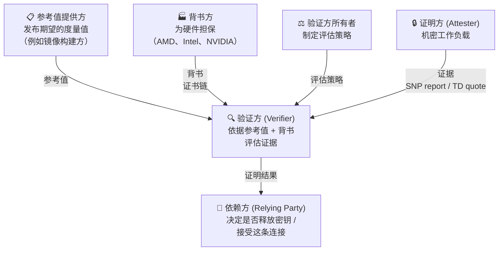
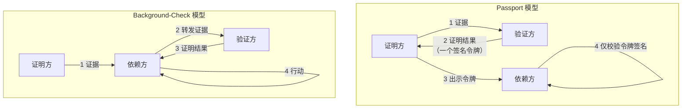
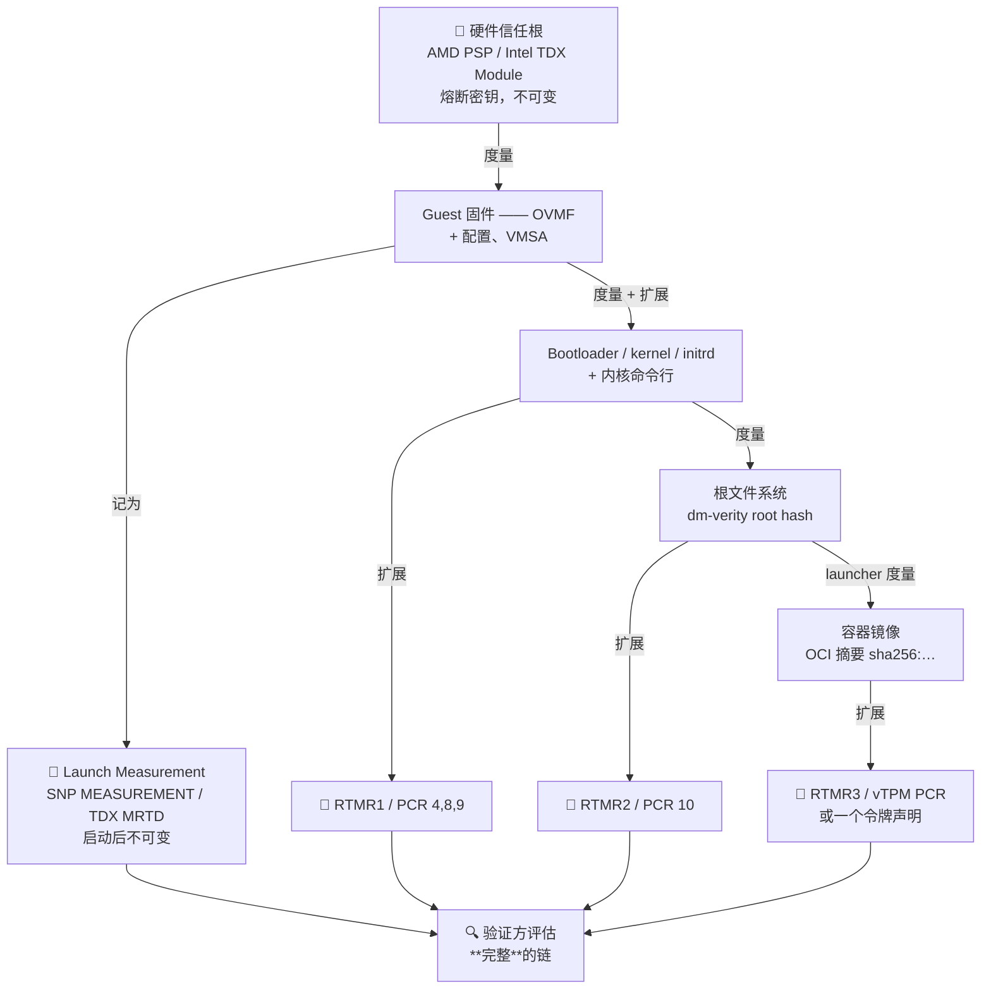
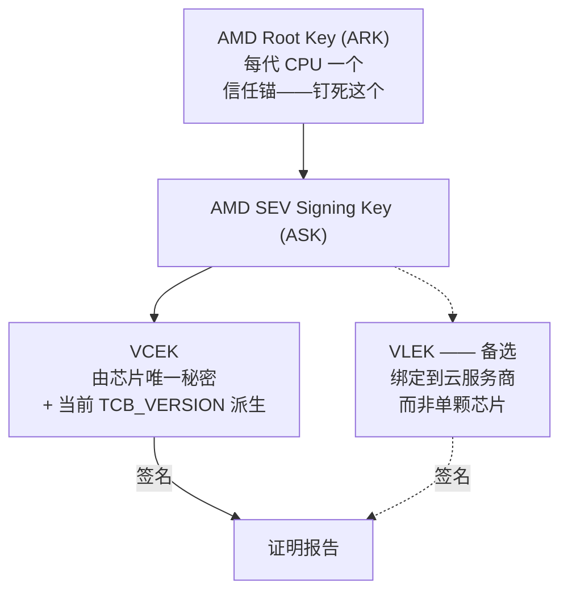
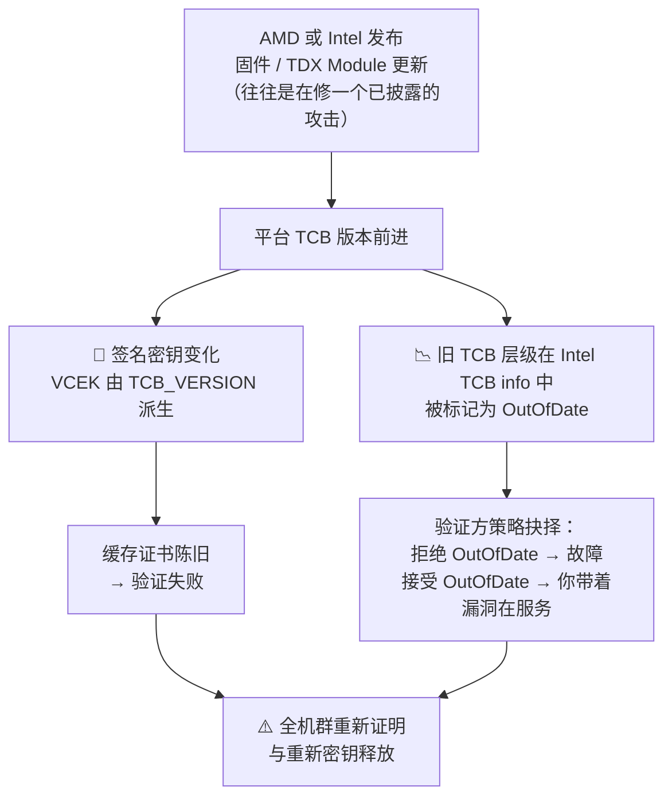
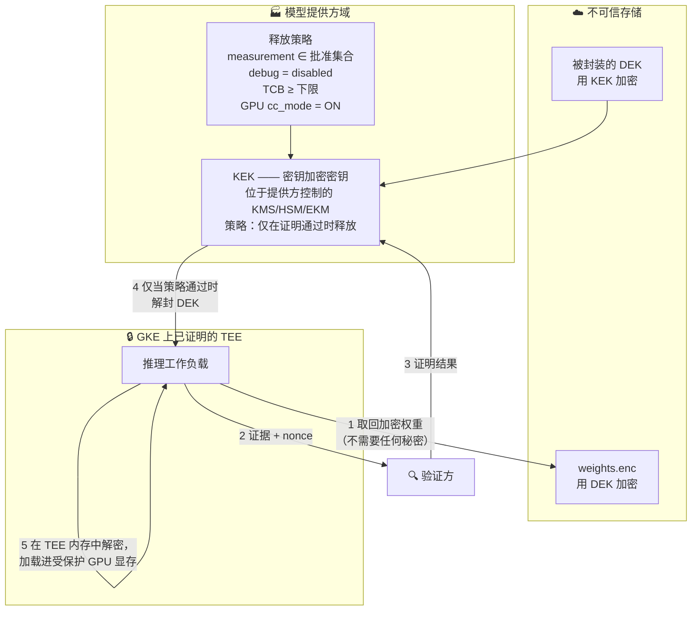
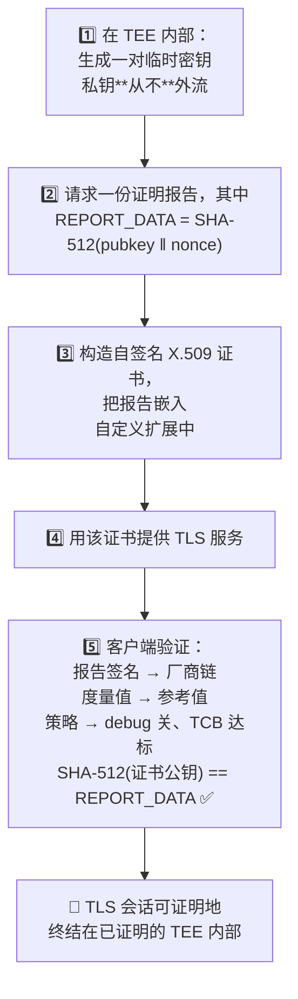

# 模块 3: 远程证明与基于证明的密钥释放

模块 2 结束时，我们拿到了一份硬件签名的报告，以及它一文不值的三个理由：没有参考值可以拿来比对度量值、不覆盖启动之后加载的任何东西、也没有绑定到你正在通话的那条通道上。本模块把这三个缺口全部闭合，然后用结果去做那件让机密计算在商业上有意义的事——**根据一台机器正在运行什么，而不是根据谁在请求，向它释放解密密钥。**

这是全书最长的模块，而且是刻意如此。可信执行环境是你**买**来的组件；证明是你**设计**的系统。现实中机密计算部署的失败，几乎全都是证明的失败，而不是 TEE 的失败。

本模块涵盖 **RATS 架构与"谁验证谁"**、**从硅片到容器摘要的度量链**、**证据格式及其证书链**、**新鲜性、吊销与 TCB 版本**、**基于证明的密钥释放**、**RA-TLS**，以及**参考值问题**。

---

## 第 1 部分: RATS 架构

### 1.1 角色

IETF RFC 9334 给了这个领域一套词汇。用它的价值不在于学究气——而在于**这些角色是可分离的**，而**谁来扮演哪个角色**是一份机密计算设计中后果最重大的决定。



| 角色 | 做什么 | 在 3P MaaS 设计里由谁扮演 |
| :--- | :--- | :--- |
| **证明方** | 产出关于自身的证据 | 机密 GKE 节点里的推理 Pod |
| **验证方** | 评估证据，产出证明结果 | ⚠️ **关键选择**——见 §1.3 |
| **依赖方** | 消费结果并据此行动 | 释放权重密钥的 KMS；决定是否发送 prompt 的客户端 |
| **背书方** | 担保硬件是真品 | AMD (KDS)、Intel (PCS)、NVIDIA (NRAS) |
| **参考值提供方** | 发布度量值**应该**是什么 | 构建镜像的一方——往往是最薄弱环节（§7） |
| **验证方所有者** | 制定评估策略 | 有权说"debug 必须关、TCB ≥ X、镜像摘要 ∈ {…}"的那一方 |

### 1.2 Passport 与 Background-Check

两种拓扑，信任与可用性性质截然不同。



| | Passport | Background-check |
| :--- | :--- | :--- |
| 谁与验证方通信 | 证明方 | 依赖方 |
| 依赖方复杂度 | 低——只需校验一个 JWT 签名 | 高——必须集成验证方 |
| 新鲜性 | 受令牌有效期限制；需小心处理 | 天然新鲜，由依赖方的 nonce 驱动 |
| 验证方是否在请求路径上 | 否（令牌可预取） | 是 |
| 依赖方必须信任什么 | 验证方的签名密钥 | 验证方的实时响应 |

Google Cloud 的 Confidential Space 用的是 **passport 模型**：工作负载从 Google Cloud Attestation 服务获取一个 OIDC 令牌，出示给 Cloud KMS 之类的依赖方，后者只检查 JWT 签名与声明。AWS Nitro Enclaves 更接近 background-check：enclave 把证明文档交给 KMS，由 KMS 自己做评估。

### 1.3 决定一切的那个问题：谁是验证方？

这里有个陷阱，也正是模块 1 里的 P3（互相可验证）在那么多真实设计中**无声失效**的原因。

如果验证方由 Google 运营，那么证明结果是一份**由 Google 作出的**、"环境是正确的"的声明。对一个威胁模型里明确包含 Google（攻击者 A3）的模型提供方来说，那不是证据——那是承诺，恰恰是机密计算本该取代的那种承诺。信任链中间有一个 Google 形状的环节。

有三条出路，强度递增：

| 做法 | 机制 | 对云运营商的残余信任 |
| :--- | :--- | :--- |
| **云运营的验证方** | Google Cloud Attestation 签发令牌；KMS 执行策略 | 完全——你信任 Google 的验证方和 Google 的 KMS |
| **独立验证方 + 云证据** | 提供方自建验证方，直接处理原始 SEV-SNP/TDX 证据，链回 AMD/Intel 证书 | 评估环节最小；Google 仍控制调度与可用性 |
| **独立验证方 + 外部密钥管理** | 同上，且解密权重的密钥位于提供方控制的基础设施（EKM） | 最小——Google 能停掉负载，但解不了密 |

**设计规则**：**验证方与密钥持有方，应该由资产处于风险中的那一方运营。** 保护权重的模型提供方，应当运行那个评估环境的验证方，并持有解锁权重的密钥。任何别的安排都会把"硬件强制"降格成"合同承诺"外加额外延迟。

这和云平台团队谈起来会相当尴尬，因为最方便的那条路——用平台的证明服务和平台的 KMS——恰恰是消解掉客户所付费购买的那个性质的路。这场对话最好发生在设计阶段，而不是安全评审阶段。

---

## 第 2 部分: 度量链

### 2.1 从硅片到容器摘要

launch measurement 覆盖固件，而容器摘要才是你真正在乎的东西。中间的一切都必须被串起来，而链的强度取决于最弱的那一环。



### 2.2 它断掉的三个地方

#### 1. 固件与内核之间的缺口

launch measurement 覆盖的是初始内存镜像。如果你的固件随后从一块未被度量的磁盘上加载内核，那么能修改那块磁盘的攻击者就控制了内核，而 launch measurement 仍然有效。修法要么是把内核**构建进**被度量的初始镜像（direct-boot、内核被度量的方案），要么是在执行前把它度量进 vTPM。

在 SEV-SNP 上这个问题很尖锐，因为架构上没有运行时度量寄存器（模块 2 §4.1）——你需要 vTPM，而这个 vTPM 必须住在信任边界**内部**（VMPL0 上的 SVSM），不能由 hypervisor 提供。**在机密 VM 里由 hypervisor 实现的 vTPM 不提供任何安全性**，因为攻击者就是 hypervisor。这是架构评审中真实且反复出现的发现。

#### 2. 可变的根文件系统

如果 rootfs 在被度量之后还能被改，那么度量它一次什么也证明不了。标准答案是 `dm-verity`：在文件系统上建一棵 Merkle 树，把根哈希度量进去，内核在每次读取时校验每个块。任何修改都会在**访问时**被发现，而不只是在启动时。

这就是为什么加固的机密镜像（Confidential Space 的镜像、Apple PCC 的、Azure 的 CVM 镜像）都是只读 + `dm-verity` + 一小块 `tmpfs` 可写覆盖层——也是为什么"把我们的 agent 加进节点镜像就行"在机密设计里是一个必须拒绝的请求。

#### 3. 运行时可变性

即便有了被校验的 rootfs，`kubectl exec`、一个调试 sidecar，或者一个特权 DaemonSet，仍然可以在证明**之后**引入未被度量的代码。度量在**它被采集的那一刻**是准确的；它不是一个持续成立的性质。

这是 Confidential Space 模型相对于纯 Confidential GKE Nodes 的最强论据（模块 5 §6）：Confidential Space 只跑**一个**容器镜像，被度量进证明令牌，生产镜像里没有交互式访问。而一个机密 GKE 节点跑的是完整的 kubelet，控制面让它起什么它就起什么。

### 2.3 检查时刻与使用时刻之间的差

证明发生在某个瞬间，执行在此之后继续。架构里没有任何东西会在运行期间重新校验工作负载。

按可行性排序的缓解手段：

- **把窗口做小。** 在释放密钥的**紧邻之前**证明，而不是在节点加入时证明一次然后永久复用。
- **让证明后的变更不可能发生。** 不可变 rootfs、无 shell、无 exec、无动态代码加载——这才是真正的防御。
- **周期性重新证明。** 限制损害窗口；注意这**检测不到**不留度量痕迹的入侵，而大多数入侵都不留痕迹。
- **把秘密绑定到度量值。** 封存（模块 1 §3.5）意味着即便攻击者替换了代码，新代码也解不开旧秘密。

---

## 第 3 部分: 证据格式与证书链

### 3.1 你会遇到的三类证据

| | **SEV-SNP report** | **TDX quote** | **TPM quote + event log** |
| :--- | :--- | :--- | :--- |
| 产出方 | AMD 安全处理器 | TD Quoting Enclave | TPM / vTPM |
| 签名密钥 | VCEK 或 VLEK | ECDSA 证明密钥 | Attestation Identity Key |
| 链回 | AMD ARK → ASK → VCEK | Intel Root CA → PCK → QE → AK | 厂商 EK 证书 |
| 背书服务 | AMD KDS | Intel PCS（DCAP collateral） | 厂商 EK CA；在 GCE 上是 Google |
| 携带的度量 | `MEASUREMENT`（仅启动） | `MRTD` + `RTMR0-3` | PCR 值 + 可重放的 event log |
| 调用方提供的字节 | `REPORT_DATA`（64 B） | `REPORTDATA`（64 B） | Qualifying data / nonce |
| 新鲜性 | 调用方须把 nonce 放进 `REPORT_DATA` | 同上 | 同上 |

TPM 那一行最容易被低估。单看一份 TPM quote，你得到的是 PCR 值——一堆不透明的哈希。让它们变得可解释的是 **event log**：它按顺序记录了被度量的东西，因此验证方可以**重放**日志、重算 PCR、确认与 quote 一致，然后逐条检视具体事件（"这个内核、这条命令行、这个 initrd"）。没有 event log，你就只能拿一个"黄金 PCR 值"去比对——这意味着你必须自己启动过一台一模一样的机器才知道该期望什么。有了日志，你可以逐组件评估。

### 3.2 AMD 的链



VCEK/VLEK 的区分对云部署要紧：

- **VCEK** 由芯片唯一秘密派生，唯一标识那颗物理 CPU。对安全性很好；对云厂商则是隐私与关联性上的顾虑，因为这让租户可以给机群里的单台机器打指纹。
- **VLEK** 签发给云服务商，因此报告标识的是"由云厂商 X 运营、处于 TCB 层级 Y 的一颗 AMD 芯片"，而不是某颗特定芯片。租户失去了区分物理机的能力。

你必须知道你的平台用的是哪一个，因为取证书的路径和由此得到的身份含义**两者都会变**。

关键运维事实（模块 2 已述，此处重复因为它真的会造成故障）：**VCEK 由 TCB 版本派生。** 固件更新 ⇒ 新 TCB 版本 ⇒ 新 VCEK ⇒ 每一份缓存证书都陈旧，每一个钉死了证书的验证方开始失败。

### 3.3 Intel 的链与 DCAP collateral

Intel 侧验证需要的不只是签名，还需要 **collateral**：

| Collateral 项 | 它确立什么 |
| :--- | :--- |
| PCK 证书链 | 这份 quote 来自一颗具有给定 PPID 与 TCB 的真品 Intel CPU |
| TCB info（按 FMSPC） | 哪些 TCB 层级当前是最新的、过期的、还是已吊销的 |
| QE identity | Quoting Enclave 本身是真品且版本可接受 |
| CRL | 链中没有任何东西被吊销 |

这些从 Intel 配置证明服务获取，通常经由本地运行的 **PCCS** 缓存。设计后果无法回避：**验证对某个厂商服务存在网络依赖。** 在生产中你要跑一个缓存服务，并且**显式地、事先地**决定：当缓存陈旧且上游不可达时会发生什么——fail closed（不释放密钥、不服务）还是 fail open（接受可能已被吊销的证据）。没有第三个选项，而**靠意外来选就等于选了 fail-open**。

### 3.4 生态的走向：EAT 与 CoRIM

三家厂商、三套互不兼容的二进制格式、三套验证库。IETF RATS 工作组的答案是：

- **EAT**（Entity Attestation Token，RFC 9711）—— 一套通用的 CBOR/JWT 声明格式，用于证明证据与结果。Google 的 Confidential Space 令牌受 EAT 影响，这正是它的声明叫 `eat_nonce`、`dbgstat`、`hwmodel`、`swname` 而不是厂商私有字段名的原因。
- **CoRIM**（Concise Reference Integrity Manifest）—— **参考值**的标准格式，好让"期望度量值"问题（§7）能通过发布一份签名清单来解决，而不是各家自己发明一套 JSON schema。
- **CoSWID** —— 软件标识标签，使参考值能绑定到一个可识别的软件件。

这些今天都还不能免除你理解底层厂商格式的必要，但它告诉你抽象边界最终会落在哪里——这也是为什么"把验证逻辑写在基于声明的抽象之上、而不是写在原始 SEV-SNP 结构体之上"是正确的选择。

---

## 第 4 部分: 新鲜性、吊销与 TCB 版本

### 4.1 新鲜性

一份没有 nonce 的报告，证明的是"某个环境在**某个**时刻存在过"，而不是"它现在存在"。重放很容易：从一台健康机器上抓一份有效报告，然后在一台已被攻陷的机器上永远出示它。

两种机制：

- **Nonce（挑战-响应）。** 依赖方生成随机值，证明方把它放进 `REPORT_DATA` / `REPORTDATA` / `eat_nonce`，报告即证明它产生于挑战之后。最强，需要一次往返，天然契合 background-check。
- **带短有效期的时间戳。** 令牌携带 `iat`/`exp`，依赖方拒绝过期的。契合 passport 模型。它的安全性**恰好等于令牌有效期**——一个有效期一小时的令牌，在一台可能三十分钟前就已被攻陷的机器上，就是一小时的重放窗口。

Confidential Space 两者都支持：令牌带 `iat`、`nbf`、`exp`，并且支持最多六个由调用方提供的 `eat_nonce`。**只要你能提供 nonce，就提供。** 只靠有效期是一个"接受重放窗口"的选择，它应该是一个被记录在案的选择，而不是一个默认值。

### 4.2 TCB 版本及其全机群后果

这是那个会在第三个月让团队措手不及的运维现实。



中间那个方框里的策略困境没有干净的答案，而且必须**事先**决定：

- **立即拒绝过期 TCB**：每一台还在旧固件上的节点都拿不到密钥。如果你的机群要花几天更新完，你就有一次持续数天的部分故障。
- **接受过期 TCB**：你在一批已知且已公开漏洞的硬件上服务客户 prompt，同时还告诉客户这个环境是已证明的。

可行的答案是**带硬截止日的宽限窗口**：在一段有限时间内接受上一个 TCB 层级，对任何仍在用它的节点大声告警，并在一个事先承诺的日期强制抬高门槛。这是一份策略加一份 runbook，而不是一次代码改动——所以它需要在第一份固件公告**之前**就存在，而不是之后。

实操建议：

1. 永远不要钉死某个精确 TCB 版本。钉一个**下限**，并有一套抬高下限的书面流程。
2. 激进地缓存背书 collateral，但把缓存未命中当成一等失败模式来对待，并且**测过**它的行为。
3. 把机群里的 TCB 版本分布做成看板。公告落地的那天你会需要它。
4. 显式决定 fail-closed 还是 fail-open，写下来，并确保 on-call 工程师知道配的是哪一个。

---

## 第 5 部分: 基于证明的密钥释放

这是收获环节。到目前为止的一切都是在产出一份可信声明；这一部分是拿它去做点有用的事。

### 5.1 模式



信封加密是让这件事变可行的关键：数百 GB 的权重用一把对称 DEK 加密一次；只有那把小小的被封装的 DEK 走证明门控的路径。轮转访问权意味着重新封装一把密钥，而不是重新加密一个模型。

### 5.2 策略才是产品

释放策略是所有安全性所在之处，也是 bug 所在之处。一份面向 3P MaaS 推理负载的策略，至少应当断言：

| 断言 | 声明 / 字段 | 缺了它会怎样 |
| :--- | :--- | :--- |
| 真品硬件 TEE | 签名链回 AMD/Intel 根 | 任何人都能伪造证据 |
| 正确的 TEE 类型 | `hwmodel` ∈ {`GCP_INTEL_TDX`, …} | 你会把一台 Shielded VM 当成 TEE 接受 |
| debug 已禁用 | `dbgstat = disabled-since-boot`；SNP `POLICY` 位 | 运营商可以挂调试器读内存 |
| 固件不陈旧 | `TCB_VERSION` ≥ 下限；Intel TCB status | 已知存在漏洞的平台 |
| 已批准的镜像 | `submods.container.image_digest` ∈ 白名单 | 平台上任何镜像都能拿到你的权重 |
| 镜像由正确的一方签名 | `submods.container.image_signatures[].key_id` | 摘要白名单会腐烂，签名才能规模化 |
| GPU 处于 CC 模式 | `submods.nvidia_gpu.cc_mode = ON` | **权重落进不受保护的 HBM——整个设计失效** |
| 期望的 GPU 型号 | `submods.nvidia_gpu.gpus[].hwmodel` | 证明了错误的加速器类别 |
| 新鲜 | `eat_nonce` 匹配，`exp` 在未来 | 重放 |

GPU 那两行是最常缺失的，也是危害最大的遗漏——一份把 CPU TEE 检查得面面俱到、却对 GPU 只字不提的策略，会产出一个证明完美、然后把你的权重装进明文 HBM 的环境。模块 4 展开这一点。

### 5.3 平台对比

| | **GCP** | **AWS** | **Azure** |
| :--- | :--- | :--- | :--- |
| 给依赖方的证据 | OIDC JWT 证明令牌（passport） | 证明文档（background-check） | 来自 MAA 的 JWT |
| 策略表达于 | Workload Identity Federation 属性条件（CEL）+ IAM | KMS 密钥策略条件键（`kms:RecipientAttestation:*`） | Managed HSM SKR 策略 |
| 密钥存储 | Cloud KMS / Cloud HSM / Cloud EKM | AWS KMS | Managed HSM |
| 能否独立验证？ | 能，走原始证据——但顺手的那条路是 Google 的验证方 | 能 | 能，经 MAA 或自建 |

模式到处都一样，只是策略语言不同。在 GCP 上机制是 Workload Identity Federation：一条针对令牌声明的属性条件决定该令牌能否换成 Google 凭据，随后由 IAM 决定该凭据可以解密什么。模块 5 §4 讲具体语法。

### 5.4 值得大声问出来的那个问题

每一份基于证明的密钥释放设计，都应当能回答：**如果云运营商想要明文密钥，它得做什么？**

| 设计 | 运营商得做什么 |
| :--- | :--- |
| 密钥在云 KMS，用云 IAM 策略 | 改一条 IAM 策略。这是一次内部操作。 |
| 密钥在云 KMS，策略针对证明声明 | 伪造一个证明令牌——需要攻破云验证方的签名密钥。 |
| 密钥在提供方自运营的外部 KMS，验证方也自运营 | 攻破 AMD/Intel 硬件证明，或者攻破模型提供方。 |

只有第三行是扎根于硬件的保证。第一行是穿着机密计算戏服的策略控制。**能够向模型提供方的安全团队直白地说出自己的设计处在哪一行**，是本模块最有价值的产出。

---

## 第 6 部分: RA-TLS —— 把证明绑定到通道

### 6.1 中继问题

证明能证明**存在**一个具备某些性质的 TEE。它不能证明那个 TEE 就是你所连接的那个端点。中间人可以从一台真实、配置正确的 TEE 上取得一份真实报告并出示给你，同时把你的连接终结在它自己选定的机器上。

修法就是模块 1 §3.4 里的第四个字段：把端点公钥的哈希放进报告的调用方数据里。



客户端最后那一步检查就是全部要义：终结这条 TLS 会话的密钥，是那个已证明 TEE 所持有的密钥。被中继的报告会失败，因为中继方并不持有与报告内哈希相匹配的私钥。

### 6.2 为什么这对 LLM 服务比对几乎任何东西都更要紧

考虑另一种情况：一个托管的 L7 负载均衡器用一张私钥由**云厂商**持有的证书终结 TLS，然后重新加密到后端。prompt 此刻就是负载均衡器内存里的明文——而那台机器**明确地**不在你的 TEE 里。

下游的一切可以做到完美机密，而保证在第一个 token 被处理之前就已经没了。这不是假设：它是几乎每一朵云上每一个托管入口的**默认配置**，也是机密推理设计最常见的无声失效方式。模块 6 §5 专门讲这些选项。

### 6.3 现实中的复杂性

- **标准 TLS 库不做这件事。** 客户端必须被赋予自定义校验逻辑。对一个公开 API 来说这是真实的采纳障碍——你在要求每个客户都用你的 SDK。对第一方或企业集成来说则完全可行。
- **证书生命周期。** 证书是临时的、与那次证明绑定。轮转频繁，必须自动化。
- **Nonce 与新鲜性。** 要达到完全新鲜，nonce 必须来自客户端，这意味着要么在握手前先交换一轮，要么接受基于时间的新鲜性。
- **复合证据。** 对 GPU 负载，报告必须同时覆盖 GPU，否则客户端验证到的是"持有 TLS 密钥的 **CPU** 是机密的"，而真正做推理的 GPU 可能不是。

---

## 第 7 部分: 参考值问题

### 7.1 最难的未解部分

到这里为止的一切都假定验证方知道该期望什么度量值。这个假设承担了极大的分量，而在实践中，这正是机密计算部署最薄弱的地方。

你手上有一份报告说 `MEASUREMENT = 0x3f2a…`。你怎么知道这是对的值？

- **你算不出来。** 它取决于固件版本、内存布局、vCPU 数量，以及初始镜像里每一样东西的精确构建。
- **你不能去问云厂商。** 那会重新引入你本来想消除的那份信任——"Google 告诉我这个哈希是好的那个"。
- **你可以自己启动一次并记录下来**——但这只能证明你和生产机器跑的是同一批比特。这确实有用，也是大多数部署实际在做的事。

### 7.2 诚实评级的几种做法

| 做法 | 怎么工作 | 强度 | 代价 |
| :--- | :--- | :--- | :--- |
| **自己启动得到的黄金值** | 在受控环境里自己启动镜像、记录度量值、钉死 | 中等——证明与**你**跑过的东西比特一致 | 低；固件与规格变化时脆弱 |
| **厂商发布的参考值** | 镜像发布方签署一份期望度量值清单（CoRIM、NVIDIA RIM） | 中等——你现在信任的是发布方 | 低，前提是发布方提供 |
| **可复现构建** | 任何人都能从源码逐比特重建镜像并独立推导出度量值 | **强**——消除对构建方的信任 | 工程成本高 |
| **二进制透明日志** | 度量值发布到只可追加、可验证的日志；说谎的发布方可被检测 | **强**，与可复现构建互补 | 中等；需要生态支持 |
| **第三方审计** | 独立方检视镜像并为其度量值背书 | 弱到中等——这是人的流程 | 持续性开销 |

诚实的现状：大多数生产级机密计算部署用的是"自己构建时记录的黄金值 + 镜像签名"。这比什么都没有**显著更好**，也比营销话术暗示的保证**显著更弱**。

### 7.3 "强"长什么样

Apple 的 Private Cloud Compute 是最完整的公开尝试，值得研究，恰恰因为它把参考值问题当成**那个**问题而不是一个细节：

1. 软件镜像以可复现方式构建。
2. 每一个生产镜像都发布到一个只可追加的透明日志。
3. 客户端设备在发送数据**之前**，验证它所连接的服务器正在运行一个存在于该日志中的镜像——**执行在客户端**，而不在运营商侧。
4. 研究者被提供镜像与工具来检视它们。

让它成立的关键是 (2) 与 (3) **合在一起**：如果客户端不拒绝与未发布镜像通信，那么发布度量值毫无价值。这就是一份真正可验证的 3P MaaS 设计应当对标的标尺，模块 7 §6 会考察一个基于 GKE 的设计能走到多近。

### 7.4 这在实践中意味着什么

对你实际要构建的那个设计：

1. **把被度量的表面积压到最小。** 一个只装了一个静态二进制的 distroless 镜像，其度量值是你能推理的。一个带包管理器的通用基础镜像则不是。
2. **在你力所能及的地方做可复现构建。** 哪怕只是部分可复现（钉死摘要、锁定依赖、`SOURCE_DATE_EPOCH`）也能缩小缺口。
3. **给镜像签名，并把签名校验放进释放策略。** `image_signatures[].key_id` 能规模化，而摘要白名单不能。
4. **发布你的参考值。** 如果模型提供方本该独立验证，他们需要一份签名的、带版本的、可公开取回的可接受度量值清单。
5. **对残余信任说明白。** 把这句话写出来："客户信任镜像摘要 X 的行为与文档一致，依据是 [签名 | 可复现构建 | 审计]。" 如果你补不完这句话，P3 就不成立。

---

## Lab: 从证据到一把被释放的密钥 —— 两条路都走一遍

**目标**：把完整的证明密钥释放做两遍。第一遍走方便的那条路：Google 的验证方、Google 的 KMS。第二遍走 §1.3 真正推荐的那条：你自己的验证方去评估原始硬件证据，密钥托管在工作负载所在项目根本碰不到的地方。然后以一个恶意项目管理员的身份攻击这两套设计，观察只有其中一套活了下来。

**规模**：两个 Google Cloud 项目——一个跑工作负载的 *operator* 项目，一个跑验证方并持有密钥的 *provider* 项目。要用 IAM 彼此独立的两个项目。这正是整个练习的要害：如果同一个管理员同时掌控两边，本实验的后半部分就什么都证明不了，而用两个项目来模拟这种分离，是最便宜的诚实做法。**状态**：结构与 claim 名称已对照 Google Cloud 文档核实；`gcloud` 的确切语法随 CLI 版本而变——请用 `--help` 核对，并随时查阅 Confidential Space 文档。

### A 部分 —— 取一份 token 并读它

写一个最简单的工作负载，读出证明 token 并打印。在 Confidential Space 工作负载内部，token 可以从 launcher 的 socket 取得：

```bash
# 在工作负载容器内部
curl -s --unix-socket /run/container_launcher/teeserver.sock \
  http://localhost/v1/token > token.jwt

# 解码 payload（这是一个 JWT，payload 是中间那段 base64url）
cut -d. -f2 token.jwt | tr '_-' '/+' | base64 -d 2>/dev/null | python3 -m json.tool
```

### B 部分 —— 把 §5.2 的每一个 claim 都找出来

在解码后的 payload 里定位并记下：

- `iss` —— 应为 `https://confidentialcomputing.googleapis.com`
- `hwmodel` —— `GCP_AMD_SEV`、`GCP_INTEL_TDX`，或者很说明问题的 `GCP_SHIELDED_VM`
- `dbgstat` —— 生产环境应为 `disabled-since-boot`，DEBUG 镜像上则是 `enabled`
- `swname` / `swversion` —— `CONFIDENTIAL_SPACE` 以及镜像版本
- `submods.container.image_digest` —— 真正重要的那个工作负载身份
- `submods.container.image_signatures[]` —— 只有你签过镜像才会出现
- `submods.gce.*` —— 项目、zone、实例
- `submods.confidential_space.support_attributes` —— `STABLE`、`LATEST`、`EXPERIMENTAL`
- `eat_nonce` —— 除非你主动请求，否则不存在
- `exp` − `iat` —— 算出 token 生命期，并注意：如果你不用 nonce，这就是你的重放窗口

**练习**：把同一个工作负载跑在 DEBUG 版 Confidential Space 镜像上，diff 两份 token。看着 `dbgstat` 翻成 `enabled`、`support_attributes` 发生变化。然后回答：哪一个 claim 一旦被依赖方漏检，就会让整个部署不再机密？

### C 部分 —— 把 KMS 密钥绑到证明上（方便的那条路）

在 **operator** 项目里，创建一个工作负载身份池，其 provider 的属性条件要求你在意的那些 claim：

```bash
gcloud iam workload-identity-pools create cc-lab-pool \
  --location=global \
  --display-name="Confidential Space lab pool"

gcloud iam workload-identity-pools providers create-oidc cc-lab-provider \
  --location=global \
  --workload-identity-pool=cc-lab-pool \
  --issuer-uri="https://confidentialcomputing.googleapis.com" \
  --allowed-audiences="https://sts.googleapis.com" \
  --attribute-mapping="google.subject=assertion.sub" \
  --attribute-condition="assertion.swname == 'CONFIDENTIAL_SPACE' \
    && assertion.dbgstat == 'disabled-since-boot' \
    && 'sha256:YOUR_IMAGE_DIGEST' in assertion.submods.container.image_digest"
```

然后给这个联合身份在持有测试密文的密钥上授予 `roles/cloudkms.cryptoKeyDecrypter`，让工作负载通过 STS 用 token 换取 Google 凭据并解密。

### D 部分 —— 用三种方式打破它

这一部分才真正产生理解。每一种，都先预测失败的样子再动手：

1. **改镜像**。改一个字节重新构建、部署，看着 digest 变化、交换因条件不匹配而失败。
2. **用 DEBUG 镜像**。`dbgstat` 变成 `enabled`，条件失败。现在把 `dbgstat` 那一条从属性条件里删掉，观察密钥释放*成功了*——在一个运维方可以检视内存的镜像上。这是整个实验里最有教育意义的一次失败。
3. **重放一个 token**。抓一份 token，等它过了 `exp` 再试。然后推演一下：在那个窗口内攻击者本可以做些什么。

### E 部分 —— 现在，自己当验证方

上面的一切，都把 Google 摆在了"Google 的基础设施是否可信"这一断言的中间。§1.3 把那称为承诺而不是证据。现在把替代方案搭出来。

在 **provider** 项目里，立一个从不信任 Google 签发 token 的验证服务。它应当接收原始证据、自己完成评估，并且只依据自己的判定释放密钥：

```python
# 验证服务，provider 项目 —— 只是草图，不是一个库
def release_key(evidence: bytes, nonce: bytes, tls_pubkey_hash: bytes) -> bytes:
    report = parse_snp_report(evidence)                       # 或 TDX quote
    verify_signature_chain(report, ark=PINNED_AMD_ROOT)       # 信 AMD，不信 GCP
    assert report.report_data == sha512(nonce + tls_pubkey_hash)
    assert report.measurement in APPROVED_MEASUREMENTS        # 你自己的，来自模块 2 §9
    assert report.tcb_version >= TCB_FLOOR                    # 下界，绝不是等值
    assert report.policy.debug is False
    return unwrap_kek()                                       # 密钥在这里，不在 operator 项目
```

有两个性质是要害，而且它们都是结构性的，而非密码学上的：

- **AMD 根证书是你自己钉死的**。整条链是 证据 → VCEK → ASK → ARK，终点是一份你自己随代码分发的证书。Google 在这条链里根本不出现。
- **密钥从不进入 operator 项目**。工作负载通过一条被证明绑定的信道收到释放的密钥；在 operator 项目里持有 IAM 的任何人都无从索取。

让工作负载发送原始证据——来自 `/dev/sev-guest` 或模块 2 §7 里的 configfs 接口——而不是 launcher 的那个 JWT，并把 `REPORT_DATA` 绑定到它自己的 TLS 公钥上，使这次释放同时绑定到信道（§6）。

### F 部分 —— 以恶意管理员的身份攻击两套设计

现在做那个把差别落到实处的实验。给你自己在 **operator** 项目上授予完整的 `roles/owner`——这恰恰是一个内部人员、一个被攻陷的 CI 账号、或一个被胁迫的员工所拥有的权限——然后用两条路各偷一次这份机密。

**打 C 部分**：把你自己的镜像 digest 加进属性条件，部署一个只负责打印解密结果的容器，然后跑起来。

```bash
gcloud iam workload-identity-pools providers update-oidc cc-lab-provider \
  --location=global --workload-identity-pool=cc-lab-pool \
  --attribute-condition="assertion.swname == 'CONFIDENTIAL_SPACE' \
    && 'sha256:MY_EXFILTRATION_IMAGE' in assertion.submods.container.image_digest"
```

成功了。明文现在在你手上。**没有任何东西被攻破，也没有任何硬件保证失效**——那条策略只是一个可变的 IAM 对象，而它正好落在这套设计本应排除掉的那个管理员的爆炸半径之内。

**打 E 部分**：同样的事再来一次。你可以改工作负载、改实例、改项目、改整套 IAM 策略——但你改不了 `APPROVED_MEASUREMENTS`，因为它住在一个你并不持有 IAM 的项目里。释放会在度量值不匹配处失败，密钥待在原地。

用一句话写下这个差值。那句话就是你日后要讲给模型提供方安全团队听的论证，也是模块 6 把密钥管理器彻底放到 Google 之外的原因。

### G 部分 —— 值得多待一会儿的问题

F 部分仍有一处软肋。请问：**是谁认定 `APPROVED_MEASUREMENTS` 里那些度量值是可接受的，客户又如何能知道？** 如果答案是"提供方认定的，而客户无从知道"，那你只是把信任搬了个家，而不是消除了它——从云厂商搬到了你自己身上。当你就是那个资产处于风险中的一方时，这是一个实打实的改进；但它不构成对第三方的保证。补上最后这个缺口需要可复现构建与透明日志（§7.3），这也正是模块 7 §6.4 里 Apple PCC 最终落脚的地方。

### H 部分 —— 清理

删掉工作负载实例与普查用的资源。把验证服务和那两个项目留着——模块 5 就是在这同一套分离结构上做部署的，而模块 6 会把它的生产版本建起来。

---

## 总结: 证明检查清单

| 问题 | 答案 | 搞错的后果 |
| :--- | :--- | :--- |
| 谁是验证方？ | 应当是资产处于风险中的那一方 | 保证退化为运营商的一句承诺 |
| Passport 还是 background-check？ | GCP 是 passport；AWS Nitro 更接近 background-check | 决定新鲜性处理方式与可用性耦合 |
| 链条抵达容器摘要了吗？ | launch measurement → 运行时寄存器 → 镜像摘要 | 你证明了固件，对工作负载一无所知 |
| rootfs 不可变吗？ | `dm-verity` + 只读 + 无 exec | 度量在启动之后变得毫无意义 |
| 有 nonce 吗？ | 尽可能使用 `eat_nonce` / `REPORT_DATA` | 令牌有效期成为你的重放窗口 |
| 检查 `dbgstat` / `POLICY.DEBUG` 了吗？ | 必须检查 | 你接受了一个运营商可读其内存的环境 |
| TCB 门槛是"下限"而非"精确值"吗？ | 下限，绝不钉死，且有抬升流程 | 要么全机群故障，要么在已知漏洞固件上服务 |
| GPU 在策略里吗？ | `cc_mode = ON` 加 GPU 型号 | 权重落进不受保护的 HBM；设计无声失效 |
| 报告绑定到 TLS 密钥了吗？ | RA-TLS，经由调用方提供的报告数据 | 证明可以从另一台机器中继过来 |
| 参考值从哪来？ | 理想是可复现构建 + 透明日志；现实是签名的黄金值 | 这是大多数真实部署里最薄弱的一环 |
| 验证方不可达时 fail-closed 还是 fail-open？ | 显式决定并写下来 | 靠意外来选就等于选了 fail-open |

本模块里每一条策略都引用了某个 GPU 声明，却没有解释它。这是剩下最大的缺口：CPU TEE 现在防守严密，而权重、激活值和 KV cache 全都住在完全另一个地方。闭合这个缺口——并理解它在吞吐上的代价——就是**模块 4: 机密 GPU 与加速器 (`04_confidential_gpus_and_accelerators.md`)**。
