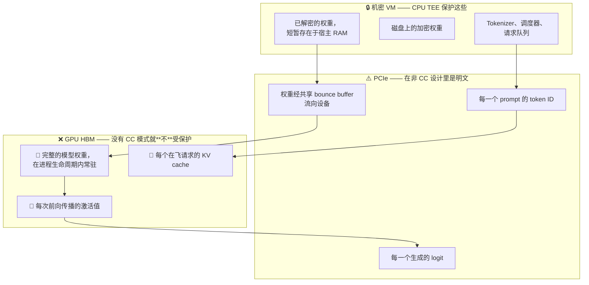
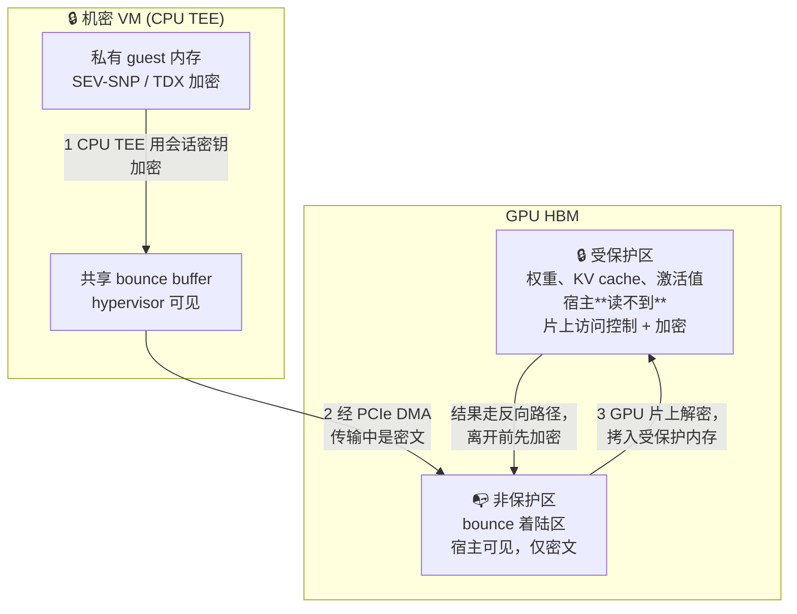
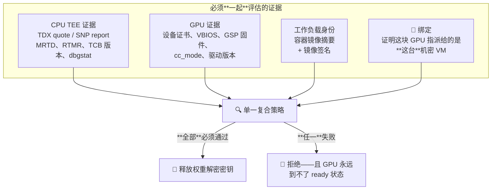
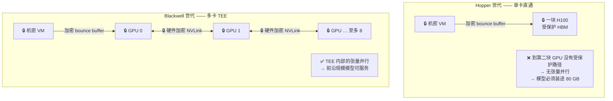

# 模块 4: 机密 GPU 与加速器

模块 3 里每一条释放策略都包含一行关于 `cc_mode` 的断言，却从未解释过。本模块解释它，并借此闭合"机密计算"与"机密 **LLM** 计算"之间的那道缺口。机密 VM 保护的是宿主 DRAM，而 LLM 不住在宿主 DRAM 里。在加速器进入信任边界之前，一台证明得完美无瑕的机密 VM，保护的是你数据里最不值钱的那份副本，而值钱的那份正以明文躺在一块 hypervisor 可以寻址的设备的 HBM 里。

本模块涵盖 **为什么 GPU 必须进 TCB**、**NVIDIA 机密计算模式的内部机制**、**GPU 证明与复合策略**、**多卡故事及其对张量并行的意义**、**性能模型**，以及**周边生态**。

---

## 第 1 部分: 为什么 GPU 必须进 TCB

### 1.1 核算一下

把模块 6 的参考架构拿来看它半成品的状态：一个跑着 SEV-SNP 或 TDX 的 Confidential GKE 节点，外加一块通过 PCIe 直通挂上来的**普通** GPU。到底什么被保护了？



那三行红字就是全部资产。一个能读 GPU 显存的宿主侧攻击者——通过驱动接口、通过 DMA 路径、或者通过设备自身的调试设施——拿到的是：

- **完整权重**，静止状态，持续数小时。模块 1 的 P1，被彻底击穿。
- **KV cache**，这是每个请求的、高保真的、模型被告知的一切的编码，包括 system prompt 和完整对话。P2，被彻底击穿。
- **激活值**，其可恢复程度足以构成问题。

还有一点容易被忽略：在纯 CPU 的机密设计里，**hypervisor 仍然编程 IOMMU、仍然拥有 PCIe 拓扑**。机密 VM 自己的 DMA 缓冲区按构造就必须是共享（未加密）页——SEV-SNP 与 TDX 下的 DMA 就是这么工作的（模块 2 §4.2.4）。所以权重不只是在 GPU 上不受保护，它们在**每一次加载**时都以明文穿过总线，途经 hypervisor 可读的内存。

**结论，值得用最强的措辞陈述**：一份不对 GPU 做证明的机密 LLM 服务设计，对模型和 prompt **不提供任何有意义的机密性**。这不是"部分保证"，这是保证的**外观**。

### 1.2 GPU TEE 必须提供什么

还是模块 1 §3 的那五种原语，只是重述给一个"不是 CPU"的设备：

| 原语 | 在 GPU 上意味着什么 | 缺了会怎样 |
| :--- | :--- | :--- |
| 信任根 | 出厂熔断、从不暴露给软件的每设备密钥 | 设备身份可伪造 |
| 度量 | VBIOS、GSP 固件与驱动状态的度量 | 你证明的是"一块 GPU"，而非"一块可信 GPU" |
| 内存保护 | 宿主读不到的 HBM 区域 | 权重可读 |
| 安全通道 | 加密且带完整性保护的 PCIe 传输 | 权重与 prompt 在每次加载、每次请求时于传输中泄露 |
| 证明 | 可对厂商链验证的、签名的设备报告 | 没有把设备纳入信任边界的依据 |

以及一个 CPU 没有对应物的原语，因为 CPU 不是外设：

| 原语 | 含义 |
| :--- | :--- |
| **与 CPU TEE 的绑定** | 证明**这块** GPU 被独占指派给**这台**机密 VM。没有它，攻击者可以对机群里别处一块真正处于 CC 模式的 GPU 做证明，却用一块不受保护的 GPU 干实际的活——这就是模块 3 §6.1 的中继攻击，应用到设备上。 |

---

## 第 2 部分: NVIDIA 机密计算模式

### 2.1 三种状态

NVIDIA Hopper（H100/H200）与 Blackwell 产品暴露一个设备级模式开关，共三档，而中间两档的区别是生产事故的常见来源：

| 模式 | 保护 | Profiling / 调试工具 | 用途 |
| :--- | :--- | :--- | :--- |
| `OFF` | 无 | 完整 | 普通非机密负载 |
| `ON` | 完整——受保护内存、加密传输、要求证明 | **禁用** | 生产机密负载 |
| `DEVTOOLS` | 部分——机制在跑，但保护被放松 | 启用 | **仅**开发与性能调优 |

`DEVTOOLS` 之所以存在，是因为你没法给一个内存读不出来的负载做 profiling，而总得有人去调 kernel。**它不是一个安全模式。** 一条接受 `cc_mode ∈ {ON, DEVTOOLS}` 的释放策略，接受的是一个运营商可以 profile 你的推理并读取设备内存的环境——这正是模块 3 §5.2 里那个 `dbgstat` 陷阱，换了身 GPU 的戏服。**断言 `cc_mode == ON`，不接受别的。**

### 2.2 受保护内存模型

在 CC 模式下 GPU 把它的 HBM 分区：



关键洞见是：**在这条路径的任何一点上，明文都不曾存在于信任边界之外。** 在机密 VM 私有内存里是明文；从进入共享 bounce buffer 那一刻起是密文；跨总线是密文；在非保护着陆区是密文；只有回到 GPU 受保护区内才重新是明文。hypervisor 能读共享缓冲区和非保护区，而它学到的只有密文和大小。

注意与模块 2 里 CPU 内存加密的**不对称**：**这里用的是 AES-GCM，不是 AES-XTS。** 在总线上你负担得起 GCM 附加的 nonce 与认证 tag，于是白得了认证性与非确定性——这正是模块 2 §5.1 的密文侧信道在这条路径上**没有**直接对应物的原因。而在 DRAM 里你负担不起这份膨胀，所以 CPU 内存加密只能困在确定性模式里。这是全书中最清晰的一例，说明系统的两半为何具有不同的密码学性质。

### 2.3 会话建立：SPDM 与 PCIe IDE

那条路径上的加密密钥总得来自某处，而且不能来自 hypervisor。机制是 **SPDM**（Security Protocol and Data Model，DMTF 标准）：机密 VM 与 GPU 执行一次双向认证的密钥交换，GPU 用它熔断的设备密钥与证书链完成认证。结果是一把由 guest 与设备共同持有、中间任何人都不持有的会话密钥。

**PCIe IDE**（Integrity and Data Encryption）是给 PCIe 流量做加密与完整性保护的链路层标准。Hopper 的实现是在软件管理的 bounce buffer 里加密；而全行业的走向是硬件链路加密加上用于设备指派的 **TDISP**（§6.2）。

值得带走的一点是：安全通道建立在**机密 VM 与设备之间**，密钥派生自设备的信任根，hypervisor 被排除在外。这和本书里其他一切是同一个形状——**由 guest 而非平台决定什么跨越边界。**

### 2.4 运维要求

两件从架构上看不出来、但各会花掉你一个下午的事：

1. **必须启用 `nvidia-persistenced`。** 在 CC 模式下，卸载并重新加载驱动意味着重新协商安全会话并重新证明。持久化守护进程让驱动保持加载，这样它就不会在每次进程退出时发生。没有它，你会看到间歇性的、令人困惑的证明失败。
2. **GPU 有一个门控计算的 "ready state"。** 证明成功之后，必须有东西告诉 GPU 它可以接活了：`nvidia-smi conf-compute -srs 1`。在那之前，GPU 处于 CC 模式但未就绪，CUDA 操作会失败。这是**刻意**的——这是硬件对"证明成功之前不许计算"的执行点，也意味着**证明按设计就在你的冷启动关键路径上**（模块 6 §4）。

---

## 第 3 部分: GPU 证明与复合策略

### 3.1 证据

GPU 产出它自己的证明报告，结构上与模块 2 的 SEV-SNP 报告平行：

| 元素 | 内容 |
| :--- | :--- |
| 设备身份 | 一个唯一设备标识，用熔断的每设备密钥签名 |
| 度量值 | VBIOS 版本、GSP 固件度量、驱动版本、CC 模式状态 |
| Nonce | 调用方提供，用于新鲜性 |
| 证书链 | 设备证书，链回 NVIDIA 根 |

验证时把这些度量值与一份 **RIM**（Reference Integrity Manifest）比对——NVIDIA 针对给定固件与驱动版本签名发布的期望度量值清单。这是模块 3 §7 的参考值问题以"厂商发布"方式给出的解：你信任的是 NVIDIA 的签名清单，而不是自己推导期望值。它的强度评级与那张表的第二行相同——中等，它**转移**了信任而非**消除**信任。

两种验证拓扑，与模块 3 §1.2 完全对应：

- **NRAS**（NVIDIA Remote Attestation Service）—— 把证据发给 NVIDIA，拿回一个裁决。简单；增加一个网络依赖，并且把你的机群情况告诉了 NVIDIA。
- **本地验证方** —— 你自己拿缓存的 RIM 与 NVIDIA 根证书做验证。工作量更大；运行时不依赖 NVIDIA；而且对一个想当自己验证方的模型提供方（模块 3 §1.3）来说，这是唯一可接受的选项。

### 3.2 复合证明才是要义

一份 CPU 证明和一份 GPU 证明，各自有效、各自分开验证，合起来证明不了多少东西。你需要的是**针对被绑定证据的单一策略决策**：



在 Google Cloud 上这次合成是替你做好的，并体现在 Confidential Space 证明令牌里：它在 CPU 声明之外还携带一个 `submods.nvidia_gpu` 段——包含 `cc_mode`、`cc_feature`，以及逐 GPU 的条目，带 `hwmodel`（如 `GCP_NVIDIA_H100`）、`driver_version`、`vbios_version` 和一个设备唯一标识。这正是"单令牌策略"得以可能的原因：一个 JWT，验证一次，同时断言关于 CPU TEE、GPU 和容器镜像的事实。

**你绝不能省略的那几行策略**，重述模块 3 §5.2，现在理由已经可见：

```text
submods.nvidia_gpu.cc_mode == "ON"           # 不是 DEVTOOLS
submods.nvidia_gpu.gpus[*].hwmodel == 期望型号
submods.nvidia_gpu.gpus[*].driver_version >= 下限
submods.nvidia_gpu.gpus[*].vbios_version  ∈ 批准集合
```

一条把 CPU TEE 验证得完美无瑕、却省掉这四行的策略，产出的是一个"已证明、机密、并且正在把你的权重装进明文 HBM"的环境。

---

## 第 4 部分: 多卡与张量并行

### 4.1 Hopper 的约束

这是本模块中后果最重大的一条实际事实，它塑造了整个模块 6 的架构。

第一代 Hopper 机密计算实现支持的是**单卡直通**。一块 H100 指派给一台机密 VM。两块机密 GPU 之间**没有**受保护的互联，因此跨两卡的张量并行组，其激活值传递的路径不在任何一方的 TEE 之内。

Google Cloud 的带 GPU 的 Confidential GKE Nodes 直接反映了这一点：文档中的配置是 `a3-highgpu-1g` 机型，每节点恰好**一块** NVIDIA H100 80 GB GPU，使用 Intel TDX——而且 GPU 共享特性（time-sharing、MIG）不可用。

对模型服务的后果很严重，应当直说：

| 约束 | 后果 |
| :--- | :--- |
| 每个机密节点一块 80 GB GPU | 你的模型加 KV cache 必须装进 80 GB，还要扣掉运行时开销 |
| 无法跨 GPU 做张量并行 | bf16 的 70B 模型（约 140 GB 权重）**装不下**，没有余地 |
| 无 MIG、无 time-sharing | 无法把多个小模型打包到一块卡上；利用率受损 |
| 机密 GPU 之间无 NVLink | 跨节点的流水线并行走的是网络，而不只是一条总线 |

因此，单块 80 GB 机密 H100 的实际服务包线是：bf16 下大约 30–40B 参数以内的模型，或者量化到 8-bit / 4-bit 的更大模型。**全精度的前沿规模模型在这个配置下无法服务。** 如果你的 Vertex 3P MaaS 负载是大模型，Hopper 这一代逼着你在"量化"、"跨节点流水线并行 + 加密的节点间传输"、"等 Blackwell"三者之间选一个。

### 4.2 Blackwell 带来的改变

Blackwell 世代的 HGX 平台（B200 及后继）移除了这个约束。多卡机密计算得到支持，同一台机密 VM 内的 GPU 之间使用**硬件加密的 NVLink**，可将 1、2、4 或 8 块 GPU 指派给单台 CVM。CPU↔GPU 流量仍走加密 bounce buffer；机密组内的 GPU↔GPU 流量走加密 NVLink。



正是这个变化，把机密 LLM 服务从"小模型的演示"推到了"人们真正付费的那些模型的部署选项"。在规划 3P MaaS 机密方案时，**加速器世代不是一个优化细节——它决定了哪些模型根本能不能服务**，它该出现在设计文档靠前的位置，而不是附录里。

### 4.3 证明上的后果

多卡机密计算把证据翻了倍。每块 GPU 产出自己的报告，策略必须验证：

1. 组里**每一块** GPU——型号、固件、CC 模式。
2. 它们**全部**绑定到同一台机密 VM。
3. 它们之间的 NVLink 互联处于受保护模式。

一条检查 GPU 0 然后假定 GPU 1–7 一样的策略，是一条漏了八分之七的策略。**逐设备验证。**

---

## 第 5 部分: 性能模型

### 5.1 开销究竟在哪

关于机密 GPU 性能，最有用的一件事是知道成本**不在**哪：

$$
T_{\text{total}} = \underbrace{T_{\text{transfer}}}_{\text{受影响严重}} + \underbrace{T_{\text{compute}}}_{\text{几乎不受影响}} + \underbrace{T_{\text{attest}}}_{\text{一次性，但很大}}
$$

**GPU 内部的计算基本不受影响。** SM 在受保护 HBM 里对明文运算，不存在逐指令的密码学开销。CC 模式下的一次矩阵乘法，速率与模式外相同。

**跨 PCIe 的传输受影响严重。** 每一个 host↔device 字节都要被加密、拷进 bounce buffer、DMA、再解密。这是一条本来就已是系统中最慢环节的路径上的逐字节开销。

已公开的 H100 CC 模式基准工作在这个形状上是一致的：GPU 内部的计算开销极小，整体代价由跨 PCIe 的 CPU–GPU 数据传输主导。

### 5.2 为什么这对 LLM 推理是好消息

LLM 推理的算术强度站在你这边。对某个阶段定义：

$$
I = \frac{\text{设备上执行的 FLOPs}}{\text{跨 PCIe 移动的字节数}}
$$

CC 模式对分母征税，对分子不动。于是相对开销按 $1/I$ 缩放，而推理的各阶段排列得很整齐：

| 阶段 | PCIe 流量 | 设备算力 | CC 开销 |
| :--- | :--- | :--- | :--- |
| **权重加载（冷启动）** | 巨大——数十到数百 GB，一次 | 无 | **严重**——代价落在这里 |
| **Prefill** | 小——传入 token ID | 大——对整个 prompt 做完整前向 | 低 |
| **Decode** | 极小——传入一个 token，传出 logits | 每步中等，但重复很多次 | 低，且随批处理进一步下降 |
| **小批次、短 prompt 请求** | 相对于算力而言不可忽略 | 小 | 服务各阶段中最高 |

这就是为什么已公开的测量报告说，开销**随模型规模、批大小与序列长度增大而缩小**：这三者都在提高"每传输字节对应的算力"。针对 H100 CC 模式的基准工作曾报告 LLM 推理的吞吐惩罚处于个位数百分比中段，对最大的模型与最长的序列趋于可忽略，而最小的模型与最短的序列承担最高的相对代价。

**设计含义很直接**：机密模式最便宜的地方，恰恰是 LLM 服务最有价值的地方——大模型、批量流量、长上下文。它最贵的地方是冷启动，以及小的、延迟敏感的请求。据此优化：**更少、更长命、批处理充分的副本，而不是很多个小副本。**

### 5.3 冷启动才是真正的代价

把一个 40 GB 模型装进受保护 HBM，意味着要加密、bounce、DMA、解密 40 GB。设 CC 后的有效带宽为 $B$ GB/s：

$$
T_{\text{load}} = \frac{S_{\text{model}}}{B_{\text{effective}}} \quad\text{其中}\quad B_{\text{effective}} < B_{\text{raw PCIe}}
$$

再加上机密 VM 自己的内存接受循环（模块 2 §4.2.3）、TEE 启动、证明往返，以及 KMS 密钥释放，一个机密推理 Pod 的冷启动比普通 Pod 差得**很实在**。这是模块 6 §4 延迟预算里的主导项，也是为什么给机密推理机群做自动扩缩容与给普通机群做是**不同的问题**。

### 5.4 该测什么

不要把已公开的数字——包括上面这些——直接当成适用于你的负载。要紧的变量（模型规模、批大小、序列长度、量化、PCIe 世代、CPU TEE 类型）差异足够大，以至于诚实的答案永远是"去测"。一份站得住脚的基准要隔离四样东西：

1. **基线**：普通 VM，普通 GPU。
2. **仅 CPU TEE**：机密 VM，GPU 关闭 CC。隔离出 CPU 侧代价。
3. **CPU TEE + GPU CC**：生产配置。
4. **冷启动与稳态分开报。** 报一个混合数字会掩盖"一个组件几乎免费、另一个很贵"这个事实。

在你拿到自己的测量数据之前，一个取自已公开单卡 H100 工作的合理起步启发式是：预留大约 **15–25% 的额外吞吐容量**，然后一旦有了针对自身负载的测量就立刻替换掉它。模块 7 §1 展开方法学。

---

## 第 6 部分: 周边生态

### 6.1 AMD 与加速器领域的其余部分

AMD 的 Instinct 产品线通过 **SEV-TIO**（Trusted I/O，AMD 的可信设备指派实现）与 SEV-SNP 配对。架构形状与 NVIDIA 相同——设备信任根、证明、加密 DMA——差别在于 AMD 可以把 CPU 与设备的信任模型整合得更紧，因为两端都是它自己的。

对一份 Google Cloud 设计来说，这在今天主要是信息性的，但它还有第二层意义：**它证明了这套机制不是 NVIDIA 专有的**——这意味着把你的证明策略写成针对抽象的"加速器证据"形状、而不是针对 NVIDIA 的具体报告格式，才是可移植的选择。

### 6.2 TDISP：这一切的去向

当前这一代机密 GPU 支持，从架构上说是一个**变通方案**。bounce buffer 之所以存在，是因为设备无法以平台能理解的方式被安全地指派给机密 VM；软件之所以在 DMA 前加密，是因为链路本身不可信。

**TDISP**（TEE Device Interface Security Protocol），一份 PCIe 规范，是标准化的修法。它定义了设备接口如何被指派给一个 TEE、如何被认证（经 SPDM）、链路如何被保护（经 IDE），以及设备如何在一个定义好的安全状态机中转换。当 TDISP 被广泛实现时，bounce buffer 就消失了：设备功能被直接指派进机密 VM 的私有内存，配合硬件链路加密。

可以预期的后果：

- §5.1 里大部分传输开销消失。
- 证明变得更标准化、更少厂商特异性。
- 信任边界变得更容易描述——在向对手方安全团队解释设计时，这是一个非常实在的好处。

这是两到三年的地平线，不是今天可以往上搭东西的东西，但它是"不要在 bounce-buffer 专用优化上过度投资"的理由。

### 6.3 TPU

对一个托管在 Vertex 上的负载来说，TPU 是个显而易见的问题，而诚实的答案是：TPU 的机密计算故事，相比 NVIDIA GPU 路径，成熟度与公开文档程度都**明显更低**。任何 3P MaaS 机密设计在假定 TPU 支持之前，都应当先对照当前的 Google Cloud 文档核实，并且应当把 GPU 路径当成今天唯一具备**文档化、可验证证明链**的那条路。

---

## Lab: 验证一块机密 GPU，并把两代硬件都实测一遍

**目标**：在两代加速器上都把机密 GPU 节点拉起来，从 guest 内部确认 CC 模式，取得并验证一份 GPU 证明报告，然后——在旁边跑着一个真实的非机密对照组的前提下——实测 §5.1 预测的传输开销、§4.2 声称的加密 NVLink 行为，以及 §4.1 所说的每一代各自的服务能力边界。

**规模**：同时跑三个节点池——一个机密 H100、一个**作为对照组的非机密 H100**、以及一个机密的 8×B200 节点。这里的 A/B 不是可选项。本模块里每一个性能断言都是两种配置之间的*差值*，而在同一实例上开关 CC 模式既测不了冷启动、也测不了 NVLink，更完全展示不出 Hopper 的服务上限。把对照组开出来。**状态**：`nvidia-smi` 与 `nvtrust` 的调用遵循 NVIDIA 既有接口；`gcloud` 节点池 flag 遵循 Google Cloud 文档。机密多 GPU 在机型与区域上的可用性，是全书变化最快的部分——动手前请对照当前文档核实，并预期至少有一个 flag 名字已经挪过位置。

### 第 1 步 —— 创建机密 Hopper 池及其对照组

```bash
# 机密：TDX + 一块 H100，依 §4.1
gcloud container node-pools create cc-gpu-pool \
  --cluster=YOUR_CLUSTER \
  --location=us-central1 \
  --node-locations=us-central1-a \
  --confidential-node-type=TDX \
  --machine-type=a3-highgpu-1g \
  --accelerator=type=nvidia-h100-80gb,count=1,gpu-driver-version=latest \
  --num-nodes=1

# 对照组：完全相同的硬件，不开机密模式。正是它让下面每一个数字
# 成为一次测量，而不是一则轶事。
gcloud container node-pools create plain-gpu-pool \
  --cluster=YOUR_CLUSTER \
  --location=us-central1 \
  --node-locations=us-central1-a \
  --machine-type=a3-highgpu-1g \
  --accelerator=type=nvidia-h100-80gb,count=1,gpu-driver-version=latest \
  --num-nodes=1
```

### 第 2 步 —— 把 Hopper 的约束证明出来，而不是读到它

§4.1 声称 Hopper 上每个机密 VM 只能有一块 GPU。去违反它试试：

```bash
gcloud container node-pools create cc-gpu-multi \
  --cluster=YOUR_CLUSTER --location=us-central1 \
  --confidential-node-type=TDX \
  --machine-type=a3-highgpu-8g \
  --accelerator=type=nvidia-h100-80gb,count=8,gpu-driver-version=latest \
  --num-nodes=1
```

把确切的报错记下来。那条消息就是 §4.1 由 API 强制执行的版本，而不是由行文描述的版本；值得原样贴进你的设计文档——它结束"我们就不能上张量并行吗"这场对话的速度，比任何解释都快。

### 第 3 步 —— 从 guest 内部确认 CC 模式

```bash
# GPU 是否处于机密计算模式？
nvidia-smi conf-compute -f

# GPU 的 ready state 是什么？计算能力受它闸控。
nvidia-smi conf-compute -grs

# 确认驱动已被 pin 住 —— CC 模式下必需
systemctl status nvidia-persistenced
```

期望看到 `CC status: ON`。在对照节点上跑同样的命令，期望是 `OFF`。如果机密节点报告 `OFF`，那么本实验后续的一切测的都是一块非机密 GPU——更要紧的是，处于这种状态的生产部署会在毫无声息中失去保护。**这条检查属于你的就绪探针**，而不只属于实验。

### 第 4 步 —— 观察那道强制闸门

在 ready state 被设置之前，试着跑任何一个 CUDA 负载：

```bash
python3 -c "import torch; print(torch.zeros(1).cuda())"
```

它应该失败。现在设置 ready state 再试：

```bash
sudo nvidia-smi conf-compute -srs 1
python3 -c "import torch; print(torch.zeros(1).cuda())"
```

这是整个实验最有启发的一刻：**在某个东西断言证明已通过之前，硬件拒绝计算。** 证明不是建议性的，它也不在关键路径之外。

### 第 5 步 —— 拉取并验证一份 GPU 证明报告

```bash
git clone https://github.com/NVIDIA/nvtrust.git
cd nvtrust/guest_tools/attestation_sdk
pip install -r requirements.txt

# 可在本地对照缓存的 RIM 与 NVIDIA 根证书验证，也可经 NRAS 远程验证 ——
# 具体调用方式请查阅该工具的当前文档。
python3 -m verifier.cc_admin
```

检查输出里的 VBIOS 版本、驱动版本，以及逐项度量值与 RIM 的比对结果。当某个度量值不匹配时，工具会指出它的索引——这就是模块 3 §7 参考值问题的 GPU 版本，也是一个适合追问"那份 RIM 从哪来、由谁签名"的时刻。

### 第 6 步 —— 对着对照组实测传输代价

在机密节点**和**普通节点上都跑一遍，然后 diff 结果：

```bash
/usr/local/cuda/extras/demo_suite/bandwidthTest --memory=pinned --mode=range \
  --start=1048576 --end=1073741824 --increment=104857600
```

然后验证模型的另一半——计算*不*受影响——在两边跑同一个大矩阵乘基准：

```bash
python3 -c "
import torch, time
a = torch.randn(16384, 16384, device='cuda', dtype=torch.bfloat16)
b = torch.randn(16384, 16384, device='cuda', dtype=torch.bfloat16)
torch.cuda.synchronize(); t = time.time()
for _ in range(50): c = a @ b
torch.cuda.synchronize()
print('TFLOP/s:', 50 * 2 * 16384**3 / (time.time() - t) / 1e12)
"
```

**预期结果**：机密节点上 PCIe 带宽显著下降，而 TFLOP/s 与对照组之间的差异落在噪声范围内。证明计算*没有*受影响，才是让 §5.2 那个模型可信的关键——也正是这个数字，能拦住一个容量规划者对所有环节一律套用一个固定的开销系数。

### 第 7 步 —— 在 Blackwell 上实测加密 NVLink

§4.2 声称 Blackwell 增加了硬件加密的 NVLink，并支持向单个 CVM 分配 1/2/4/8 块 GPU。去测它：

```bash
gcloud container node-pools create cc-gpu-blackwell \
  --cluster=YOUR_CLUSTER --location=us-central1 \
  --confidential-node-type=TDX \
  --machine-type=a4-highgpu-8g \
  --accelerator=type=nvidia-b200,count=8,gpu-driver-version=latest \
  --num-nodes=1
```

在第 2 步失败的地方，这次节点池创建成功了——这件事本身就是头条结果。现在分别在 CC 模式开与关的情况下测量互连：

```bash
nvidia-smi conf-compute -f            # 确认八块设备全部为 ON
nvidia-smi nvlink --status            # 链路状态与每条链路的带宽

git clone https://github.com/NVIDIA/nccl-tests && cd nccl-tests && make
./build/all_reduce_perf -b 8M -e 4G -f 2 -g 8
```

记录每个消息尺寸下的总线带宽，CC 开 vs 关。**要看什么**：GPU↔GPU 这条路径靠的是硬件链路级加密，而不是绕经主机内存的 bounce buffer，因此集合通信的代价形态应当与第 6 步的 PCIe 代价完全不同。如果你的数字不是这样，先弄清为什么，再据此做设计——就这一项测量，决定了张量并行的机密服务是否可行。

### 第 8 步 —— 用实验找出每一代的服务能力边界

拿一个 bf16 的 70B 模型——按 §4.1 那张表，约 140 GB 权重——试着在机密 H100 上把它服务起来：

```bash
python3 -c "
from vllm import LLM
llm = LLM(model='YOUR_70B_MODEL', gpu_memory_utilization=0.9)
"
```

它会因显存不足而失败，而且它本来也不可能有别的结果。现在把同一个模型跑在机密 Blackwell 节点上，用张量并行铺满全部八块 GPU：

```bash
python3 -c "
from vllm import LLM
llm = LLM(model='YOUR_70B_MODEL', tensor_parallel_size=8, gpu_memory_utilization=0.9)
print('loaded')
"
```

**这个对比就是第 4 部分的全部论点，浓缩成两条命令。** 一代硬件出多少钱都服务不了这个模型；下一代则能在 TEE 内部、带着加密互连把它服务起来。这正是 §4.2 坚持"加速器代次属于设计文档的开头而不是附录"的原因。

### 第 9 步 —— 给模块 6 将要做预算的那些阶段计时

在两个机密节点上，加载一个确实装得下的模型，把两个阶段分开计时：

```bash
time python3 -c "
from vllm import LLM
llm = LLM(model='YOUR_MODEL', gpu_memory_utilization=0.9)
print('loaded')
"
```

然后跑一个简短的生成基准。你应该看到 §5.2 预测的形态：加载慢得不成比例，稳态生成则接近基线。也在对照节点上跑一遍，好把机密计算特有的那部分，从"搬运几十 GB 本身就要花的代价"里分离出来。这一次分解，就是模块 6 里整个冷启动讨论的经验基础。

### 第 10 步 —— 拆掉

```bash
for p in cc-gpu-pool plain-gpu-pool cc-gpu-blackwell; do
  gcloud container node-pools delete "$p" --cluster=YOUR_CLUSTER --location=us-central1 --quiet
done
gcloud container node-pools list --cluster=YOUR_CLUSTER --location=us-central1
```

用最后那条命令确认删除，而不是假定它删掉了。加速器节点是本课程里唯一值得专门核实其已消失的资源——原因不是账单，而是一个删了一半的节点池会悄悄把你下一个实验调度到错误的硬件上，并且不动声色地让它的数字全部作废。

---

## 总结: 机密 GPU 检查清单

| 问题 | 答案 | 为什么要紧 |
| :--- | :--- | :--- |
| 纯 CPU 机密 VM 能保护 LLM 吗？ | **不能**——权重、KV cache、激活值全在 GPU HBM | 这是本领域的标志性错误 |
| CC 模式加密什么？ | 用 AES-GCM 加密 host↔device 传输；HBM 通过访问控制划出受保护区 | 非确定性模式，与 CPU 内存加密不同 |
| `DEVTOOLS` 是安全模式吗？ | **不是**——profiling 启用且保护被放松 | 精确断言 `cc_mode == ON` |
| 会话密钥怎么建立？ | CVM 与设备之间的 SPDM 双向认证 | hypervisor 按构造被排除 |
| GPU 怎么证明？ | 签名的设备报告，度量值与 NVIDIA RIM 比对 | 若你需要当自己的验证方，就用本地验证 |
| CPU 与 GPU 证据必须绑定吗？ | **必须**——否则别处一块真 CC GPU 可被中继 | 针对单一令牌的复合策略 |
| Hopper 上每台机密 VM 几块 GPU？ | **一块**——`a3-highgpu-1g`，无 MIG，无 time-sharing | 把可服务模型规模封在 80 GB 内 |
| Blackwell 解决了吗？ | 是——加密 NVLink，每 CVM 1/2/4/8 卡 | 决定前沿规模模型**能不能**被服务 |
| 开销落在哪？ | host↔device 传输；设备内计算几乎不受影响 | 开销随模型规模、批大小、序列长度增大而缩小 |
| 昂贵操作是什么？ | 冷启动——把数十 GB 装进受保护 HBM | 模块 6 延迟预算里的主导项 |

你现在拥有了硬件的两半：一颗带已验证度量值的机密 CPU，以及一块与之绑定的机密加速器。剩下的是平台——哪些机型、哪些 GKE 设置、哪个证明服务，以及 Google 那两个相当不同的机密产品里你到底该基于哪一个来构建。那就是**模块 5: Google Cloud 机密计算产品面 (`05_google_cloud_confidential_surface.md`)**。
