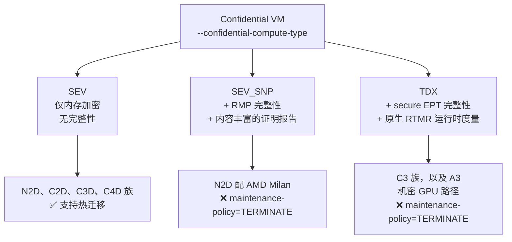
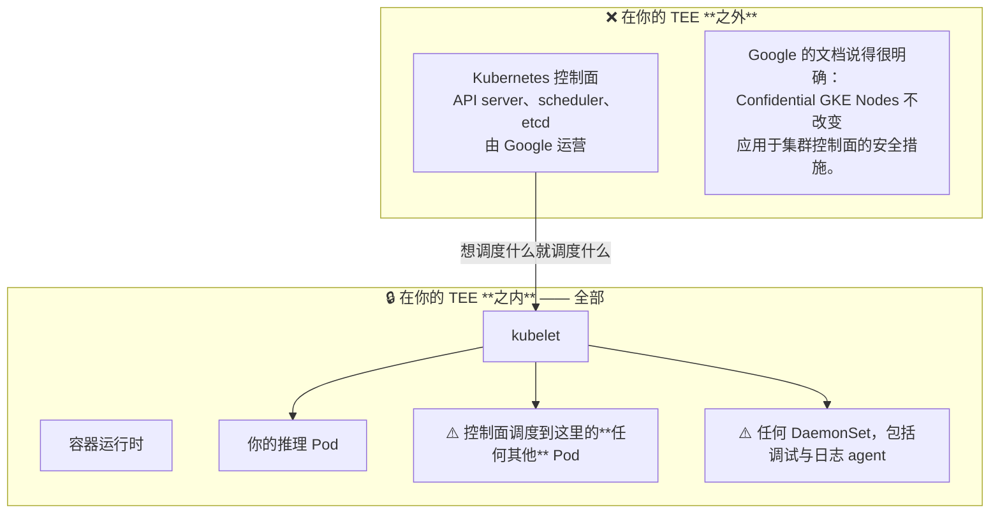
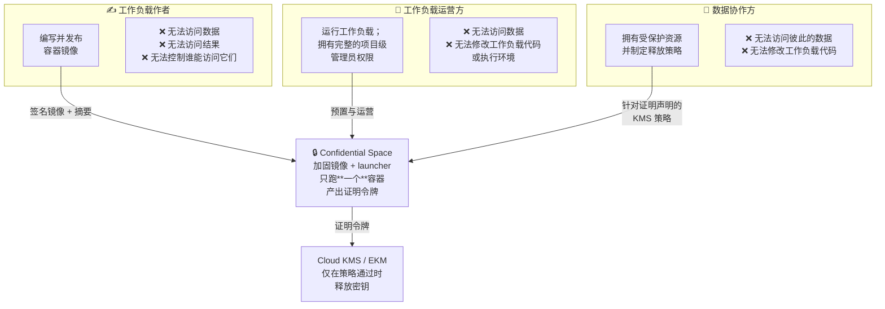
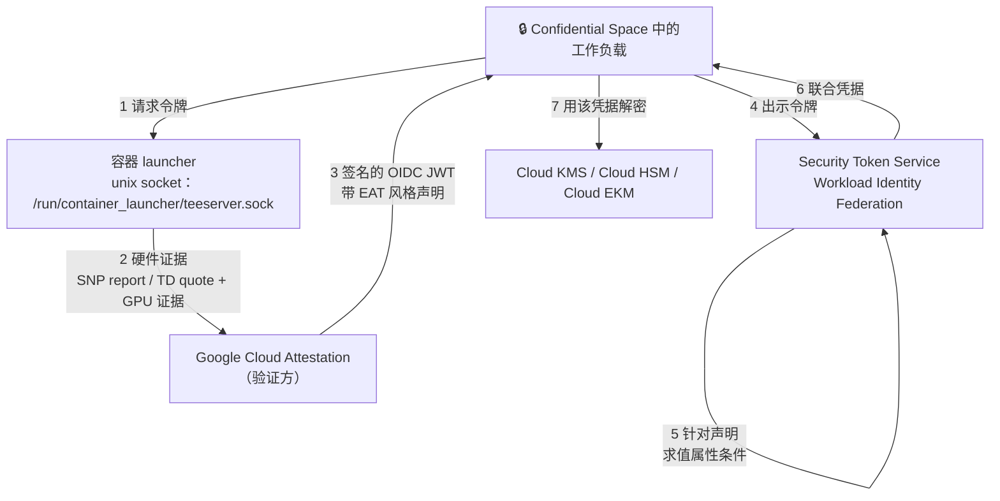
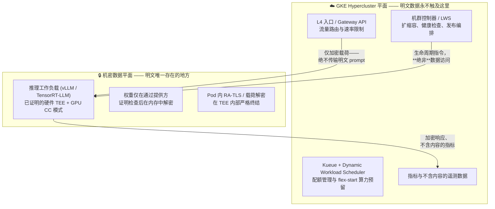

# 模块 5: Google Cloud 机密计算产品面

模块 1 到 4 构建了机制。本模块讲的是 Google Cloud 实际卖的是什么、每个产品暴露了其中哪些机制，以及那个决定你架构走向的问题——**一个第三方模型服务负载，该基于 Google 那两个相当不同的机密产品中的哪一个来构建。** 它们不是彼此的变体。它们体现的是对"谁在信任边界之内"这个问题的**不同回答**，而选那个方便的会让你丢掉一个之后很难补回来的安全性质。

本模块涵盖 **Confidential VM 机型族**、**Confidential GKE Nodes 及其未覆盖之处**、**Confidential Space 及其三角色分离**、**GCP 的证明与密钥释放产品面**、**周边配套产品**，以及**面向推理的正面决策对比**。

!!! warning "产品面变化很快"
    本领域的机型可用性、地域覆盖与 GPU 支持以**月**为尺度变化。本模块中每一条产品论断在进入设计文档之前，都应当对照当前的 Google Cloud 文档重新核验。**架构**是稳定的；**可用性矩阵**不是。

---

## 第 1 部分: Confidential VM

### 1.1 产品矩阵

Confidential VM 是基础层——本模块其余一切都建立在它之上。



| | **SEV** | **SEV-SNP** | **TDX** |
| :--- | :--- | :--- | :--- |
| 内存机密性 | 有 | 有 | 有 |
| 内存完整性 | **无** | 有 | 有 |
| 原生运行时度量 | 无 | 无——需要 vTPM | **有**（`RTMR0-3`） |
| 热迁移 | 支持 | 不支持 | 不支持 |
| 机型族（请核验时效） | N2D、C2D、C3D、C4D | N2D（AMD Milan） | C3，以及机密 GPU 的 A3 路径 |
| 机密 GPU 支持 | 无 | 见 §2.2 | **有**——文档化的 GPU 路径 |

**应当驱动你选择的那一行是内存完整性。** 纯 SEV 给的是没有完整性的机密性，而模块 1 §3.3 已确立：这对一个主动作恶的 hypervisor 是不够的——重放与重映射攻击可行。SEV 是可用性最广、最便宜的选项，而对一个威胁模型包含攻击者 A2 或 A3 的负载来说，它是**错的**那个。**如果一份设计文档只写"Confidential VM"而不说是哪种技术，它就还没做那个要紧的决定。**

### 1.2 实际约束

三条会塑造你容量规划的：

1. **SEV-SNP 与 TDX 需要 `--maintenance-policy=TERMINATE`。** 没有热迁移（模块 2 §4.2.1）。主机维护会停掉实例。对一个冷启动要好几分钟的推理节点，这是一个真实的可用性输入，不是脚注。
2. **地域可用性很窄。** 机密产品——尤其是 TDX 与机密 GPU——只在少数地域提供。这与数据驻留要求相互作用得很糟：一个需要数据留在特定地域的客户，可能会发现那里根本不提供机密选项，而由此产生的对话很尴尬，因为这**两个**要求都是安全要求。
3. **不只是可用性，还有容量。** A3 机密容量受限。**预留很重要。**

### 1.3 VM 周边的存储与密钥

Confidential VM 保护内存，它对磁盘只字未提，周边的存储故事必须刻意去搭：

| 关注点 | 机制 | 备注 |
| :--- | :--- | :--- |
| 启动盘与数据盘 | Google 托管加密、CMEK，或 Confidential Hyperdisk | CMEK 意味着**你**在 Cloud KMS 里控制 KEK——更好，但仍由 Google 运营 |
| 静态模型权重 | 应用层信封加密（模块 3 §5） | **不要靠磁盘加密来做这件事。** 解密必须由证明门控，而磁盘加密不是 |
| 秘密 | 基于证明的密钥释放，而非 Secret Manager IAM | Secret Manager 按**身份**释放；你需要按**度量值**释放 |

中间那一行最要紧，也最常做错。用 CMEK 把磁盘上的权重加密，保护的是"有人偷走磁盘"的场景。它**不**保护你不受云运营商侵害，因为运营商的平台能读那块盘、也握着通往密钥的路径。只有**基于证明门控的释放**才做得到。

---

## 第 2 部分: Confidential GKE Nodes 与 GKE Hypercluster

### 2.1 它是什么与 GKE Hypercluster 语境

Confidential GKE Nodes 本质上就是"把我这个节点池的 VM 跑成 Confidential VM"。kubelet、容器运行时和你的 Pod 全都跑在硬件 TEE 内部。

在现代 AI 基础设施的语境下，**GKE Hypercluster**（Google Cloud AI Hypercomputer 架构中的超大规模 Kubernetes 集群架构）将这一范式扩展到了超大规模 GPU 与 TPU 集群。GKE Hypercluster 集成了：

- **AI 原生调度与编排**：用于多租户排队与公平共享的 [Kueue](https://kueue.sigs.k8s.io/)、用于保障性群调度（Gang-scheduling）与容量预留的 [Dynamic Workload Scheduler (DWS)](https://cloud.google.com/kubernetes-engine/docs/concepts/dynamic-workload-scheduler) 及 `flex-start`、用于编排多节点分布式推理与训练（如 vLLM、TensorRT-LLM、Ray on GKE）的 [LeaderWorkerSet (LWS)](https://github.com/kubernetes-sigs/lws)，以及 [JobSet](https://github.com/kubernetes-sigs/jobset)。
- **高性能网络与存储**：多网卡（Multi-NIC）GPUDirect-RDMA / RoCE 网络 Fabric、优化的 NCCL 拓扑、带本地 SSD 流式缓存的 [Cloud Storage FUSE](https://cloud.google.com/kubernetes-engine/docs/how-to/persistent-volumes/cloud-storage-fuse-csi-driver)，以及支持多节点并行读取吞吐的 [Hyperdisk ML](https://cloud.google.com/compute/docs/disks/hyperdisks#hyperdisk-ml)。
- **硬件强制的机密性**：由 Intel TDX 或 AMD SEV-SNP 支撑的机密节点池，配合机密 GPU（运行在 CC 模式下的 NVIDIA Hopper H100/H200 与 Blackwell B200）。

集群级启用（Autopilot 或 Standard）：

```bash
gcloud container clusters create-auto CLUSTER_NAME \
  --location=LOCATION \
  --confidential-node-type=CONFIDENTIAL_COMPUTE_TECHNOLOGY   # sev | sev_snp | tdx
```

或节点池级启用（仅 Standard）：

```bash
gcloud container node-pools create NODE_POOL_NAME \
  --cluster=CLUSTER_NAME \
  --location=LOCATION \
  --machine-type=MACHINE_TYPE \
  --node-locations=ZONE1,ZONE2 \
  --confidential-node-type=CONFIDENTIAL_COMPUTE_TECHNOLOGY
```

**集群级启用不可逆。** 你无法在已有集群上把它关掉。节点池级启用是灵活的那条路，也是你在迭代期间想要的。

### 2.2 GPU 与加速器配置

模块 4 §4.1 里的机密 GPU 路径，表达成一个 GKE 节点池：

```bash
gcloud container node-pools create cc-gpu-pool \
  --cluster=CLUSTER_NAME \
  --location=LOCATION \
  --node-locations=ZONE \
  --confidential-node-type=tdx \
  --machine-type=a3-highgpu-1g \
  --accelerator=type=nvidia-h100-80gb,count=1,gpu-driver-version=latest
```

不同硬件世代下的约束：

- **Hopper 世代（`a3-highgpu-1g`）**：每节点一块 H100 80 GB，Intel TDX，**无 GPU 共享**（没有 time-sharing，没有 MIG）。单节点内跨 GPU 张量并行受单 GPU 直通限制。
- **Blackwell 世代（`a4-highgpu-8g` / HGX B200）**：单台机密节点可挂载多达 8 块 B200，且 TEE 内部的 GPU 间通过硬件加密的 NVLink 互联。
- 有最低 GKE 版本要求，且随"手动还是自动安装驱动"、"是否使用 ComputeClasses 或 Dynamic Workload Scheduler flex-start"而不同。

### 2.3 Confidential GKE Nodes **没有**覆盖什么（以及如何加固）

本节是这个模块存在的理由，也是从中最该带走的东西。



仔细跟着推论走：

1. 控制面在你的 TEE 之外，由 Google 运营。
2. kubelet 在你的 TEE **之内**，并服从控制面。
3. 因此，任何拥有足够控制面权限的人，都可以让任意代码运行在**你的信任边界之内**。

这包括 `kubectl exec` 进你的推理 Pod、在节点上调度一个特权调试 Pod，或者加一个读取进程内存的 DaemonSet。而内存加密在整个过程中都在**完美地**履行职责——它正在保护那个攻击者的代码不被 hypervisor 看见。

**诚实的表述**：Confidential GKE Nodes 把 hypervisor 和物理层移出了你的 TCB（攻击者 A2 与 A4，以及 A3 的很大一部分）。它**没有**移出 Kubernetes 控制面，而在 GKE 上控制面由 Google 运营。

#### 现代 GKE 架构如何弥合该差距

为了在不放弃 Kubernetes 的前提下在 GKE 上实现 3P MaaS 隔离，生产架构采用了三层纵深防御：

1. **Pod 级密码学证明与内存密钥隔离**：不依赖 Kubernetes RBAC 门控访问，而是让推理容器内部运行的证明代理直接从底层硬件获取原始 TDX quote 与 GPU RIM，直接向模型提供方的外部 KMS（EKM）进行证明。解封后的 DEK 与明文权重**仅存在于**受保护的 GPU HBM/内存中。明文 prompt **仅在 Pod 内部**解密（通过 RA-TLS 或 HPKE）。控制面与宿主机 daemon 全程只能看到密文。
2. **控制面与准入加固**：强制执行 [Binary Authorization](https://cloud.google.com/binary-authorization)（拦截未签名/未经证明的容器镜像）、严格的 Pod 安全准入（禁止 `privileged`、`hostPID`、`hostIPC`、`hostPath`）、私有控制面端点，以及对 `kubectl exec` 的 Break-Glass 审计日志。
3. **机密容器（CoCo）/ Pod 级 MicroVM TEE**：采用 microVM 运行时（如基于 TDX/SEV-SNP 的 Kata Containers），将宿主机 OS、kubelet 及邻居 Pod 彻底排除在 Pod 的硬件 TEE **之外**，兼得 Confidential Space 级别的强隔离与 Kubernetes 编排能力。

### 2.4 其他值得知道的限制

- 与 sole-tenant 节点不兼容。
- 不支持 Windows 节点池。
- Local SSD 仅支持临时存储与读取缓存用途。
- Node auto-provisioning 支持 SEV 与 SEV-SNP，但**不支持 TDX**——这很要紧，因为 TDX 正是机密 GPU 路径。
- 在无法热迁移的场景下，维护事件会造成中断（`maintenance-policy=TERMINATE`）。

### 2.5 Hypercluster：默认配置与密封配置，以及为什么只有一个算数

§2.1 里关于 Hypercluster 的一切讲的都是规模与编排。那些都不是机密性属性。真正的机密性属性藏在一个很容易被略过的配置选择里，而它决定了本模块的论证是否适用。

Hypercluster 以**链接运行器（linked runners）**的形式承载加速器算力——用 Google 自己的话说，这些实例"不会作为 `Node` 对象注册进 Kubernetes API server"，并且"没有 Kubernetes agent，只有一组最小化的 GKE 组件"。少量普通的**控制节点（control nodes）**跨区域管理着数量极大的这类运行器。这个拆分本身就与安全相关：§2.3 里那么大的攻击面，很大程度上正是因为一个完整的 kubelet 以及控制面的调度权，和你的工作负载一起待在 TEE 里面。运行器把这块面积削掉了相当一部分。

但运行器有两种配置，而它们并不是彼此的变体：

| | **默认配置** | **密封配置（Sealed）** |
| :--- | :--- | :--- |
| 宿主 OS | Container-Optimized OS | 最小化 COS 镜像 |
| SSH 到实例 | 平台管理员与 SRE **可用** | 禁用 |
| 容器 shell 访问 | 可用 | 禁用 |
| Google 人员访问 | 可用于排障 | **"管理员与 Google 人员无法访问宿主实例"** |
| TEE | 这不是该模式的重点 | Titanium Intelligence Enclave（TPU）/ NVIDIA CC（GPU） |
| 证明 | —— | agent 将固件与工作负载度量值送往 Google Cloud Attestation |
| 工作负载准入 | 普通 Kubernetes | 由实例侧强制的策略，要求容器镜像带签名 digest |

**默认配置不是一个机密部署。** 平台管理员与应急人员可以 SSH 进实例。面对 A3 攻击者，这就是 §2.3 那个失败再加一道门，而且再多的 Binary Authorization 或 Pod 安全准入都改变不了——那些是控制面策略，而 SSH 这条路径根本不经过控制面。如果你只从本模块带走一条运维事实，就带走这条：**一个 Hypercluster 之所以机密，不是因为它是 Hypercluster，而是因为它被密封了。**

密封配置则是一个完全不同的论断，也正是第三方模型服务真正需要的那个。禁用 shell 访问、一个同时覆盖固件*与*工作负载的证明 agent、由实例侧强制的签名镜像 digest、以及一条明确覆盖 Google 自家人员的"无法访问"声明——这就是 Confidential Space（§3）的那套属性集合，只是这一次它是**带着** Kubernetes 编排一起来的，而不是以牺牲编排为代价。§6.2 之所以推荐 Confidential Space，部分原因正是 Confidential GKE Nodes 拿不出这个论断。密封 Hypercluster 拿得出，这也是 §6 会重新审视那条建议的原因。

有两条限定必须紧挨着上面这段话，而且都不是脚注：

1. **验证方是 Google Cloud Attestation。** 证明 agent 把度量值报给一个 Google 服务，再拿回 claims token。请带着这一点重读模块 3 §1.3：对于一个威胁模型包含 Google 的模型提供方，一份由 Google 签发、用于证明 Google 自家基础设施的 token，落在"云厂商运营的验证方"那一行——三行里最弱的一行。密封配置消除的是 Google 的*运维*访问权；它本身并没有把 Google 从*评估*路径里移走。要拿到强版本，仍然得做模块 3 实验里做的那件事——自己验证原始证据，并把密钥握在工作负载所在项目之外。
2. **资格门槛与可观测性。** Hypercluster "仅对符合条件的 GKE 客户开放"，而且 Google 直言它并不面向大多数生产 AI/ML 工作负载，"运维摩擦增加"是被接受的代价。链接基础设施上没有 GKE 的日志与监控 agent。模块 7 里那章"没有 SSH 怎么调试"在这里不是思想实验——它就是操作手册。

---

## 第 3 部分: Confidential Space

### 3.1 一个回答不同问题的不同产品

Confidential Space 不是"带增强的 Confidential VM"。它是为**多方信任问题**量身打造的答案——也就是说，它正是为模块 1 §5.1 的场景而建的产品。

核心思想：一个加固的、由 Google 发布的、被度量的镜像，它的全部工作就是启动**一个**容器，并产出一份描述该容器的证明令牌。**没有 SSH。没有交互式访问。不能随意调度工作负载。** 该镜像基于 Container-Optimized OS，并为这一单一用途做了加固。

### 3.2 三个角色

这个分离才是这个产品真正的贡献，而且它直接映射到课程索引里的三方图。



需要内化的那句话是：**工作负载运营方拥有完整的项目级管理员权限，却仍然读不到数据。** 这正是 Confidential GKE Nodes 给不了你的性质，也恰恰是一份 3P MaaS 设计所需要的性质。把它映射到真实各方：

| Confidential Space 角色 | 3P MaaS 中的一方 |
| :--- | :--- |
| 工作负载作者 | 构建推理镜像的一方（模型提供方，或一次联合审计的构建） |
| 工作负载运营方 | Google / 运行该服务的平台团队 |
| 数据协作方（权重） | 模型提供方，持有权重 KEK |
| 数据协作方（prompt） | 终端客户，如果 prompt 密钥也由证明门控 |

### 3.3 DEBUG 与生产镜像

Google 同时发布 Confidential Space 镜像的 debug 与生产两个变体。差别体现在证明令牌里：

| | 生产镜像 | Debug 镜像 |
| :--- | :--- | :--- |
| `dbgstat` 声明 | `disabled-since-boot` | `enabled` |
| 交互式访问 | 无 | 可用于排障 |
| 适合真实数据 | 是 | **否** |

这就是模块 3 里那条 `dbgstat` 检查的具体落地。一个不断言 `dbgstat == "disabled-since-boot"` 的依赖方，会**欣然**把生产密钥释放给一个运营商可以检视工作负载的 debug 镜像。这是一行策略遗漏，后果却是全局性的——也是整份释放策略里价值最高的单项检查。

镜像版本还携带 `support_attributes`（`STABLE`、`LATEST`、`USABLE`、`EXPERIMENTAL`）。生产释放策略应当钉死可接受取值，而不是照单全收——理由和你钉死 TCB 下限是同一个。

### 3.4 可观测性张力

Confidential Space 的强项——什么都进不去，除了工作负载**刻意**输出的东西什么都出不来——同时也是它的运维代价。你不能 SSH 进去。你不能挂调试器。如果容器在启动时崩了，你手上的线索非常少。

Google 提供了可选开启的机制来输出日志与内存监控，而证明令牌会反映它们是否被启用（Confidential Space 子模块下有一个 `monitoring_enabled` 结构）。**"这件事被反映在令牌里"才是那个重要的设计细节**：数据协作方可以写一条策略，拒绝向一个开启了内存监控的实例释放密钥。这才是正确的形状——**可观测性决策变成了一个可协商、可证明的性质，而不是运营商单方面拨动的开关。**

这个张力是真实的，而且没有干净的化解办法：你每增加一项诊断能力，就多开了一条通往信任边界之外的通道。模块 7 §3 讲的就是如何在这个约束下工作。

### 3.5 对推理而言的局限

Confidential Space 每个 VM 实例跑一个容器。它不是 Kubernetes。没有 HPA，没有服务网格，没有滚动发布原语，没有 Pod 级调度。

对一个推理**服务**——它需要自动扩缩容、负载均衡、滚动升级和基于健康度的替换——你实际上在重建 Kubernetes 给你的相当一部分东西。这是 §6 的核心权衡，也是一项**真实的工程成本**，而不是一句形式化的告诫。

---

## 第 4 部分: GCP 上的证明与密钥释放

### 4.1 令牌路径



这就是模块 3 §1.2 的 passport 模型。注意第 2 步：**Google Cloud Attestation 就是那个验证方。** 模块 3 §1.3 解释过为什么这是一个设计决策而非细节——对一个威胁模型包含 Google 的模型提供方来说，**由 Google 签名的证明结果，是那个被怀疑方作出的声明**。缓解手段见下面 §4.3。

### 4.2 把策略写成 Workload Identity Federation 属性条件

策略是一条针对令牌声明求值的 CEL 表达式：

```bash
gcloud iam workload-identity-pools providers create-oidc PROVIDER_ID \
  --location=global \
  --workload-identity-pool=POOL_ID \
  --issuer-uri="https://confidentialcomputing.googleapis.com" \
  --allowed-audiences="https://sts.googleapis.com" \
  --attribute-mapping="google.subject=assertion.sub" \
  --attribute-condition="
    assertion.swname == 'CONFIDENTIAL_SPACE'
    && assertion.dbgstat == 'disabled-since-boot'
    && assertion.hwmodel == 'GCP_INTEL_TDX'
    && 'sha256:APPROVED_DIGEST' in assertion.submods.container.image_digest
    && assertion.submods.nvidia_gpu.cc_mode == 'ON'
  "
```

这里每一个子句都是在前面某个模块里挣来的：

| 子句 | 在哪确立 |
| :--- | :--- |
| `swname == 'CONFIDENTIAL_SPACE'` | §3.1——这是 Confidential Space 镜像，不是裸 GCE VM |
| `dbgstat == 'disabled-since-boot'` | §3.3 与模块 3 §5.2——最重要的单项检查 |
| `hwmodel == 'GCP_INTEL_TDX'` | 模块 2 §4.1——你要的是完整性，而不只是 SEV 的机密性 |
| `image_digest` 白名单 | 模块 3 §2——链条抵达真正的工作负载 |
| `nvidia_gpu.cc_mode == 'ON'` | 模块 4 §2.1 与 §3.2——没有它权重就落进明文 HBM |

在可能的情况下，优先用 `submods.container.image_signatures[].key_id` 而不是摘要白名单。摘要白名单每次发版都得改；签名检查能跨版本存活，并且表达的是**意图**（"由这把密钥签名的镜像"），而不是一份实例枚举。

### 4.3 密钥存储的抉择

P3（互相可验证）这条性质就是在这里赢下或输掉的。

| 选项 | 密钥材料在哪 | 谁能改释放策略 | 保证 |
| :--- | :--- | :--- | :--- |
| **Cloud KMS** | Google 基础设施，Google 托管 HSM 支撑 | 项目内的 Google Cloud IAM 主体 | 策略级 |
| **Cloud HSM** | FIPS 认证 HSM，Google 运营 | 同上 | 策略级，密钥托管更好 |
| **Cloud EKM** | **你自己的**外部密钥管理器，在 Google 之外 | 你，在你自己的系统里 | **扎根于硬件与组织** |

对模型提供方的权重 KEK 来说，EKM 是那个**质上不同**的选项。用 Cloud KMS 时，"Google 要拿到明文密钥得做什么？"的答案里包含"改一条 IAM 策略"——一次内部操作。用 EKM 时，密钥从不存在于 Google 的基础设施中，释放决定由模型提供方自己运营的系统作出。

有两条需要诚实说明的注意事项：

- EKM 在冷启动路径上增加了对外部密钥管理器的延迟与可用性依赖。
- **即便用了 EKM，模型提供方也必须自己验证证明证据**才能拿到完整性质。如果外部密钥管理器只是单纯信任一个 Google 签名的令牌，那么验证方**仍然是** Google。要做对，意味着提供方的密钥管理器要拿底层硬件证据去对 AMD/Intel/NVIDIA 的根做校验。

---

## 第 5 部分: 配套阵容

### 5.1 镜像签名与 Binary Authorization

机密计算把安全问题从隔离转移到了供应链（模块 1 §4.3）。真正要紧的工具链：

- **Sigstore / cosign** 对容器镜像的签名，会以 `submods.container.image_signatures[]` 的形式出现在证明令牌里，带 `key_id` 与 `signature_algorithm`。这就是让释放策略能说"由模型提供方签名"而不是"摘要等于 X"的东西。
- **Binary Authorization** —— 一个 GKE 准入控制器，阻止未签名或未证明的镜像被部署。注意这个区别：Binary Authorization 阻止的是**部署**；证明策略阻止的是**密钥释放**。两者互补，而**只有后者由 Google 控制面之外的东西来执行**。

### 5.2 gVisor 不是"弱一点的 TEE"

这个混淆几乎出现在每一次设计评审里，所以值得说直白点。

| | **gVisor / 沙箱** | **机密计算** |
| :--- | :--- | :--- |
| 保护 | **宿主**不受**工作负载**侵害 | **工作负载**不受**宿主**侵害 |
| 攻击者 | 恶意或被攻陷的容器 | 恶意 hypervisor、云内部人员、物理攻击者 |
| 执行方 | 软件（用户态内核） | 硬件 |
| 对 3P MaaS 设计有用吗？ | 有——但理由不同 | 有——理由就是本书讲的这个 |

它们是**正交的**，不是替代关系。事实上两者对 3P MaaS 都相关：机密计算保护模型提供方的权重不受平台侵害，而沙箱保护平台不受模型提供方的容器侵害。一份完整的设计很可能两者都用——而**把这一点说出来**，恰恰表明威胁模型在**两个方向**上都被想过。

### 5.3 Shielded VM、Workload Identity 与其余

- **Shielded VM** 提供安全启动、vTPM 与完整性监控。它**不是**机密计算——内存没有被加密，hypervisor 读得到。注意 `GCP_SHIELDED_VM` 是 `hwmodel` 声明的一个可能取值，这正是为什么释放策略必须**断言它期望的 `hwmodel`**，而不能只检查令牌能否验签。
- **Workload Identity** 把一个 Kubernetes 服务账号绑到一个 Google 服务账号。它认证的是工作负载**是谁**，而不是它**在跑什么代码**。它不是证明的替代品，而一份用 Workload Identity 去门控权重访问的设计，是在需要**度量控制**的地方放了一个**身份控制**。
- **VPC Service Controls** 在网络边界约束数据外泄。它与模块 6 §8 相关——那里的问题是如何阻止一个 TEE 内的工作负载外泄 prompt，而这恰是少数几个 TEE **之外**的控制确实有用的场合，因为**威胁就是工作负载本身**。

---

## 第 6 部分: Confidential Space 与 GKE Hypercluster 用于推理的对比

### 6.1 架构图谱

在 GCP 上部署机密 LLM 推理时，依据威胁模型的严苛程度、模型规模以及运维需求，架构分布在三个主要范式构成的光谱上：

| 维度 | **原生 GKE Hypercluster（机密节点池）** | **Confidential Space（独立 CVM）** | **GKE Hypercluster 分离平面 / 混合编排** |
| :--- | :--- | :--- | :--- |
| **机密性单位** | Pod / 节点（硬件 TEE 内存 + GPU CC 模式） | 运行单一容器的独立 VM | 由 GKE 编排的 Confidential Space 工作节点 |
| **kubelet 在 TCB 内** | **是** —— 通过 Pod 级证明与准入加固消除风险 | 不适用 —— 无 Kubernetes 或宿主 daemon | kubelet 位于机密工作平面之外 |
| **控制面代码注入风险** | 通过 Binary Authorization 与严格 Pod 安全准入防御 | **无** —— 不可变、被度量的镜像 | GKE 仅控制生命周期，无法读取工作节点内存 |
| **分布式多节点服务（TP/PP）** | 通过 LeaderWorkerSet (LWS)、Ray on GKE、多网卡 RoCE **原生支持** | 复杂 —— 需自行构建跨节点同步 | GKE 负责调度与路由，工作节点处理张量并行 |
| **AI 调度与扩缩容（Kueue, DWS, HPA）** | **全套原生支持**（Dynamic Workload Scheduler flex-start） | 无 —— 需自行实现编排器 | **支持** —— GKE 管理排队、伸缩与请求分发 |
| **证明机制** | Pod 内部证明代理直接读取 TDX / GPU 硬件证据 | 开箱即得的 launcher socket（`teeserver.sock`） | 工作节点 CVM 内部的 launcher socket |
| **存储与权重流式传输** | Cloud Storage FUSE + Hyperdisk ML + 内存解密 | 直接下载 GCS 密文至 `tmpfs` | 下载 GCS 密文至工作节点 `tmpfs` / 内存 |
| **运维复杂度** | 标准 Kubernetes AI 生产工作流 | 极高 —— 需从零重造编排工具链 | 中等 —— 双平面混合架构 |
| **最契合场景** | **前沿大模型服务（70B+）、企业级大规模 MaaS** | 单租户机密批处理 / 合规审计任务 | 监管严格要求绝对零宿主机 agent 驻留的 MaaS |

### 6.2 决策框架

这三种架构的选择取决于你如何在**威胁模型严苛度**与**模型规模与运维能力**之间权衡：

1. **原生 GKE Hypercluster（配合机密加速节点池）** 是生产级、高吞吐 LLM 服务的推荐基准。它提供了完整的 AI Hypercomputer 生态系统——用于跨 A3/A4 节点进行张量并行模型服务的 LeaderWorkerSet、用于公平排队的 Kueue、用于确定性算力保障的 Dynamic Workload Scheduler，以及用于权重流式加载的 Cloud Storage FUSE。至于 kubelet 位于 TCB 内的残留风险，通过密码学 Pod 级证明（仅当硬件 TDX + GPU CC 模式校验通过时才直接向 Pod 释放解密密钥）、端到端载荷加密以及严格的准入控制来有效消除。
2. **Confidential Space** 适用于合同或监管条例明确要求*零交互式运维访问的密码学证明*，且严禁任何多租户 kubelet 或宿主 agent 驻留在机器上的场景。
3. **GKE Hypercluster 分离平面 / 混合架构** 则连接了两者的优势：由 GKE Hypercluster 充当不可信但高效率的控制面、网关与路由器，并将加密的推理载荷分发给隔离的 Confidential Space 工作节点实例。



约束所有机密 GKE 架构的核心不变式：

> **编排平面可以管理容量、调度作业并路由加密流量。它绝不可持有解密密钥，也绝不可观测任何明文 prompt 或权重数据。**

模块 6 将把这些模式展开为一个完整的、面向生产的设计。

---

## Lab: 把同一个容器跑在三种产品面上，看着它们分道扬镳

**目标**：把同一个工作负载**同时**部署到 Confidential Space 实例、Confidential GKE 节点和一台普通机密 VM 上，用证明 token 闸控向它释放一份机密，然后以完整管理员权限从每一种里去偷这份机密。三者中有两个会交出来。这就是模块 3 的实验落到真实产品面上的版本，也是本模块的核心论断被变成可证伪的那一刻。

**规模**：三种产品面同时开着，并沿用模块 3 实验里的 operator/provider 双项目划分。依次部署再回头比对笔记不是同一个练习：要害在于把除"机密产品"以外的一切都固定住，然后对每一个跑*同一次攻击*，看着结果分叉。把模块 3 的验证服务继续跑着——正是它把第 6 步从演示变成了对照实验。**状态**：命令遵循 Google Cloud 文档；`gcloud` 语法随 CLI 版本而变，请用 `--help` 与当前的 Confidential Space 文档核对。

### 第 1 步 —— 构建一个会亮出自己 token、并持有机密的工作负载

```dockerfile
FROM python:3.12-slim
RUN pip install --no-cache-dir requests-unixsocket google-auth
COPY main.py /main.py
CMD ["python", "/main.py"]
```

`main.py` 应当：从 launcher socket 取 token、打印解码后的 claim、通过 STS 交换、尝试一次 Cloud KMS 解密，然后**在一个长期存活的进程里把解密后的机密留在内存中**。正是最后这个细节，让第 6 步变得可测量而不只是修辞。把它推到 Artifact Registry 并记下 digest。

### 第 2 步 —— 建好密钥与策略

```bash
# 一把持有测试机密的 KMS 密钥
gcloud kms keyrings create cc-lab --location=global
gcloud kms keys create weights-kek --location=global --keyring=cc-lab --purpose=encryption

# 一个由证明 claim 闸控的工作负载身份池
gcloud iam workload-identity-pools create cc-lab-pool --location=global

gcloud iam workload-identity-pools providers create-oidc cc-lab-provider \
  --location=global \
  --workload-identity-pool=cc-lab-pool \
  --issuer-uri="https://confidentialcomputing.googleapis.com" \
  --allowed-audiences="https://sts.googleapis.com" \
  --attribute-mapping="google.subject=assertion.sub" \
  --attribute-condition="assertion.swname == 'CONFIDENTIAL_SPACE' \
    && assertion.dbgstat == 'disabled-since-boot' \
    && 'sha256:YOUR_DIGEST' in assertion.submods.container.image_digest"
```

给由此产生的主体在该密钥上授予 `roles/cloudkms.cryptoKeyDecrypter`。

### 第 3 步 —— 把三种产品面都拉起来

```bash
# (a) Confidential Space —— 加固过的、把运维方排除在外的镜像
gcloud compute instances create cc-space-lab \
  --confidential-compute-type=SEV_SNP \
  --machine-type=n2d-standard-2 \
  --min-cpu-platform="AMD Milan" \
  --maintenance-policy=TERMINATE \
  --zone=us-central1-a \
  --image-project=confidential-space-images \
  --image-family=confidential-space \
  --metadata="^~^tee-image-reference=REGION-docker.pkg.dev/PROJECT/REPO/IMAGE@sha256:DIGEST" \
  --scopes=cloud-platform \
  --service-account=YOUR_SA@PROJECT.iam.gserviceaccount.com

# (b) Confidential GKE Nodes —— 硬件加密内存，普通的 Kubernetes
gcloud container node-pools create cc-lab-pool \
  --cluster=YOUR_CLUSTER --location=LOCATION \
  --confidential-node-type=sev_snp --machine-type=n2d-standard-4

# (c) 一台普通机密 VM，手动跑同一个容器
gcloud compute instances create cc-plain-cvm \
  --confidential-compute-type=SEV_SNP \
  --machine-type=n2d-standard-2 \
  --min-cpu-platform="AMD Milan" \
  --maintenance-policy=TERMINATE \
  --zone=us-central1-a \
  --image-project=ubuntu-os-cloud --image-family=ubuntu-2404-lts-amd64
```

在 Cloud Logging 里查看 Confidential Space 工作负载的输出，那边的解密应当成功。把同一个容器镜像部署到 (b)，并在 (c) 上手动跑起来。

### 第 4 步 —— 把三份 token 并排 diff

从每种产品面各收一份 token 并 diff。不要总结——把它们摆在一起：

| Claim | Confidential Space | Confidential GKE 节点 | 普通机密 VM |
| :--- | :--- | :--- | :--- |
| `swname` | `CONFIDENTIAL_SPACE` | *（没有 launcher socket —— 请自己查清能拿到什么）* | `GCE` |
| `dbgstat` | `disabled-since-boot` | | |
| `submods.container.image_digest` | 存在 | | |
| KMS 解密成功吗？ | 成功 | | |

中间那一列才是有教育意义的，那些空格是故意留的。Confidential GKE 节点上并没有 launcher token socket 的开箱即用等价物，这意味着不存在任何内建机制，把*这个容器镜像*绑定到*这台硬件*上。你拿到了硬件加密的内存，却没有被证明过的工作负载身份——而这个区别从不出现在产品对比页上。

### 第 5 步 —— 用三种方式打破策略

每一种，都先预测失败的样子再动手。

1. **改镜像**。在 `main.py` 里加一行注释、重建、推送，用新 digest 重新部署但不更新属性条件。token 交换会在 digest 那一条上失败。
2. **换成 debug 镜像族**。用 debug 版 Confidential Space 镜像重新部署。观察 token 里的 `dbgstat` 变为 `enabled`、条件失败。**然后把 `dbgstat` 那一条删掉再部署一次。** 解密这次成功了——在一个运维方拥有交互式访问权的镜像上。请在这个结果上多待一会儿；这是本模块最有教育意义的一次失败。
3. **在普通机密 VM 上试**。`swname` 现在是 `GCE` 而不是 `CONFIDENTIAL_SPACE`，条件失败。这就是那一条并不冗余的原因。

### 第 6 步 —— 现在用完整管理员权限攻击这三个

给自己授予 `roles/owner` 与 cluster-admin，然后试着从每个正在运行的工作负载里把机密读出来。同一个容器，同一份机密，三种产品面。

**打 Confidential GKE 节点**，用普通集群凭据：

```bash
kubectl exec -it POD_NAME -- /bin/sh
cat /proc/1/environ; grep -a -A2 SECRET /proc/1/maps   # 或者干脆挂个调试器
```

你现在身处信任边界之内，站在一台内存被硬件加密的节点上，从工作负载的地址空间里读出机密明文。**这就是 §2.3，用一条命令演示完毕。** 没有任何东西坏掉；产品完全按设计工作。它只是没有防住你以为它防住的那个攻击者——并且注意，你甚至不需要节点访问权限，因为由 Google 运营的控制平面就是你的入口。

**打普通机密 VM：**

```bash
gcloud compute ssh cc-plain-cvm --zone=us-central1-a
sudo cat /proc/$(pgrep -f main.py)/environ
```

同样的结果，步骤还更少。

**打 Confidential Space**：把能试的都试一遍。SSH 用不了。没有 `exec`。串口控制台输出受限。挂调试器不可能。改镜像重新部署，则 digest 那一条会拒绝密钥。唯一的入口是改释放策略——而如果你搭了模块 3 E 部分那个验证方，这条策略压根不在你能控制的项目里。

写下来：三种产品面里哪一个活了下来，以及是对哪一类攻击者活下来的。那张表就是本模块的交付物，在设计评审里，它比任何厂商对比图都更有说服力。

### 第 7 步 —— 确认控制平面在边界之外

§2.3 说 Google 的控制平面位于你的 TEE 之外。你在第 6 步刚刚把它当成攻击路径用过。现在把这件事挑明：

```bash
kubectl get pod POD_NAME -o yaml | grep -A5 'image:'   # 调度与镜像选择
kubectl auth can-i --list                              # 控制平面能对你做什么
```

谁控制 API server，谁就决定哪个镜像跑在你的机密节点上。硬件加密的内存对这个选择没有任何约束力。这正是模块 6 把数据平面放进 Confidential Space、并从*普通* GKE 去编排它的原因，而不是试图让 Confidential GKE Nodes 扛起整个安全论证。

### 第 8 步 —— 清理

```bash
gcloud compute instances delete cc-space-lab cc-plain-cvm --zone=us-central1-a --quiet
gcloud container node-pools delete cc-lab-pool --cluster=YOUR_CLUSTER --location=LOCATION --quiet
```

---

## 总结: GCP 机密计算产品面

| 问题 | 答案 | 后果 |
| :--- | :--- | :--- |
| 选哪种 Confidential VM 技术？ | SEV-SNP 或 TDX，绝不用纯 SEV | 纯 SEV 没有内存完整性 |
| GPU 用哪种技术？ | TDX，`a3-highgpu-1g`，一块 H100 | 把可服务模型规模封在 80 GB |
| Confidential GKE 覆盖控制面吗？ | **不覆盖**——Google 文档明确这么说 | Google 运营的控制面能向你的 TEE 注入代码 |
| Confidential Space 运营方能读数据吗？ | **不能**——即便拥有完整项目管理员权限 | 这正是 3P MaaS 需要的性质 |
| 什么门控密钥释放？ | 针对令牌声明的 CEL 属性条件，随后是 IAM | 每个子句都对应模块 2–4 中的一个机制 |
| 哪些声明不可妥协？ | `dbgstat`、`hwmodel`、`image_digest`、`nvidia_gpu.cc_mode` | 仅遗漏 `dbgstat` 就足以作废整个保证 |
| 权重 KEK 该放哪？ | Cloud EKM，由提供方自己的验证方校验 | Cloud KMS 会把保证降级为一条 IAM 策略 |
| gVisor 是 TEE 的替代品吗？ | **不是**——方向相反，两者都可能有用 | 它保护宿主不受负载侵害，而非反过来 |
| Confidential Space 还是 Confidential GKE？ | 数据平面用 Confidential Space，外围用普通 GKE | 机密部分要放弃 HPA、滚动更新与 sidecar |

你现在拥有了全部组件：硬件 TEE、证明、机密 GPU，以及暴露它们的平台原语。剩下的是设计本身——权重怎么进来、TLS 在哪里终结、KV cache 对你的威胁模型做了什么，以及一个拿到 host root 的内部人员对成型系统**仍然**能做什么。那就是**模块 6: 在 GKE 上设计机密 LLM 服务 (`06_designing_confidential_llm_serving_on_gke.md`)**。
