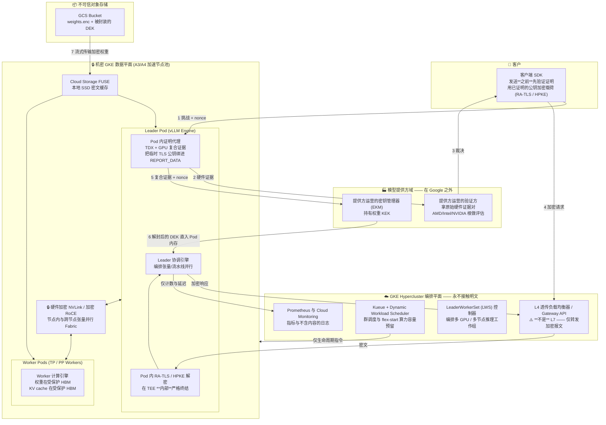
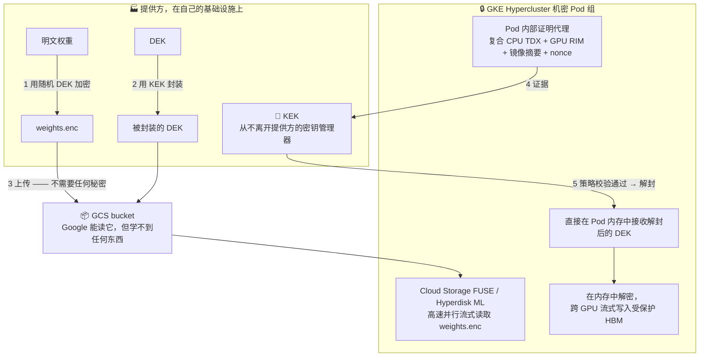
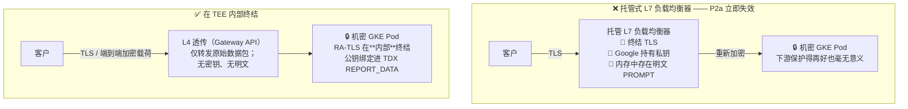
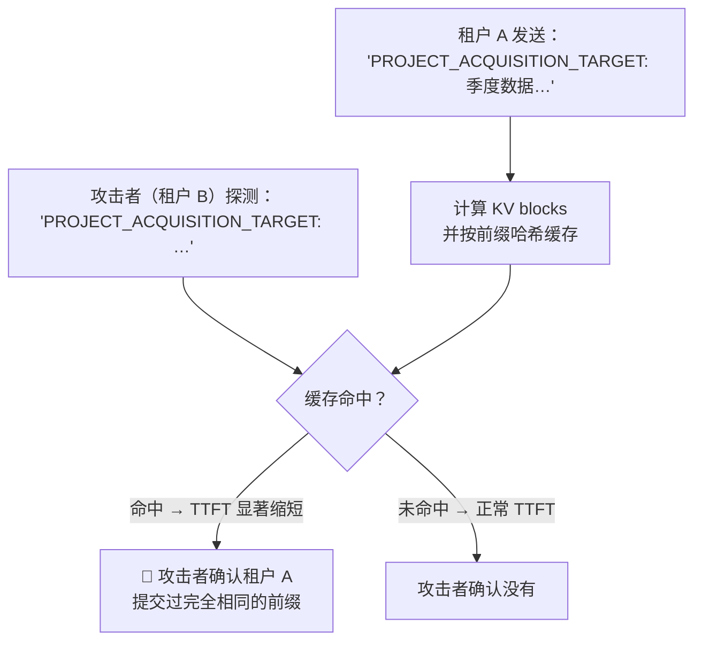
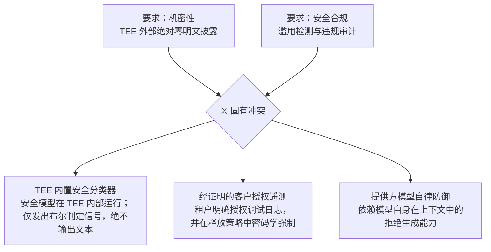

# 模块 6: 在 GKE 上设计机密 LLM 服务

本模块之前的一切，都是为了让本模块读得懂。机制已经就位：带完整性的内存加密、一条抵达容器摘要的度量链、基于证明的密钥释放、一块进入信任边界的 GPU，以及暴露它们的平台原语。本模块把它们组装成基于 **GKE Hypercluster**（以及 Google Cloud AI Hypercomputer 架构）的端到端生产级设计，然后——这才是工程文档区别于市场文档的地方——把成型的设计拖回攻击者清单过一遍，明明白白地说清楚**还有什么在泄露**。

本模块涵盖 **需求拆解**、**GKE Hypercluster 上的参考架构**、**加密权重管线**、**冷启动预算与 Hypercluster 优化**、**TLS 在哪里终结**、**KV cache 与 prefix cache 泄露**、**多租户**、**可观测性与安全监控的张力**，以及**对结果的对抗性复盘**。

---

## 第 1 部分: 需求拆解

### 1.1 把四条性质讲精确

模块 1 §5.1 非形式地陈述了 P1–P4。这里把它们写成可测试的断言，每条都点名它对抗谁。

| | 性质 | 对抗谁 | 检验：你怎么知道它失效了？ |
| :--- | :--- | :--- | :--- |
| **P1** | 模型权重仅在其度量值经模型提供方事先批准的 TEE 内部以明文存在 | 云运营商（A2、A3、A4）；终端客户 | 有任何一方能在不产出满足提供方策略的证据的情况下，拿到明文权重文件吗？ |
| **P2a** | Prompt 与生成结果仅在这样的 TEE 内部以明文存在 | 云运营商（A2、A3、A4） | 请求路径上是否存在任何一点，有 Google 运营的组件持有明文？ |
| **P2b** | 除推理所必需之外，prompt 不向模型提供方披露 | 模型提供方（B2） | 工作负载能否出网、持久化或记录内容？谁验证过它不能？ |
| **P3** | 各方均可基于扎根于硅片厂商证书的证据验证 P1、P2a、P2b，而不依赖另一方的断言 | 所有方 | 验证是否需要信任被怀疑那一方所作出的声明？ |
| **P4** | P1–P3 在有竞争力的 TTFT 与吞吐下成立，冷启动可行，硬件拿得到 | 现实 | 机密路径是否差过约 25%，或者冷启动是否无界？ |

把 P2 拆成 P2a 与 P2b 是这张表里最有用的一件事。它们是不同的问题、不同的解法：**P2a 由硬件解决，而 P2b 根本无法由硬件解决。** 设计者常常解掉 P2a，宣称解掉了 P2，然后就发布了。

### 1.2 先把做不到的说清楚

设计之前先钉死边界。以下几项**永久**不在范围内，暗示相反的设计是不诚实的：

- **对抗运营商的可用性。** Google 能停掉工作负载。永远能。
- **流量分析。** 请求数、到达时刻、载荷大小、token 间时序、会话时长，平台都看得见。对 LLM 来说这比听起来更有信息量：**输出长度可以从流式行为中直接观测到。**
- **客户自己的端点。** 如果客户的应用记录 prompt，这里的一切都帮不上忙。
- **完美的 P2b。** 如模块 1 §5.3 所确立的，证明把"信任提供方的意图"降级成"信任提供方发布的镜像"，但降不到零。闭合剩余部分需要硬件之外的透明性机制。

---

## 第 2 部分: 参考架构

### 2.1 架构范式光谱

在机密计算下提供前沿 LLM（70B、405B、MoE 架构）服务需要高带宽多 GPU 互联、分布式多节点编排、低延迟权重流式加载以及动态算力调度。现代生产架构分布在三种不同模式上：

1. **原生 GKE Hypercluster（配合机密加速节点池，主要参考架构）**：通过 [LeaderWorkerSet (LWS)](https://github.com/kubernetes-sigs/lws) 直接在机密 GPU 节点池上运行分布式推理（如 vLLM / TensorRT-LLM）。Pod 内运行的证明代理直接获取底层硬件 quote，向模型提供方外部 KMS 解封 DEK 并流式加载到受保护 HBM 中。控制面风险主要靠让运行器跑在**密封配置**下来化解（模块 5 §2.5）——它在实例侧禁用 SSH 与 shell 访问，并把签名镜像 digest 的强制点放在实例上而非控制面；Binary Authorization 镜像签名准入、严格 Pod 安全策略、私有端点以及 Pod 内端到端载荷加密则作为纵深防御。**在默认配置下这套模式不成立**，因为管理员的 SSH 会绕过上述每一项控制。
2. **GKE Hypercluster 分离平面 / 混合编排**：由 GKE Hypercluster 充当不可信前端调度器（Kueue / Dynamic Workload Scheduler）与 L4 路由器，将实际计算分发给独立的 [Confidential Space](05_google_cloud_confidential_surface.md#part-3-confidential-space) 工作节点（适用于合规政策绝对严禁任何宿主机 agent 驻留的场景）。
3. **基于机密容器（CoCo）的 GKE Hypercluster**：采用 microVM 运行时（如基于 TDX/SEV-SNP 的 Kata Containers），每个 Pod 独占独立的硬件 TEE，将宿主机 Kubelet 与操作系统彻底置于 Pod 的信任边界之外。

### 2.2 参考设计（原生 GKE Hypercluster）



### 2.3 组件逐一说明

| 组件 | 选择 | 理由 |
| :--- | :--- | :--- |
| **机密运行时** | GKE Hypercluster 机密加速节点池 | 获得完整 AI Hypercomputer 编排能力（LWS, Kueue, DWS flex-start, GCS FUSE），同时数据受硬件 TEE 保护 |
| **CPU TEE** | Intel TDX | 模块 2 §4.1——原生 `RTMR` 运行时度量、安全 EPT 完整性保护；机密 GPU 推荐路径 |
| **加速器** | NVIDIA H100/H200 (A3) 或 B200 (A4) CC 模式（`cc_mode == ON`） | 模块 4 §2.1 与 §4.2——权重与 KV cache 置于受保护 HBM 中；B200 支持 8 块 GPU 间硬件加密 NVLink |
| **工作负载编排器** | GKE 上的 LeaderWorkerSet (LWS) | 管理复杂的分布式推理拓扑（跨 Worker 工作组的张量并行 + 流水线并行） |
| **验证方** | **提供方运营**，评估原始证据 | 模块 3 §1.3——Google 运营的验证方会让 P3 变成 Google 的一句承诺 |
| **密钥管理器** | **提供方运营的外部 KMS (Cloud EKM)** | 模块 5 §4.3——Cloud KMS 会把保证降级为内部 IAM 策略 |
| **入口** | L4 透传（Gateway API）+ Pod 内 RA-TLS，或客户端载荷加密（HPKE） | 第 5 部分——L7 LB 会在 TEE 之外终结 TLS 并作废 P2a |
| **存储层** | Cloud Storage FUSE + 本地 SSD 缓存 | 将分块加密的模型权重高速并行流式读取到客户机内存中 |
| **控制面安全** | 加固版 GKE Autopilot / Standard + Binary Authorization | 通过签名容器摘要与严格准入控制消除 Kubelet/控制面注入风险 |
| **可观测性** | 仅计数、延迟与错误类别 | 第 8 部分 |

让这个架构自洽的那条核心规则，值得作为不变式写下来：

> **编排平面可以管理容量、调度作业并路由加密流量。它绝不可持有解密密钥，也绝不可观测任何明文 prompt 或权重数据。**

任何违反它的提议——一个调试端点、一个内容感知的路由器、一个模型前面的缓存层——都是对**安全架构**的改动，必须按安全改动来评审。

---

## 第 3 部分: 加密权重管线

### 3.1 GKE Hypercluster 上的流程



### 3.2 多节点与多 GPU 张量并行权重分发

在 GKE Hypercluster 上通过 LeaderWorkerSet (LWS) 运行大模型（如 70B+ 参数）的多 GPU / 多节点推理时：

1. **Leader Pod 证明**：Leader Pod 初始化并执行 CPU + GPU 复合硬件证明，向模型提供方外部 KMS (EKM) 证明自身环境，将解封后的 DEK 直接接收至受保护的客户机内存中。
2. **工作组内安全密钥/权重分发**：
   - *单节点多卡（Blackwell B200）*：权重在 CVM 内存中解密，并通过 PCIe bounce buffer 流式写入 GPU 0–7，GPU 间通过硬件加密的 NVLink 共享中间激活值。
   - *多节点分布式（跨主机流水线并行）*：Worker Pods 在 GKE Hypercluster 内部网络上通过双向 RA-TLS 频道与 Leader Pod 相互证明。解封后的 DEK（或加密的权重流）通过这条相互认证且加密的 Pod 间通道安全传输。
3. **绝不把明文权重写到磁盘**：严格在内存/`tmpfs` 中解密并直接写入 GPU HBM。Cloud Storage FUSE 与本地 SSD 仅缓存**密文**。

### 3.3 要紧的设计决策

**密钥粒度：**

| 方案 | DEK 泄露的爆炸半径 | 运维成本 |
| :--- | :--- | :--- |
| **每个模型版本一把 DEK** | 该模型版本，全网 | 最低 —— 推荐的生产起点 |
| **每个模型版本 × 每个部署地域一把 DEK** | 一个地域 | 中等 —— 强制实施地理合规边界 |
| **每实例 / 每 Pod 组一把 DEK** | 单个 Pod 工作组 | 最高 —— 使权重缓存复杂化 |

**轮转：** 轮转 KEK 意味着在提供方 KMS 中重新封装 DEK——很便宜，毫秒级生效，且完全不触碰加密后的权重文件。轮转 DEK 意味着重新加密整个模型——很贵。**将系统设计为"日常操作仅轮转 KEK"。**

**吊销：** 从释放策略里删掉一个镜像摘要，能阻止**新** Pod 拿到密钥。已在运行的 Pod 仍在内存中持有 DEK。如果吊销必须立即生效，需结合短期密钥租约与周期性重新证明机制；一旦租约续期失败，推理进程立即销毁并擦除 GPU 显存。

### 3.4 你实际要部署些什么

上面那套架构是一张图。下面这份是对象清单，而组织它的依据只有一个真正要紧的问题：**谁能改动它。** 模块 3 的实验展示过：一个握有 project-owner 权限的攻击者，压根不碰工作负载就偷走了密钥——他改的是释放策略。下面每一项的摆放位置，都是为了让那次攻击失败。

#### 提供方平面 —— 位于集群运维方的 IAM 之外

这些对象必须住在一个集群管理员并不持有其 IAM 的项目里。做不到这一点，其余的都是装饰。

| 对象 | 为什么它在这里 |
| :--- | :--- |
| **KEK**，位于 Cloud HSM 或 Cloud EKM | 密钥本身。如果它在运维方项目里，整个保证就退化成那个项目的 IAM |
| **验证服务**，评估原始证据 | 模块 3 §1.3 的第二行。即便在密封运行器上，也别让 Google Cloud Attestation 的 token 成为唯一的评估 |
| **参考值** —— 批准的度量值、TCB 下界、镜像 digest、GPU RIM | 攻击者最想改的那份白名单 |
| **Binary Authorization attestor 密钥** | 谁握着签名密钥，谁就定义了什么叫"已批准" |

#### 集群平面 —— Kubernetes 对象

```yaml
# 工作负载身份绑定：一个能联合到提供方 KMS 的 K8s SA
apiVersion: v1
kind: ServiceAccount
metadata:
  name: inference-sa
  namespace: confidential-serving
  annotations:
    iam.gke.io/gcp-service-account: infer@OPERATOR_PROJECT.iam.gserviceaccount.com
---
# 出站白名单：Pod 只与验证方、KMS 和权重存储桶通信。
# 别的都不行。正是它把"信任这个镜像"变成了"约束这个镜像"。
apiVersion: networking.k8s.io/v1
kind: NetworkPolicy
metadata:
  name: inference-egress
  namespace: confidential-serving
spec:
  podSelector:
    matchLabels: { app: inference }
  policyTypes: [Egress]
  egress:
    - to: [{ ipBlock: { cidr: PROVIDER_VERIFIER_CIDR } }]
    - to: [{ ipBlock: { cidr: PROVIDER_KMS_CIDR } }]
```

与之并列的还有：承载证明 agent 的 `LeaderWorkerSet`、一条 `requireAttestationsBy` 指向提供方 attestor 的 Binary Authorization 策略、给命名空间打上 `pod-security.kubernetes.io/enforce: restricted`，以及——在密封运行器上——由实例侧强制、把签名镜像 digest 钉死的工作负载策略。

#### RBAC，以及它到底是干什么用的

人的直觉是把 RBAC 当成一种机密性控制。在这套设计里它不是。机密性来自硬件；RBAC 存在的意义，是堵住模块 5 实验里用一条命令走通的那条**人的**路径：

```yaml
# RBAC 里没有 "deny" 动词 —— 你是靠从不授予来关掉 exec 的。
# 请审计任何授予了下面这四个子资源的 Role 或 ClusterRole。
apiVersion: rbac.authorization.k8s.io/v1
kind: Role
metadata:
  name: inference-operator
  namespace: confidential-serving
rules:
  - apiGroups: [""]
    resources: ["pods", "pods/log"]
    verbs: ["get", "list", "watch"]
  # 刻意不给的：pods/exec、pods/attach、pods/portforward、
  # pods/ephemeralcontainers。每一个都是通往信任边界内部的一个 shell。
  - apiGroups: ["leaderworkerset.x-k8s.io"]
    resources: ["leaderworkersets"]
    verbs: ["get", "list", "watch", "update"]
```

不要只顾着写新策略，更要去审计集群里**已有的**授权——对每个主体跑 `kubectl auth can-i --list`，并在所有 `ClusterRole` 里横扫一遍 `pods/exec`，包括你的平台团队早已持有的那些 `cluster-admin` 绑定。

接下来这句话让整段话保持诚实。**RBAC 由 API server 强制执行，而 API server 由 Google 运营、位于你的 TEE 之外。** 它约束的是你的工程师；它约束不了 A3 攻击者，因为后者根本不需要经过准入控制。在**密封**运行器上，这个缺口由实例自己堵上——shell 访问是在镜像里被禁用的，而不是被策略拒绝的。在默认运行器上，没有任何东西堵它。这就是上一模块 §2.5 换成部署后果的说法：对付"无意的内部人"，RBAC 是对的控制；对付"设计上的内部人"，它是错的控制。

---

## 第 4 部分: 冷启动问题与 Hypercluster 优化

### 4.1 延迟预算

冷启动是机密推理最核心的运维挑战，必须作为一份严密的预算来工程化。

| 阶段 | 发生了什么 | 机密特有的代价 |
| :--- | :--- | :--- |
| **容量分配** | GKE 调度分配 A3/A4 机密节点池 | 容量排队延迟（通过 Dynamic Workload Scheduler 消除） |
| **TEE 启动与内存接受** | 固件、guest OS、私有内存接受 | 与 VM 内存大小成正比（模块 2 §4.2.3） |
| **证明** | 合成 TDX + GPU 硬件证据并向验证方提交 | 网络往返；缓存冷时拉取厂商 collateral |
| **GPU ready state** | 证明通过后触发 `conf-compute -srs 1` | 硬件在验证前锁死计算（模块 4 §2.4） |
| **密钥释放** | 向外部 KMS 发起 EKM unwrap 请求 | 跨云 / 跨数据中心网络延迟 |
| **权重流式取回** | 从 GCS 拉取数十/数百 GB 权重 | 通过 GCS FUSE / Hyperdisk ML 并行带宽拉取 |
| **解密 + 加载至 HBM** | 内存中 AES-GCM 解密 + PCIe bounce buffer DMA | **主导耗时项**——受加密 PCIe 传输瓶颈制约（模块 4 §5.3） |
| **预热** | CUDA graph 捕获、KV cache 分配、首 token 准备 | 与非机密环境相同 |

$$
T_{\text{cold}} = T_{\text{provision}} + T_{\text{boot}} + T_{\text{attest}} + T_{\text{key}} + \frac{S_{\text{model}}}{B_{\text{fetch}}} + \frac{S_{\text{model}}}{B_{\text{cc-effective}}} + T_{\text{warm}}
$$

### 4.2 GKE Hypercluster 冷启动缓解方案

| 缓解手段 | 怎么起作用 | 安全代价 |
| :--- | :--- | :--- |
| **Dynamic Workload Scheduler (DWS) / `flex-start`** | 预先分配并群调度（Gang-schedule）整个多节点加速节点池，提供确定性的算力执行窗口 | **无。** 彻底消除运行时容量排队抖动。 |
| **Cloud Storage FUSE 本地缓存** | 在 Pod 重启间隙将加密权重块缓存在本地 NVMe SSD 上 | **无。** 缓存的数据是密文；无 DEK 无法读取任何内容。 |
| **取回与证明重叠** | 在证明与密钥释放进行的同时，通过 GCS FUSE 并行拉取加密权重 | **无。** 加密权重拉取无需任何敏感密钥。 |
| **基于 Kueue 的预热池** | 维持预先完成证明、预加载权重的 Pod 组以吸收流量尖峰 | **无。** 纯财务成本；标准生产实践。 |
| **容器镜像流式加载** | 配合辅助引导盘（Secondary boot disks）实现秒级容器冷启 | **无**，前提是容器摘要经过准入白名单校验。 |
| **量化（fp8 / int4）** | 减半或缩减四分之三通过 PCIe bounce buffer 传输的字节数 | 对机密性无代价；属于精度与速度的权衡。 |
| **VM 快照 / 恢复** | 从磁盘恢复预热好的 VM 内存镜像 | ❌ **对证明具有根本敌意。** 快照绕过了度量启动过程；启动度量值无法反映当前内存真实状态。 |

### 4.3 对自动扩缩容的后果

当冷启动以**分钟**而非秒计时，被动式自动扩缩容在流量突发时无法及时响应。GKE Hypercluster 上的可行模式：

1. **基于 Kueue 与 DWS 的预测式扩缩容**：基于流量预测曲线提前向调度器预约算力。
2. **充裕的预热池**：按照请求到达分布的 p99 峰值而非均值来预留基础常驻实例。
3. **排队与显式降级**：通过网关实施显式背压限流，防止级联超时。
4. **超配并接受成本**：机密推理档位属于高溢价企业服务，算力冗余应直接计入定价模型。

---

## 第 5 部分: TLS 在哪里终结

### 5.1 那个作废机密性的入口问题



如果在 TEE 之前由 L7 负载均衡器终结 TLS，**Prompt 就会在 Google 运营的基础设施上以明文存在**。无论下游的机密 GPU 有多安全，P2a 在第一跳就已经被打破了。

### 5.2 入口方案对比

| 方案 | 机制 | P2a 成立？ | 运维权衡 |
| :--- | :--- | :--- | :--- |
| **A. 托管 L7 LB** | Google 终结 TLS 并重新加密发给 Pod | ❌ **不成立** | 零开发成本；但完全作废机密性保证 |
| **B. L4 透传 + Pod 内 RA-TLS** | GKE Gateway API / L4 LB 转发报文；Pod 内使用绑定至证明报告的密钥终结 TLS | ✅ 成立 | 失去 L7 WAF 与路径路由能力；客户端需证明验证 SDK |
| **C. 客户端载荷加密（HPKE）** | 客户端使用 Pod 已证明的公钥加密 prompt 体；传输层 TLS 可在任意位置终结 | ✅ 成立 | 应用层协议；对网络拓扑变更或误配置具有天然免疫力 |
| **D. B + C（纵深防御）** | L4 透传与客户端载荷加密相结合 | ✅ 成立 | 最高安全等级保证 |

**建议：** 生产推荐采用 **方案 C**（客户端 HPKE 载荷加密）结合 **方案 B**（基于 GKE Gateway API 的 L4 透传）。应用层载荷加密确保即使运维人员接入了 L7 调试代理或误配置了入口网络，用户的 Prompt 明文也绝不暴露。

---

## 第 6 部分: KV Cache、Prefix Caching 与解耦推理

### 6.1 KV Cache 即 Prompt 内容

KV Cache 编码了模型处理过的所有历史 token（系统 prompt、RAG 文档、用户输入）。在机密 GPU 中，它安全地保存在硬件保护的 HBM 中。任何移动、共享或持久化 KV block 的机制，都必须遵循与 Prompt 相同的机密性要求。

### 6.2 Prefix Caching：跨租户时序预言机

Prefix caching 会复用共享前缀计算好的 KV block。一旦跨租户共享，它就会变成高精度的时序预言机：



由于 TTFT 延迟差异可以通过公网 API 轻易测量，内存加密对这种侧信道完全无能为力。

**机密服务的硬性规则：**
- **跨租户共享 Prefix Cache**：❌ **绝对禁止。**
- **租户内私有 Prefix Cache**：✅ 允许（预言机仅向租户自身暴露自身数据）。
- **静态提供方系统 Prompt 缓存**：⚠️ 仅在 Prompt 完全公开且不含任何租户数据时允许。
- **KV Cache 卸载至 CPU RAM**：✅ 允许在机密 VM 内存内；❌ 严禁卸载至宿主机共享内存。

### 6.3 GKE Hypercluster 上的 Prefill 与 Decode 解耦服务

Prefill 与 Decode 解耦（PD 分离）将计算密集的预填充节点与显存密集的解码节点拆分，在网络间传输 KV Tensor。在 GKE Hypercluster 上，这要求：

1. **双向证明（mRA-TLS）**：Prefill 与 Decode Pod 在传输张量前必须互相验证对方的硬件 TEE 与容器镜像摘要。
2. **加密跨节点 Fabric**：通过 RoCE 或 VPC 网络传输的 KV blocks 必须使用在 TEE 内部协商的临时会话密钥加密。
3. **零明文暂存**：张量绝不能在未加密的宿主机内存或未经认证的 RDMA 缓冲区中暂存。

---

## 第 7 部分: GKE Hypercluster 上的多租户

### 7.1 多租户隔离模型

| 模型 | 隔离机制 | 资源利用率 | 推荐适用场景 |
| :--- | :--- | :--- | :--- |
| **每租户独占节点池** | 节点级硬件 TEE 物理边界 | 低（每租户承担 GPU 空闲成本） | 高合规要求的顶级企业专享档 |
| **机密容器（Pod TEE）** | 共享节点上每 Pod 独占 MicroVM TEE | 高 | 兼具多租户共享与硬件隔离要求 |
| **共享 Pod 内连续批处理** | 对平台硬件隔离；**租户间属于软件隔离** | 最高 | 标准多租户推理服务（需向客户明确下述边界） |

### 7.2 多租户软件隔离注意点

在标准连续批处理中，多个租户的 token 在同一次前向传播中共享 GPU HBM 与进程空间。硬件 TEE 保护的是整个实例不受云运营商侵犯，但**租户间的隔离依赖于推理引擎（如 vLLM）内存管理代码的正确性**。引擎内部的 block 泄漏 bug 属于信任边界内部的跨租户泄露。

如果客户明确要求对抗其他恶意租户的*硬件级隔离*，必须为其分配独立机密节点或 Pod 级 MicroVM TEE。

---

## 第 8 部分: 可观测性与安全监控的张力

### 8.1 遥测数据白名单

为维持 P2a 机密性不变式，机密平面发出的遥测必须遵循严格的字段白名单：

| 信号 | 允许发出？ | 理由 |
| :--- | :--- | :--- |
| **请求计数、延迟、TTFT、TPOT** | ✅ | 不含内容的纯性能指标 |
| **Token 计数（Prompt 与 Completion）** | ✅ | 计费所需（长度本就可通过流量分析推断） |
| **错误代码与类别** | ✅ | 仅脱敏后的状态码 |
| **错误详细信息与调用栈** | ❌ | 经常内插 Prompt 文本；必须在边界处剥离 |
| **原始 Prompt / Completion 文本** | ❌ | 彻底打破 P2a |
| **Heap Dump 与 Core Dump** | ❌ | 包含明文权重与内存 Prompt 数据 |

### 8.2 安全与滥用监控的张力

负责任的 AI 服务需要检测违规内容，但机密计算禁止外部审查内容。



**生产落地方案：** 在 TEE 内部协同运行轻量级安全分类器模型。分类器仅向外发出违规布尔标记，实现平台安全合规的同时确保 Prompt 内容不外泄。

---

## 第 9 部分: 对抗性复盘

### 9.1 威胁模型评估

将成型的 GKE Hypercluster 设计拖回模块 1 的攻击者清单逐项检验：

| 攻击者 | 面对本架构的能力 | 结论 |
| :--- | :--- | :--- |
| **A1 — 恶意邻居租户** | 无法访问 CVM DRAM 或 GPU HBM；受硬件 TEE 隔离 | ✅ 已防御 |
| **A2 — 被攻破的 Hypervisor** | 在 DRAM 与 PCIe 总线上只能看到密文；受 TDX 与 GPU CC 完整性保护 | ✅ 已防御 |
| **A3 — 拥有 Host Root 的云内部人员** | 能停机或分析流量时序；无法读取权重、Prompt 或 KV Cache；无法绕过提供方 EKM 策略 | ✅ 机密性已防御 —— **仅在密封运行器上成立。** 在默认配置的 Hypercluster 实例上，平台管理员与 SRE 保有 SSH 访问权，此行应为 ❌（模块 5 §2.5） |
| **A4 — 物理 / DMA 攻击者** | 内存与总线具备硬件级完整性加密 | ✅ 已防御 |
| **B1 — 被篡改的镜像** | 在 Enclave 内拥有完全权限 | ⚠️ 依赖供应链防护：cosign 签名、Binary Authorization、证明摘要白名单 |
| **B2 — 恶意模型提供方** | 编写了持有明文 Prompt 的代码 | ⚠️ 部分防御：VPC Service Controls、阻断任意出网、开源审计（P2b 边界） |
| **B3 — 硅片 TEE 厂商** | 硬件/固件信任根 | ⚠️ 不可消除的基础信任（Intel/AMD/NVIDIA） |
| **C1 — 可用性威胁** | 云厂商可随时终止实例 | ❌ 不在范围内 |
| **C2 — 流量时序分析** | 报文速率、流式生成节奏、载荷大小可见 | ❌ 不在范围内；需向客户披露 |
| **C3 — 侧信道攻击** | 针对 DRAM/Cache 的密文侧信道 | ⚠️ 通过及时升级固件与强制 TCB 基线缓解 |

### 9.2 六项断言核对清单

| 断言 | 验证状态 | 本架构中的具体实现 |
| :--- | :--- | :--- |
| **1. 权重静态加密** | ✅ 通过 | GCS 中使用提供方 KEK 封装的 AES-256-GCM 密文（§3.1） |
| **2. 权重仅在 TEE 中解密** | ✅ 通过 | 仅当硬件 TDX + GPU CC 证明通过后 EKM 才向内存释放 DEK（§3.1） |
| **3. 运行经批准的镜像** | ✅ 通过 | Binary Authorization + 证明令牌中校验镜像摘要 |
| **4. 宿主机 RAM 不可读** | ✅ 通过 | Intel TDX 硬件内存加密与安全 EPT 完整性校验 |
| **5. GPU HBM 不可读** | ✅ 通过 | 启用 NVIDIA CC 模式（`cc_mode == ON`）与受保护 HBM |
| **6. 提供方自主验证** | ✅ 通过 | 提供方验证服务根据芯片厂商根证书验证原始证据 |

---

## Lab: 在 GKE Hypercluster 上部署生产级机密 LLM 服务

**目标：** 在 GKE Hypercluster 机密 GPU 节点池上，使用 LeaderWorkerSet (LWS) 与 vLLM 部署前沿大模型（如 70B 参数模型），完成基于外部 KMS 的证明密钥释放与 Pod 内 RA-TLS 验证。

### 第 1 步 —— 创建带机密加速节点池的 GKE Hypercluster

```bash
# 创建具备加固控制面的 GKE 集群
gcloud container clusters create-auto cc-hypercluster \
  --location=us-central1 \
  --release-channel=rapid

# 创建机密 GPU 节点池（Intel TDX + NVIDIA H100/B200）
gcloud container node-pools create cc-gpu-pool \
  --cluster=cc-hypercluster \
  --location=us-central1 \
  --node-locations=us-central1-a \
  --machine-type=a3-highgpu-1g \
  --confidential-node-type=tdx \
  --accelerator=type=nvidia-h100-80gb,count=1,gpu-driver-version=latest \
  --enable-gvnic \
  --num-nodes=2
```

### 第 2 步 —— 配置加密存储与 GCS FUSE

```bash
# 生成随机 DEK，加密模型权重并封装
openssl rand -out dek.bin 32
tar cf - ./model-70b | openssl enc -aes-256-gcm -kfile dek.bin > model.enc
gcloud kms encrypt --key=weights-kek --keyring=cc-ring --location=global \
  --plaintext-file=dek.bin --ciphertext-file=dek.wrapped
gsutil cp model.enc dek.wrapped gs://cc-model-store/
shred -u dek.bin
```

### 第 3 步 —— 部署带证明代理的 LeaderWorkerSet

```yaml
apiVersion: leaderworkerset.x-k8s.io/v1
kind: LeaderWorkerSet
metadata:
  name: vllm-confidential-70b
spec:
  replicas: 1
  leaderWorkerTemplate:
    size: 2
    leaderTemplate:
      metadata:
        labels:
          role: leader
      spec:
        containers:
        - name: vllm-leader
          image: us-docker.pkg.dev/PROJECT/REPO/vllm-cc:v1@sha256:APPROVED_DIGEST
          securityContext:
            allowPrivilegeEscalation: false
            capabilities:
              drop: ["ALL"]
          env:
          - name: MODEL_BUCKET
            value: "gs://cc-model-store"
          - name: EKM_ENDPOINT
            value: "https://kms.provider.com/unwrap"
          volumeMounts:
          - name: gcs-fuse-csi
            mountPath: /data
        volumes:
        - name: gcs-fuse-csi
          csi:
            driver: gcsfuse.csi.storage.gke.io
            readOnly: true
    workerTemplate:
      spec:
        containers:
        - name: vllm-worker
          image: us-docker.pkg.dev/PROJECT/REPO/vllm-cc:v1@sha256:APPROVED_DIGEST
```

### 第 4 步 —— 验证端到端证明与密钥释放

1. Leader Pod 生成包含 TDX + H100 CC 模式的复合硬件证据。
2. Pod 将证据与 nonce 提交给模型提供方的外部 KMS (EKM)。
3. 策略评估通过后，解封的 DEK 通过 TLS 直传回 Pod 内存。
4. Pod 从 GCS FUSE 流式拉取 `model.enc`，在内存中解密并载入受保护 HBM。
5. 客户端 SDK 请求 Pod 的证明报告，校验绑定的 RA-TLS 临时密钥，发起端到端加密推理请求。

---

## 总结：GKE 机密推理设计核对清单

| 决策点 | 生产推荐方案 | 妥协的后果 |
| :--- | :--- | :--- |
| **机密基础设施** | GKE Hypercluster（TDX + H100/B200 CC 节点池） | 普通节点将内存直接暴露给 Hypervisor 与云内部人员 |
| **工作负载编排** | LeaderWorkerSet (LWS) + Dynamic Workload Scheduler flex-start | 无法在证明约束下高效协同多节点张量并行 |
| **密钥释放门控** | 提供方自主运营的外部 KMS (Cloud EKM) 评估原始硬件证据 | Cloud KMS 将安全保证降级为一条云端 IAM 策略 |
| **TLS 与入口** | L4 透传（Gateway API）+ Pod 内 RA-TLS / 客户端 HPKE | 托管 L7 LB 会终结 TLS 并在云端内存中持有明文 Prompt |
| **权重传输** | Cloud Storage FUSE + 内存解密直接流式写入受保护 HBM | 磁盘上的明文权重文件可被云平台随意读取 |
| **冷启动策略** | DWS flex-start + FUSE 本地缓存 + 预热池 | 分钟级冷启动将在流量尖峰时导致严重的请求超时 |
| **Prefix Caching** | 严格按租户隔离，绝对禁止跨租户共享 | 共享缓存成为时序预言机，泄露其他租户的 Prompt 内容 |
| **解耦服务** | 双向 RA-TLS 互信 + 跨节点加密传输 Fabric | 明文 KV 激活值在网络中裸传 |
| **遥测与可观测性** | 严格字段白名单；脱敏状态码；零 Prompt 文本记录 | 未捕获的异常堆栈将用户 Prompt 泄露至 Cloud Logging |
| **安全监控** | TEE 内置分类器模型发出违规判定信号 | 陷入完全无法监控安全或彻底侵犯用户隐私的两难 |

设计已经完整且立得住。接下来要做的是衡量其性能开销、在缺乏传统调试手段时完成生产运维，并理解证明约束下的机群生命周期。这就是 **[模块 7: 性能、运维与评估](07_performance_operations_and_evaluation.md)**。
