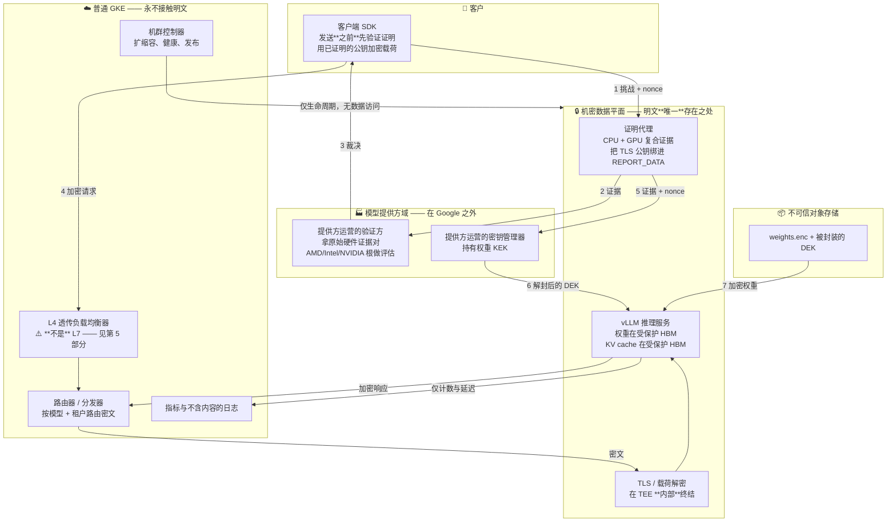
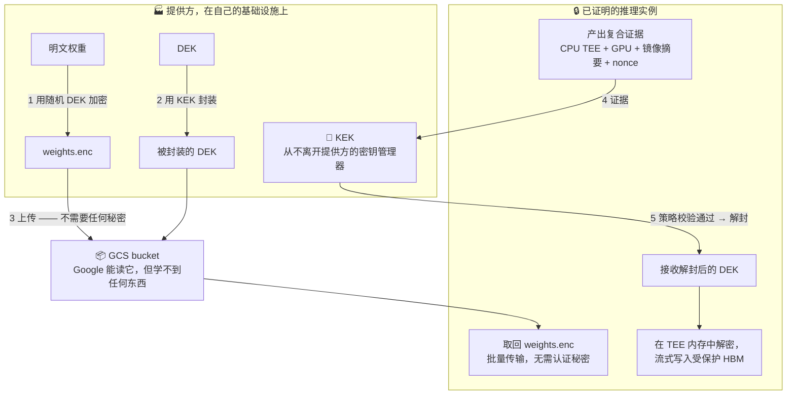
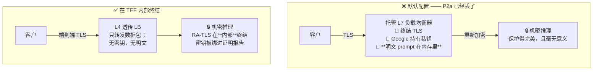
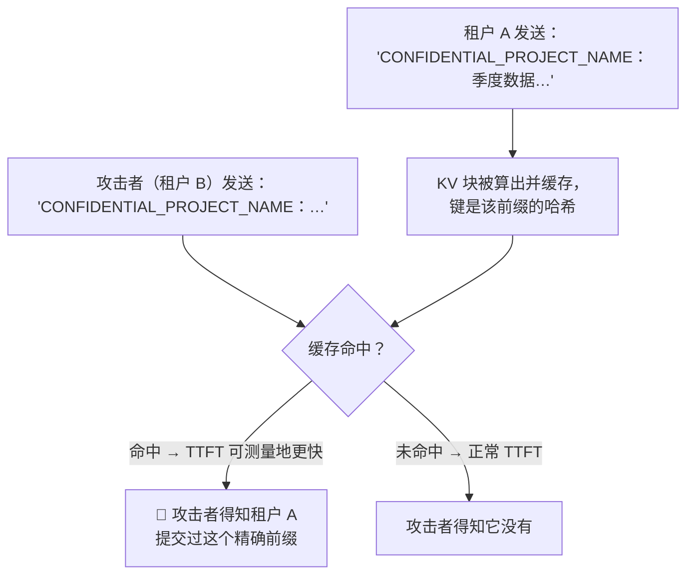
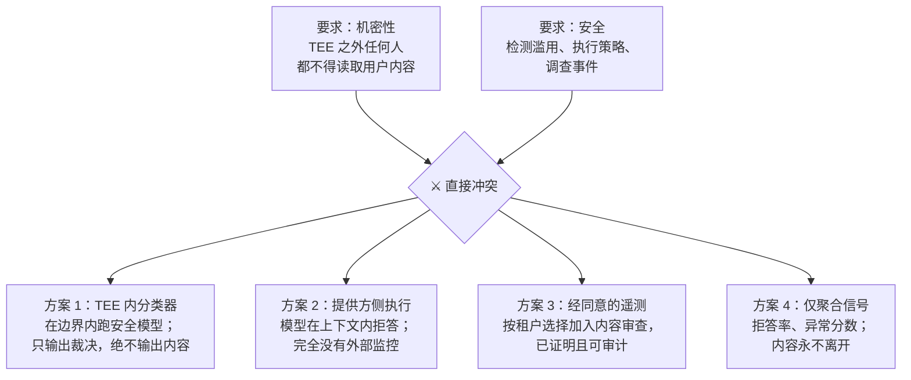

# 模块 6: 在 GKE 上设计机密 LLM 服务

本模块之前的一切，都是为了让本模块读得懂。机制已经就位：带完整性的内存加密、一条抵达容器摘要的度量链、基于证明的密钥释放、一块进入信任边界的 GPU，以及暴露它们的平台原语。本模块把它们组装成一个设计，然后——这才是工程文档区别于市场文档的地方——把成型的设计拖回攻击者清单过一遍，明明白白地说清楚**还有什么在泄露**。

本模块涵盖 **需求拆解**、**参考架构**、**加密权重管线**、**冷启动预算**、**TLS 在哪里终结**、**KV cache 与 prefix cache 泄露**、**多租户**、**可观测性与安全监控的张力**，以及**对结果的对抗性复盘**。

---

## 第 1 部分: 需求拆解

### 1.1 把四条性质讲精确

模块 1 §5.1 非形式地陈述了 P1–P4。这里把它们写成可测试的断言，每条都点名它对抗谁。

| | 性质 | 对抗谁 | 检验：你怎么知道它失效了？ |
| :--- | :--- | :--- | :--- |
| **P1** | 模型权重仅在其度量值经模型提供方事先批准的 TEE 内部以明文存在 | 云运营商（A2、A3、A4）；终端客户 | 有任何一方能在不产出满足提供方策略的证据的情况下，拿到明文权重文件吗？ |
| **P2a** | Prompt 与生成结果仅在这样的 TEE 内部以明文存在 | 云运营商（A2、A3、A4） | 请求路径上是否存在任何一点，有 Google 运营的组件持有明文？ |
| **P2b** | 除推理所必需之外，prompt 不向模型提供方披露 | 模型提供方（B2） | 工作负载能否出网、持久化或记录内容？谁验证过它不能？ |
| **P3** | 各方均可基于扎根于硅片厂商证书的证据验证 P1、P2a、P2b，而不依赖另一方的断言 | 所有方 | 验证是否需要信任被怀疑那一方所作出的声明？ |
| **P4** | P1–P3 在有竞争力的 TTFT 与吞吐下成立，冷启动可行，硬件拿得到 | 现实 | 机密路径是否差过约 25%，或者冷启动是否无界？ |

把 P2 拆成 P2a 与 P2b 是这张表里最有用的一件事。它们是不同的问题、不同的解法：**P2a 由硬件解决，而 P2b 根本无法由硬件解决。** 设计者常常解掉 P2a，宣称解掉了 P2，然后就发布了。

### 1.2 先把做不到的说清楚

设计之前先钉死边界。以下几项**永久**不在范围内，暗示相反的设计是不诚实的：

- **对抗运营商的可用性。** Google 能停掉工作负载。永远能。
- **流量分析。** 请求数、到达时刻、载荷大小、token 间时序、会话时长，平台都看得见。对 LLM 来说这比听起来更有信息量：**输出长度可以从流式行为中直接观测到。**
- **客户自己的端点。** 如果客户的应用记录 prompt，这里的一切都帮不上忙。
- **完美的 P2b。** 如模块 1 §5.3 所确立的，证明把"信任提供方的意图"降级成"信任提供方发布的镜像"，但降不到零。闭合剩余部分需要硬件之外的透明性机制。

---

## 第 2 部分: 参考架构

### 2.1 设计



### 2.2 组件逐一说明

| 组件 | 选择 | 理由 |
| :--- | :--- | :--- |
| 机密运行时 | Confidential Space 实例，由普通 GKE 中的控制器编排 | 模块 5 §6.2——Confidential GKE Nodes 会让 Google 运营的控制面能向信任边界注入代码 |
| CPU TEE | Intel TDX | 模块 2 §4.1——原生 `RTMR` 运行时度量；而且它就是机密 GPU 路径 |
| 加速器 | CC 模式 H100，断言 `cc_mode == ON`，每实例一块 | 模块 4 §2.1 与 §4.1 |
| 验证方 | **提供方运营**，评估原始证据 | 模块 3 §1.3——Google 运营的验证方会让 P3 变成 Google 的一句承诺 |
| 密钥管理器 | **提供方运营的外部 KMS** | 模块 5 §4.3——Cloud KMS 会把保证降级为一条 IAM 策略 |
| 入口 | L4 透传，或客户端载荷加密 | 第 5 部分——L7 LB 会在 TEE 之外终结 TLS 并作废 P2a |
| 控制面 | 普通 GKE，显式置于信任边界之外 | 它**可以**编排；它**绝不能**看到明文 |
| 可观测性 | 仅计数、延迟与错误类别 | 第 8 部分 |

让这个分离平面设计自洽的那条规则，值得作为不变式写下来：

> **编排平面可以启动、停止、伸缩机密平面并向其路由。它绝不可持有任何能解密什么东西的密钥，也绝不可观测任何请求或响应内容。**

任何违反它的提议——一个调试端点、一个内容感知的路由器、一个模型前面的缓存层——都是对**安全架构**的改动，必须按安全改动来评审。

---

## 第 3 部分: 加密权重管线

### 3.1 流程



### 3.2 要紧的设计决策

**绝不把明文权重写到磁盘。** 解密到内存，再流进 GPU 显存。持久盘上的明文权重文件，无论它是怎么到那儿的，平台都读得到。如果内存压力迫使你做暂存，那就暂存到 TEE 内部的 `tmpfs`，绝不放到持久卷上。

**密钥粒度。** 三种合理方案，各有真实权衡：

| 方案 | DEK 泄露的爆炸半径 | 运维成本 |
| :--- | :--- | :--- |
| 每个模型版本一把 DEK | 该模型版本，全网 | 最低 |
| 每个模型版本 × 每个部署地域一把 DEK | 一个地域 | 中等 |
| 每实例一把 DEK，在释放时派生 | 一个实例 | 最高；使缓存复杂化 |

"按模型版本"是通常的起点。当监管边界要紧时，"按地域"值得。

**轮转。** 轮转 KEK 意味着重新封装 DEK——很便宜，且完全不触碰加密后的权重。轮转 DEK 意味着重新加密模型——很贵。**把设计做成"日常操作是 KEK 轮转"。**

**吊销。** 从释放策略里删掉一个镜像摘要，能阻止**新**实例拿到密钥；它**阻止不了**已经在跑、密钥已在内存里的实例。如果吊销必须立即生效，你需要短期密钥租约与周期性重新证明，并让工作负载在租约续不上时自行终止。想清楚你需要哪一种；两者的差别是**设计改动**，不是配置改动。

---

## 第 4 部分: 冷启动问题

### 4.1 预算

这是整个设计中最主要的实际成本，它需要是一份**预算**，而不是一个愿望。

| 阶段 | 发生了什么 | 机密特有的代价 |
| :--- | :--- | :--- |
| 实例预置 | 分配一台 A3 机密实例 | 容量受限；可能排队 |
| TEE 启动 | 固件、guest kernel、**私有内存接受** | 接受循环与 VM 内存成正比（模块 2 §4.2.3） |
| 证明 | 合成 CPU + GPU 证据，与验证方往返 | 网络往返；缓存冷时还要取厂商 collateral |
| GPU ready state | 证明成功后执行 `conf-compute -srs 1` | 在此之前硬件拒绝计算（模块 4 §2.4） |
| 密钥释放 | 与提供方外部密钥管理器往返 | 跨组织网络依赖 |
| 权重取回 | 从对象存储拉数十 GB | 与非机密相同 |
| 解密 + 加载 | 在 TEE 内存中解密，流式写入受保护 HBM | **大头**——每个字节都要加密、bounce、DMA、解密（模块 4 §5.3） |
| 预热 | CUDA graph 捕获、首 token 延迟稳定 | 与非机密相同 |

有两个结构性性质让它比普通冷启动更糟：这个序列在很大程度上是**串行**的（你不能在证明之前取密钥，也不能在 GPU 就绪之前加载权重），而且它对验证方与密钥管理器有**外部依赖**，这是普通部署所没有的。

$$
T_{\text{cold}} = T_{\text{provision}} + T_{\text{boot}} + T_{\text{attest}} + T_{\text{key}} + \frac{S_{\text{model}}}{B_{\text{fetch}}} + \frac{S_{\text{model}}}{B_{\text{cc-effective}}} + T_{\text{warm}}
$$

**逐项分别测量。** 一个混合数字不会告诉你该攻哪一项。

### 4.2 缓解手段及其安全代价

| 缓解手段 | 怎么起作用 | 安全代价 |
| :--- | :--- | :--- |
| **预热池** | 预先证明、预先加载的实例吸收需求尖峰 | **无。** 只是花钱。这是首要答案。 |
| **取回与证明重叠** | 在证明在途时就去拉加密权重；它们不需要任何秘密 | **无。** 白捡的收益，而且经常被漏掉。 |
| **封存的本地缓存** | 用封存密钥把已解密权重缓存在本地 SSD（模块 1 §3.5） | 中等——把攻击面扩展到持久介质；且缓存绑定到度量值，镜像更新即作废 |
| **激进缓存 collateral** | 避免在关键路径上冷取 AMD KDS 或 Intel PCS | 无，前提是陈旧问题被处理（模块 3 §4.2） |
| **量化** | 要解密与传输的字节更少；还能缓解 Hopper 的 80 GB 天花板 | 对机密性无代价；这是一个质量决策 |
| **VM 快照 / 恢复** | 能完全跳过启动与加载 | ❌ **对证明具有根本敌意。** 快照在不重新执行被度量的启动路径的情况下恢复内存状态；launch measurement 不再反映这块内存是如何形成的。**在没有专门为此设计的方案之前，别做这个。** |

快照那一行值得强调，因为它是**最诱人**、也是最能悄无声息毁掉保证的优化。如果有人提议它，该问的问题是：**对一台内存是被"恢复"而不是被"构建"出来的 VM，launch measurement 还意味着什么？**

### 4.3 对自动扩缩容的后果

当冷启动以**分钟**而非秒计时，被动式自动扩缩容就不管用了——等新实例开始服务时，流量尖峰早就过去了。可行的模式是：

1. **预测式扩缩容**，基于流量预测而非瞬时队列深度。
2. **充裕的预热池**，按到达过程的 p99 而非均值来定容量。
3. **排队并降级**，承认部分请求要等，用显式背压而不是超时。
4. **超配并接受成本。** 对一个溢价机密档位来说，这往往是诚实的答案，而且它应当**计入定价**，而不是靠工程去绕开。

---

## 第 5 部分: TLS 在哪里终结

### 5.1 那个作废其余一切的问题

这是机密推理设计中最常见的无声失效，值得说得直白些。



这个失效的后果一点都不微妙，却在评审中极易被漏掉——因为架构中**机密的那部分确实是正确的**。prompt 在到达 TEE 之前，就已经是 Google 运营的负载均衡器里的明文了。**P2a 在第一跳就失效了**，而那一点之后的每一张图，描述的都是一份已经不再要紧的保护。

### 5.2 选项

| 选项 | 怎么工作 | P2a 成立？ | 代价 |
| :--- | :--- | :--- | :--- |
| **A. 托管 L7 LB** | Google 终结 TLS，重新加密到后端 | ❌ **否** | 零工作量；零保证 |
| **B. L4 透传 + TEE 内 RA-TLS** | LB 转发数据包；TEE 持有唯一私钥，并绑进它的证明报告（模块 3 §6） | ✅ 是 | 失去 L7 路由、WAF、HTTP 感知限流；客户端需要自定义校验 |
| **C. 客户端载荷加密** | 客户端用一把只释放给已证明 TEE 的公钥加密 prompt（HPKE）；传输层 TLS 在哪终结都行 | ✅ 是 | 应用层协议；需要客户端 SDK；流式响应需逐块加密 |
| **D. B + C 一起** | 双保险 | ✅ 是 | 复杂度最高 |

### 5.3 建议

**选 C，并在客户端支持得了的地方同时上 B。**

理由是选项 C **优雅降级**。载荷加密与传输层无关，因此这个设计能在负载均衡器配置错误、服务网格变更，或者某位 SRE 出于正当运维理由加了一跳 L7 之后**依然成立**。单靠选项 B 是正确的，但脆弱：它依赖一条网络拓扑不变式，而一个不相干的团队可以在完全不知道自己破坏了什么的情况下破坏它。

选项 C 的代价是真实的：每一个客户端都必须使用一个 SDK 去取回已证明公钥、验证证明、加密载荷、解密流式分块。对第一方或企业集成，这可以接受。对一个公开的、curl 就能用的 API，这是实打实的采纳障碍——**这也正是机密推理产品往往是企业档位而非默认端点的原因。**

**无论你选哪个，都把那条不变式写下来并为它加一个测试。** "任何 Google 运营的组件都不曾持有能解密请求内容的密钥"是一条你可以在设计评审上断言、并且花点力气就能持续验证的性质。

---

## 第 6 部分: KV cache、Prefix Caching 与分离式推理

### 6.1 KV cache 就是 prompt 内容

KV cache 是模型所关注过的一切的、按请求的张量编码：system prompt、检索到的文档、用户消息、对话历史。**请以对待 prompt 本身的敏感度来对待它**，因为它就是那个东西。

在机密 GPU 内部，它住在受保护 HBM 里，没问题。危险来自每一个**移动它、共享它或持久化它**的机制。

### 6.2 Prefix Caching：一条等价于明文的泄露信道

Prefix caching 跨请求复用共享 prompt 前缀已算好的 KV 块。它是现代服务中价值最高的优化之一。它同时也是——**跨租户时**——一条信息泄露信道，而且更糟的是，一条**可主动探测**的信道。



这是一条针对**其他租户 prompt 内容**的时序预言机。一个拥有 API 访问权的攻击者可以通过观测 TTFT 来二分搜索一个秘密。**内存加密在这里毫无帮助**——泄露走的是**延迟**，不是内存访问，而延迟对任何能发请求的人都可见。

**规则：**

| 配置 | 裁决 |
| :--- | :--- |
| Prefix cache 跨租户共享 | ❌ **绝不。** 这是一台跨租户内容预言机。 |
| Prefix cache 按租户隔离 | ✅ 可接受——预言机只会把租户自己的 prompt 泄露给自己 |
| 为提供方提供的 system prompt 做共享 prefix cache | ⚠️ 仅当该前缀不是秘密时可接受；务必确认其中不含租户数据 |
| KV cache 卸载到 CPU 内存 | ✅ 在机密 VM 内部没问题；❌ 绝不卸载到 host 共享内存 |
| KV cache 持久化到磁盘 | ❌ 除非用证明门控的密钥加密，否则不行 |

一条适用范围远超 prefix caching 的通则：**任何以内容为键、跨信任边界共享的缓存，都是该内容的一台预言机。** 把它同样应用到 tokenizer 缓存、语义缓存、embedding 缓存和投机解码的草稿缓存上。

### 6.3 分离式 Prefill 与 Decode

分离式服务把 prefill 与 decode 跑在不同机器上，并在它们之间搬运 KV cache。这是一项可观的吞吐收益，而如果实现得天真，它会在信任边界上开一辆卡车过去。

KV cache——也就是 prompt 内容——要在两个节点之间跨网络传输。在机密设计中，这次传输必须：

1. **传输中加密**，密钥由两个 TEE 之间协商建立。
2. **双向证明**——prefill 节点在发送前必须验证 decode 节点是一个被批准的、已证明的 TEE，反之亦然。否则攻击者起一个假 decode 节点就能收到明文 KV 块。
3. **不在任何中间缓冲区、传输服务或 RDMA 暂存区里以明文暂存。**

这相当于在推理节点之间、在热路径上、对大张量做 RA-TLS（模块 3 §6）。可以做到，但分离式带来的性能收益必须与增加的延迟和显著增加的复杂度相权衡。**对第一版机密部署，不要做分离式。** 先把单节点路径做对、测准，再回头考虑。

---

## 第 7 部分: 多租户

### 7.1 光谱

| 模型 | 隔离性 | 效率 | 什么时候是对的 |
| :--- | :--- | :--- | :--- |
| **每租户一实例** | 最强——租户之间隔着一道 TEE 边界 | 差：每租户一块 GPU，每租户一次冷启动 | 高价值租户；监管隔离要求 |
| **每模型一实例，租户混批** | 相对平台是硬件隔离；**租户之间是软件隔离** | 好——标准服务模型 | 多数场景，前提是你接受下面那条注意事项 |
| **一实例多模型** | 最弱 | 最好 | 在机密单卡约束下本来也做不了 |

### 7.2 必须说明的那条注意事项

在中间那一行——也就是常规那一行——连续批处理会把多个租户的 token 放进同一次前向、同一块 GPU 显存、同一个进程。TEE 边界围的是**整个实例**，而不是每个租户。

**后果**：租户 A 与租户 B 之间的隔离，是由推理服务请求处理逻辑的**正确性**来保证的，而不是由硬件保证的。vLLM 块管理器里一个在序列之间泄露 KV 块的 bug，就是一次跨租户数据泄露，而机密计算对此**无能为力**——泄露完全发生在信任边界**之内**。

这值得对客户明说，因为"机密计算"的自然读法是"与其他租户硬件隔离"，而**批处理部署提供的不是这个**。它提供的是相对**平台**的硬件隔离，那是另一个、同样有价值的性质。把两者混为一谈，正是那种会在安全评审时变成问题的不精确。

如果某个租户要求与其他租户硬件隔离，他们需要独占实例——而那应该是一个**定价档位**，而不是一场争论。

### 7.3 可观测的跨租户信号

即便隔离正确，共享实例的租户之间仍可间接互相观测：

- **排队延迟**揭示其他租户的负载。
- **批次组成**对 token 间延迟的影响揭示并发活动。
- **Prefix cache 命中**在共享时揭示内容（§6.2）。
- 内存压力下的**抢占与驱逐**揭示其他租户的序列长度。

在多数威胁模型下这些都不致命，但它们该被写进设计文档里**枚举出来**，而不是被客户的红队发现。

---

## 第 8 部分: 可观测性与安全监控盲区

### 8.1 你能输出什么

§2.2 的不变式把遥测约束得很死。一份可用的分类：

| 信号 | 输出？ | 备注 |
| :--- | :--- | :--- |
| 请求数、延迟、TTFT、TPOT | ✅ | 不含内容 |
| Token 计数（输入与输出） | ✅ | 计费需要；注意它**确实**是一点点泄露——不过长度本来就可观测 |
| 错误类别与错误码 | ✅ | 而**不是**错误**消息**，后者常常内嵌内容 |
| 模型、版本、实例、证明状态 | ✅ | 运维必需 |
| 队列深度、批大小、缓存命中率 | ⚠️ | 仅聚合值；按租户的缓存命中率会泄露（§6.2） |
| Prompt 或生成结果文本 | ❌ | 作废 P2a |
| 堆栈跟踪、core dump | ❌ | 例行地包含内容 |
| 用于质量评估的采样请求 | ❌ | 哪怕 0.1% 的采样也是一条明文外泄信道 |

堆栈跟踪那一行是生产中真会咬人的。一个未处理异常，其消息里带着 prompt 的一部分，被写进 Cloud Logging——这是一次经由**普通代码路径**的明文泄露，而没有人把那条路径当作安全边界来评审过。**这里，带显式字段白名单的结构化日志不是可选项**——黑名单一定会失守。

### 8.2 安全监控的张力

这是那个真正困难、尚未解决的问题，它值得被**点名**，而不是被悄悄绕过。

负责任的模型服务包含滥用监控、安全分类和事件调查。这些全都需要读取用户内容。机密计算禁止在 TEE 之外读取用户内容。**这两条要求直接冲突。**



没有一个是完整的：

- **TEE 内分类器**适用于自动化策略执行，是最强的选项，但它支撑不了对某个具体事件的人工复核，会增加延迟，并且会扩大被度量的镜像。
- **提供方侧执行**完全依赖模型行为，没有纵深防御。
- **经同意的遥测**对企业客户是诚实且可行的，而且它应当是**被证明的**——租户的同意状态应当是策略所执行的一部分，而不是运营商拨的一个开关。
- **聚合信号**告诉你出事了，但不告诉你出了什么事。

**该采取的设计立场**：挑一个组合，把它写进面向客户的文档，并且明说机密档位的**滥用监控弱于**标准档位。那是客户有权知道的一个真实权衡，而假装不是，正是一套安全架构变成负债的方式。

---

## 第 9 部分: 对抗性复盘

现在动用模块 1 §2.1 的那套纪律。拿成型的设计，把攻击者清单走一遍。

### 9.1 复盘

| 攻击者 | 对本设计的能力 | 裁决 |
| :--- | :--- | :--- |
| **A1 —— 恶意同租户** | 读不到另一台机密实例的内存 | ✅ 已解决 |
| **A2 —— 被攻陷的 hypervisor** | 在 DRAM 与 PCIe 路径上看到的是密文；有完整性保护 | ✅ 已解决 |
| **A3 —— 拿到 host root 的云内部人员** | 能停掉负载、观测流量模式、尝试密文侧信道。读不到权重或 prompt。改不了释放策略——它在提供方的密钥管理器里 | ✅ 机密性方面已解决 |
| **A4 —— 物理攻击者** | DRAM 与总线内容是带完整性的密文 | ✅ 已解决 |
| **B1 —— 被攻陷的工作负载镜像** | 对边界内一切拥有完整访问权 | ⚠️ **仅靠供应链缓解**：最小镜像、签名、可复现构建、已证明的摘要白名单 |
| **B2 —— 恶意模型提供方** | 写了那份持有明文 prompt 的代码 | ⚠️ **部分解决**：不出网、不持久化、已证明摘要、VPC-SC。对镜像行为的残余信任仍在——这就是 P2b，硬件解不了 |
| **B3 —— TEE 厂商** | AMD、Intel、NVIDIA 固件按构造被信任 | ⚠️ 不可约减；在设计文档里点名它 |
| **C1 —— 可用性** | Google 可随时终止工作负载 | ❌ 永久不在范围内 |
| **C2 —— 流量分析** | 请求数、大小、时序、流式行为全都可见 | ❌ 不在范围内；披露它 |
| **C3 —— 侧信道** | 针对 guest 内存中密钥的密文侧信道；单步执行 | ⚠️ 真实存在；保持固件最新，尽量减少 guest DRAM 中的长期密钥 |
| **C4 —— 客户自己的端点** | 客户可能记录自己的明文 | ❌ 不在范围内 |

### 9.2 一个拿到 host root 的内部人员仍然能做什么

直说，因为模型提供方的安全团队问的就是这个：

1. **停掉你。** 终止实例、不给容量、吊销项目。
2. **观测元数据。** 多少请求、多大、多频繁、响应流了多久——由此可**直接推断输出长度**。
3. **尝试侧信道。** 针对 guest 内存中密码学密钥的密文侧信道（模块 2 §5.1）；用单步执行放大其他信道。不轻松，但也不是理论上的。
4. **攻击供应链。** 如果他们能影响构建出什么镜像、或者哪个摘要进了白名单，他们就赢了——**这正是白名单必须住在提供方的密钥管理器里、而不是一条 Google Cloud IAM 策略里的原因。**
5. **经由固件漏洞提权。** 这正是模块 3 §4.2 里的 TCB 下限与更新姿态是**安全控制**而非卫生习惯的原因。

他们**做不到**的：读权重、读 prompt、读生成结果、读 KV cache。

### 9.3 六论断清单，逐条回答

模块 1 §5.2 把"Google 看不到权重"分解成了六条可核验论断。成型的设计：

| 论断 | 本设计中的状态 |
| :--- | :--- |
| 权重以 Google 不持有的密钥静态加密 | ✅ 提供方运营的外部密钥管理器（§2.2、§3.1） |
| 权重仅在 TEE 内部被解密 | ✅ 基于证明的密钥释放（§3.1） |
| TEE 运行的正是被批准的那个镜像 | ✅ 令牌中的 Confidential Space 镜像摘要；⚠️ 受模块 3 §7 参考值问题所限 |
| Host RAM 不可读 | ✅ 带完整性的 TDX 内存加密 |
| GPU HBM 不可读 | ✅ 释放策略中断言 `cc_mode == ON` |
| 提供方能自行验证以上全部 | ✅ 提供方运营的验证方，评估原始证据 |

六中之六——第三行上带一个诚实的星号，那就是参考值问题，也是模块 3 §7 存在的理由。

---

## Lab: 端到端机密推理

**目标**：在一台带 CC 模式 H100 的 Confidential Space 实例里跑一个小模型，权重密钥仅在 CPU + GPU + 镜像的复合证明通过后释放，并让客户端在发送 prompt **之前**先验证证明。

**成本**：⚠️ **昂贵。** 一台 A3 实例，按时长计费。预留两小时，做完全部删除。**状态**：本实验由模块 3、4、5 实验中已核验的部件组合而成；**组合本身**是作为设计练习给出的。请逐条对照当前文档核验。

### 第 1 步 —— 加密一个模型

```bash
# 生成 DEK、加密模型、用你控制的 KEK 封装 DEK
openssl rand -out dek.bin 32
tar czf - ./model | openssl enc -aes-256-gcm -kfile dek.bin > model.enc
gcloud kms encrypt --key=weights-kek --keyring=cc-lab --location=global \
  --plaintext-file=dek.bin --ciphertext-file=dek.wrapped
gsutil cp model.enc dek.wrapped gs://YOUR_BUCKET/
shred -u dek.bin   # 明文 DEK 不得在这一步之后存活
```

### 第 2 步 —— 构建推理镜像

容器应当按顺序做：从 launcher socket 请求证明令牌；换取凭据；解封 DEK；取回并把模型解密到 `tmpfs`；启动 vLLM；暴露一个返回自身证明令牌的端点，好让客户端验证它。

用 cosign 给镜像签名并记下摘要。

### 第 3 步 —— 写复合释放策略

```bash
gcloud iam workload-identity-pools providers create-oidc cc-infer-provider \
  --location=global \
  --workload-identity-pool=cc-lab-pool \
  --issuer-uri="https://confidentialcomputing.googleapis.com" \
  --allowed-audiences="https://sts.googleapis.com" \
  --attribute-mapping="google.subject=assertion.sub" \
  --attribute-condition="
    assertion.swname == 'CONFIDENTIAL_SPACE'
    && assertion.dbgstat == 'disabled-since-boot'
    && 'sha256:YOUR_DIGEST' in assertion.submods.container.image_digest
    && assertion.submods.nvidia_gpu.cc_mode == 'ON'
  "
```

### 第 4 步 —— 部署并给每个阶段计时

给容器加埋点，在 §4.1 的每个冷启动里程碑处记录时间戳：启动完成、证明完成、密钥释放、权重取回、权重解密并加载、首 token 服务。**产出你这套配置的那张真实预算表。** 这个产物比本实验其余部分加起来更有价值——它是每一场容量与定价对话都会需要的那个数字。

### 第 5 步 —— 从客户端验证

写一个客户端，在发送任何 prompt **之前**：

1. 取回服务端的证明令牌。
2. 验证签名与声明——**包括 `cc_mode` 与镜像摘要**。
3. **验证失败就拒绝发送任何东西。**

然后打破它：部署一个摘要不在白名单里的镜像，确认客户端拒绝。**那次拒绝就是 P3 在起作用。**

### 第 6 步 —— 演示 prefix cache 预言机

在开启并共享 prefix cache 的情况下，发送一个有辨识度的长 prompt，然后测量"共享该前缀的第二个请求"与"全新请求"的 TTFT 差异。这个差异应当清晰可测。

**那个可测的差异，就是 §6.2 的泄露，用你自己的数字呈现出来。** 然后关闭跨请求的前缀共享，确认差异消失。这是全书中最有说服力的一次演示，说明**一次机密性失效根本不需要读取任何内存。**

### 第 7 步 —— 清理

删除实例、节点池、bucket 内容与 KMS 密钥版本。

---

## 总结: 设计检查清单

| 决策 | 建议 | 另一选项的后果 |
| :--- | :--- | :--- |
| 机密运行时 | Confidential Space，由普通 GKE 编排 | Confidential GKE Nodes 把 Google 控制面留在边界之内 |
| CPU TEE | TDX | SEV-SNP 缺原生运行时度量，且不是 GPU 路径 |
| GPU | CC 模式 H100，断言 `cc_mode == ON` | 权重进明文 HBM |
| 验证方 | 提供方运营，评估原始证据 | P3 变成 Google 的一句承诺 |
| 密钥管理器 | 提供方运营的外部 KMS | 保证退化为一条 Google IAM 策略 |
| TLS 终结 | 客户端载荷加密，外加 L4 透传 | 托管 L7 LB 持有明文 prompt |
| 权重分发 | 信封加密；只解密到内存 | 磁盘上的明文权重平台读得到 |
| 冷启动 | 预热池；取回与证明重叠；绝不用 VM 快照 | 分钟级冷启动下被动式扩缩容不管用 |
| Prefix caching | 仅按租户，绝不跨租户共享 | 一台针对其他租户 prompt 内容的时序预言机 |
| 分离式推理 | v1 不做；若采用，节点间上 RA-TLS | KV cache——即 prompt 内容——以明文跨网络 |
| 多租户 | 按模型批处理，并披露软件隔离那条注意事项 | 客户以为租户之间是硬件隔离，而他们错了 |
| 可观测性 | 字段白名单；永不含内容；不输出堆栈跟踪 | 一条异常消息经由未被评审的路径泄露一个 prompt |
| 安全监控 | TEE 内分类器 + 经证明的同意遥测；披露缺口 | 要么是一次无声的机密性泄露，要么是一片无人监控的滥用面 |

设计完成了。剩下的是证明它跑得够快、在没有你惯用工具的情况下运营它，以及能够在一个成熟的对手方面前为它的论断辩护——包括诚实地把它和 AWS、Azure、Apple 已公开的方案做比较。那就是**模块 7: 性能、运维与评估 (`07_performance_operations_and_evaluation.md`)**。
