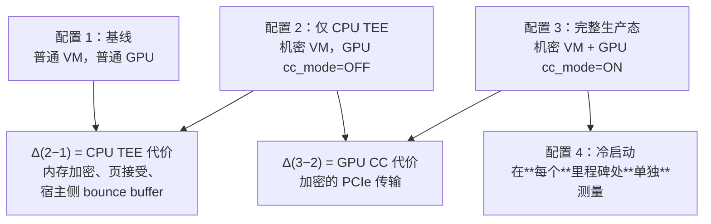
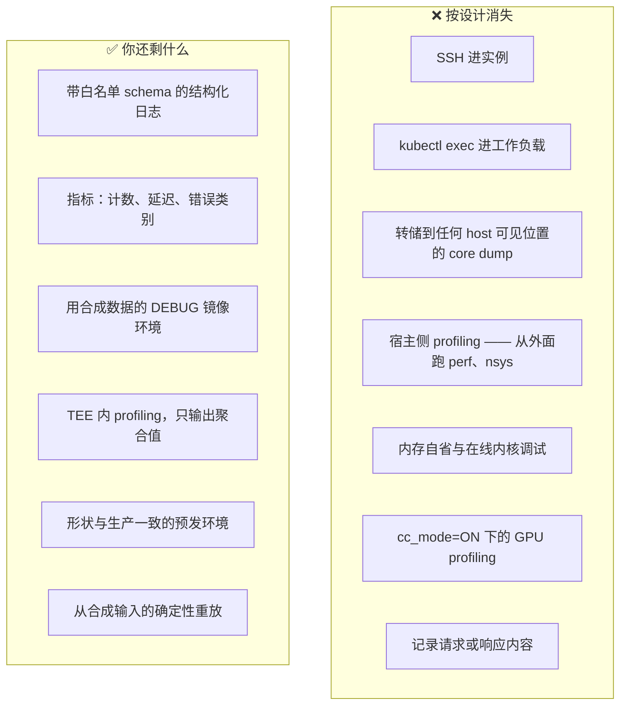

# 模块 7: 性能、运维与评估

一个正确但无法运维的设计不是设计。本模块讲的是决定模块 6 架构能否在生产中存活的三件事：你能否诚实地测量它的代价、你能否在没有惯用工具的情况下运营它，以及你能否在一个读过同样文献的对手方面前为它的论断辩护。

本模块涵盖 **基准测试方法学**、**开销与成本预算**、**没有 SSH 与 core dump 时如何调试**、**证明约束下的机群生命周期**、**哪些合规论断真正成立**，以及**AWS、Azure、Apple 已公开的方案如何对比**。

---

## 第 1 部分: 基准测试方法学

### 1.1 四配置矩阵

本领域最常见的基准测试错误，是为"机密计算开销"报一个数字。至少存在**两个独立**的代价来源，而且它们的行为**完全不同**。把它们分开不是学究气——这决定了哪一项优化值得做。

配置 4 不是第四个环境——它是一条坚持：**冷启动必须与稳态分开报告**。把两者混在一起产出的数字哪个都不描述，而且它掩盖了"一个组件几乎免费、另一个很贵"这个事实。

### 1.2 一份站得住脚的基准要控制什么

| 变量 | 为什么要紧 | 怎么控制 |
| :--- | :--- | :--- |
| 模型规模 | 开销随模型增大而下降（模块 4 §5.2） | 逐模型报告；绝不跨规模外推 |
| 批大小 | 开销随批处理增大而下降 | 做扫描；报曲线，不报单点 |
| 序列长度 | 更长的 prompt 把传输摊到更多算力上 | 输入与输出长度分别扫描 |
| 量化 | 改变传输字节数与常驻字节数 | 写明；fp8 与 bf16 是不同的实验 |
| 冷 vs 热 | 差一个数量级 | 永远分开 |
| 证明缓存 | 冷取厂商 collateral 会多出数秒 | 写明缓存是热的还是冷的 |
| 实例差异 | 机密容量受限，你可能拿到不同宿主 | 跨多实例重复，报分布 |

### 1.3 服务场景真正要紧的指标

四个都报；任何单独一个都会误导：

$$
\text{TTFT} = t_{\text{first token}} - t_{\text{request}} \qquad
\text{TPOT} = \frac{t_{\text{last}} - t_{\text{first}}}{N_{\text{output}} - 1}
$$

- **TTFT** —— 由 prefill 主导。受 CC 影响适中。
- **TPOT** —— 由 decode 主导。受 CC 影响最小。
- **吞吐**（在固定延迟 SLO 下的 requests/s 与 tokens/s）—— 决定每 token 成本的那个数字。
- **冷启动**，按模块 6 §4.1 的里程碑拆解。

**在延迟 SLO 下**报吞吐，而不是孤立地报。在无界排队下测出的吞吐，是一个关于你的队列的数字，不是关于你的系统的数字。

### 1.4 对已公开数字的诚实框定

针对 H100 机密计算的已公开基准工作，曾报告 LLM 推理吞吐惩罚处于**个位数百分比中段**，并随模型规模、批大小与序列长度增大而趋于可忽略，且代价几乎完全归因于跨 PCIe 的 CPU–GPU 传输，而非设备内计算。

把这些数字带进自己的规划时，有两点要当心：

1. **它们是稳态数字。** 它们对冷启动只字未提，而冷启动正是这套架构真正吃痛的地方。
2. **它们是单卡数字。** Hopper 的单卡约束（模块 4 §4.1）意味着这个对比往往**不是**"同一个负载开关 CC"，而是"一个你不得不重构以塞进 80 GB 的负载 vs 一个不必重构的负载"。**那份重构成本是真实的，而且不会体现在任何 CC 开销百分比里。**

在拿到自己的测量数据之前，预留大约 **15–25% 的额外吞吐容量**是一个合理的起步启发式——一旦有了针对自身负载的测量，就该立刻用它替换掉这个数字。

---

## 第 2 部分: 开销与成本预算

### 2.1 代价究竟来自哪

| 来源 | 量级 | 落在哪 | 可缓解？ |
| :--- | :--- | :--- | :--- |
| 加密的 PCIe 传输 | 稳态最大项 | 每一个 host↔device 字节 | 部分——多批处理、少传输；最终靠 TDISP |
| 冷启动时的权重加载 | 总体最大项 | 仅启动 | 预热池、量化、封存缓存 |
| Guest 私有内存接受 | 数秒，随 VM 内存缩放 | 仅启动 | 把 VM 规格定准 |
| 证明往返 | 数百毫秒到数秒 | 启动，以及重新证明 | 缓存 collateral；与权重取回重叠 |
| 密钥释放往返 | 到外部 KMS 的网络 RTT | 启动 | 就近部署；但不以牺牲独立性为代价 |
| 内存加密 | 小，多被内存层级掩盖 | 所有内存访问 | 基本不可 |
| 失去 GPU 共享（无 MIG、无 time-slicing） | **可能压过其他一切** | 利用率 | 不可——这是硬约束 |

最后一行是预算最常漏掉的。5% 的吞吐惩罚很容易吸收。而**失去把多个小模型打包到一块 GPU 上的能力，可能把你的有效利用率砍半**，这在每 token 成本上的体现远大于任何加密开销。

### 2.2 成本模型

$$
C_{\text{token}} = \frac{C_{\text{instance-hour}} \times (1 + \alpha_{\text{premium}})}{\text{Throughput}_{\text{tokens/hour}} \times U_{\text{effective}}}
$$

三个乘数同时与你为敌，而其中只有一个是大家常说的那个开销：

1. **$\alpha_{\text{premium}}$** —— 机密机型带价格溢价，且机密 SKU 是一个更窄、更难拿折扣的选择集。
2. **吞吐** —— 被 §1.4 的 CC 开销降低。这是**小**的那一项。
3. **$U_{\text{effective}}$** —— 被失去的 GPU 共享、预热池的闲置容量，以及分钟级冷启动所迫使的超配同时降低。**这通常是最大的一项。**

带进定价讨论的诚实总结是：**机密计算的算力开销不大；运维开销才大。** 预热池与丢掉的打包密度，比加密贵得多。

### 2.3 这在商业上意味着什么

机密推理档位是一个**溢价产品**，就该按溢价产品来定价和定位。试图把它与标准推理平价供应，意味着要在某个看不见的地方吸收预热池与利用率成本，而那最终会变成一个**容量问题**，而不是一个毛利问题。

---

## 第 3 部分: 可调试性

### 3.1 你失去了什么

实践中最痛的两条：

- **没有 core dump。** 崩溃最多给你一个堆栈跟踪，而那个堆栈跟踪**不能**包含内容。一次 CUDA kernel 里的段错误留给你的线索非常少。
- **没有生产 profiling。** `cc_mode=ON` 会禁用 profiling 工具。**你无法 profile 你真正在跑的那个配置**；你只能 profile `DEVTOOLS` 模式，然后指望差异不重要。

### 3.2 如何在这个约束下工作

1. **把 DEBUG 路径做成一等公民。** 一个用合成数据、除此之外每一处都与生产一致的 Confidential Space DEBUG 镜像，才是调试真正发生的地方。**在"让它真正一致"上投入**——一个与生产有偏差的调试环境，正是那些你复现不了的 bug 藏身之处。
2. **用白名单记日志，绝不用黑名单。** 显式定义可输出字段。任何能插值任意数据的日志调用，都是一次等着合适异常出现的泄露。**这是一条 lint 规则，不是一条代码评审约定。**
3. **在边界处净化异常。** 把请求处理器包起来，让任何异常消息都传不到 logger。记录一个错误**类别**和一个关联 ID；消息丢弃。
4. **到处用关联 ID。** 日志里没有内容时，一个贯穿所有组件的请求 ID 是重建请求路径的**唯一**办法。
5. **确定性合成复现。** 建立"只重放请求**形状**"的能力——token 数、批次组成、采样参数——而不含其内容。多数性能 bug 和不少正确性 bug 仅凭形状就能复现。
6. **只输出聚合值的 TEE 内 profiling。** 直方图和分位数可以离开边界。单个请求的 trace 不行。

### 3.3 没有证据的事件响应

生产出问题时，你手上会有：指标、错误类别、证明状态，以及**没有内容**。在事件发生**之前**就为它做好准备：

- **事先定好升级路径。** 如果诊断确实需要内容，唯一正当的途径是**客户同意的、有时限的、被证明的**遥测（模块 6 §8.2）——而不是某位 SRE 在压力下决定打开一个 debug 开关。
- **在心平气和时写好 runbook。** "我们看不了数据"在凌晨三点是个很不受欢迎的发现。
- **接受有些事件无法解决。** 有些问题会在没有根因的情况下关闭。**那是这套架构刻意付出的代价**，应当在 SLA 对话中被承认，而不是被当作一次运维失败。

---

## 第 4 部分: 证明约束下的机群生命周期

### 4.1 证明给每项操作加了什么

| 操作 | 普通机群 | 机密机群 |
| :--- | :--- | :--- |
| 节点加入 | 向控制面注册 | 证明、取密钥、到达 GPU ready 状态 |
| 镜像发布 | 推送、滚动、结束 | 推送、**更新释放策略里的参考值**、然后滚动 |
| 固件更新 | 透明 | 推进 TCB → 缓存 collateral 失效 → 全机群重新证明 |
| 密钥轮转 | 更新一个 secret | 重新封装 DEK，向每个在跑实例重新释放 |
| 扩容 | 数秒 | 数分钟（模块 6 §4） |
| 主机维护 | 热迁移 | **终止**——SEV-SNP 与 TDX 下没有热迁移 |

镜像发布那一行是运维陷阱。**新镜像有新摘要，而摘要在释放策略里。** 先部署镜像、后更新策略，每一个新实例都拿不到权重密钥——一次自作自受的故障，看起来像密钥管理失败，实际上是**部署顺序 bug**。

正确的顺序，它该待在部署流水线里而不是某个人的记忆里：

1. 构建并签名镜像；记下摘要。
2. 把新摘要**加入**释放策略，**保留**旧的。
3. 滚动机群。
4. 确认没有实例还在用旧摘要。
5. **移除**旧摘要。

第 2 步与第 5 步让策略在滚动期间同时容忍两个版本。跳过第 5 步，白名单里就会堆积起没人说得清来历的摘要，而那本身就是一个安全问题。

### 4.2 TCB 推进 Runbook

当 AMD 或 Intel 发布固件更新时（模块 3 §4.2）：

1. 缓存的背书 collateral 变陈旧；验证开始失败。
2. 旧 TCB 层级被标记为过期；你的策略必须决定是否接受它。
3. 立即拒绝它，意味着每一台未更新的节点失去密钥访问。
4. 接受它，意味着在一批有已公开漏洞的硬件上继续服务。

可行的答案，它必须在**第一份公告之前**就以书面策略的形式存在：

- 一个接受上一个 TCB 层级的**宽限窗口**。
- 对任何仍处于旧层级的节点**大声告警**。
- 一个到期即无条件抬高门槛的**事先承诺日期**。
- 一张全机群 **TCB 版本分布看板**——公告落地那天你会需要它，而在压力下临时建它不是个好时机。

### 4.3 重新审视自动扩缩容

模块 6 §4.3 已确立：在分钟级冷启动下，被动式自动扩缩容不管用。可行的运维形态是：

- **预测式扩缩容**，基于预测而非瞬时队列深度。
- **按到达过程 p99 定容的预热池**，而不是按均值。
- **显式背压** —— 排队并以明确错误拒绝，而不是超时。
- **把证明健康度当成一等信号。** 一个通过了证明并释放了密钥的实例才是 "ready"；一个只是启动完成的不是。**你的 readiness probe 必须检查 GPU CC 模式与证明状态**，而不只是 HTTP 端口通不通（模块 4 实验第 2 步）。

---

## 第 5 部分: 合规与定位

### 5.1 机密计算真正支撑得住什么

| 论断 | 成立？ | 限定条件 |
| :--- | :--- | :--- |
| "云运营商读不到使用中的数据" | ✅ 是 | 需同时具备 SEV-SNP/TDX **且** GPU CC 模式 **且** TEE 内 TLS 终结 |
| "数据受保护，免于被攻陷的 hypervisor" | ✅ 是 | 这是核心的、证据充分的性质 |
| "只有被批准的代码能解密数据" | ✅ 是 | 前提是释放策略完整且验证方独立 |
| "客户可以独立验证这一点" | ✅ 是 | 仅当验证方独立；若云运营商就是验证方则 ❌ |
| "数据永不离开该司法辖区" | ⚠️ 部分 | CC 不控制部署位置；那是另一个地域级控制 |
| "这满足 [某法规]" | ⚠️ 视情况 | CC 是支撑某个控制目标的**证据**，不是一张认证 |
| "工作负载无法外泄数据" | ❌ **否** | TEE 保护工作负载免受平台侵害，**从不**反过来 |
| "数据免于一切攻击" | ❌ **否** | 侧信道、流量分析与可用性依然在（模块 2 §5.4） |

### 5.2 营销跑到机制前面的地方

四条值得你在客户会议上礼貌地纠正的说法：

1. **"机密计算意味着我们看不到你的数据。"** 只有在 GPU 已被证明、TLS 在 TEE 内终结、且没有任何遥测携带内容时才成立。这三条**每一条都是一个设计决策**，而且经常被做成了另一种。
2. **"证明证明了代码可信。"** 证明证明的是**哪份**代码在跑。那份代码是否可信，是另一个由源码可得性、可复现构建或审计来回答的问题（模块 3 §7）。
3. **"你的数据与其他租户隔离。"** 在批处理部署中，租户间的隔离由推理服务的**正确性**保证，而非由硬件保证（模块 6 §7.2）。
4. **"这让我们合规了。"** 机密计算是一项支撑合规论证的技术控制。它不是认证，而且没有哪个监管机构有一个"机密计算"的勾选框。

**做那个在房间里把这些说准确的人，比做那个宣称更多的人更有价值。** 成熟的对手方——而模型提供方的安全团队就是成熟的对手方——是根据**你主动说出哪些限定条件**来给你的可信度打分的。

---

## 第 6 部分: 对比架构

### 6.1 版图

| | **AWS Nitro Enclaves** | **Azure Confidential Containers** | **Apple Private Cloud Compute** | **本设计（GKE）** |
| :--- | :--- | :--- | :--- | :--- |
| 隔离单位 | 从父 EC2 实例中切出的 enclave | Pod 沙箱（Kata + SEV-SNP） | 整台专用节点 | 一个 Confidential Space 实例 |
| 硬件基础 | Nitro hypervisor 与 Nitro 卡 | AMD SEV-SNP | Apple 芯片，扩展部署中还有 Intel TDX 与 NVIDIA CC | Intel TDX + NVIDIA H100 CC |
| 证明模型 | background-check——enclave 把文档交给 KMS | 来自 Microsoft Azure Attestation 的 JWT | 客户端强制，对照透明日志 | 经 Google Cloud Attestation 的 passport，或提供方自验原始证据 |
| 密钥释放 | 针对证明的 KMS 条件键 | Managed HSM 安全密钥释放 | Apple 控制，客户端验证 | 提供方运营的外部 KMS |
| 无交互式访问 | enclave 无持久存储、无网络、无 shell | 沙箱边界 | **在设计上被剔除**——无远程 shell、无交互式调试 | Confidential Space 生产镜像 |
| 参考值 | 客户自管的 PCR | 针对容器镜像的策略 | **可复现构建 + 公开二进制 + 只可追加日志** | 签名的黄金值；摘要白名单 |
| GPU 支持 | 有限 | 正在形成 | 有，NVIDIA CC | 有，每实例一块 H100 |

### 6.2 各家做对了什么

**AWS Nitro Enclaves** 的密钥释放故事最干净：KMS 策略被表达成针对证明度量值的条件键，并由 KMS 自己执行。这个机制简单到可以用一张图向客户讲清楚，而那是一项**真实的工程美德**。它的局限在于作用域——enclave 没有持久存储、没有直接网络，这对密钥操作很优雅，对挂 GPU 的推理则很别扭。

**Azure Confidential Containers** 把**机密性单位**选对了。让每个 Pod 跑在自己的 VM TEE 里（Kata 加 SEV-SNP），意味着 kubelet 与节点代理留在信任边界之外——**恰恰是 Confidential GKE Nodes 所缺的那个性质**（模块 5 §2.3）。如果 GKE 提供一个 Pod 沙箱式的机密运行时，模块 6 的架构会简单得多，因为你可以既保留 Kubernetes、又把控制面排除在外。

**Apple Private Cloud Compute** 是对参考值问题最完整的公开处理，也是最值得下功夫研究的那个设计。它陈述的五条要求——无状态计算、可强制执行的保证、无特权运行时访问、不可定向、可验证透明性——读起来就是对本书所罗列的那些缺口的直接回答。其中两条正是 GKE 设计最常达不到的：

- **无特权运行时访问，是"设计上剔除"而非"配置上关闭"。** Apple 声明它**刻意**没有在 PCC 节点上包含远程 shell 与交互式调试机制，因为这种开放式访问会提供一个宽阔的攻击面。请与模块 5 §2.3 那次 `kubectl exec` 演示对照。
- **可验证透明性，由客户端强制。** 镜像以可复现方式构建，二进制公开供检视，度量值进入一个可密码学验证的只可追加账本，而且——**承重的那部分**——客户端设备**拒绝**向镜像不在该日志中的节点发送数据。**如果客户端不据此强制，发布度量值什么也换不来。**

### 6.3 值得知道的一项进展

Apple 已把 Private Cloud Compute 扩展到自有数据中心之外，与 Google 和 NVIDIA 合作，在 Google Cloud 上运行 Apple Intelligence 负载。已公开的技术栈是 **NVIDIA GPU 上的 NVIDIA Confidential Computing、带 TDX 的 Intel CPU，以及 Google 的 Titan 芯片**——这在组件层面上，**就是模块 6 所描述的那套架构**。

Apple 的表述中有两个细节值得内化，因为它们恰恰是本书一直在主张的立场：

1. **Apple 保有对软件的完全控制。** Apple 设备只信任经 Apple 密码学批准的 PCC 软件，并且所有二进制都公开供检视。**Google 提供基础设施；Google 没有成为验证方。** 这就是模块 3 §1.3 的规则——**验证方与密钥持有方应当是资产处于风险中的那一方**——由一个有足够筹码去坚持它的一方，在规模上实现了出来。
2. **Apple 明确表示不单靠机密计算。** 他们公开的立场是：不单独依赖机密计算来缓解那些利用机密 VM **之外**特权访问的攻击，**包括侧信道攻击**。这就是模块 2 §5.4 那份诚实总结被采纳为一种工程姿态：**在"TEE 的保证是有边界的"这一假设下做分层防御。**

对一份 Vertex 3P MaaS 设计而言，其现实意义很直接：**一个成熟的模型提供方，在 Google Cloud 基础设施上运行、自带独立验证方、自己控制软件——这不是假设。** 它是一个已公开、已上线的安排，并且它设定了一个可比产品将被拿来衡量的预期。

### 6.4 一份 GKE 设计该瞄准什么

按"价值/投入"比排序：

1. **独立验证。** 模型提供方自己验证原始硬件证据。价值最高；今天完全做得到。
2. **外部密钥管理。** 权重 KEK 放在 Google 之外。用 Cloud EKM 可达。
3. **生产环境无交互式访问。** Confidential Space 生产镜像，以及一条永不接受 `dbgstat == enabled` 的策略。**免费**——它就是一行策略。
4. **客户端强制证明。** 客户端在发送前验证。需要一个 SDK；**这是大多数设计跳过的那一步，也正是那个让保证归客户所有而不是归运营商所有的一步。**
5. **发布参考值。** 一份签名的、带版本的可接受度量值清单。投入中等，可信度高。
6. **可复现构建。** 投入最高，强度最高。朝它去；如果必须先发，就先发，**并且说明这一点**。

一份站得住脚的设计与 Apple 的标尺之间的差距，就是第 4、5、6 项——**而它们没有一项是硬件限制。** 它们全都是产品与工程的投入决策。

---

## Lab: 搭出基准框架并演练一次轮转

**目标**：产出你的组织将来真正会引用的那张开销表，并演练那个最可能引发故障的操作。

**成本**：⚠️ 若要做真正的 A/B，需要两台 A3 实例。据此做预算，或者接受通过开关 GPU CC 模式做的同机对比。**状态**：这是一次方法学练习；具体命令取决于你的服务栈。

### A 部分 —— 四配置矩阵

在 §1.1 的各配置上跑同一个负载，把这张表填满。**这张产物就是交付物。**

| 配置 | TTFT p50 | TTFT p99 | TPOT p50 | Tokens/s | 冷启动 |
| :--- | :--- | :--- | :--- | :--- | :--- |
| 1. 基线（普通 VM + GPU） | | | | | |
| 2. 仅 CPU TEE（`cc_mode=OFF`） | | | | | |
| 3. 完整 CC（`cc_mode=ON`） | | | | | |

然后对配置 1 与 3 扫描批大小 $\in \{1, 4, 16, 64\}$ 与输入长度 $\in \{128, 1024, 8192\}$，把开销百分比对二者作图。**你要找的是模块 4 §5.2 预测的那条下降斜率。** 如果你没看到它，说明你的基准以模型未预测的方式受限于传输，而**弄清楚为什么，比那些数字本身更有价值**。

### B 部分 —— 拆解冷启动

给模块 6 §4.1 的每个里程碑加埋点，产出：

| 阶段 | 时长 | 占比 |
| :--- | :--- | :--- |
| 实例预置 | | |
| TEE 启动 + 内存接受 | | |
| 证明（collateral 缓存为热） | | |
| 证明（collateral 缓存为冷） | | |
| 密钥释放 | | |
| 权重取回 | | |
| 解密 + 加载到受保护 HBM | | |
| 预热至首 token | | |

跑两遍——一遍 collateral 缓存为热、一遍为冷——并记下差值。**那个差值就是你在关键路径上对 AMD KDS 或 Intel PCS 故障的暴露程度。**

### C 部分 —— 密钥轮转演练

这演练的是最可能造成自作自受故障的那项操作。

1. 在有流量的情况下，轮转 KEK 并重新封装 DEK。
2. 强制启动一个新实例并让它取得新密钥。
3. 确认旧实例上在飞的请求不受影响。
4. 排空旧实例。
5. **给全过程计时**，并记录是否有请求失败。

现在在非生产环境里**刻意**做破坏性版本：**部署一个新镜像摘要，但不先把它加进释放策略。** 看着每个新实例都拿不到密钥。给"你从可用信号中诊断出原因"计时——**而那正是你将来某一天要在压力下、没有 shell 访问权的情况下做的那次诊断。**

### D 部分 —— TCB 推进模拟

把释放策略里的最低 TCB 版本抬到高于你机群当前上报的值。观察所有实例都拿不到密钥。然后问：

1. 你的监控多快检测到了？
2. 告警说的是"TCB 低于策略下限"，还是"密钥释放失败"？**只有前者可行动。**
3. 你本来会怎么回滚？

从你学到的东西写出 runbook。**在一个平常的周二刻意做这件事，远比在固件公告落地那天才发现它便宜。**

---

## 总结: 运营一个机密推理机群

| 问题 | 答案 | 为什么要紧 |
| :--- | :--- | :--- |
| 怎么诚实地做基准？ | 四配置；把 CPU TEE、GPU CC、冷启动分开 | 一个混合数字什么都不描述 |
| 算力开销在哪？ | PCIe 传输；个位数百分比中段，随规模缩小 | 不大，而且不是主要成本 |
| **真正**的成本在哪？ | 预热池、失去的 GPU 共享、为冷启动做的超配 | 利用率压过加密开销 |
| 调试上失去什么？ | SSH、exec、core dump、宿主与 GPU profiling、内容日志 | 投入到 DEBUG 一致性与基于形状的重放 |
| 怎么安全地记日志？ | 白名单字段、净化异常、关联 ID | 黑名单会从一条异常消息里漏出去 |
| 镜像发布时什么会坏？ | 摘要变了，而释放策略没变 | 滚动前先加新摘要，滚完再删旧的 |
| 固件更新时会发生什么？ | TCB 推进、collateral 陈旧、全机群重新证明 | 需要宽限窗口与事先承诺的截止日 |
| 自动扩缩容管用吗？ | 被动式不管用 | 预测式扩缩容 + 按 p99 定容的预热池 |
| 哪些合规论断成立？ | "运营商读不到使用中的数据"成立；"工作负载无法外泄"**不成立** | 主动说出限定条件换来可信度 |
| 该瞄准什么标尺？ | Apple PCC：设计上无特权访问、可复现构建、客户端强制透明性 | §6.4 的第 4–6 项是产品决策，不是硬件限制 |

---

## 接下来去哪

你现在拥有了完整的栈：原语、硬件、证明系统、加速器、平台、一个设计，以及评估它的手段。接下来有两件事值得做。

**把能端到端跑通的最小的东西建出来。** 一台机密实例、一个带加密权重文件的玩具模型、一条复合释放策略，以及一个在证明失败时**拒绝发送 prompt** 的客户端。**最后那个行为——一个会说"不"的客户端——才是把这一切从理论变成你信得过的系统的那一步。**

**把一手资料放在手边。** 这个领域变化得足够快，本书里任何一条具体论断都有保质期。架构不会变太多；可用性矩阵、GPU 世代和攻击文献会变。附录 B 存在的意义正在于此。

两份附录是 [附录 A: 术语总表](appendix_glossary_and_terminology.md) 与 [附录 B: 一手资料阅读清单](appendix_reading_list.md)。
