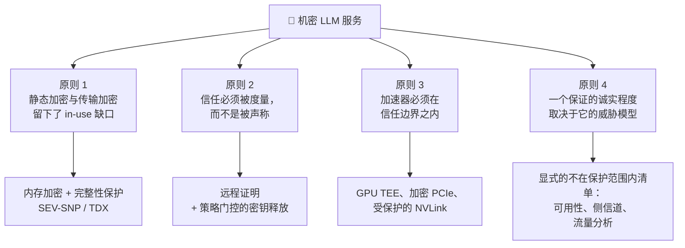
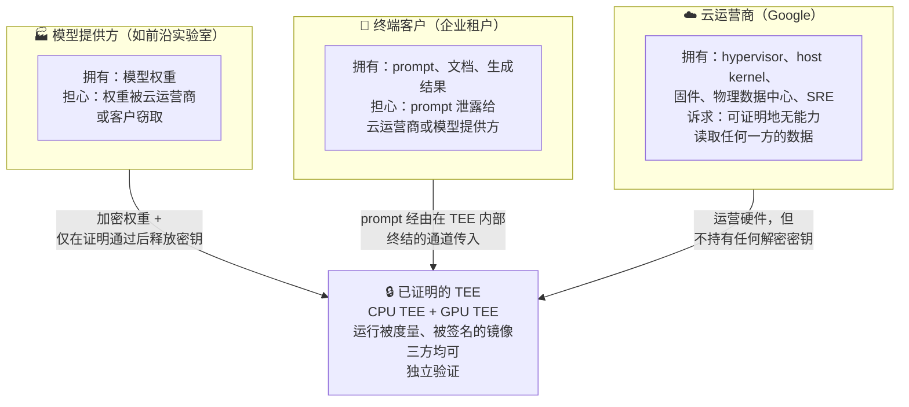

# LLM 服务的机密计算：威胁模型与完整课程大纲

在别人的云上托管第三方基础模型，本质上是一个**互不信任**的问题。模型提供方不希望云运营商——也不希望终端客户——读到自己花了九位数训练出来的权重。终端客户不希望云运营商——也不希望模型提供方——读到自己的 prompt。云运营商则希望能够可信地、并且能对监管机构说清楚：它在技术上**没有能力**读到任何一方的数据。任何策略、合同或 IAM 配置都无法解决这个问题，因为这些控制手段无一例外都由那个被怀疑的一方来执行。

机密计算就是把这些"承诺"转换成"可验证声明"的一整套硬件机制。本书从内存加密原语一路构建到一个完整的、经过对抗性复盘的 GKE 机密 LLM 推理参考架构，内容涵盖**数据的三种状态与 in-use 缺口**、**AMD SEV-SNP 与 Intel TDX 内部机制**、**远程证明与基于证明的密钥释放**、**机密 GPU**、**Google Cloud 产品面**、**落地服务设计**，以及**性能、运维与诚实的评估**。

---

## 第 1 部分: 核心原则

以下四条原则贯穿全书，后面每个模块本质上都是对其中某一条的展开。

### 原则 1: 静态加密与传输加密留下了 in-use 缺口

业界早在二十年前就解决了静态数据（磁盘加密、CMEK）和传输中数据（全链路 TLS）的保护。这两个方案共享同一个结构性假设：数据在某个时刻会被解密到内存里，而内存是可信的。当机器归你自己所有时，这个假设站得住脚；当机器属于云厂商——它的 hypervisor、host kernel、固件和运维人员全都横亘在 DIMM 与你的进程之间——这个假设就不成立了。

**这对推理意味着什么**：LLM 服务进程**除了** in-use 数据以外什么都没有。权重在内存和 HBM 里；TLS 一终结，prompt 就在内存里；KV cache——整段对话的一种有损但确实可还原的编码——在请求的整个生命周期里都躺在 GPU 显存中。在请求生命周期里，**不存在**一个"有价值的数据处于静态"的时刻。

**解法**：带完整性保护的硬件内存加密——让 hypervisor 和物理攻击者能看到的密文对他们不可解密，且无法在不被发现的情况下被重放或重映射。

### 原则 2: 信任必须被度量，而不是被声称

一个没有远程证明的 TEE，只是一台"声称自己安全"的机器。一个**带**远程证明的 TEE，则会产出一份由硬件签名的、精确描述自己正在运行什么代码的声明；远端方可以在把任何敏感数据交给它之前，拿这份声明去比对自己事先选定的参考值。

后者有价值，前者一文不值——因为一个恶意运营商完全可以起一台普通 VM，然后告诉你这是机密 VM。

**这决定了你该把时间花在哪**：刚进入这个领域的工程师往往把时间花在 TEE 上，把证明当成管道工作。这是反的。TEE 是从 AMD 或 Intel 买来的，能用就是能用。而**证明**才是所有设计决策、所有运维痛苦、以及所有真正的安全性质所在之处——这也是为什么模块 3 是全书最长的一章。

### 原则 3: 加速器必须在信任边界之内

机密 VM 保护的是 CPU 内存，而 LLM 不住在 CPU 内存里。如果权重经由明文 PCIe 总线拷贝进不受保护的 HBM，那么这台机密 VM 保护的恰恰是这份数据最无关紧要的那个副本，而 host 侧攻击者可以把剩下的全部读走。

**结论**：LLM 机密计算不是"把机密计算应用到 LLM 上"，而是一个严格更难的问题。它要求 GPU 拥有自己的信任根、自己的证明、自己的受保护内存，以及一条到 CPU TEE 的加密且带完整性保护的通道；同时要求验证方**同时**检查两侧证据并把它们绑定在一起。这是本领域最常见的设计错误。

### 原则 4: 一个保证的诚实程度取决于它的威胁模型

机密计算并不能让一个工作负载"变安全"。它只是把一批**具体的、可枚举的**攻击者移出信任边界，同时把另一批留在里面。一份只说"数据在使用中受到保护"、却不说**防谁**、**防什么**的设计文档，是市场材料而不是设计文档。

**本书坚持的纪律**：书中每一个架构后面都跟一份显式清单，列出仍然暴露的东西——可用性、请求时序与流量特征、密文侧信道、客户自己的客户端完全可以记录明文这一事实，以及产出这个被度量镜像的供应链。模块 6 的最后一节存在的唯一目的，就是把成型的参考架构重新拖回模块 1 的攻击者清单里过一遍，然后明明白白地说清楚：一个拿到 host root 的内部人员**仍然**能做什么。

---

## 第 2 部分: 三方信任问题

本书中每一个设计决策都可以追溯回下面这张图。建议在进入模块 1 之前先把它内化。

这里承重的词是**独立**。这套架构之所以有意思，前提是：模型提供方能够验证权重解密密钥确实只释放给了它认可的环境——**而不必相信 Google 的一面之词**；同时客户能够验证处理 prompt 的端点就是那个被认可的环境——**而不必相信 Google 或模型提供方任何一方**。达不到这个标准，方案就退化成了"多绕几步的普通云租户"。

---

## 第 3 部分: 课程结构与路线图

| 模块 | 文件名 | 核心主题 |
| :--- | :--- | :--- |
| **[模块 1: 基础](01_confidential_computing_foundations.md)** | [`01_confidential_computing_foundations.md`](01_confidential_computing_foundations.md) | 数据的三种状态；攻击者分类；TCB 最小化；信任根、度量、封存；内存加密与完整性；进程级 TEE vs 虚拟机级 TEE；3P MaaS 问题陈述 |
| **[模块 2: 硬件 TEE](02_hardware_tee_architectures.md)** | [`02_hardware_tee_architectures.md`](02_hardware_tee_architectures.md) | AMD SEV → SEV-ES → SEV-SNP（RMP、VMPL、PSP）；Intel TDX（SEAM、TDX Module、secure EPT、MRTD/RTMR）；ARM CCA 与 RISC-V CoVE；运维上会坏掉的东西；密文侧信道与单步攻击 |
| **[模块 3: 远程证明](03_remote_attestation_and_key_release.md)** | [`03_remote_attestation_and_key_release.md`](03_remote_attestation_and_key_release.md) | RATS 架构（RFC 9334）；从信任根到容器摘要的度量链；证据格式与证书链；新鲜性、吊销、TCB 版本；基于证明的密钥释放；RA-TLS；可复现的参考值 |
| **[模块 4: 机密 GPU](04_confidential_gpus_and_accelerators.md)** | [`04_confidential_gpus_and_accelerators.md`](04_confidential_gpus_and_accelerators.md) | 为什么纯 CPU TEE 对推理无效；NVIDIA Hopper/Blackwell CC 模式；bounce buffer、SPDM、PCIe IDE；GPU 证明、RIM、NRAS、复合证明；Hopper 单卡 vs Blackwell 多卡 NVLink 加密；开销模型 |
| **[模块 5: GCP 产品面](05_google_cloud_confidential_surface.md)** | [`05_google_cloud_confidential_surface.md`](05_google_cloud_confidential_surface.md) | Confidential VM 机型族；Confidential GKE Nodes 及其 GPU 约束；Confidential Space 及其三角色分离；GCP 证明令牌与 Workload Identity Federation；Cloud KMS/EKM 密钥层级；推理场景下 Confidential Space vs Confidential GKE |
| **[模块 6: 落地设计](06_designing_confidential_llm_serving_on_gke.md)** | [`06_designing_confidential_llm_serving_on_gke.md`](06_designing_confidential_llm_serving_on_gke.md) | 需求拆解；参考架构；加密权重分发；冷启动预算；TLS 在哪里终结；KV cache 与 prefix cache 泄露；多租户；可观测性与安全监控的张力；对抗性复盘 |
| **[模块 7: 性能与运维](07_performance_operations_and_evaluation.md)** | [`07_performance_operations_and_evaluation.md`](07_performance_operations_and_evaluation.md) | 基准测试方法学；开销预算与成本模型；没有 SSH、core dump、host profiler 时怎么调试；证明约束下的机群生命周期；哪些合规声明成立、哪些是营销；AWS Nitro、Azure CACI 与 Apple PCC 对比 |
| **[附录 A: 术语总表](appendix_glossary_and_terminology.md)** | [`appendix_glossary_and_terminology.md`](appendix_glossary_and_terminology.md) | 书中全部缩写，按领域分组，含全称与一句话定义 |
| **[附录 B: 阅读清单](appendix_reading_list.md)** | [`appendix_reading_list.md`](appendix_reading_list.md) | 带注解的一手资料——厂商规范、RFC 与攻击论文，便于回溯核验书中任何一条论断 |

---

## 第 4 部分: 模块内容详解

### [模块 1: 机密计算基础](01_confidential_computing_foundations.md)

1. **数据的三种状态** —— 为什么 "in use" 一直没被解决，以及为什么推理正是那个让它绕不过去的负载。
2. **威胁模型与攻击者分类** —— 恶意同租户、被攻陷的 hypervisor、拿到 host root 的云内部人员、物理/DMA 攻击者、恶意 guest。每一类的能力边界，以及对应哪种机制。
3. **TEE 的构件** —— 硬件信任根、度量启动、封存、证明报告、临时内存加密密钥、AES-XTS vs AES-GCM，以及为什么只有机密性而无完整性会被重放与重映射攻破。
4. **进程级 TEE vs 虚拟机级 TEE** —— SGX enclave 模型及其移植代价，VM-TEE 的平迁模型及其 TCB 代价，以及为什么 VM TEE 在 AI 场景胜出。机密容器作为 Kubernetes 形态的折中方案。
5. **第三方 MaaS 问题的形式化** —— 四条安全性质、每条各自对抗哪一方，以及模块 6 会反复使用的评估清单。

### [模块 2: 硬件 TEE 架构](02_hardware_tee_architectures.md)

1. **AMD SEV 谱系** —— C-bit 与内存加密引擎；SEV-ES 与 VMSA 寄存器保护；SEV-SNP 的反向映射表（RMP）、`PVALIDATE`、VMPL、guest policy，以及作为信任根的 PSP。
2. **Intel TDX** —— SEAM 模式与作为附加 TCB 层的 TDX Module；shared vs private GPA 与 secure EPT；`TDCALL`/`SEAMCALL`；`MRTD` vs 运行时可扩展的 `RTMR0-3`；TDREPORT → Quoting Enclave → DCAP 的取证路径。
3. **其余版图** —— SGX 为何在本类负载中退场、ARM CCA Realms、RISC-V CoVE。
4. **对比与运维后果** —— TCB 体量、完整性模型、I/O 模型、证明格式、GCP 可用性；然后是那些会停止工作的东西：热迁移、内存气球、嵌套虚拟化、大页、host 侧 profiling、kdump。
5. **已知攻击与残余风险** —— 密文侧信道家族、单步攻击、TDX 勘误与补丁节奏——统一以这个视角来看：**这些会削弱你即将向模型提供方作出的那个承诺吗？**

### [模块 3: 远程证明与密钥释放](03_remote_attestation_and_key_release.md)

1. **RATS 架构** —— Attester、Verifier、Relying Party、Endorser、Reference Value Provider；passport 与 background-check 两种模型；为什么"谁来当验证方"是一个披着技术外衣的商业问题。
2. **度量链** —— 硬件信任根 → 固件 → 度量寄存器 → kernel/initrd/`dm-verity` → 容器镜像摘要，以及这条链通常在哪三个地方断掉。
3. **证据格式与证书链** —— SEV-SNP 报告结构、TDX quote 结构、TPM quote 与 event log；VCEK/VLEK 与 AMD KDS；Intel PCS 与 DCAP collateral；EAT/CoRIM 的归一化趋势。
4. **新鲜性、吊销与 TCB 版本** —— nonce、重放、令牌有效期，以及固件更新引发的全机群重新证明风暴。
5. **基于证明的密钥释放** —— 权重的信封加密；以证明声明为条件的策略；KMS 侧执行 vs 验证方侧执行；GCP、AWS、Azure 三种模式对比。
6. **RA-TLS** —— 把 TLS 公钥绑进证明报告，以及为什么这是给**客户端**端到端保证的唯一干净做法。
7. **参考值与可复现构建** —— 真正尚未解决的部分：你怎么知道该期望哪个度量值。

### [模块 4: 机密 GPU 与加速器](04_confidential_gpus_and_accelerators.md)

1. **为什么 GPU 必须进 TCB** —— 当 CPU 机密而 GPU 不机密时，精确核算到底泄露了什么。
2. **NVIDIA CC 模式内部机制** —— CC-Off/CC-On/CC-DevTools；片上信任根与 GSP 固件；受保护内存区；AES-GCM 加密的 bounce buffer；SPDM 会话与 PCIe IDE。
3. **GPU 证明** —— 设备证据、VBIOS/驱动度量、参考完整性清单（RIM）、NRAS vs 本地验证、`nvtrust`，以及 CPU+GPU+镜像的复合策略。
4. **多卡与张量并行** —— Hopper 的单卡约束对大模型意味着什么；Blackwell 的硬件加密 NVLink 与 1/2/4/8 卡机密分配。
5. **开销模型** —— 为什么代价落在 host↔device 传输而非算力上、为什么它随模型与 batch 增大而缩小，以及到底该测什么。
6. **周边生态** —— AMD SEV-TIO、作为标准化终点的 PCIe TDISP，以及机密加速器的走向。

### [模块 5: Google Cloud 机密计算产品面](05_google_cloud_confidential_surface.md)

1. **Confidential VM** —— 按机型族区分的 SEV、SEV-SNP 与 TDX；功能差异；地域与容量的现实；Confidential Hyperdisk 与 CMEK。
2. **Confidential GKE Nodes** —— 如何启用、节点池约束，以及那个关键事实：控制面在你的 TEE **之外**。
3. **Confidential Space** —— 加固镜像与 launcher；workload author / operator / data collaborator 的三方分离；DEBUG vs PROD 镜像；日志逃生口，以及它们究竟让你付出多少代价。
4. **GCP 上的证明** —— 证明令牌及其声明；vTPM 路径；作为策略语言的 Workload Identity Federation 属性条件；Cloud KMS、Cloud HSM 与 EKM 密钥层级。
5. **配角阵容** —— Binary Authorization 与 Sigstore 签名；Workload Identity vs Secret Manager；gVisor 是**正交**的威胁模型，而不是"弱一点的 TEE"。
6. **推理场景下 Confidential Space vs Confidential GKE** —— 正面对比决策表，以及为什么正确答案不是那个显而易见的答案。

### [模块 6: 在 GKE 上设计机密 LLM 服务](06_designing_confidential_llm_serving_on_gke.md)

1. **需求拆解** —— 四条性质的形式化陈述，每条都指名对抗哪一方。
2. **参考架构** —— Confidential GKE 节点 + 机密 GPU + vLLM + 证明代理 + 基于证明的密钥释放 + TEE 内 TLS 终结，逐组件拆解。
3. **加密权重管线** —— 从提供方侧加密到在受保护 GPU 显存中完成证明后解密；密钥轮转与吊销。
4. **冷启动问题** —— TEE 启动 + 证明 + 数 GB 解密 + GPU 加载的延迟预算，以及那些不会破坏证明的缓解手段。
5. **TLS 在哪里终结** —— 已证明入口问题，以及托管 L7 负载均衡器为什么会悄无声息地作废整个保证。
6. **KV cache、prefix cache 与分离式推理** —— 为什么跨租户复用 prefix cache 等价于明文泄露，以及分离式服务会把你的信任边界切成什么样。
7. **多租户** —— 每租户独立 TEE vs 共享 TEE 内跨租户连续批处理。
8. **可观测性与安全监控盲区** —— 机密性与滥用监控之间真实存在的冲突，以及三种架构应对方案。
9. **对抗性复盘** —— 把成型设计重新拖回模块 1 的攻击者清单过一遍。

### [模块 7: 性能、运维与评估](07_performance_operations_and_evaluation.md)

1. **基准测试方法学** —— 把 CPU-TEE 开销、GPU-CC 开销与证明开销分离出来；一次公平的 A/B 需要什么条件。
2. **开销与成本预算** —— 按来源归因的开销，加上机型溢价与选型受限带来的成本。
3. **可调试性** —— 在没有 SSH、core dump、host profiler 和 `kubectl exec` 的情况下作业；在没有证据的情况下做事件响应。
4. **机群生命周期** —— 节点升级、TCB 升级引发的重新证明、在线密钥轮转、把证明放在关键路径上的自动扩缩容。
5. **合规与定位** —— 机密计算真正支撑得住什么，以及营销话术在哪里跑到了机制前面。
6. **对比架构** —— AWS Nitro Enclaves、Azure Confidential Containers 与 Apple Private Cloud Compute 作为已公开的设计参照。

---

## 第 5 部分: 每个模块如何组织

每个模块都遵循同样的四拍结构，并以一个动手实验收尾。

1. **概念基础** —— 从第一性原理讲清机制，并且先讲它要解决的问题、再讲解法。
2. **架构与数据流** —— 每个关键机制配 Mermaid 图，凡是两种设计相互竞争的地方都配对比表。
3. **配置与 API 解剖** —— 直接给出真实的 flag、claim 名、报告字段和 `gcloud` 接口，而不是它们的转述。
4. **生产陷阱** —— 什么会坏、厂商文档避重就轻的地方在哪、残余风险是什么。
5. **`## Lab:`** —— 一个可运行的练习。机密计算不会因为读字段表而变直观；它变直观的时刻，是你第一次真的拉出一份证明报告、把它解出来、翻转镜像里的一个字节、然后眼看着密钥释放失败。

!!! warning "关于实验与费用"
    这些实验会真实创建 Confidential VM、Confidential GKE 与 A3 GPU 资源，均按量计费，且其中数项受地域容量限制。每个实验都会标注大致成本，并说明其命令是在真实项目上执行过的，还是从厂商文档转录、标记为**未验证**的。

从 [模块 1: 机密计算基础](01_confidential_computing_foundations.md) 开始。
